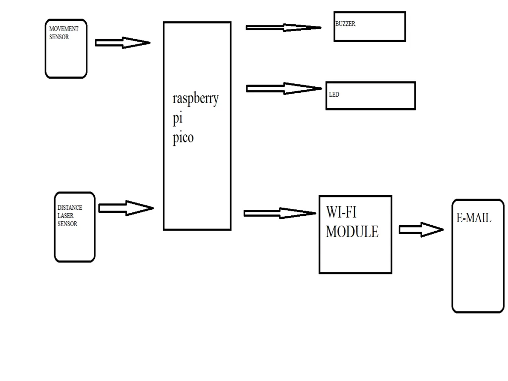
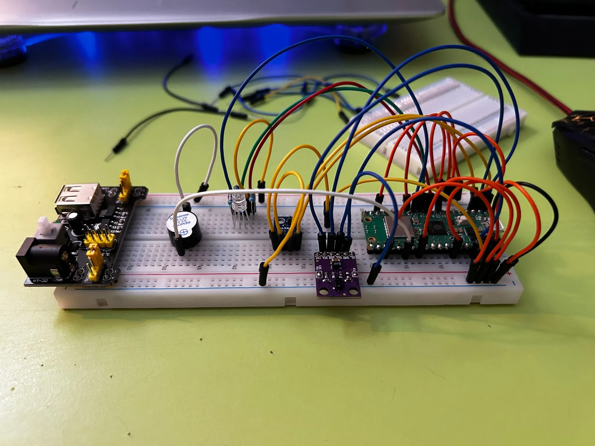
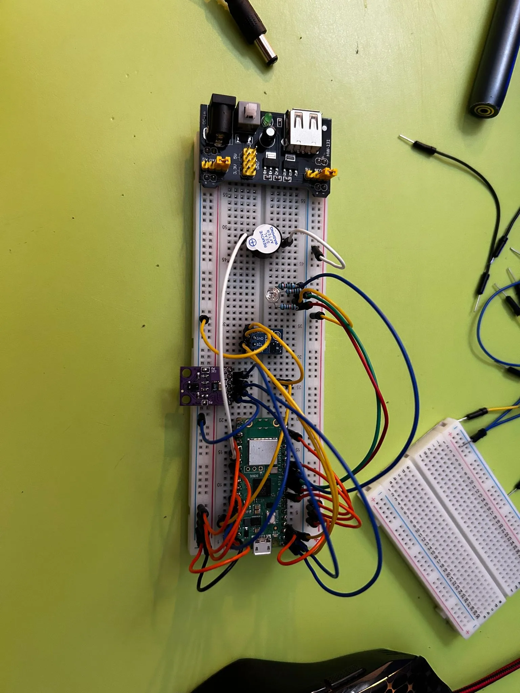
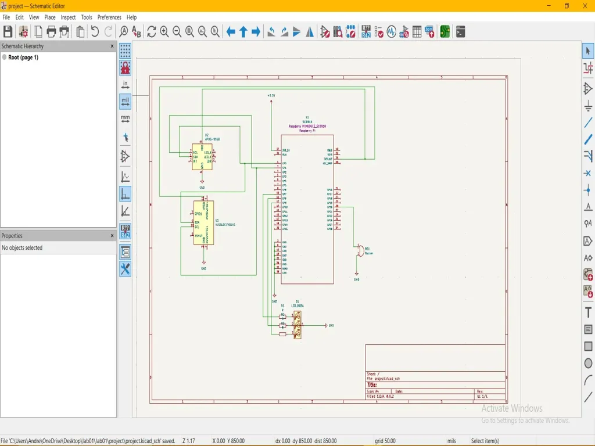

# SentinelGuard

:::info

**Author**: Andreescu Andrei-Vlad \
**GitHub Project Link**: https://github.com/UPB-PMRust-Students/project-AndreiAndreescu

:::
## Description

i want to make a project that activates a system alarm when something enters in a zone where is a movement sensor a laser sensor and a light sensor and then it gives me an email with the the time spend in the zone at the time that the alarm activated 

## Motivation

For me an alarm system is very interesting so to do one is absolutly grandious 

## Architecture 

## Log

<!-- write every week your progress here -->

### Week 6 - 12 April 
Research for components
### Week 13 - 19 April 
Buying the components
### Week 19 - 25 April  
Documentation 
### Week 12 - 16 May
Hardware

## Hardware

Raspberry Pi Pico W (SC0918): Microcontroller board based on the RP2040 microcontroller chip.

APDS-9960 Light Sensor: Digital RGB, ambient light, and gesture sensor with I2C interface.

VL53L0X Distance Laser Sensor: Time-of-flight (ToF) laser-ranging sensor for measuring distances with an I2C interface.

RGB LED: Light-emitting diode capable of producing various colors, typically with common cathode/anode configuration.

Buzzer: Electromechanical component that produces sound when activated, usually by applying an alternating current.

### Schematics

### Bill of Materials

Rapspberry Pi Pico W
Light sensor and movement sensor
Laser distance sensor
Rgb led
Buzzer
Power supply 

| Device | Usage | Price |
|--------|--------|-------|
| [Rapspberry Pi Pico W](https://www.raspberrypi.com/documentation/microcontrollers/raspberry-pi-pico.html) | The microcontroller | [35 RON](https://www.optimusdigital.ro/en/raspberry-pi-boards/12394-raspberry-pi-pico-w.html) |
[Light sensor and movement sensor](https://www.emag.ro/senzor-de-lumina-rgb-detector-de-gesturi-apds-9960-multicolor-apds9960-mod/pd/DLR798MBM/?utm_campaign=share%20product&utm_source=mobile%20app&utm_medium=ios)  | |[21 RON] |
[Laser distance sensor](https://www.emag.ro/senzor-de-distanta-laser-tof-vl53l0x-aalbastru-vl53l0x-gy530-blue/pd/DQR798MBM/?utm_campaign=share%20product&utm_medium=ios&utm_source=mobile%20app)  | |[16 RON] |

## Software

| Library | Description | Usage |
|---------|-------------|-------|
| [st7789](https://github.com/almindor/st7789) | Display driver for ST7789 | Used for the display for the Pico Explorer Base |
| [embedded-graphics](https://github.com/embedded-graphics/embedded-graphics) | 2D graphics library | Used for drawing to the display |

## Main Code
#![no_std]
#![no_main]
#![feature(type_alias_impl_trait)]

use defmt::*;
use defmt_rtt as _;
use panic_probe as _;

use embassy_executor::Spawner;
use embassy_rp::gpio::{Level, Output, Input, Pull};
use embassy_rp::gpio::AnyPin;
use embassy_rp::i2c;
use embassy_rp::peripherals::{I2C0, PIN_0, PIN_1, PIN_2, PIN_3, PIN_4, PIN_10, PIN_11, PIN_12, PIN_13};
use embassy_rp::init;
use embassy_time::{Duration, Timer, Instant};
use embassy_executor::raw::Executor;
use embassy_macros::task;
use static_cell::StaticCell;
use {unwrap};
use embassy_net::{Stack, Config};
use embassy_rp::wifi::{WifiDevice, WifiConfig, WifiController};

static mut MOVEMENT_SENSOR: Option<Input<'static, _>> = None;
static mut LASER_SENSOR: Option<Input<'static, _>> = None;
static mut LIGHT_SENSOR: Option<Input<'static, _>> = None;

#[cortex_m_rt::entry]
fn main() -> ! {
    static EXECUTOR: StaticCell<Executor> = StaticCell::new();
    let executor = EXECUTOR.init(Executor::new());
    executor.run(|spawner| {
        unwrap!(spawner.spawn(main_task(spawner)));
    });
    loop {}
}

#[task]
async fn main_task(_spawner: Spawner) {
    let p = init(Default::default());

    use embassy_net::Config;
    use embassy_net::Stack;
    use embassy_net::tcp::TcpSocket;
    use embassy_rp::wifi::{WifiDevice, WifiController, WifiConfig};

    // Initialize Wi-Fi
    let wifi = WifiDevice::new(p.WLAN, p.PIN_0, p.PIN_1, p.PIN_2);
    let controller = WifiController::new(wifi);
    let config = WifiConfig {
        ssid: "".into(),
        password: "".into(),
    };

    info!("Connecting to Wi-Fi...");
    controller.connect(config).await.unwrap();
    info!("Connected to Wi-Fi");

    unsafe {
        MOVEMENT_SENSOR = Some(Input::new(p.PIN_2, Pull::None));
        LASER_SENSOR = Some(Input::new(p.PIN_3, Pull::None));
        LIGHT_SENSOR = Some(Input::new(p.PIN_4, Pull::None));
    }

    let mut led_r = Output::new(p.PIN_11, Level::Low);
    let mut led_g = Output::new(p.PIN_12, Level::High);
    let mut led_b = Output::new(p.PIN_13, Level::High);
    let mut buzzer = Output::new(p.PIN_10, Level::Low);

    let _i2c = i2c::I2c::new_blocking(
        p.I2C0,
        p.PIN_1,
        p.PIN_0,
        i2c::Config::default(),
    );

    let mut time_in_zone: u64 = 0;

    loop {
        let movement_detected = check_movement_sensor();
        let laser_interrupted = check_laser_sensor();
        let light_changed = check_light_sensor();

        if movement_detected && laser_interrupted && light_changed {
            time_in_zone = 3; // Simulated time in seconds

            info!("ALERT: All sensors triggered. Activating alarm...");
            let alarm_start = Instant::now();

            led_r.set_high();
            led_g.set_low();
            led_b.set_low();
            buzzer.set_high();

            Timer::after(Duration::from_secs(3)).await;

            led_r.set_low();
            led_g.set_high();
            led_b.set_high();
            buzzer.set_low();

            let elapsed = alarm_start.elapsed();
            info!("Alarm deactivated. Intruder spent {} seconds in zone.", elapsed.as_secs());

            // Simulated email sending via HTTP request (mock)
            info!("(Simulated) Sending email: Intruder detected. Time spent: {}s", elapsed.as_secs());
            // Implement real email sending logic over WiFi using embassy-net or a webhook
            send_webhook_alarm_email(time_in_zone).await;

            info!("Sending webhook email...");
            //  Replace with real webhook sending using embedded-nal-async or similar
        }

        Timer::after(Duration::from_secs(2)).await;
    }
}

async fn send_webhook_alarm_email(time_spent: u64) {
    info!("Sending webhook email with time spent: {} seconds", time_spent);

}

fn check_movement_sensor() -> bool {
    unsafe {
        if let Some(sensor) = &MOVEMENT_SENSOR {
            sensor.is_high()
        } else {
            false
        }
    }
}

fn check_laser_sensor() -> bool {
    unsafe {
        if let Some(sensor) = &LASER_SENSOR {
            sensor.is_low() // assuming LOW means interrupted
        } else {
            false
        }
    }
}

fn check_light_sensor() -> bool {
    unsafe {
        if let Some(sensor) = &LIGHT_SENSOR {
            sensor.is_high() // simulate light change
        } else {
            false
        }
    }
}

use core::panic::PanicInfo;

#[crate::panic_handler]
fn panic(info: &PanicInfo) -> ! {
    defmt::error!("Panic: {}", info);
    loop {}
}

## Cargo.toml 
[package]
name = "sentinel_guard"
version = "0.1.0"
edition = "2021"

[dependencies]
# Embassy async runtime and RP2040 support
embassy-executor = { version = "0.3.3", features = ["defmt", "executor-thread"] }
embassy-time = { version = "0.3.0", features = ["defmt"] }
embassy-rp = { version = "0.1.0", features = ["time-driver", "unstable-pac"] }
embassy-sync = "0.5.0"
cortex-m-rt = "0.7"

# Peripherals & communication
embedded-hal = "1.0.0"
embedded-hal-async = "1.0.0"
embedded-hal-nb = "1.0.0"
embedded-io = "0.6.1"
embedded-io-async = "0.6.1"

# Sensor-specific crates (if you use them)
vl53l0x = "0.2"          # Laser distance
apds9960 = "0.1"         # Gesture/light/proximity

# Email (you'll need a working SMTP client or a bridge)
lettre = { version = "0.10.0-rc.4", default-features = false, features = ["smtp-transport", "builder"] }

# Debug & panic
defmt = "0.3"
defmt-rtt = "0.4"
panic-probe = { version = "0.3", features = ["print-defmt"] }

# Other utilities
static_cell = { version = "1.3", features = ["nightly"] }

[profile.release]
opt-level = "z"
lto = true
debug = true
codegen-units = 1
panic = "abort"

## Links

1. [link](https://example.com)
2. [link](https://example3.com)
...
