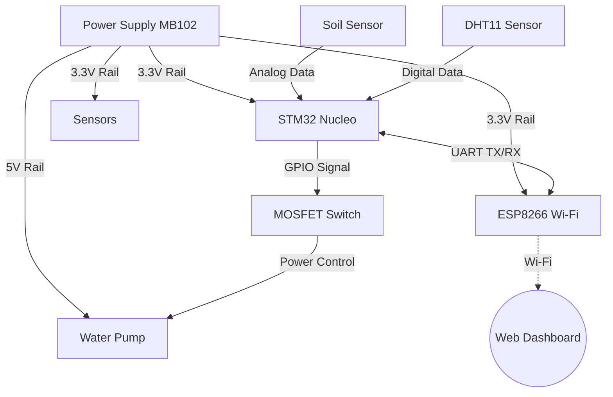

# Automatic Plant Watering System
A smart IoT gardening assistant that monitors soil and air conditions to automate watering.

:::info 

**Author**: Andrei Anghelea \
**GitHub Project Link**: https://github.com/AngAndrei/automatic-plant-watering.git

:::

## Description

The **Automatic Plant Watering System** is an embedded IoT solution designed to maintain optimal conditions for indoor plants. Built around an **STM32 microcontroller**, the system intelligently monitors both **soil moisture** and **ambient temperature/humidity** to make watering decisions.

The system is designed for flexibility, offering two modes of operation:
1.  **Automatic Mode:** The system autonomously activates the water pump when soil moisture drops below a critical threshold.
2.  **IoT Remote Mode:** Using an **ESP8266 Wi-Fi module**, the device connects to a mobile app/web dashboard, allowing the user to view real-time environmental data and trigger the watering pump remotely.

## Motivation

I chose this project to address a recurrent, common daily problem for me and my family and friends: keeping house plants alive during busy periods or vacations. Plants often die due to irregular watering, sometimes because owners forget.

From an engineering perspective, this project demonstrates:
* **Hybrid Power Management:** Using a dedicated **Breadboard Power Supply** to drive high-current actuators (pumps) while keeping the microcontroller logic safe.
* **IoT Bridge Implementation:** Creating a UART-to-Wi-Fi bridge between an ARM Cortex-M4 (STM32) and an ESP8266.
* **Multi-Sensor Fusion:** Combining analog data (soil) and digital protocol data (DHT11) in a real-time Rust application.

## Architecture 

### Component List
1.  **STM32 (Controller):** Orchestrates the logic, reads sensors, and sends commands.
2.  **Sensors:**
    * **Soil Sensor:** Analog reading of soil water content.
    * **DHT11:** Digital reading of air temperature and humidity.
3.  **Actuator:** A 5V Submersible Pump controlled by a **MOSFET** (Low-Side Switch).
4.  **Connectivity:** ESP8266 communicating via UART (TX/RX) to send JSON data to the cloud.

## Log

### Weeks 3 - 9 and 10 - 16 November
* **Project Selection:** Researched various embedded project ideas and selected the "Automatic Plant Watering System" due to its practical utility.
* **Requirements Definition:** Decided on the core architecture: using an **STM32** for control and an **ESP8266** for Wi-Fi connectivity.
* **Planning:** Created the initial project outline and defined the necessary features (Automatic Mode vs. Remote App Control).

### Weeks 24 November - 7 December
* **Component Selection:** Finalized the Bill of Materials (BOM), ensuring compatibility between the 3.3V logic of the STM32 and the 5V requirement of the pump.
* **Procurement:** Ordered the specialized components (Soil Sensor, Submersible Pump, Breadboard Power Supply).
* **Inventory:** Verified existing components from Arduino starter kits (DHT11, Resistors, Wires) to ensure nothing was missing.
* **Arrival:** Received the ordered parts and performed a visual inspection.

### Weeks 8 - 14 December
* **Hardware Testing:** Individually tested the new components:
    * Verified the **Breadboard Power Supply** output (5V/3.3V rails).
    * Tested the **Submersible Pump** functionality directly on power.
    * Calibrated the **Soil Moisture Sensor** (Dry air vs. Water readings).
* **Integration Tests:** Experimented with the MOSFET circuit to switch the pump on/off using a simple signal.
* **Final Sourcing:** The last remaining components arrived, completing the hardware set.

### Week 15 - 21 December
* **Documentation:** Started writing the comprehensive project documentation (Architecture, Hardware, Software sections) on the website.
* **Core Logic:** Began developing the main software logic in **Rust**, defining the application structure.
* **State Machine:** Designed the primary state machine (Sleep -> Measure -> Decide -> Report) to serve as the base for the code implementation.

### Week 12 - 18 January
* **Component Integration:** Connected the Soil Moisture Sensor and DHT11 to the STM32 Nucleo board on the breadboard.
* **Initial Code Testing:** Wrote and flashed the initial Rust driver code to verify accurate readings from both sensors via the defmt logger.
* **Actuator Prep:** Soldered male jumper headers onto the Submersible Pump wires to allow for a secure connection to the breadboard.
* **Bridge Configuration:** Flashed the ESP-01 with the custom "Wi-Fi Manager" firmware to handle ThingSpeak communication.

### Week 19 - 25 January
* **Circuit Completion:** Built the MOSFET Low-Side Switch circuit (Transistor + Flyback Diode) to safely interface the 5V Pump with the 3.3V STM32 logic.
* **Power Rail Setup:** Configured the MB102 Power Supply to provide separate 5V (for the pump) and 3.3V (for the STM32/ESP) rails.
* **Final Polish:** Tided up the wiring and finalized the documentation photos.

## Hardware

### Schematics

### Bill of Materials

| Device | Usage | Price(Ron) |
| :--- | :--- | :--- |
| **STM32 Board** (Nucleo-U545RE-Q) | Main Controller | 128 |
| **[Breadboard Power Supply (MB102)](https://www.optimusdigital.ro/ro/electronica-de-putere-stabilizatoare-liniare/61-sursa-de-alimentare-pentru-breadboard.html)** | Provides stable 5V & 3.3V rails | 4.69 |
| **[9V Battery + Jack Clip](https://www.optimusdigital.ro/en/wires-with-connectors/896-9v-battery-connector-with-dc-jack.html?srsltid=AfmBOoqBu2WnHuISFJTu4C4pY3SxYivh9p0muAx0wqIuCJrkuwDhYV5S)** (or 12V Adapter) | Input power for the Breadboard Supply | 1.5 |
| **[ESP8266 (ESP-01S)](https://www.optimusdigital.ro/ro/wireless-wifi/222-modul-wi-fi-esp-01-negru.html?search_query=esp8266+wifi+module&results=12)** | Wi-Fi Connectivity (UART) | 17.49 |
| **[Mini Submersible Pump (5V)](https://www.optimusdigital.ro/ro/altele/12969-mini-pompa-de-apa-submersibila-5v-cu-usb.html)** | Watering Actuator | 10 |
| **[Soil Sensor v1.2](https://www.optimusdigital.ro/ro/senzori-senzori-de-umiditate/73-senzor-de-umiditate-a-solului.html?search_query=sensor+umiditate&results=8)** | Analog Moisture Sensor | 4 |
| **[DHT11 Sensor](https://www.optimusdigital.ro/ro/senzori-senzori-de-temperatura/4762-modul-senzor-de-temperatura-dht11-cu-led.html?search_query=dht11&results=12)** | Air Temp & Humidity | 10 |
| **[IRLZ44N MOSFET](https://www.optimusdigital.ro/ro/componente-electronice-tranzistoare/11870-tranzistor-mosfet-irlz44n-canal-n-83w-55v-41a.html?search_query=irlz44n+mosfet&results=1)** | Switch for the Pump | 5 |
| **[1N4007 Diode](https://www.optimusdigital.ro/ro/kituri/12333-kit-plusivo-microcontroller-starter.html?search_query=starter+kit&results=14)** | Flyback Protection (for Pump) | 0.5 |
| **[Resistors (10kΩ, 1kΩ)](https://www.optimusdigital.ro/ro/kituri/12333-kit-plusivo-microcontroller-starter.html?search_query=starter+kit&results=14)** | Resistors | 1 |
| **[Jumper Wires & Breadboard](https://www.optimusdigital.ro/ro/prototipare-breadboard-uri/8-breadboard-830-points.html?search_query=breadboard&results=96)** | Connections | 10 |
| **[Vinyl Tubing (6mm)](https://www.optimusdigital.ro/ro/piese-imprimante-3d-altele/12925-tub-de-teflon-4x6-mm-pret-per-1-m.html?search_query=tub&results=49)** | Water transport | 10 |

## Software

| Library | Description | Usage |
| :--- | :--- | :--- |
| `embassy-stm32` | Hardware Abstraction Layer (HAL) | Controls the **ADC** (Soil Sensor), **GPIO** (Pump), and **UART** (ESP8266). |
| `embassy-time` | Async Timer | Manages non-blocking delays (e.g., watering for exactly 5 seconds). |
| `dht-sensor` | DHT11 Driver | Specialized driver to read Air Temperature & Humidity from the DHT11 sensor. |
| `heapless` | Static Data Structures | Used to create fixed-size String buffers for formatting the UART messages ("22,50,4000\n"). |
| `panic-probe` | Panic Handler | Handles system panics by printing the error location to the debug console. |

## Links

1.  [The Embedded Rust Book](https://docs.rust-embedded.org/book/) - Core concepts for Rust on microcontrollers.
2.  [Embassy Framework Documentation](https://embassy.dev/) - The primary framework used for the async logic.
3.  [ESP8266 AT Command Set](https://docs.espressif.com/projects/esp-at/en/latest/AT_Command_Set/index.html) - Reference for commanding the Wi-Fi module via UART.
4.  [DHT11 Rust Driver (dht-sensor)](https://crates.io/crates/dht-sensor) - Documentation for the specific sensor library.
