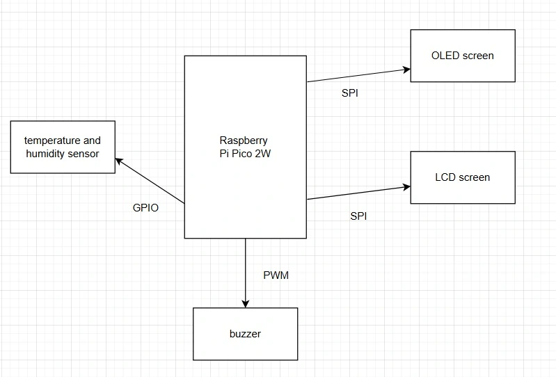
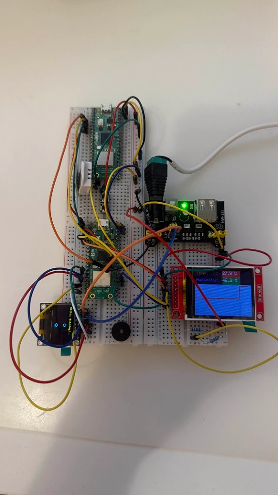
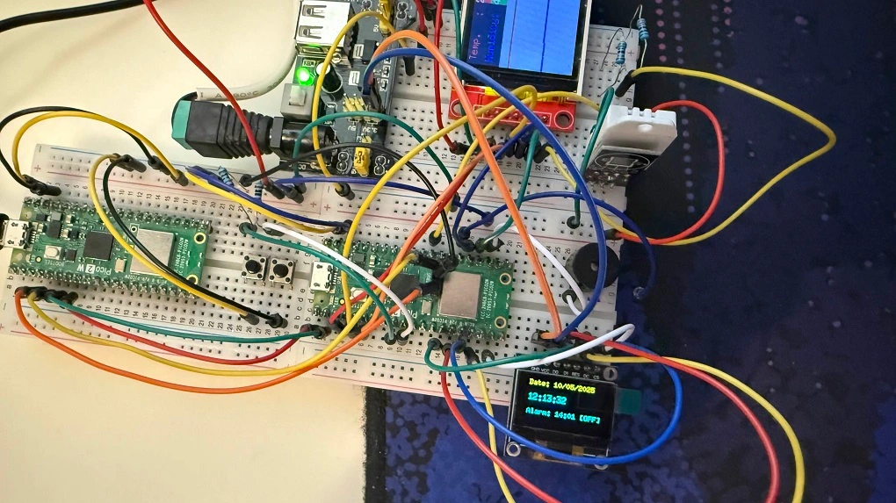
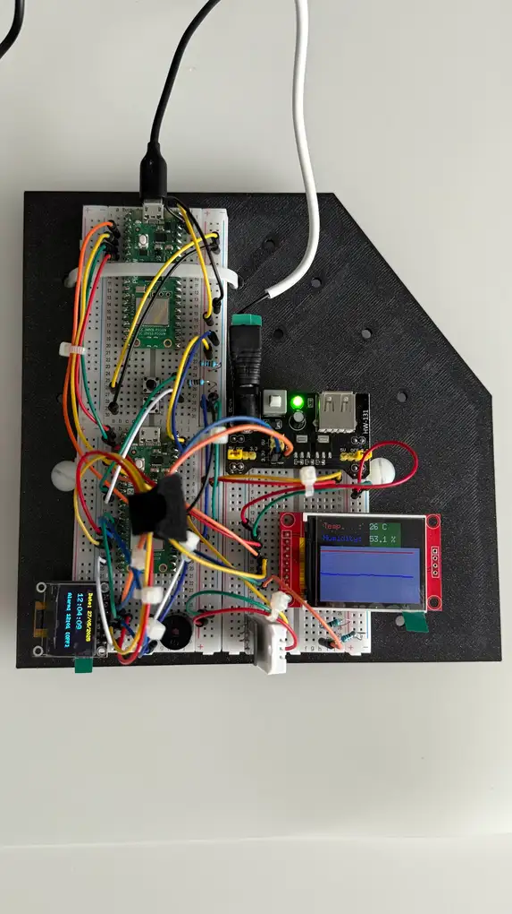
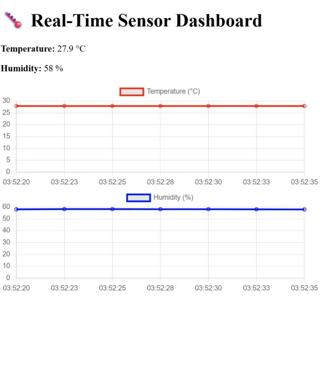
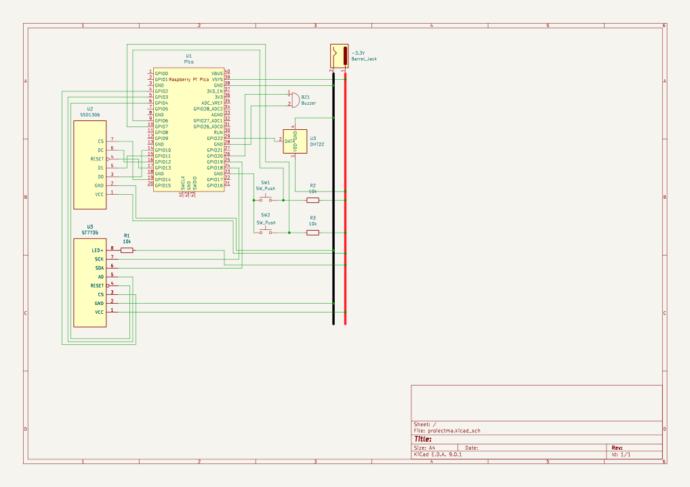

# Smart Clock
A smart clock with an alarm, display, temperature/humidity monitoring and a web interface.

:::info 

**Author**: Dumitrescu Andrei-Bogdan \
**GitHub Project Link**: https://github.com/UPB-PMRust-Students/project-Andreid04

:::

## Description

This project is built using the Raspberry Pi Pico 2W, capable of displaying the current time and date on a small OLED display, and live temperature/humidity data on another small LCD display that also shows a real-time graph of both temperature and humidity. The current temperature and humidity also change color depending on their value. The device fetches accurate time from the internet every 2 hours, and offers the possibility to set alarms. Alarms can be heard through a passive buzzer placed on the breadboard.

## Motivation

I always wanted a machine that sits on my desk and keeps track of time and schedule related stuff while also offering information about what is happening in the air of my room(humidity and temperature). I wanted a fully customizable clock that is also "smart" but i could not find anything that i like in a store. So i decided to take this opportunity and create the smart clock that i wanted with full customizability and pleasent looking OLED and LCD displays for a fraction of the price of a similar clock bought from the internet.

## Architecture 

 <!-- include the power supply and a small description on how it works  images:1024x768 -->

### General Schematic



### Components overview

- **Microcontroller**
    - The Raspberry Pi Pico 2W microcontroller handles the data from the sensor and the web interface in order to active an alarm, show and update information on the screens; 
- **Sensor service**
    - polls DHT22 for temperature & humidity every 2 seconds and writes the data to the LCD display, updating the graphs in real time;
- **Clock Service**
    - fetches the exact time from the internet every 2h and keeps local RTC synced;
- **Alarm Handler**
    - creates and triggers the alarm created by the user;
- **Display units**
    - The OLED display shows the clock, alarms and the date; 
    - The LCD display is used for temperature and humidity monitoring and their respective graphs.


## Log

<!-- write your progress here every week -->

### Week 5 - 11 May

- Set up ST7735 lcd and SSD1306 oled displays with embedded-graphics.  
- Drew dynamic temperature/humidity graphs and live colored changes if values are between a known good range.



### Week 12 - 18 May

- Got the second display (ssd1306 OLED) to display the correct date and time in hours:minutes:seconds in real time.
- Added 2 buttons through which you can set alarms and view them on the screen. The first button is used to enter/exit alarm modes:
    - default: nothing alarm related appears on the screen
    - set hour: sets the alarm hour
    - set minute: sets the alarm minute at which it will trigger
    - toggle alarm on/off: if off the alarm will not be triggered at the specified time
- The second button increments the alarm hour/ minute /toggle functionality.
- When the alarm triggers, a buzzer will pulse for 3 seconds with 3 audible beeps on different pitched tones (50-200hz).


 
### Week 19 - 25 May

- 3D Printed a support with feet for the project and tied up the wires for a cleaner look.
- Moved the set alarm functionality on an asynchronous task for efficiency and faster response although it may create some noise on the screens if they do not get clean, stable power. 
- Finally got the Wi-Fi part working and sending the sensor data to a python web server that uses Flask. Time is sent from the server to the pico every 2h, mainly before initializing the screen and the main loop in order to have an accurate date and time displayed.
- At the PM Fair the project will look even better, i am thinking of putting a plexiglass sheet raised on some supports but i don't currently have the cutting tools.





## Hardware

- **2x Raspberry Pi Pico 2W** (one acts as a debugger): The brains of the smart clock. It supports the wi-fi interface for sending and receiving data from an external device;
- **Breadboard + jumper wires**: for connecting the peripherals to the pico and to power; 
- **ST7735 TFT LCD display** (SPI): acts as a colored screen for displaying the temperature and humidity info, their graphs and color mapping if the paramters are healthy or not(green, yellow and red);  
- **SSD1306 OLED** (secondary SPI display): used for displaying the clock, the date and the alarms;
- **DHT22** (temperature + humidity sensor): used for monitoring the temperature and humidity of the air with the help;
- **Passive buzzer + resistor** (GPIO controlled): a buzzer that is controlled through PWM on a PWM capable GPIO pin(20);
- **12V power supply** terminated to a barrel jack feeding the HW131 power supply that outputs regulated 3.3V and 5V DC. (I only use 3.3V for this project).


### Schematics

**KiCAD schematic**




### Bill of Materials

<!-- Fill out this table with all the hardware components that you might need.

The format is 
```
| [Device](link://to/device) | This is used ... | [price](link://to/store) |

```

-->

| Device | Usage | Price |
|--------|--------|-------|
| [Raspberry Pi Pico 2W](https://www.raspberrypi.com/documentation/microcontrollers/raspberry-pi-pico.html) | The microcontroller | [40 RON](https://www.optimusdigital.ro/ro/placi-raspberry-pi/13327-raspberry-pi-pico-2-w.html) |
| [DHT22 Sensor](https://www.optimusdigital.ro/ro/senzori-senzori-de-temperatura/1449-modul-senzor-de-temperatura-i-umiditate-dht22.html)         | Temp & humidity monitoring  | [23 RON](https://www.optimusdigital.ro/ro/senzori-senzori-de-temperatura/1449-modul-senzor-de-temperatura-i-umiditate-dht22.html)  |
| [ST7735 LCD](https://www.optimusdigital.ro/ro/optoelectronice-lcd-uri/1311-modul-lcd-spi-de-18-128x160.html)         | Color display 160x128  1.8'     | [29 RON](https://www.optimusdigital.ro/ro/optoelectronice-lcd-uri/1311-modul-lcd-spi-de-18-128x160.html)  |
| [Passive Buzzer](https://www.optimusdigital.ro/ro/audio-buzzere/634-buzzer-pasiv-de-5-v.html)         | Alarm feedback      | [2 RON](https://www.optimusdigital.ro/ro/audio-buzzere/634-buzzer-pasiv-de-5-v.html)   |
| [Kit Breadboard + wires + HW131 power supply](https://done.land/tools/breadboard/powersupply/hw-131/)   | Prototyping setup and 3.3/5V PSU | [22 RON](https://www.optimusdigital.ro/ro/kituri/2222-kit-breadboard-hq-830-p.html)  |
| [SSD1306 OLED](https://github.com/rickkas7/SSD1306-tutorial)          | Secondary text display for clock and alarms    | [24 RON](https://www.optimusdigital.ro/ro/optoelectronice-lcd-uri/194-oled-096-.html)  |


## Software

| Library | Description | Usage |
|---------|-------------|-------|
|[ssd1306](https://crates.io/crates/ssd1306)| Crate to interface with SSD1306 OLED display | Control the display |
| [st7735](https://github.com/almindor/st7789) | Display driver for ST7735 LCD |Control the display |
| [embedded_graphics](https://github.com/embedded-graphics/embedded-graphics) | 2D graphics library that is minimal in used resources | Used for writing and drawing to the display |
| [embedded_hal](https://github.com/rust-embedded/embedded-hal)        | Abstraction layer for MCU drivers | Interfaces for all peripherals  |
| [embedded_dht_rs](https://github.com/rust-dd/embedded-dht-rs)       | Temperature/humidity sensor crate | For controlling and reading data from the DHT22 sensor |
| [pwm](https://docs.embassy.dev/embassy-rp/git/rp235xb/pwm/index.html)       | PWM module | For controlling the active buzzer on a precise tone in HZ |
| [cyw43](https://docs.rs/cyw43/latest/cyw43/)       | Driver for the CYW43 Wi-Fi chip on the Pico W | Support for wi-fi station mode and AP mode as well as bluetooth support |
| [heapless](https://github.com/rust-dd/embedded-dht-rs)       | Fixed-capacity collections for no_std | Used for String buffers and messaging, can be instantiated in a static variable|
| [chrono](https://github.com/chronotope/chrono)       | Timezone-aware date and time handling | Used for the clock and the alarm in order to keep track of time accurately |
| [embassy_net](https://docs.embassy.dev/embassy-net/git/default/index.html)       | Async embedded TCP/IP network stack | Used to serve a web interface over Wi-Fi|
| [embassy_rp](https://docs.embassy.dev/embassy-rp/git/rp235xb/index.html) | Access to the pheripherals | Initializing and talking to peripherals|
| [embassy_executor](https://docs.embassy.dev/embassy-rp/git/rp235xb/index.html) | Provides an executor for running asynchronous tasks concurrently | Execute asynchronous tasks concurrently |
| [embassy_time](https://docs.rs/embassy-time/latest/embassy_time/) | Timekeeping, delays and timeouts | Schedule tasks to run at specific times |
| [embassy-sync](https://crates.io/crates/embassy-sync) | Async synchronization primitives | Used for Mutex in screens and sharing data through TCP |
| [display-interface-spi](https://crates.io/crates/display-interface-spi) | SPI display abstraction | Facilitates SPI communication between spi screens and device |
| [static-cell](https://crates.io/crates/static-cell) | Safe static memory allocator | Used to initialize and store static data |
| [defmt](https://github.com/knurling-rs/defmt) | A highly efficient logging framework that targets resource-constrained devices, like microcontrollers | Prints out messages in the terminal(debugging) |

## Links

<!-- Add a few links that inspired you and that you think you will use for your project -->

1. [SSD 1306 setup with SPI](https://github.com/rickkas7/SSD1306-tutorial)
2. [Pico 2W in kicad](https://github.com/ncarandini/KiCad-RP-Pico)
3. [DHT22 data sheet and crate usage](https://github.com/rust-dd/embedded-dht-rs)
4. [Embedded-graphics examples](https://github.com/embedded-graphics/examples)
5. [Simple rust examples with pico](https://pico.implrust.com/index.html)
6. [Demo of working project on youtube](https://youtube.com/shorts/2jhZCI8OYJE?si=Fdq_udtOpBgoNPQ3)
