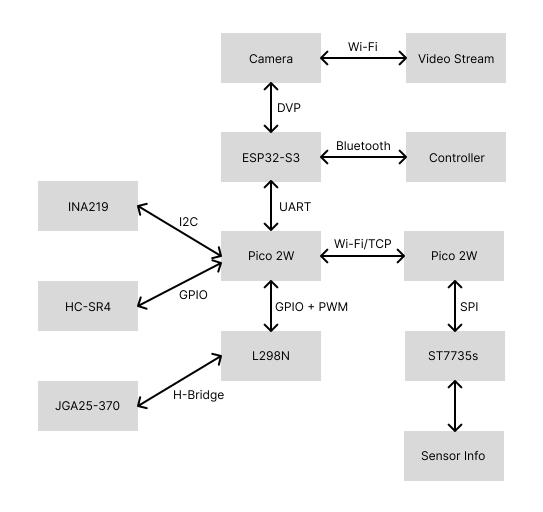

# DriveSight

A mobile robot project with a camera for visual tracking, based on a Raspberry Pi Pico 2W and ESP32-S3.

:::info

**Author**:  Neagu Andrei-Cristian 
**GitHub Project Link**: "https://github.com/UPB-PMRust-Students/project-mohgTheOmen.git"

:::

## Description

DriveSight is a manually controlled robotic platform equipped with real-time video streaming. It integrates a camera module for live feed monitoring and a wireless controller interface for direct motor control, providing precise, remote navigation and situational awareness.

## Motivation

I started this project to challenge myself and explore how far I could push the capabilities of embedded hardware, combining real-time control, wireless communication, and camera streaming on constrained systems.

## Architecture

Main Components:

- Raspberry Pi Pico 2W (Motor Controller): Controls motors, ultrasonic sensors, and receives movement commands via UART.
- ESP32-S3: Captures a live camera feed and sends control commands from a connected Bluetooth controller.
- Raspberry Pi Pico 2W (Display Host): Hosts a Wi-Fi access point and receives data from the motor controller to display real-time sensor values or system status on a small screen.

Feedback Mechanisms:

- Current sensors (INA219): Monitor motor current to help maintain consistent speed across varying surface conditions.
- Ultrasonic sensors: Provide obstacle detection and distance feedback for navigation and collision avoidance.

User Interface:

- Web-based interface: Hosted on the ESP32-S3 for viewing the live camera feed.
- Bluetooth controller: Used for manual driving input.
- On-board display: Connected to Pico no.2, shows live telemetry from the motor controller over Wi-Fi.

Connections Between Components:

- UART: Used for communication between the ESP32-S3 and motor controller Pico.
- Wi-Fi: Motor controller Pico connects to the display host Pico (AP mode) for data transmission.
- I2C: Used by the motor controller Pico for reading data from INA219 current and ultrasonic sensors.
- GPIO: Used to control the L298N motor driver from the motor controller Pico.

## Log

### Week 21 - 27 April

- Tested components individually.

### Week 28 April - 4 May

- Set up the ESP32-S3 to stream the webserver.
- Assembled the second Pico to display data received through TCP from the first Pico.

### Week 5 - 11 May

### Week 12 - 18 May

### Week 19 - 25 May

## Hardware

- Raspberry Pi Pico 2W: Main controller handling sensors and motor control.
- ESP32-S3: Provides camera feed for object tracking and sends control commands.
- Raspberry Pi Pico 2W (Display Unit): Hosts an access point and displays telemetry data.
- ST7735s: Display the telemetry data.
- L298N Motor Driver: Drives the two DC motors.
- 2 × DC Motors: Provide movement for the robot.
- 2 × INA219 Current Sensors: Monitor motor currents to detect stalls or resistance changes.
- 3 × HC-SR04 Ultrasonic Sensors: Detect obstacles in front of the robot.
- Power Bank or Li-ion Batteries: Powers the system.
- Wires, Breadboard, and Connectors: For interconnecting all the components.

### Schematics

(*to be added*) - KiCad WIP

### Bill of Materials

| Device                                                                                               | Usage                | Price                                                                                                                                         |
| ---------------------------------------------------------------------------------------------------- | -------------------- | --------------------------------------------------------------------------------------------------------------------------------------------- |
| 2x[ Raspberry Pi Pico 2W](https://datasheets.raspberrypi.com/picow/pico-2-w-datasheet.pdf)              | Main control board   | [ 39.66 lei ](https://www.optimusdigital.ro/ro/placi-raspberry-pi/13327-raspberry-pi-pico-2-w.html)                                              |
| [ESP32-S3](https://www.espressif.com/sites/default/files/documentation/esp32-s3_datasheet_en.pdf)       | Camera and Wi-Fi     | [ 56.71 lei ](https://www.aliexpress.com/item/1005004960637276.html)                                                                             |
| [L298N Motor Driver](https://www.handsontec.com/dataspecs/L298N%20Motor%20Driver.pdf)                   | Controls motor power | [ 10.99 lei ](https://www.optimusdigital.ro/ro/drivere-de-motoare-cu-perii/145-driver-de-motoare-dual-l298n.html)                                |
| [ST7735s Display](https://www.displayfuture.com/Display/datasheet/controller/ST7735.pdf)                | Displays sensor data | [ 27.99 lei ](https://www.optimusdigital.ro/ro/optoelectronice-lcd-uri/870-modul-lcd-144.html)                                                   |
| 2x[ JGA25-370 Motors](https://media.digikey.com/pdf/Data%20Sheets/Seeed%20Technology/114090046_Web.pdf) | Robot movement       | [ 49.00 lei ](https://www.optimusdigital.ro/ro/motoare-motoare-cu-reductor-de-25-mm/350-motor-cu-reductor-jga25-310.html)                        |
| 2x[ INA219 Current Sensor](https://www.ti.com/lit/ds/symlink/ina219.pdf?ts=1746074360615)               | Current monitoring   | [ 29.99 lei ](https://www.optimusdigital.ro/ro/senzori-altele/5824-modul-senzor-de-curent-cu-interfaa-i2c-ina219.html)                           |
| 3x[ HC-SR04 Ultrasonic Sensor](https://cdn.sparkfun.com/datasheets/Sensors/Proximity/HCSR04.pdf)        | Obstacle detection   | [ 14.99 lei ](https://www.optimusdigital.ro/ro/senzori-senzori-ultrasonici/2328-senzor-ultrasonic-de-distana-hc-sr04-compatibil-33-v-i-5-v.html) |
| Li-ion 3x Battery Holder                                                                             | Power source         | [ 20.13 lei ](https://www.emag.ro/suport-acumulator-liion-format-18650-3-celule-in-serie-18650-3/pd/DF392RYBM/)                                  |
| Wires, Connectors, Breadboard, Resistors                                                             | Wiring               | Already had them                                                                                                                              |

## Software

### ESP32-S3 (C)

| Library                                               | Description                                  | Usage                                    |
| ----------------------------------------------------- | -------------------------------------------- | ---------------------------------------- |
| [ESP-IDF](https://github.com/espressif/esp-idf)          | Official Espressif IoT Development Framework | Base SDK for Wi-Fi, networking, etc.     |
| [esp_camera](https://github.com/espressif/esp32-camera)  | Camera driver for OV3660                     | Captures and streams MJPEG frames        |
| [Bluepad32](https://github.com/ricardoquesada/bluepad32) | Bluetooth game controller library            | Receives input from Bluetooth controller |

### Raspberry Pi Pico 2W (Rust)

| Library                                                      | Description                                           | Usage                                                             |
| ------------------------------------------------------------ | ----------------------------------------------------- | ----------------------------------------------------------------- |
| [embassy](https://crates.io/crates/embassy)                     | Async embedded runtime for embedded systems           | Task scheduling and async infrastructure                          |
| [embassy-executor](https://crates.io/crates/embassy-executor)   | Asynchronous task executor                            | Schedules and runs tasks in a `no_std` async environment        |
| [embassy-rp](https://crates.io/crates/embassy-rp)               | RP2040-specific HAL for Embassy                       | GPIO, SPI, PWM, ADC, and other peripherals                        |
| [embassy-time](https://crates.io/crates/embassy-time)           | Timer and delay handling                              | Non-blocking frame-rate control, delays, timeouts                 |
| [embassy-sync](https://crates.io/crates/embassy-sync)           | Synchronization primitives                            | Used for async channels and mutexes                               |
| [embassy-gpio](https://crates.io/crates/embassy-gpio)           | GPIO abstraction for Embassy                          | Manages input/output pins for buttons, sensors, and motor control |
| [cyw43](https://crates.io/crates/cyw43)                         | Wi-Fi driver for the CYW43 chip                       | Connecting the Pico 2W to Wi-FI                                   |
| [cyw43-pio](https://crates.io/crates/cyw43-pio)                 | PIO-based driver for the CYW43 chip                   | Enables Wi-Fi using the RP2350's PIO peripheral                   |
| [embassy-net](https://crates.io/crates/embassy-net)             | TCP/IP networking stack                               | Hosts server or client for sending/receiving data                 |
| [hcsr04-async](https://crates.io/crates/hcsr04-async)           | Async driver for ultrasonic distance sensor (if used) | Obstacle detection                                                |
| [defmt](https://crates.io/crates/defmt)                         | Lightweight logging framework for embedded systems    | Enables efficient, structured logging                             |
| [defmt-rtt](https://crates.io/crates/defmt-rtt)                 | RTT (Real-Time Transfer) backend for `defmt`        | Outputs logs via RTT for real-time debugging                      |
| [embedded-graphics](https://crates.io/crates/embedded-graphics) | 2D graphics library for embedded systems              | Drawing text, shapes, and UI elements on the display              |
| [mipidsi](https://crates.io/crates/mipidsi)                     | Display driver for MIPI-compatible SPI LCDs           | Driving the ST7735s display via SPI                               |
| [rand](https://crates.io/crates/rand)                           | Random number generation                              | Used internally by the TCP stack for port/sequence numbers        |

## Links

1. [Personal Project Repo](https://github.com/mohgTheOmen/drivesight)
