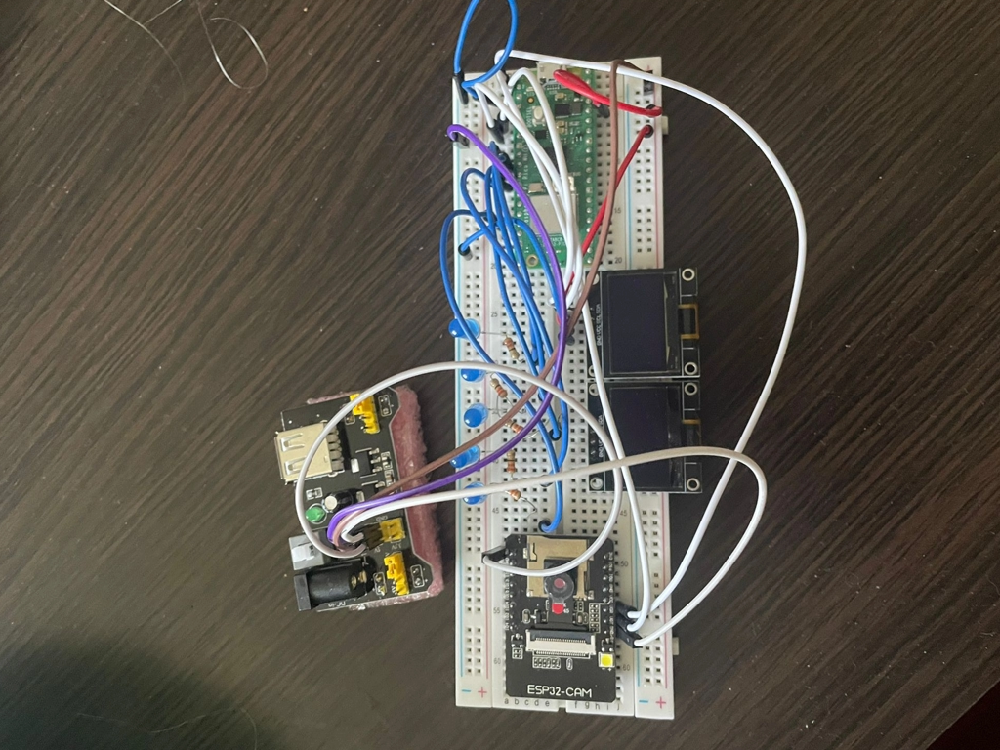
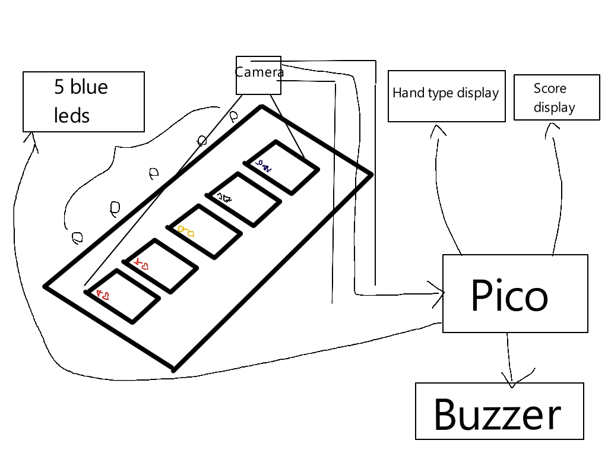
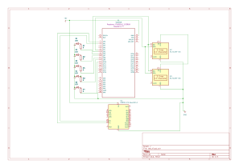

# Poker Hand Identifier
A device that identifies a Poker Hand and computes a score (Balatro in real life)

:::info 

**Author**: Andrei Profir \
**GitHub Project Link**: https://github.com/UPB-PMRust-Students/project-Razapriest

:::

## Description

This device uses a camera to look at a Poker Hand and determine what type of hand it is (Flush, Two Pair, etc.). It also computes a score for the user, based on my criteria. How it works is that a phone camera will take a picture of the 5-card poker hand and it will transfer the image to a python script that runs a pattern-matching algorithm to determine the rank and suit of cards, then sends that information to the pico to be computed by the hand detecting logic and for the score to be calculated. Additionally, cards that are considered scoring (so for example, in a Flush, all of them, but in a Pair, only 2 of them) will have asmall Blue LED light up above them and a ding sound be made when their rank is added to the score. I also thought of the scenario where 2 or more hands are detected, so for example, a Full House will always contain a Two Pair, so the algorithm will only take into account the highest scoring hand.

Wi-Fi connection is used to send the data to the pico from a python script that runs the image recognition. I would have loved for the project to be 100% in rust, but I don't think rust can do image recognition and template matching. The python script will be in the classroom github alongside everything rust-related.

## Motivation

Over the past few weeks, I have been playing a lot of Balatro. It's a video game where you make poker hands and get a score (I know it sounds lame but trust me it won game of the year for a reason). As I was playing it to procrastinate for this project, a brilliant idea came to mind, why don't I build this game in real life? This will be just a prototype, but it will work for a regular deck of cards and will be able to compute a score. To be completely honest, this project isn't really something "useful" in day-to-day life, but it is a very fun concept for me and I'm looking forward to building it, I'm sure people will find it cool.

Also, a very important aspect of this project is that it was done without a debugger. This was because I didn't know about the debugger thing and I didn't want to spend more money and I wanted to see if I could do it without one, so that should be pretty impressive right? (I used the screens and leds for debugging).

## Architecture 

The pico is connected to the 5 LEDs and the 2 LCDs (in the picture only 1 LCD is connected) and to the power source. The pico's TX and RX pins io0 and io1 are connected to the esp32-cam's TX and RX pins respectively. Everything is then connected to the power source.


this is what it looks like now


## Log

<!-- write your progress here every week -->

### Week 28 April - 4 May

This week I did research on my idea and made preparations for starting the project. The first thing I did, since components didn't arrive yet, was to try and do the hand and score computation logic. I wrote the code initially in C++, because I am more familiar with that language and I can work on it comfortably, so later on I can translate it to rust and fix any problems that may arise. In the meantime, the components arrived. I made sure I had everything and I looked into how they must be connected and what they can and can't exactly do.

### Week 5 - 11 May

In this week I started work on the hardware. I connected my components, the LEDs, the OLED displays and the camera to test them, as they will be later rearranged on multiple separate breadboards. Pictures of the testing setup will be uploaded, the final setup for the components is yet to be designed because I have to take measurements of the playing cards and determine the height of the camera. Funnily enough, because I don't want to spend money on 3d printing, the project may or may not be built out of legos.

### Week 12 - 18 May

Sadly, I wasn't able to get much work done this week. Because my family and I are moving (very unfortunate timing), and I also had 2 exams, it was very hard to find time to work, but I did manage to build what I had to build out of legos so I saved money on 3d printing. Additionally, I tested all of the hardware components and made sure they all work. Every component is set in stone and is connected correctly, except for the camera, because its position depends on how the software part will go, I have to determine the correct height and position for it to function so that's why it isn't set up yet.

### Week 19 - 25 May

This week marked a turning point for my project. Apparently the ESP32-CAM module that I ordered had a "fake" camera, not an OV2640, so it was incompatible. Thus, I had to start from scratch. Now, my project requieres using a phone camera for the card input. I wrote a Python script that creates a Flask app which the phone connects to so it can input an image of 5 poker cards on a single color background (so the whole lego building was useless). The python script then matches the cards to pre-established templates and sends a 10 character string to the pico to be processed.

## Hardware

For the hardware, I use a Raspberry Pi Pico WH for convenience-sake, a breadboard, a power source, a couple of wires and adaptors, a buzzer, 5 LEDs with their according resistors. An esp32-cam would've been used but I was scammed, so a phone camera will be used instead and the project will work with wi-fi integration.

### Schematics





### Bill of Materials

<!-- Fill out this table with all the hardware components that you might need.

The format is 
```
| [Device](link://to/device) | This is used ... | [price](link://to/store) |

```

-->

| Device | Usage | Price |
|--------|--------|-------|
| [Raspberry Pi Pico WH] | The microcontroller | [56.23 RON] |
| [Breadboard + Wires + Power Source kit] | The base of the project | [20.83 RON] |
| [2x OLED Displays] | The displays | [41.98 RON] |
| [5x LEDs + 5x Resistors] | The LEDs | [2.85 RON] |
| [Piezo Active Buzzer] | Hopefully for a "ding" sound | [4.02 RON] |
| [Extra stuff like wires, adaptors, buttons and some smaller breadboards] | The extras | [18.71 RON] |

!! No debugger used !!

All products ordered from ArduShop: https://ardushop.ro/ro/


## Software

The python script that runs the image recognition is quite simple, and was done in collaboration with ChatGPT (I have no reason to try and reinvent the wheel). I will spare you the details as it is nothing too exciting, but the script receives an image through a flask app, it rotates it, divides the 5 cards by detecting their contours, then matches them to templates (yes, I have scanned an entire deck of cards and tested each one to make sure the templates work as intented). In the end, a 10 character string is generated to pe processed by in the rust code (So, for example, for the following hand: King of Hearts, Queen of Diamonds, 5 of Spades, 5 of Clubs, Queen of Hearts, the following string is generated: KHQD5S5CQH).

! Disclaimer: the rust code was 100% written by hand, no ChatGPT involved (i tried but it didn't know how to do anything)
Now on the rust side is where the fun begins. The 10-character string is received through wi-fi and is processed as follows: Every 2 characters represent a card, and a struct Card is used to store them in a 5 element array. The cards are then sorted by their "true rank" (so 9 is 9, 0 is 10, J is 11, and so on), because that makes it easier to detect hands. Each type of hand has its own function, for example, here is how a Straight is detected:
```
fn is_straight(hand: &mut [Card; 5]) -> bool 
{
    if hand[0].true_rank + 1 == hand[1].true_rank && hand[1].true_rank + 1 == hand[2].true_rank && hand[2].true_rank + 1 == hand[3].true_rank && hand[3].true_rank + 1 == hand[4].true_rank 
    { return true; }
    if hand[0].true_rank == 2 && hand[1].true_rank == 3 && hand[2].true_rank == 4 && hand[3].true_rank == 5 && hand[4].true_rank == 14 
    { return true; }
    return false;
}
```
And here is how a Two Pair is detected:

```
fn is_twopair(hand: &mut [Card; 5]) -> u32
{
    if hand[0].true_rank == hand[1].true_rank && hand[2].true_rank == hand[3].true_rank
    { return 1; }
    if hand[0].true_rank == hand[1].true_rank && hand[3].true_rank == hand[4].true_rank
    { return 2; }
    if hand[1].true_rank == hand[2].true_rank && hand[3].true_rank == hand[4].true_rank
    { return 3; }
    return 0;
}
```
Notice how the Straight function returns true or false, but the Two Pair function returns 1, 2 or 3. That is because, for a Straight, all 5 cards are scored, but for a Two Pair, one card will not be scored, so there are 3 possible combinations (1-2 and 3-4, 1-2 and 4-5, 2-3 and 4-5). It is needed to know which cards are scored so we know which LEDs need to be light up and which ranks to add to the final score.

After all the specific hand functions, a big determine hand function is created. This is a very big if else if else if block, I had no better idea, but it works very well.

In the end, for each scoring card, a score function is called to make its LED blink and cause a beep:

```
async fn score<P>(led: &mut P, pwm: &mut Pwm<'static>)
where
    P: OutputPin,
{
    led.set_high().ok();
    short_beep(pwm).await;
    Timer::after(Duration::from_millis(1000)).await;
    led.set_low().ok();
}
```
(the short beep function called here just causes a buzzer to be turned on for 200 milliseconds)

Here is also an example of how a card is scored:

```
if playing_cards[4].is_scored == true
    {
        unsafe 
        {
            CHIPS += playing_cards[4].true_rank;
            let chips = CHIPS;
            let mult = MULT;
            buf.clear();
            write!(&mut buf, "{} x {}", chips, mult).unwrap();
        }

        Text::new(&buf, Point::new(0, 32), style) //RIGHT DISPLAY
            .draw(&mut display2)
            .unwrap();
        display2.flush().unwrap();
        score(&mut card_led_5, &mut pwm).await;
        display2.clear(BinaryColor::Off).unwrap();
    }
```
I use an unsafe block because the CHIPS and MULT variables are global and are updated in the determine hand function.

Some debugging lines may be found throughout the code. You will notice there is no defmt or info. That is because I did my debugging with LEDs and Displays.

| Library | Description | Usage |
|---------|-------------|-------|
| [ssd1306]([https://github.com/almindor/st7789](https://github.com/rust-embedded-community/ssd1306)) | Display driver for ssd1306 | Used for the OLED displays |
| [embedded-graphics](https://github.com/embedded-graphics/embedded-graphics) | 2D graphics library | Used for drawing to the displays |
| [embassy-net](https://github.com/embassy-rs/embassy-net) | Embassy net crate | Used for internet connection |
| [cyw43]() | cyw43 driver | Also used for internet connection |

## Links

<!-- Add a few links that inspired you and that you think you will use for your project -->

1. [The game that the project is based on](https://www.playbalatro.com/)
2. [Example of wifi use for pico W](https://github.com/embassy-rs/embassy/blob/main/examples/rp/src/bin/wifi_tcp_server.rs#L125)
3. [Template I used to start](https://github.com/fatfingers23/raspberry-pico-w-embassy-template/tree/main)
4. [Youtube Link in case something breaks](https://www.youtube.com/shorts/9FIxcekURE0)

