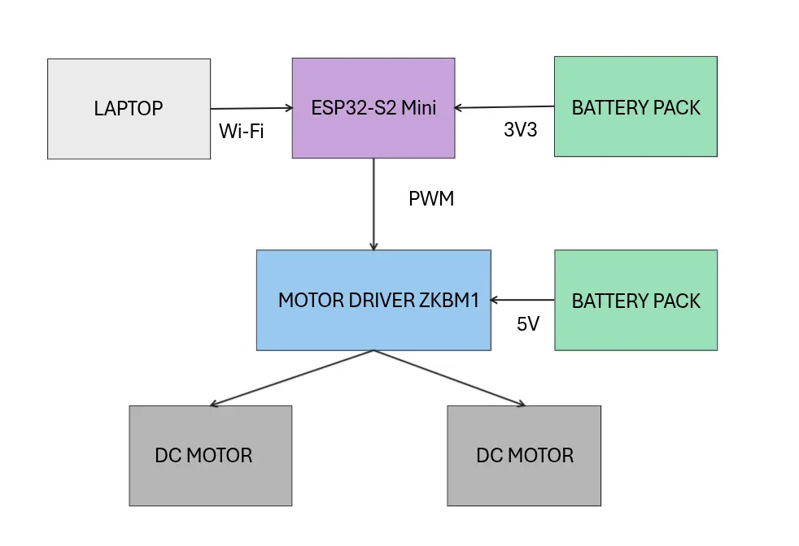
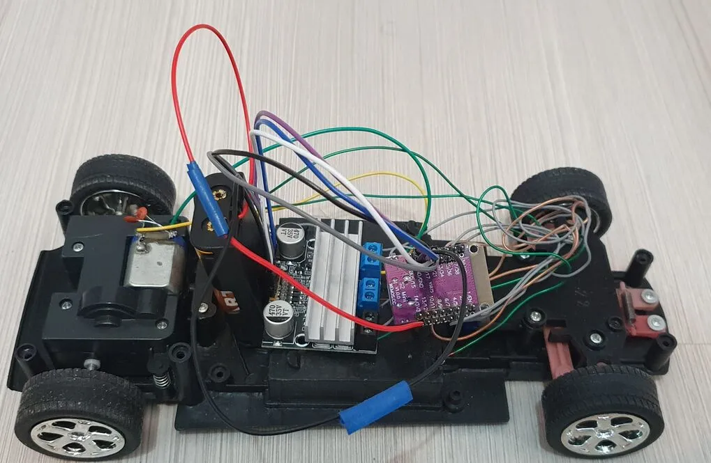
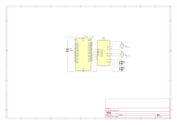

# Octane
A Wi-Fi controlled RC car with a design inspired by Rocket League cars.

:::info 

**Author**: Salavastru Andrei \
**GitHub Project Link**: https://github.com/UPB-PMRust-Students/project-AndreiSa05

:::

## Description

Octane is a Wi-Fi controlled RC car powered entirely by an ESP32-S2 Mini. The car uses a motor driver to control two DC motors that handle both forward and backward movement. Users can control the car remotely by sending WASD commands over Wi-Fi from a browser interface. The ESP32-S2 receives these commands, interprets them, and drives the motors accordingly.

## Motivation

I chose this project because I’ve always been curious about how RC cars work. As a child, I loved playing with them, but I never truly understood how they were built or controlled. This project gave me the opportunity to explore that curiosity hands-on — combining programming with real hardware to build something functional and fun. 

## Architecture 

### Schematic Diagram

#### ESP32-S2 Mini
- **Role:** Serves as the central microcontroller for the car. It handles Wi-Fi communication, receives user input, processes that input, and controls the motors.
- **Connections:** GPIO pins send PWM signals to the motor driver’s enable pins.

#### LAPTOP
- **Role:** Acts as the remote control interface. Sends WASD movement commands over Wi-Fi to the ESP32-S2 Mini.
- **Connections:** Communicates with the ESP32-S2 via HTTP over a shared Wi-Fi network. The control interface is a web page.

#### MOTOR DRIVER ZKBM1
- **Interface:** PWM
- **Role:** Controls the direction of the two DC motors based on the signals received from the ESP32-S2 Mini.
- **Connections:** The driver uses four GPIO pins from the ESP32-S2: IN1 and IN2 for Motor A, IN3 and IN4 for Motor B. Each motor’s speed is adjusted using PWM signals, while direction is determined by the HIGH/LOW configuration of the control pins. The driver is powered directly from a battery pack connected to its VCC and GND terminals.

#### DC MOTOR x2
- **Interface:** Powered through motor driver
- **Role:** Provide movement for the car - forward and backward
- **Connections:** Each motor is connected to one output channel of the ZKBM1 motor driver. They receive power and directional signals through these channels.

#### BATTERY PACK x2
- **Interface:** Power supply
- **Role:** Provides electrical power to both the motors and the ESP32-S2 system
- **Connections:** A battery pack is connected to the VCC and GND inputs of the motor driver to power the motors, while the other is used to power the ESP32-S2 Mini.

## Log

<!-- write your progress here every week -->

### Week 5 - 11 May
Purchased all the necessary components and set up the Rust development environment for the ESP32-S2 Mini microcontroller.
### Week 12 - 18 May
Completed the hardware assembly of the car, including wiring and soldering the electronic components. Continued software development by implementing Wi-Fi connectivity and setting up PWM control for the motors.
### Week 19 - 25 May
Integrated Wi-Fi command handling with motor control and tested remote operation via HTTP requests sent from a browser interface. Additionally fixed minor bugs to improve stability and recorded a short demo.

## Hardware
The Octane project is built around an ESP32-S2 Mini, which handles both Wi-Fi communication and motor control. User commands (WASD) are received via Wi-Fi and translated into PWM signals sent to a ZKBM1 motor driver. The ZKBM1 controls two DC motors, enabling movement through GPIO pins. Power is supplied by two battery packs: one powers the motor driver, and the other powers the ESP32-S2 Mini. Thus, the setup allows for wireless control using a microcontroller. You can watch a [demo of the project on YouTube](https://youtu.be/3dMxoPGCX78).

### Schematics

### Bill of Materials

| Device                                                                                                             | Usage                                                       | Price                                                                                                   |
| ------------------------------------------------------------------------------------------------------------------ | ----------------------------------------------------------- | ------------------------------------------------------------------------------------------------------- |
| [ESP32-S2 Mini](https://electronix.ro/produs/placa-s2-mini-wifi-bazata-pe-esp32-s2fn4r2-esp32-s2-4mb-flash-2mb-psram/)     | Main microcontroller, handles Wi-Fi and motor control logic | [30.23 RON](https://electronix.ro/produs/placa-s2-mini-wifi-bazata-pe-esp32-s2fn4r2-esp32-s2-4mb-flash-2mb-psram/)                                           |
| [Motor Driver ZKBM1](https://www.aliexpress.com/item/1005003339586638.html) | Controls direction of two DC motors via PWM       | [18.16 RON](https://www.aliexpress.com/item/1005003339586638.html)                                            |
| [DC Motors x2](https://www.emag.ro/motor-dc-3v-ai284-s370/pd/DV0X44BBM/)                         | Provide propulsion — forward, backward        | [7.84 RON](https://www.emag.ro/motor-dc-3v-ai284-s370/pd/DV0X44BBM/)                                                              |
| [Battery Pack x2](https://www.emag.ro/carcasa-cu-suport-si-conectori-cu-2-fire-pentru-doua-baterii-tip-aa-r6-din-plastic-negru-csc-2-aa/pd/DGX5NBMBM/?ref=embedding_similar_model_1_1&provider=rec&recid=rec_102_7872997ae108d1ecb78cdc72ca60392b41d18d7b0db60c74e34ad4a5536be491_1746301694&scenario_ID=102)                  | Powers the motor driver and ESP32                           | [11.98 RON](https://www.emag.ro/carcasa-cu-suport-si-conectori-cu-2-fire-pentru-doua-baterii-tip-aa-r6-din-plastic-negru-csc-2-aa/pd/DGX5NBMBM/?ref=embedding_similar_model_1_1&provider=rec&recid=rec_102_7872997ae108d1ecb78cdc72ca60392b41d18d7b0db60c74e34ad4a5536be491_1746301694&scenario_ID=102)                                                          |
| [Female-Female Wires x20 ](https://electronix.ro/produs/fire-dupont-mama-mama-cu-jumper-wire-pentru-pcb-10-pini/)            | Connect components Female-Female            | [5.96 RON](https://electronix.ro/produs/fire-dupont-mama-mama-cu-jumper-wire-pentru-pcb-10-pini/)                                                 |
| [Male-Male Wires x20](https://electronix.ro/produs/fire-dupont-tata-tata-cu-jumper-wire-pentru-pcb-10-pini/)            | Connect components Male-Male              | [7.54 RON](https://electronix.ro/produs/fire-dupont-tata-tata-cu-jumper-wire-pentru-pcb-10-pini/)                                                 |

## Software
| Library | Description | Usage |
|---------|-------------|-------|
| [`esp-idf-sys`](https://crates.io/crates/esp-idf-sys)   | Low-level bindings to the ESP-IDF  | Provides access to ESP32 system APIs and runtime components                                                |
| [`esp-idf-hal`](https://crates.io/crates/esp-idf-hal)   | Hardware Abstraction Layer for ESP32 using ESP-IDF                      | Used for GPIO, PWM (via ledc) for motor control               |
| [`esp-idf-svc`](https://crates.io/crates/esp-idf-svc)   | High-level service wrappers over ESP-IDF APIs                           | Used for managing Wi-Fi and networking                                |
| [`embedded-svc`](https://crates.io/crates/embedded-svc) | Traits and types for portable embedded services                         | Provides abstractions for networking, HTTP servers, and more          |
| [`log`](https://crates.io/crates/log)                   | Standard Rust logging interface                                         | Enables logging throughout the application                            |
| [`anyhow`](https://crates.io/crates/anyhow)             | Error handling library                                                  | Simplifies error propagation and reporting                            |
| [`embuild`](https://crates.io/crates/embuild)           | Build-time support for `esp-idf` projects                               | Required for setting up and linking the ESP-IDF build system properly |
| [`std`](https://doc.rust-lang.org/std/)                 | Rust standard library (enabled via `esp-idf`)                           | Provides multithreading (`thread`), networking (`TcpStream`, `TcpListener`), and synchronization (`Mutex`, `Arc`) capabilities |

## Links

<!-- Add a few links that inspired you and that you think you will use for your project -->

1. [ESP IDF Template](https://github.com/esp-rs/esp-idf-template)
2. [KiCad Tutorials](https://www.kicad.org/help/learning-resources)
