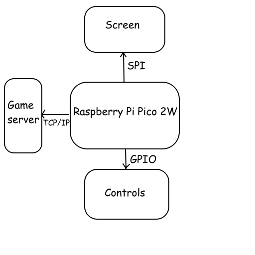
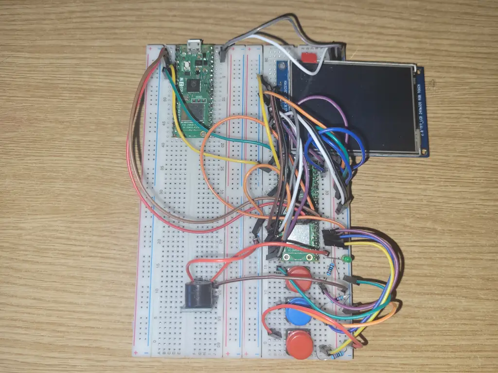
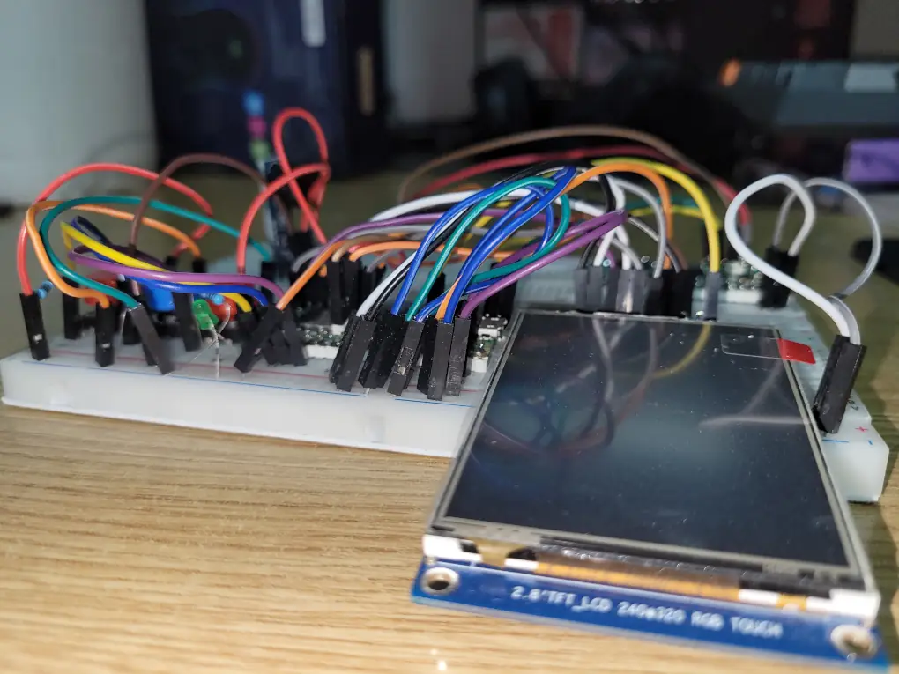

# PicoPlay

PicoPlay is a hand-held retro game console with built-in multiplayer support.

:::info

**Author**: Ștefănescu Andrei-Cezar

**GitHub Project Link**: https://github.com/UPB-PMRust-Students/project-andrewstephengames

::::

# Description

PicoPlay is a hand-held device which allows players to enjoy a multiplayer in a tiny retro package. Users can either choose to play a classic singleplayer game or the baked in multiplayer game called [Retro Heroes](https://andrewstephen.xyz/retro-heroes). Multiplayer is done either among PicoPlay clients or between PicoPlay and web browser clients. To power the experience, a server binary is run on a cloud computer, which the players connect to.

# Motivation

My motivation to embark upon this project came from some of my previous personal projects, which all have a retro theme (see [[1](https://andrewstephen.xyz/pixper)] [[2](https://andrewstephen.xyz/retro-heroes)]. Since I got into programming because of my passion for retro games, I am motivated to build a device from the ground up that includes the best games that I've written over the years, and allows for a solid platform for any future ports.

# Architecture

Basic diagram

Main components used:

1. Raspberry Pi Pico 2W

    * the platform that we use

    * Connections:

        * 5 buttons, one buzzer, one LED on GPIO
    
        * LCD touch screen on SPI 
    
        * Game server on LAN (optional)

2. GPIO components

    * Left button: GP18

    * OK button: GP19

    * Right button: GP20

    * Up button: GP21

    * Down button: GP22

    * Green LED boot indicator: GP16

    * Buzzer: GP17

3. Touch screen module
    * 2.8" LCD module with the ILI9341 controller: SPI
    
## Log

<!-- write your progress here every week -->

### Week 5 - 11 May

During this week I've wired up and soldered most of the components, such as the screen and buttons. Other than that, I worked on my scientific session project, which will come up later, in the software development milestone. The sacrifice I made by developing for a different project will pay off.

### Week 12 - 18 May

During this week I prepared for the hardware milestone by checking my electronic connections and finding several bad connections for SPI, which I've fixed, both physically and in the electric schematic below.

### Week 19 - 25 May

TBA

## Hardware

The hardware consists of the Raspberry Pi Pico 2W microcontroller and various peripherals connected to it.

There are five buttons connected that control the graphical interface: Left, Ok, Right, Up and Down. Also, a small green LED is attached, indicating the boot status of the board.

The most important peripherals attached are the ILI9341 touch screen module and the buzzer, which allow for an embedded game development platform. Every single peripheral is attached via GPIO, except for the screen, which communicates with the board via SPI. On the screen we draw a menu, allowing the user to select from a list of games to play. Details can be seen in the figures below.

Figure 1

Figure 2

## Schematics

Electrical schematic

## Bill of Materials

| Device                                                  | Usage                        | Price                           |
|---------------------------------------------------------|------------------------------|---------------------------------|
| [Raspberry Pi Pico 2W](https://www.raspberrypi.com/documentation/microcontrollers/pico-series.html) | The microcontroller | [39.66 RON](https://www.optimusdigital.ro/en/raspberry-pi-boards/13327-raspberry-pi-pico-2-w.html?srsltid=AfmBOoo5CQdoi14-RbmA_YJJrNUG1hPBzlSKgPdCOYv9U2PgJdK3bPwM) |
[2.8" SPI LCD Module with ILI9341 Controller (240 x 320 px)](https://cdn-shop.adafruit.com/datasheets/ILI9341.pdf) | Displaying graphics | [69.99 RON](https://www.optimusdigital.ro/en/lcds/3531-modul-lcd-de-24-cu-spi-i-controller-ili9341-240x320-px.html) |
[Passive Buzzer](https://www.mouser.com/datasheet/2/400/ef532_ps-13444.pdf) | Buzzer | [0.99 RON](https://www.optimusdigital.ro/en/buzzers/12247-3-v-or-33v-passive-buzzer.html) |
[4x Red Button with Round Cover](https://components101.com/sites/default/files/component_datasheet/Push-Button.pdf) | Button | [7.96 RON](https://www.optimusdigital.ro/en/buttons-and-switches/1114-red-button-with-round-cover.html) |
[Blue Button with Round Cover](https://components101.com/sites/default/files/component_datasheet/Push-Button.pdf) | Button | [1.99 RON](https://www.optimusdigital.ro/en/others/1118-blue-round-button-with-cover.html) |
[Plusivo 3 mm and 5 mm Diffused LED Light Emitting Diode Assortment Kit](https://www.plusivo.com/electronics-kit/40-plusivo-3mm-diffused-led-diode-assortment-kit.html) | LEDs and resistors | [26.99 RON](https://www.optimusdigital.ro/en/optimus-digital-kits/9517-set-de-led-uri-asortate-de-5-mm-si-3-mm-310-buc-cu-rezistoare-bonus.html) |
[2x 20 cm 10p Male-Female Wires](https://www.optimusdigital.ro/en/wires-with-connectors/214-fire-colorate-mama-mama-10p.html) | Male to female wires | [7.98 RON](https://www.optimusdigital.ro/en/wires-with-connectors/214-fire-colorate-mama-mama-10p.html) |
[10 cm 40p Male-Male Wires](https://www.optimusdigital.ro/en/wires-with-connectors/884-set-fire-tata-tata-40p-10-cm.html) | Male to male wires | [4.99 RON](https://www.optimusdigital.ro/en/wires-with-connectors/884-set-fire-tata-tata-40p-10-cm.html) |

## Software

| Library | Description | Usage |
|---------|-------------|-------|
[embassy-rp](https://docs.embassy.dev/embassy-rp/git/rp235xb/index.html) | The embassy embedded framework | Initializing and interacting with peripherals
[embassy-executor](https://docs.embassy.dev/embassy-executor/git/cortex-m/index.html) | An async/await executor designed for embedded usage | Asynchronous programming |
[embassy-time](https://docs.embassy.dev/embassy-time/git/default/index.html) | Timekeeping, delays and timeouts. | Delays |
[embassy-sync](https://docs.embassy.dev/embassy-sync/git/default/index.html) | Synchronization primitives and data structures with async support | Synchronizing tasks |
[ili9341](https://docs.rs/ili9341/0.6.0/ili9341/) | ILI9341 display driver | Controlling the display |
[embedded-graphics](https://docs.rs/embedded-graphics/0.8.1/embedded_graphics/) | 2D graphics library that is focused on memory constrained embedded devices | Drawing graphics without using any buffers |
[embedded-hal-async](https://docs.rs/embedded-hal-async/latest/embedded_hal_async/) | An asynchronous Hardware Abstraction Layer (HAL) for embedded systems | Asynchronous hardware access
[gpio](https://docs.embassy.dev/embassy-rp/git/rp235xb/gpio/index.html) | GPIO management | Controlling GPIO pins |
[pwm](https://docs.embassy.dev/embassy-rp/git/rp235xb/pwm/index.html) | PWM module | Controlling the buzzer and the intensity of the boot LED | 

## Links

1. [Retro Heroes](https://andrewstephen.xyz/retro-heroes)
2. [Pixper](https://andrewstephen.xyz/pixper)
