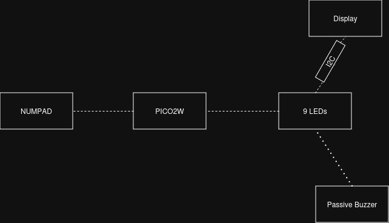
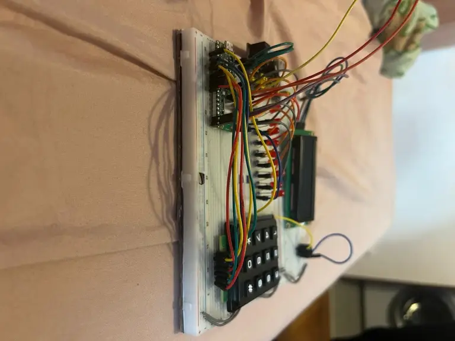
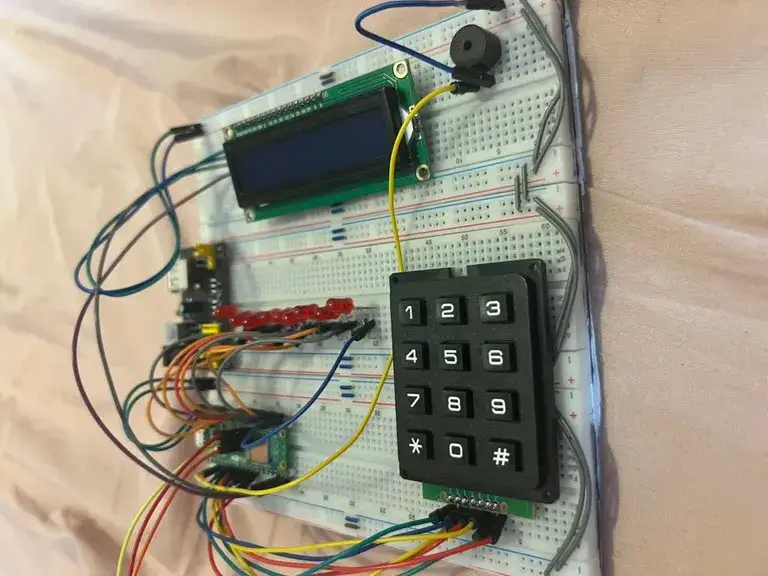
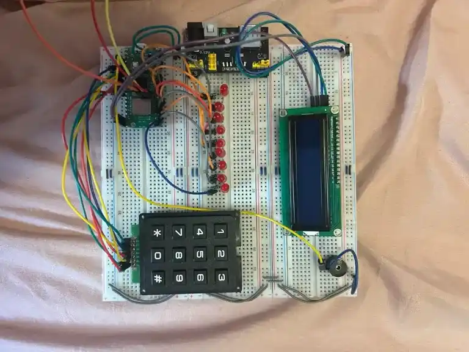
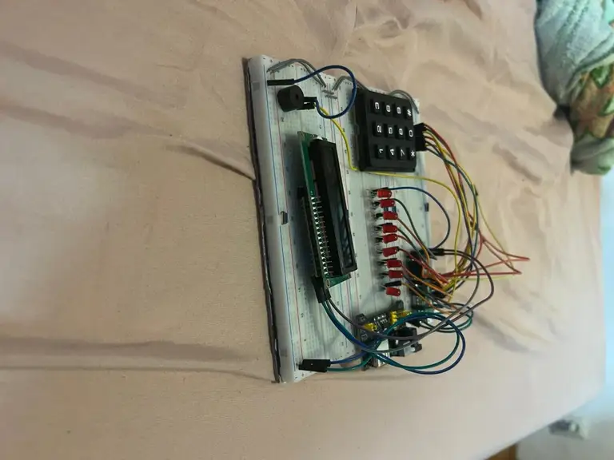
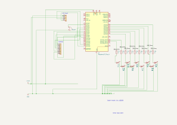

# Simon Says Game with LCD 


:::info 

**Author**: Dobrin Andrei Liviu \
**GitHub Project Link**: [https://github.com/UPB-PMRust-Students/project-andrei-1-64](https://github.com/UPB-PMRust-Students/project-andrei-1-64)

:::

## Description

This project implements a "Simon Says" memory game using 9 LEDs and a numpad. The game logic runs on a Raspberry Pi Pico 2W. An I2C-connected 16x2 LCD screen displays a start menu, current score, and high score saved in the microcontroller's flash memory.

## Motivation

I chose this project to combine embedded hardware and software concepts in a fun and interactive way. It challenges both my circuit design skills and my ability to use Rust in embedded development.

## Architecture 

The project is made up of several parts that work together to create the Simon Says game:




### Game Logic
- This is the main part of the program.
- It controls the flow of the game: when it starts, how patterns are shown, and when the game ends.

### Pattern Generator
- Generates a random sequence of LEDs that the player has to remember and repeat.
- The sequence gets longer each round to make the game more challenging.

### Input Handler
- Listens for button presses from the 4x3 keypad.
- Checks if the player's input matches the generated pattern.

### Output Handler
- Controls the 9 LEDs to display the pattern.
- Sends messages to the LCD screen (like score, "You Win", or "Game Over").
- Activates the buzzer to give sound feedback for actions.

### Score System
- Keeps track of the player’s current score.
- Saves the highest score in the microcontroller's flash memory so it’s not lost when powered off.

### How everything connects
- The **Game Logic** tells the **Pattern Generator** to make a new sequence.
- The **Input Handler** reads the player’s buttons and tells the **Game Logic** if it was correct.
- The **Output Handler** lights up the LEDs, updates the screen, and beeps the buzzer.
- The **Score System** stores the highest score and updates it when needed.

## Log

<!-- write your progress here every week -->

### Week 5 - 11 May
Started working on my Simon Says game using a Raspberry Pi Pico2W and Rust. Chose this project to explore embedded Rust and hardware interaction. Defined the concept: 9 inline LEDs, 4x3 keypad, buzzer, and 16x2 LCD. Focused on planning and selecting components.
### Week 12 - 18 May
Connected the LCD via I2C and displayed simple messages. Tested individual LEDs and the buzzer to confirm they work correctly. Began setting up the breadboard layout for the full game circuit. Verified power supply and pin assignments
### Week 19 - 25 May
Integrated core hardware (keypad, 9 LEDs, buzzer on GP13) with the main Simon Says game logic, enabling random sequence generation, level progression, and player input checking. Successfully implemented distinct audio feedback via PWM. Also integrated the 16x2 I2C LCD to display dynamic game information, including current level, game state messages, and scores (current and high score).

## Hardware
The Simon Says game is built around several key hardware components, each playing a crucial role in its functionality:

*   **Raspberry Pi Pico W**: It acts as the central microcontroller, responsible for running the game logic, generating light patterns, reading player input, and controlling the display and buzzer.
*   **16x2 I2C LCD Screen**: Displays game information to the player.
*   **LEDs (x9)**: Provide the primary visual output for the game. They light up in specific sequences that the player must memorize and replicate using the numpad.
*   **330Ω Resistors (x9)**: Act as current-limiting resistors for each of the 9 LEDs, protecting them from damage by ensuring they receive the correct amount of electrical current.
*   **10kΩ Resistors (x9)**: Used as pull-down resistors for the numpad buttons. They ensure that each button input pin on the microcontroller reads a defined LOW state when a button is not pressed, preventing floating inputs.
*   **Breadboard**: A prototyping board that helps to assembly all electronic components without soldering.
*   **Jumper Wires**: Wires used to establish electrical connections.
*   **Buzzer**: An auditory output device that provides sound feedback for various game events, such as correct or incorrect button presses, level completion, or game over signals.
*   **Numpad**: The main input interface for the player. It is used to enter the sequence of lights they have memorized, attempting to match the pattern shown by the LEDs.
*   **Breadboard Power Supply**: Provides the voltage from an external source to power all components on the breadboard.








### Schematics



### Bill of Materials

<!-- Fill out this table with all the hardware components that you might need.

The format is 
```
| [Device](link://to/device) | This is used ... | [price](link://to/store) |

```

-->

| Device | Usage | Price |
|--------|--------|-------|
| [Raspberry Pi Pico W (x2)](https://www.raspberrypi.com/documentation/microcontrollers/raspberry-pi-pico.html) | The microcontroller | [35 RON](https://www.optimusdigital.ro/en/raspberry-pi-boards/12394-raspberry-pi-pico-w.html) |
| [16x2 I2C LCD Screen](https://www.optimusdigital.ro/en/lcds/62-1602-lcd-with-i2c-interface-and-yellow-green-backlight.html) | Displays menu and scores | [15 RON](https://www.optimusdigital.ro/en/lcds/62-1602-lcd-with-i2c-interface-and-yellow-green-backlight.html) |
| [LEDs (x9)](https://www.optimusdigital.ro/en/leds/696-led-rou-de-3-mm-cu-lentile-difuze.html) | Lights up in sequence | [4 RON](https://www.optimusdigital.ro/en/leds/696-led-rou-de-3-mm-cu-lentile-difuze.html) |
| [330Ω Resistors (x9)](https://www.robotshop.com/products/resistor-330-ohm-1-4-watt-pth-20pk) | LED current limiting | [5 RON](https://www.robotshop.com/products/resistor-330-ohm-1-4-watt-pth-20pk) |
| [10kΩ Resistors (x9)](https://www.optimusdigital.ro/en/resistors/1088-025w-10k-resistor.html) | Pull-down for buttons | [1 RON](https://www.optimusdigital.ro/en/resistors/1088-025w-10k-resistor.html) |
| [Breadboard](https://www.optimusdigital.ro/en/breadboards/13244-breadboard-175-x-67-x-9-mm.html) | For prototyping | [12 RON](https://www.optimusdigital.ro/en/breadboards/13244-breadboard-175-x-67-x-9-mm.html) |
| [Jumper Wires](https://www.optimusdigital.ro/en/wires-with-connectors/7330-50-cm-40p-female-female-wire.html) | Connect components | [23 RON](https://www.optimusdigital.ro/en/wires-with-connectors/7330-50-cm-40p-female-female-wire.html) |
| [Buzzer](https://www.optimusdigital.ro/en/buzzers/10-active-buzzer-module.html) | Audio feedback | [3 RON](https://www.optimusdigital.ro/en/buzzers/10-active-buzzer-module.html) |
| [Numpad](https://www.optimusdigital.ro/en/others/5825-keyboard-module.html?gad_source=1&gad_campaignid=19615979487&gclid=Cj0KCQjw_dbABhC5ARIsAAh2Z-QC84GTPPIBHt5XXHiNGdmiLp44m6mMsmXymzOsN6fYGzXHPE1uBhEaAtJKEALw_wcB) | Controlling the game | [19 RON](https://www.optimusdigital.ro/en/others/5825-keyboard-module.html?gad_source=1&gad_campaignid=19615979487&gclid=Cj0KCQjw_dbABhC5ARIsAAh2Z-QC84GTPPIBHt5XXHiNGdmiLp44m6mMsmXymzOsN6fYGzXHPE1uBhEaAtJKEALw_wcB) |
| [Breadboard Power Supply](https://www.optimusdigital.ro/en/linear-regulators/61-breadboard-source-power.html) | Supplies 3.3V & 5V Power | [5 RON](https://www.optimusdigital.ro/en/linear-regulators/61-breadboard-source-power.html) |


## Software

| Library                 | Description                                                                                                | Usage in Simon Says Project                                                                                                                                                                 |
| :---------------------- | :--------------------------------------------------------------------------------------------------------- | :----------------------------------------------------------------------------------------------------------------------------------------------------------------------------------------------- |
| `embassy-executor`      | Asynchronous task executor for `async/await`.                                                              | Runs the main game logic (`main` function) and the concurrent `keypad_scanner_task`.                                                                                                         |
| `embassy-rp`            | Hardware Abstraction Layer (HAL) for Raspberry Pi RP2040/RP2350.                                           | Initializing the microcontroller (`init`); providing drivers/types for GPIO (LEDs, keypad), I2C (for LCD), PWM (for buzzer), and specific peripheral instances from its `peripherals` module. |
| `embassy-time`          | Timekeeping, asynchronous delays (`Timer::after_millis`, `Timer::after_secs`), and the `Delay` struct.     | Used for game delays, LED on-times, keypad debounce timing, sound durations, and as the `Delay` provider for the LCD driver.                                                                  |
| `embassy-sync`          | Asynchronous synchronization primitives (Mutexes, Channels, OnceLock).                                     | `Channel` for sending key presses; `Mutex` and `OnceLock` for safely initializing and sharing the LCD peripheral (`SHARED_GAME_LCD`). `CriticalSectionRawMutex` as the mutex type.      |
| `embassy-futures`       | Utilities for working with Futures.                                                                        | `join::join` for concurrently playing a buzzer sound and lighting an LED.                                                                                                                    |
| `heapless`              | `#![no_std]` data structures without dynamic memory allocation.                                             | `Vec` for storing the Simon Says LED sequence; `String` (aliased as `HString`) for formatting text to display on the LCD.                                                              |
| `fixed`                 | Fixed-point number types (e.g., `FixedU16`, `U4`).                                                         | Used for the `divider` field in `embassy_rp::pwm::Config` to allow fractional clock division for precise PWM frequencies for the buzzer (as per your working buzzer example).                   |
| `i2c-character-display` | Driver for character LCDs (like 16x2) connected via an I2C I/O expander (like PCF8574T).                  | Used to initialize and control your 16x2 LCD: `init()`, `clear()`, `home()`, `set_cursor()`, `print()`, and `backlight()`.                                                                |
| `defmt`                 | An efficient logging framework for embedded systems.                                                       | Provides `defmt::info!`, `defmt::warn!`, `defmt::error!`, `defmt::debug!` for structured log messages to observe program flow and debug.                                                              |
| `defmt-rtt`             | Backend for `defmt` enabling log output via RTT (Real-Time Transfer).                                      | Allows viewing `defmt` logs on your host computer.                                                                                                                                               |
| `panic-probe`           | Panic handler that prints panic messages using `defmt`.                                                    | Ensures panic messages are logged via `defmt` if the program crashes.                                                                                                                          |
| `cortex-m-rt`           | Minimal runtime for ARM Cortex-M microcontrollers.                                                         | Provides the entry point (`#[embassy_executor::main]` uses this) and basic runtime setup.                                                                                                   |
| `critical-section`      | A crate for handling critical sections (disabling interrupts).                                             | Used by Embassy's synchronization primitives (`Mutex`, `Channel`) to ensure data integrity in concurrent contexts.                                                                         |
| `rand` / `rand_core`    | Crates for random number generation. (`rand_core` defines traits like `RngCore`).                          | Although `SimplePrng` is currently used (which doesn't directly use `rand_core::RngCore` trait in its `impl`), these are in your `Cargo.toml` providing general RNG capabilities.            |
| `core::fmt::Write`      | Trait for enabling formatted writing into buffers.                                                         | Used with `format_args!` and `HeaplessString` to prepare text for the LCD.                                                                                                                   |
## Links

<!-- Add a few links that inspired you and that you think you will use for your project -->

1. [Full Rust Course](https://www.youtube.com/watch?v=BpPEoZW5IiY)
2. [crates.io](https://crates.io/)
2. [My Video Presenting the Project](https://www.youtube.com/watch?v=CTlhsGvXJ4Us)

