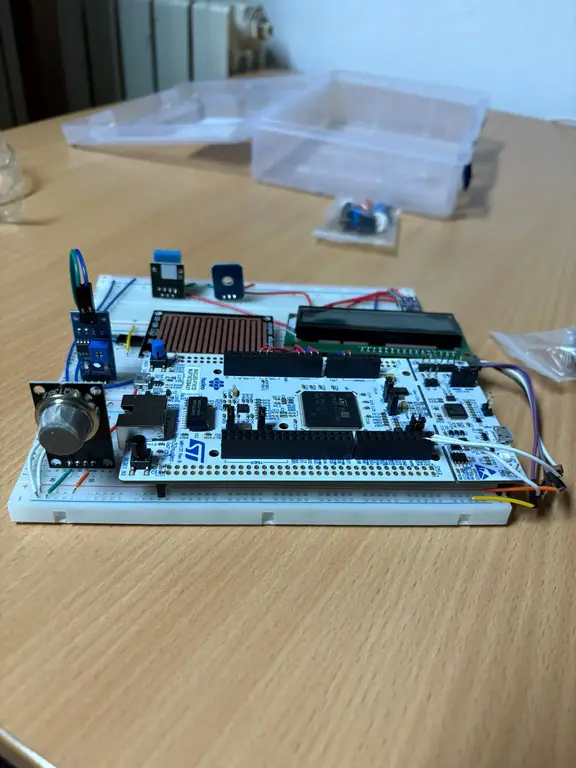
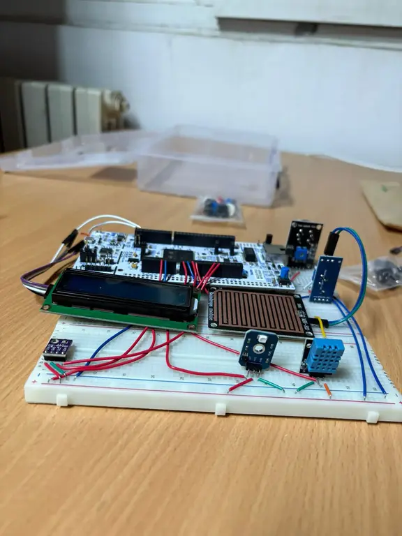
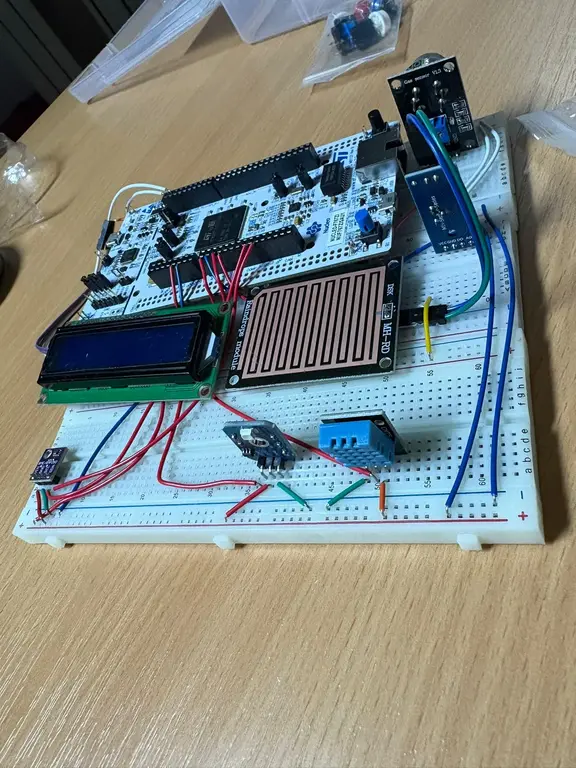
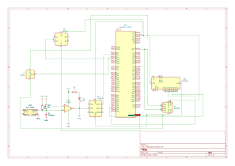

# Smart Weather station
A weather monitoring system that measures enviormental conditions  and automatically reacts to changes like heat, humidity and UV levels.

:::info 

**Author**: Student Name Fekete Anna-Maria \

**GitHub Project Link**: https://github.com/UPB-PMRust-Students/project-annfkt

:::

## Description

This project is a smart weather station built around the STM32F767ZI microcontroller, designed to monitor key environmental conditions such as temperature, humidity, barometric pressure, UV intensity, and rainfall. Using a variety of sensors, the system collects environmental data and provides both visual feedback through a display and audible alerts when preset thresholds are reached. Users can easily observe current conditions through an intuitive interface. The project focuses on sensor integration, data processing, and multitasking, resulting in a functional and versatile environmental control platform.This compact and customizable weather station demonstrates how embedded hardware and software can be combined to create an efficient and responsive environmental control system.

## Motivation

I chose this project based on both my technical background and personal interests. During my participation in the Future Shapers Summer School, organized by the University POLITEHNICA of Bucharest in collaboration with Honeywell, I gained valuable hands-on experience working with a variety of environmental sensors. This program not only deepened my understanding of sensor integration and data acquisition but also sparked a strong interest in developing practical applications that involve environmental monitoring.

In addition to this technical foundation, I have a long-standing passion for nature and natural phenomena, which has continually inspired my curiosity about how environmental conditions change and interact. The idea of building a system that can observe, respond to, and visualize those changes aligns closely with my interests in both technology and the natural world.

By combining my experience from the summer school with my enthusiasm for environmental topics, this project offers an ideal opportunity to apply my skills in a meaningful way—developing a system that connects embedded technology with nature, while also exploring areas like automation, user interaction, and environmental awareness.

## Architecture 

It is based on the Nucleo STM32F767ZI microcontroller, which controls the system and processes data from different environmental sensors. The DHT11 sensor measures temperature and humidity and is connected to a digital GPIO pin. The BMP280 sensor, which reads air pressure, uses the I2C interface and shares the communication lines with the LCD display, which also uses I2C to show the collected data. The UV sensor and MQ-2 gas sensor are connected to analog input pins, while the rain sensor is connected to a digital GPIO pin to detect rain.

The station gives output through an LCD display and several LEDs. The LEDs light up when certain conditions are met, like high gas levels or rain. There is also an optional button connected through GPIO that can be used to reset the data or change the display mode. The system connects to a laptop using a USB cable, which is used for both programming the board and powering it. This project shows how sensors, displays, and outputs can be connected and controlled using a microcontroller in a well-organized embedded system.

## Log

<!-- write your progress here every week -->

### Week 21 - 27 April
Choosing and buying the main components of the project.

### Week 28 April - 4 May
Receiving  most of the necesarry hardware and testing it to ensure functionality.
Performing tests on the sensors using an Arduino to observe accuracy.

### Week 5 - 11 May
Starting to test my hardware on the STM that i wish to use for the project. Firstly testing an easy example on the board to ensure functionality then starting th e hardware and a small part of the software. startinf to encounter issues at the esnd of the week.
### Week 12 - 18 May
Trying o solve the newly discoverde board issues while putting together the hardware of my project. Finishing the layout of the breadboard while still encountering problems on my board.
### Week 19 - 25 May

## Hardware





For the second milestone of the Smart Weather Station project, the base hardware setup has been completed and assembled on a breadboard. The current system includes key environmental sensors such as the DHT11 for temperature and humidity, the BMP280 for atmospheric pressure, a UV sensor, a rain sensor, and an MQ-2 gas sensor for detecting harmful gases. A 16x2 LCD screen is included to display the readings in real time, all managed by the Nucleo STM32F767ZI development board. This configuration forms the foundation of the weather station and is fully functional for monitoring environmental conditions. While this setup may remain as the final version, there is potential for future expansion with the addition of components like buttons, LEDs, and a buzzer for enhanced interactivity and alert features.


### Schematics

Place your KiCAD schematics here.

### Bill of Materials

<!-- Fill out this table with all the hardware components that you might need.

The format is 
```
| [Device](link://to/device) | This is used ... | [price](link://to/store) |

```

-->

| Device | Usage | Price |
|--------|--------|-------|
| [STM32F767ZI](https://community.st.com/t5/stm32-mcus-products/getting-started-with-stm32f767zi/td-p/393384) | The microcontroller | [150 RON](https://www.tme.eu/ro/details/nucleo-l496zg/kituri-de-dezvoltare-stm/stmicroelectronics/?brutto=1&currency=RON&utm_source=google&utm_medium=cpc&utm_campaign=RUMUNIA%20%5BPLA%5D%20CSS&gad_source=1&gad_campaignid=10591401989&gbraid=0AAAAADyylhJslZBEB_0nbud_bTPnF0Cr7&gclid=Cj0KCQjw_dbABhC5ARIsAAh2Z-T7umUOvDhnYLHLi6mAC9NWR94C_WWwn-O-1GjxfoASqPme8mpvBOcaAheeEALw_wcB) |
|[DHT11](https://randomnerdtutorials.com/esp32-dht11-dht22-temperature-humidity-sensor-arduino-ide/)|Temperature and humidity sensor|[7 RON](https://www.bitmi.ro/modul-senzor-de-temperatura-si-umiditate-dht11-compatibil-arduino-10393.html?gad_source=1&gad_campaignid=21312430054&gbraid=0AAAAADLag-l9sLX5JFk2SUW07oJY9cwkP&gclid=Cj0KCQjw_dbABhC5ARIsAAh2Z-SEj5EVdTPHdqKYIvsgy2Yz_DyTOI8Zq8XX5cPLcJB31AZycjcqdnoaAoS9EALw_wcB)|
|[BMP280](https://www.youtube.com/watch?v=8nPW7nZEMiA)|Temperature and pressure sensor|[9 RON](https://sigmanortec.ro/modul-presiune-temperatura-si-umiditate-bmp280-5v?SubmitCurrency=1&id_currency=2&gad_source=1&gad_campaignid=22174019478&gbraid=0AAAAAC3W72NKFDYwdfyTTpSdW2LkNtz2F&gclid=Cj0KCQjw_dbABhC5ARIsAAh2Z-QAfzGGx1iYgA6aDzzKQEfz8v_HAdNXpbOv6NtgQyOdE76V_kryGzYaAiMfEALw_wcB)|
|[UV Sensor](https://www.youtube.com/watch?v=vJct0vD6WWg)|Detects UV rays|[30 RON](https://sigmanortec.ro/Senzor-UV-p135396936?SubmitCurrency=1&id_currency=2&gad_source=1&gad_campaignid=22174019478&gbraid=0AAAAAC3W72NKFDYwdfyTTpSdW2LkNtz2F&gclid=Cj0KCQjw_dbABhC5ARIsAAh2Z-R-x7NfHpjRiFCjC3kZh7JzyKZVfzkdEG79hsjOL4drh9XUx20E8WsaAm0MEALw_wcB)|
|[Rain Sensor](https://www.youtube.com/watch?v=p6Td_d9ItFE)|Detects Rain|[8 Ron](https://sigmanortec.ro/Modul-senzor-ploaie-p126182467)|
|[Gas Sensor Module MQ-2](https://www.youtube.com/watch?v=SJV51kScJLg)|Detects gas in the air|[11 RON](https://www.optimusdigital.ro/ro/senzori-de-gaze/107-modul-senzor-gas-mq-2.html)|
|[LCD 1602](https://www.youtube.com/watch?app=desktop&v=g9P9tFjDsCk)|LCD Screen|[16 RON](https://www.optimusdigital.ro/ro/optoelectronice-lcd-uri/2894-lcd-cu-interfata-i2c-si-backlight-albastru.html?gad_source=1&gad_campaignid=19615979487&gbraid=0AAAAADv-p3DST91rElLA-XfsBRapIVDc8&gclid=Cj0KCQjw_dbABhC5ARIsAAh2Z-QsNJRul-ToPWptOIpYHZcAVjxGyZ0mW1CtNOFzdc7oehQKJzZ7R3YaAjjcEALw_wcB)|


## Software

| Library | Description | Usage |
|---------|-------------|-------|
| [st7789](https://github.com/almindor/st7789) | Display driver for ST7789 | Used for the display for the Pico Explorer Base |
| [embedded-graphics](https://github.com/embedded-graphics/embedded-graphics) | 2D graphics library | Used for drawing to the display |
|embassy|Asinc embeded rust Framework|Used for interacting with Periferals|

## Links

<!-- Add a few links that inspired you and that you think you will use for your project -->

1. [link](https://example.com)
2. [link](https://example3.com)
...
 
