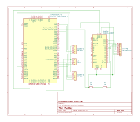

# RustBox
RustBox - The Rust Gaming Box

:::info 

**Author**: Frimu Aurel-Viorel \
**GitHub Project Link**: https://github.com/AurasV/RustBox-The-Rust-Gaming-Box

:::

## Description

Using the power of two screens, two joysticks and a few buttons, RustBox is a (mini) gaming console that can run several Singleplayer and Multiplayer (1v1) games: 

Singleplayer games:
 - Brick Breaker
 - Snake 

Multiplayer games: 
 - Tic Tac Toe
 - Snake battle
 - Pong

## Motivation

I have always wanted to create some portable gaming devices since I've first seen them on YouTube and other websites. Wanting to one up my roommate that made something similar - [Rogue Rust](https://embedded-rust-101.wyliodrin.com/docs/fils_en/project/2025/denis_iulian.pavel)

## Architecture 

The STM32 Board is the whole gaming station and it connects to the rest of the components like so:
 - To the 1602 LCD Display using I2C;
 - To the Two Axis HW-504 Joysticks using ADC for the X and Y movements and using GPIO for the push button they each have;
 - To the built in button using GPIO
 - To the (Fake) Arduino using Serial

## Log

<!-- write your progress here every week -->

### Week 1
Got the rough outline of the components and planned what games I want to implement, ordered the components and started researching.

### Week 2
Got the components and started doing the wiring and some tests, couldn't figure out how to get the STM32 to play nicely with the TFT screen. Started going insane trying different things / libraries to make it work.

### Week 3
Tested TFT screen with an Arduino that I had from a previous purchase, it worked so switched to using the Arduino as a GPU and communicating between STM32 and Arduino via Serial. Finished the wiring and started work on the code, successfully making Tic Tac Toe work with the controllers and the screens.

### Week 4
Made a main menu, struggled to find a decent enough speed that the Arduino could keep up with (text wouldn't appear / wouldn't be formatted if speed was too high, games would be too slow if the speed was too low)

## Hardware

The hardware used is: 

NUCLEO-U545RE-Q - STM32 Board - 1x \
(Fake) Arduino from Plusivo - ATMEGA328 microcontroller - 1x \
TFT IPS Display - GMT130-V1.0 with Driver IC - ST7789 using SPI - 1x \
LCD 1602 Text Display - using I2C - 1x \
HW-504 Joystick - 2x \

### Schematics

KiCAD schematic:

### Bill of Materials

| Device | Usage | Price |
|--------|--------|-------|
| [NUCLEO-U545RE-Q - STM32 Board](https://www.st.com/en/evaluation-tools/nucleo-u545re-q.html) | The Microcontroller | Loaned from Class - 0 RON |
| [(Fake) Arduino from Plusivo - ATMEGA328 microcontroller](https://www.plusivo.ph/compatibile-with-arduino-uno/9-uno-r3-development-board-atmega328p-and-ch340-50cm-cable.html) | To control the TFT display | Got as Part of a [Kit](https://www.emag.ro/kit-plusivo-microcontroller-starter-programabil-in-arduino-ide-x001fpqyl1/pd/DKJN9VMBM/), Standalone Price - [47.47](https://www.emag.ro/placa-dezvoltare-arduino-uno-r3-compatibil-arduino-ide-atmega328-microcontroler-16-intrari-analogice-distanta-dintre-pini-2-54mm-i7/pd/DNS9R1YBM/) |
| [Ecran LCD - 1602 IIC/I2C](https://www.handsontec.com/dataspecs/module/I2C_1602_LCD.pdf) | To Display Simple Text | [21.04 RON](https://www.emag.ro/ecran-lcd-1602-iic-i2c-albastru-ai848-s815/pd/D0WQLTMBM/) |
| [TFT Color Display - GMT130-V1.0 ST7789](https://goldenmorninglcd.com/tft-display-module/1.3-inch-240x240-st7789-gmt130-v1.0/) | Showing the Actual Game | [40.99 RON](https://www.emag.ro/afisaj-grafic-tft-ips-de-240x240px-spi-1-3-inch-tft-1-3-st7789-black/pd/DXKNW6MBM/) |
| [Two Axis Joystick - HW-504](https://www.handsontec.com/dataspecs/accessory/PS2-Joystick.pdf) | Used for Playing the Games | [5.35 RON](https://www.optimusdigital.ro/ro/senzori-senzori-de-atingere/742-modul-joystick-ps2-biaxial-negru-cu-5-pini.html) x 2 |
| [Push Button - for Breadboard](https://www.arduino.cc/documents/datasheets/Button.pdf) | Reset Button | [1 RON](https://www.emag.ro/push-button-pentru-breadboard-ai138-s254/pd/DGBZQGMBM/) |
| [Breadboard HQ - 830 Points](http://www.pgccphy.net/1020/datasheets/ELEGOO%20830%20430%20tie-points%20Breadboard.pdf) | Connecting Everything | Got as Part of a [Kit](https://www.emag.ro/kit-plusivo-microcontroller-starter-programabil-in-arduino-ide-x001fpqyl1/pd/DKJN9VMBM/), Standalone Price - [9.98 RON](https://www.optimusdigital.ro/ro/prototipare-breadboard-uri/8-breadboard-830-points.html) |
| [Female to Male Wires - 20 cm](https://www.optimusdigital.ro/en/wires-with-connectors/92-female-male-wire40p-20-cm.html) | Wires | [7.99 RON](https://www.optimusdigital.ro/en/wires-with-connectors/92-female-male-wire40p-20-cm.html) |
| [Male to Male Wires - Various Sizes](https://www.optimusdigital.ro/en/wires-with-connectors/92-female-male-wire40p-20-cm.html) | Wires | Got as part of a [Kit](https://www.emag.ro/kit-plusivo-microcontroller-starter-programabil-in-arduino-ide-x001fpqyl1/pd/DKJN9VMBM/), standalone price - [7.99 RON](https://www.optimusdigital.ro/en/wires-with-connectors/92-female-male-wire40p-20-cm.html) |
| Total | If Hardware Obtained From Kits Are Accounted | 147.16 RON |

## Software

| Library | Description | Usage |
|---------|-------------|-------|
| [embassy-stm32](https://github.com/embassy-rs/embassy) | Hardware Abstraction Layer for STM32 microcontrollers | Used for GPIO, ADC, I2C, UART, and peripheral configuration on the STM32U545 |
| [embassy-executor](https://github.com/embassy-rs/embassy) | Async/await executor for embedded systems | Used to run the async main function and manage tasks |
| [embassy-time](https://github.com/embassy-rs/embassy) | Timekeeping, delays and timeouts | Used for `Timer::after_millis()` delays throughout the game logic |
| [embedded-hal-async](https://github.com/rust-embedded/embedded-hal) | Async traits for embedded HAL | Used for I2C trait bounds in LCD helper functions |
| [embedded-io-async](https://github.com/rust-embedded/embedded-io) | Async traits for embedded I/O | Used for UART Write trait bounds in TFT display functions |
| [heapless](https://github.com/rust-embedded/heapless) | Static-friendly data structures that don't require dynamic memory | Used for `String` used in UART |
| [defmt](https://github.com/knurling-rs/defmt) | Efficient, deferred formatting for logging on embedded systems | Used for debug logging with `info!()` macro |
| [defmt-rtt](https://github.com/knurling-rs/defmt) | RTT transport for defmt | Used to transport defmt logs over RTT to the debugger |
| [cortex-m](https://github.com/rust-embedded/cortex-m) | Low-level access to Cortex-M processors | Required for Cortex-M CPU features and critical sections |
| [cortex-m-rt](https://github.com/rust-embedded/cortex-m) | Minimal runtime for Cortex-M microcontrollers | Provides the startup code and interrupt vector table |
| [panic-probe](https://github.com/knurling-rs/probe-run) | Panic handler for probe-run | Handles panics by printing via defmt and halting execution |

## Links

1. [Rogue Rust](https://embedded-rust-101.wyliodrin.com/docs/fils_en/project/2025/denis_iulian.pavel)
2. [I Made an Original Xbox Portable](https://www.youtube.com/watch?v=W3OK9A_RbSI)
3. [I Built My Own Steam Deck!](https://www.youtube.com/watch?v=7uqis3KFYeo) 