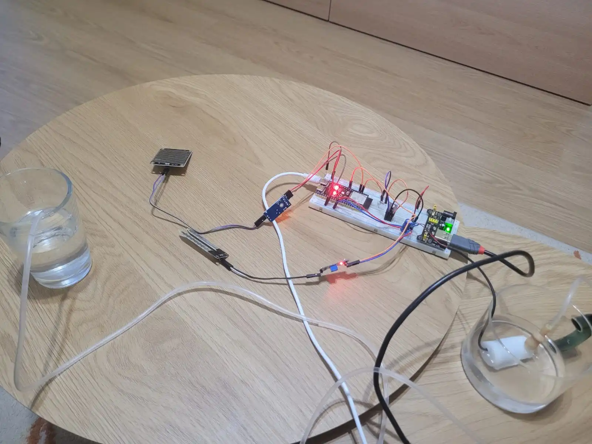
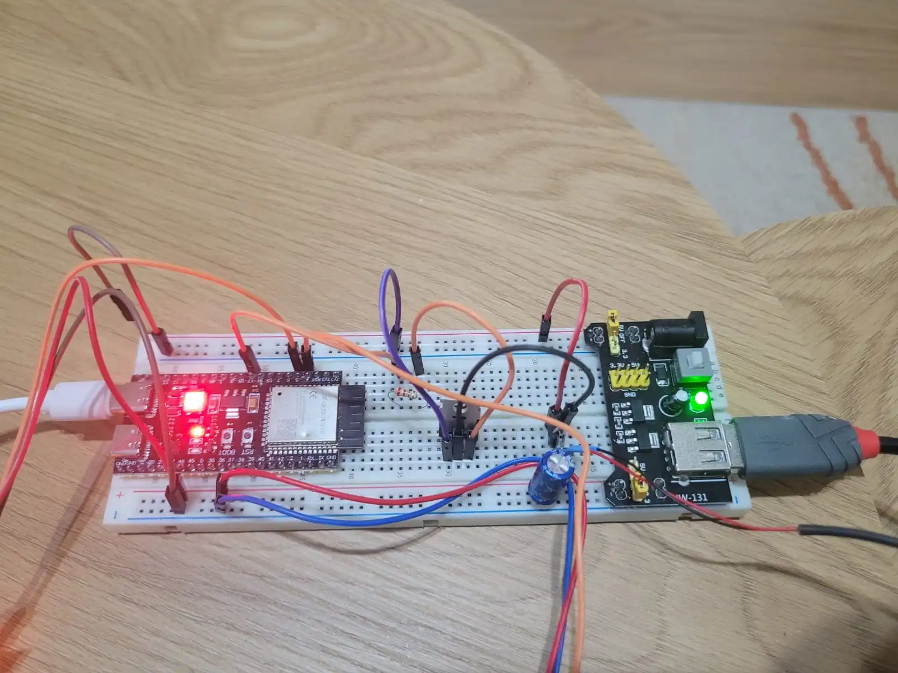

# HydroSense

An ESP32-based irrigation controller written in Rust, using soil moisture + rain sensing and MQTT telemetry.

:::info

**Author:** Cătălina Nedelcu-Holtea (`catalina_nedelcu.holtea`)  
**GitHub Project Link:**

:::

## Description

HydroSense is an ESP32-based irrigation controller written in Rust, designed to automate watering decisions using real sensor data. The system reads a soil moisture sensor and a rain sensor, then switches a 5 V water pump through an N-channel MOSFET stage when irrigation is needed. In parallel, it publishes status and measurements via MQTT, which enables remote monitoring and makes testing/debugging significantly easier.

## Motivation

I am particularly interested in embedded and IoT systems because they connect software to the physical world in a direct and measurable way—through sensing, decision-making, and reliable control of real hardware. These concepts are fundamental to understanding many technologies we interact with daily, from smart home devices and environmental monitoring to agriculture/greenhouse automation and industrial control.
At the same time, HydroSense started from a personal need. I genuinely enjoy taking care of plants, but watering often becomes a routine task that is easy to forget during busy periods. I have experienced situations where inconsistent watering led to plants drying out and dying. This project is my practical solution: a small, dependable system that handles watering based on actual conditions, not memory or fixed schedules.

## Architecture

### Main components

- **ESP32 (main controller + Wi-Fi):**  
  The ESP32 is responsible for the full control loop: it reads the soil moisture and rain sensors, decides whether irrigation is required, and controls the relay module that switches the pump. In parallel, it connects to Wi-Fi and communicates with an MQTT broker to publish telemetry and receive remote commands.

- **Soil moisture sensor (probe + LM393 module):**  
  The probe behaves like a variable resistor whose value changes with soil moisture. The LM393 board conditions the signal and provides two outputs:
  - **AO (analog output):** a continuous voltage that can be sampled by the ESP32 to obtain a real moisture level. Because the system uses Wi-Fi/MQTT, the analog output should be connected to an **ADC1 pin** (recommended) for stable readings.
  - **DO (digital output):** a comparator-based 0/1 signal generated by the LM393. The threshold is adjusted using the onboard potentiometer, and it can be used as a simple “dry/wet” detection input.

- **Rain sensor:**  
  Provides a rain/no-rain signal. This input is used as an additional condition to prevent watering when rain is detected.

- **Relay module:**  
  The relay acts as the power switching stage. It is driven by one ESP32 GPIO pin and electrically separates the low-voltage logic from the pump power line.

- **5 V water pump:**  
  The actuator that performs irrigation. It is powered from a dedicated 5 V supply and is switched ON/OFF through the relay module.

- **Tube (water delivery):**  
  Routes water from the pump to the plant/soil area.

- **MQTT broker + phone dashboard:**  
  The MQTT broker is the communication bridge between the device and the user interface. Telemetry is sent from the ESP32 to the broker, and the phone dashboard subscribes to it. The dashboard can also publish command messages that allow manual pump control.

### User interface

- **Monitoring (telemetry):**  
  The ESP32 publishes measurements and system state via MQTT (soil moisture level, rain status, pump state). This allows me to view the system status on my phone and validate behavior during testing.

- **Manual override:**  
  Although the system operates automatically, the pump can also be turned ON/OFF manually from the phone by sending an MQTT command. This is useful for exceptional situations and for controlled testing.

### Data flow summary

- Soil moisture sensor + rain sensor → ESP32 (measurements)  
- ESP32 → relay module → 5 V pump → tube (irrigation)  
- ESP32 ↔ MQTT broker ↔ phone dashboard (telemetry + manual control)

## Project Log

### Week 6–7

Defined the project scope and system architecture.
Researched compatible ESP32 components and libraries.
Identified initial setup issues and clarified the development approach.

### Week 9

Acquired and tested the main hardware components.
Validated basic sensor readings for soil moisture and rain detection.
Verified GPIO and ADC behavior on the ESP32.

### Week 10

Connected the soil moisture sensor, rain sensor, and relay module.
Resolved wiring issues and unstable ADC readings.
Refined signal handling for reliable measurements.

### Week 12

Implemented pump control logic using the relay module.
Integrated Wi-Fi connectivity and MQTT communication.
Published sensor telemetry and tested remote control commands.

### Week 13

Tested full system functionality under different conditions.
Improved decision logic for irrigation based on sensor data.
Stabilized MQTT reconnect and error handling behavior.

### Week 14

Performed final testing and system adjustments.
Improved reliability and code structure.
Prepared the project for demonstration and documentation.

## Hardware

- **ESP32 DevKit V1 (ESP32-WROOM-32 module)**  
  The ESP32 is the main controller of HydroSense. It reads the sensors, runs the automatic watering logic, drives the pump switching stage, and provides Wi-Fi connectivity. Over Wi-Fi it communicates with an MQTT broker to publish measurements (telemetry) and receive optional manual ON/OFF commands.

- **Soil moisture sensor: YL-69 probe + YL-38 (LM393) module**  
  This is the common resistive soil moisture kit composed of a two-prong probe (YL-69) and a small conditioning board (YL-38) based on the LM393 comparator. In HydroSense it provides the soil moisture signal used to decide whether watering is required. The module exposes:
  - **AO (analog output)** for a continuous moisture-related voltage, and
  - **DO (digital output)** for a threshold-based dry/wet signal set via the onboard potentiometer.

- **Rain sensor: FC-37 rain plate + LM393 comparator module**  
  This module detects rain/water on the sensor plate and outputs a signal that indicates rainfall (analog and/or thresholded digital, depending on how it is used). In HydroSense it is used as a safety/logic input to prevent watering when rain is detected.

- **Relay module: 1-channel 5 V relay**  
  The relay module is the electrical switching stage between the ESP32 and the pump power line. The ESP32 drives the relay input pin with a GPIO signal, and the relay contacts switch the pump’s supply. This allows the pump to be controlled safely without driving the load directly from the microcontroller.

- **Water pump: mini DC submersible pump (5 V)**  
  The pump is the actuator that moves water from a container/reservoir into the tube. HydroSense turns it ON/OFF through the relay module based on soil moisture and rain status, or via manual override through MQTT.

- **Tube (silicone/PVC)**  
  Provides water delivery from the pump outlet to the plant/soil area. It is the physical interface that completes the irrigation path.

### Schematics

### Bill of materials

| Device | Usage | Price (RON) |
|---|---|---:|
| ESP32 development board (ESP-WROOM-32) | Main controller: reads sensors, runs the automation logic, and publishes data / receives commands via MQTT over Wi-Fi | 46.99 |
| 1-channel relay module (5V, low-level trigger) | Switches the water pump ON/OFF under ESP32 control (acts like an electronic switch) | 4.99 |
| Soil moisture sensor module (LM393 + probe, YL-69/FC-28 style) | Measures soil moisture level to decide when watering is needed | 3.99 |
| Rain sensor module (LM393 + rain plate, FC-37 style) | Detects rain / water droplets so watering can be avoided when it’s already raining/wet | 19.00 |
| Mini submersible water pump (5V) | Pumps water from a container to the plant pot when watering is triggered | 7.99 |
| Silicone tube (4/6 mm, 1 m) | Carries water from the pump outlet to the plant pot | 2.08 |

## Software

| Library / Driver               | Description                                                           | Role in Project                                                                                                               |
| ------------------------------ | --------------------------------------------------------------------- | ----------------------------------------------------------------------------------------------------------------------------- |
| **`esp-idf-hal`**              | Hardware Abstraction Layer for ESP32 peripherals (GPIO, ADC, timers). | Reading soil moisture (analog/digital), rain sensor input, and controlling the pump relay.                                    |
| **`esp-idf-svc`**              | High-level ESP-IDF system services (Wi-Fi, networking, logging).      | Wi-Fi connectivity, system initialization, and network stack support for MQTT communication.                                  |
| **`rumqttc`**                  | Lightweight MQTT client for Rust (publish/subscribe).                 | Publishing telemetry (soil moisture, rain status, pump state) and receiving manual ON/OFF commands from the mobile dashboard. |
| **`embedded-hal`**             | Standardized embedded hardware traits.                                | Ensures portability and clean abstraction of I/O interfaces.                                                                  |
| **`heapless`**                 | Fixed-capacity data structures for embedded environments.             | Constructing MQTT topics and payloads without dynamic memory allocation.                                                      |
| **`log` + `esp-idf-svc::log`** | Logging facade with ESP32 backend.                                    | Debug output for sensor readings, state transitions, and MQTT connection events.                                              |
---

## Links

### Saving the Flower ([https://embedded-rust-101.wyliodrin.com/docs/fils_en/project/2024/alecsandra_elena.iordache](https://embedded-rust-101.wyliodrin.com/docs/fils_en/project/2024/alecsandra_elena.iordache))
### PlantaSoteria ([https://embedded-rust-101.wyliodrin.com/docs/fils_en/project/2025/ana.adascalitei](https://embedded-rust-101.wyliodrin.com/docs/fils_en/project/2025/ana.adascalitei))
### YouTube Demonstration ([https://www.youtube.com/watch?v=ojhrVsBs0nM](https://www.youtube.com/watch?v=ojhrVsBs0nM))
Video demonstration showcasing the system setup, operation, and irrigation workflow but with Arduino.

