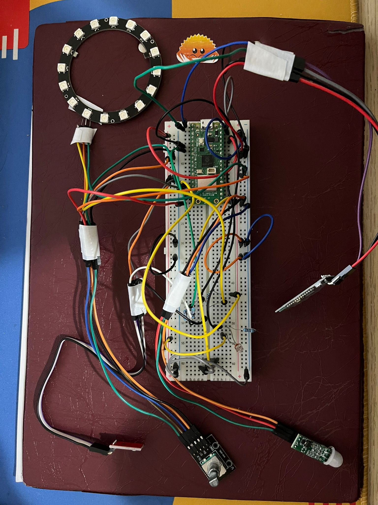

# Smart Bedside Lamp
A smart bedside lamp prototype that automates lighting based on motion and darkness, with Bluetooth control over other functionalities.

:::info

**Author**: Codrin-Emilian Grăpinoiu (Group 1241EC FILS)
**GitHub Project Link**: [Smart Bedside Lamp](https://github.com/UPB-PMRust-Students/project-dm-2025-studentcodrr)

:::

## Description

The Smart Bedside Lamp automatically lights up when it detects darkness and motion, providing convenient hands-free lighting. Beyond automation, it offers a rich manual control interface: a Rotary Encoder allows for precise brightness and color adjustments and instant on/off toggling, while a dedicated Mode Button cycles between "Smart" (sensor-based), "Manual" (direct input), and "Bluetooth" (app pairing) modes. The device also features persistent memory (EEPROM), ensuring that your prefered color and brightness settings are remembered even after the lamp is unplugged.

## Motivation

I chose this project to experiment with IoT design because I wanted a custom smart lamp for my own bedroom. It makes the room more comfortable and fun by automating the light based on motion, darkness, and color. This is a practical embedded systems project using a PIR sensor, LDR, and Bluetooth module, that gets rid of light switches and lets me set the right mood for hanging out or just relaxing.

## Architecture

**Components**
* **Raspberry Pi Pico WH**: The central microcontroller that processes sensor data, manages logic, and controls the LEDs.
* **PIR Sensor (HC-SR505)**: Detects movement in the room to trigger the light automatically when in Smart Mode.
* **Photo Sensor (LDR)**: Measures ambient light intensity to ensure the lamp only turns on when the room is dark.
* **Bluetooth Module (HC-05)**: Allows for wireless communication with a web app to select custom colors and presets.
* **LED Strip**: The main light output, capable of displaying a multitude of colors and smooth dimming effects.
* **Rotary Encoder**: A multi-function knob used to adjust brightness or color (rotate), a toggle to change between these 2 options (long press), and toggle the light ON/OFF (press).
* **Push Button**: A dedicated physical interface to cycle through the operating modes (Manual / Smart / Bluetooth).
* **EEPROM (AT24C08)**: A memory chip that stores the last used color, brightness, and mode settings so they are saved even when power is lost.

**Connection Setup**

**Features & Logic**
**Manual Mode**: The default state where the user has direct control. The Rotary Encoder adjusts brightness and color and its button toggles power. Sensors are ignored in this state.
* **Smart Mode**: Automation takes over. The system continuously monitors the PIR and LDR sensors, turning the light ON only when movement is detected *and* the room is dark, then turning it OFF after inactivity.
* **Bluetooth Mode**: An advanced state used for pairing with the web app. In this mode, the system prioritizes commands from the app over the physical controls. The Bluetooth app acts as a "Digital Remote" for color selection and light dimming, when Bluetooth mode is active.
* **Memory**: The system "auto-saves" current settings (Color, Brightness, Mode) to the AT24C08 EEPROM.

## Log

### Week 6
Defined the project scope and researched compatible components. Spent this period overcoming initial difficulties and understanding issues with setting up a working version of `embassy-rp`.

### Week 8
Acquired the core hardware (Pico WH, sensors) and began basic unit testing. Verified readings from the LDR and PIR using a simple LED. Also, I began researching drivers for the LED strip control.

### Week 10
Started connecting the actual parts like the LED strip and the knob to the Pico. Spent time fixing loose wires and figuring out why the knob signals unusual reads. I also continued working on a compatible driver file with my component and also the libraries I chose to work with.

### Week 12
Configured the driver for the LED strip and pushed forward testing mode switching (Manual, Smart, Bluetooth). Configured the EEPROM and Bluetooth module and made the custom app for the latter.

### Week 13
Tested all functionalities, added the Bluetooth module and also created the application necessary to control the lamp. Besides this, I began designing the lamp prototype exterior using cardboard and extra wiring.

### Week 14
Tested everything again and made adjusments to the cardboard model so that it is easy to transport and showcase.

## Hardware
The system is built around the Raspberry Pi Pico WH. It integrates environmental sensors (Light + Motion), showcases Bluetooth connectivity to automate the functionalities of a LED strip and have a memory card storing last appointed settings.

**Hardware Setup**

### Schematics

**KiCad Schematic**

### Bill of Materials

| Device | Usage | Price (RON) |
| :--- | :--- | :--- |
| [Raspberry Pi Pico WH](https://www.raspberrypi.com/products/raspberry-pi-pico/) | Microcontroller (Brain) | 39 |
| [Bluetooth Module (HC-05)](https://www.emag.ro/modul-bluetooth-hc05-n290-hc05/pd/DMY3F6YBM/) | Wireless App Control | 32.58 |
| [PIR Sensor (HC-SR505)](https://www.optimusdigital.ro/ro/senzori-senzori-pir/1498-senzor-pir-in-miniatura-hc-sr505.html) | Motion Detection | 9.24 |
| [Photo Resistor (LDR)](https://www.optimusdigital.ro/ro/componente-electronice-altele/28-fotorezistor10-pcs-set.html?search_query=photo+resistor&results=3) | Light Detection | 1.9 RON |
| [LED Strip (WS2812B)](https://www.optimusdigital.ro/ro/optoelectronice-altele/12342-inel-de-led-uri-rgb-ws2812-cu-16-led-uri.html) | RGB Light Output | 29.15 |
| [Rotary Encoder (KY-040)](https://www.optimusdigital.ro/ro/senzori-senzori-de-atingere/7150-modul-encoder-rotativ.html) | Manual Brightness & Power | 4,99 |
| [EEPROM (AT24C08)](https://www.optimusdigital.ro/ro/memorii/632-modul-eeprom-at24c256.html) | Save Settings (Memory) | 8.99 |
| [Breadboard](https://www.optimusdigital.ro/ro/prototipare-breadboard-uri/44-breadboard-400-points.html) | Connection Board | 4.56 |
| Push Button | Mode Switch | 0.4 |
| Jumper Wires | Connections | 10 |
| **TOTAL** | | **140.81** |

## Software

| Library | Description | Usage |
|---------|-------------|-------|
| `embassy-rp` | Embassy-rp framework | Provides hardware abstraction for GPIO, timers, and peripherals specific to the RP2040. |
| `embassy-executor` | Async task executor | The "scheduler" that allows concurrent handling, like he knob usage and sensors reading. |
| `embassy-time` | Time utilities | Handles all timing logic (delays, timers). |
| `embassy-sync` | Async synchronization primitivess | Used for safe communication and shared state between asynchronous tasks. |
| `smart-leds` | Addressable LED controls | Used to control WS2812 LEDs by managing color data and LED output formatting. |
| `portable-atomic` | Atomic operations | Provides lock-free atomic types and critical-section–based fallbacks. |

### Links

1.  [Raspberry Pi Pico Bluetooth Setup Module](https://www.instructables.com/How-to-Use-HC-05-Bluetooth-With-Raspberry-Pi-Pico-/)
2.  [WS2812 Original Driver](https://github.com/embassy-rs/embassy/blob/main/embassy-rp/src/pio_programs/ws2812.rs#L103)
3.  [Pico Transfer of .uf2 File](https://www.youtube.com/watch?v=os4mv_8jWfU)
4.  [Embedded Rust 101](https://github.com/rust-embedded/awesome-embedded-rust)