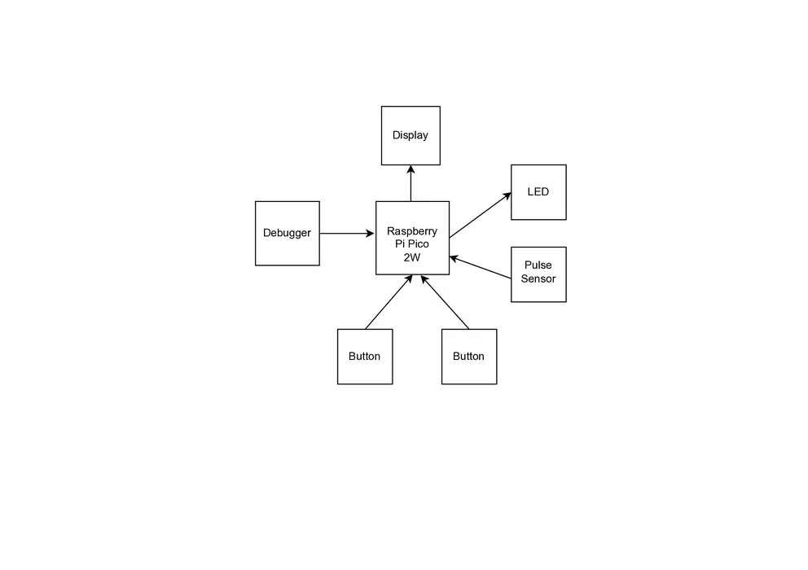
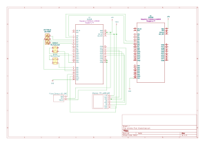
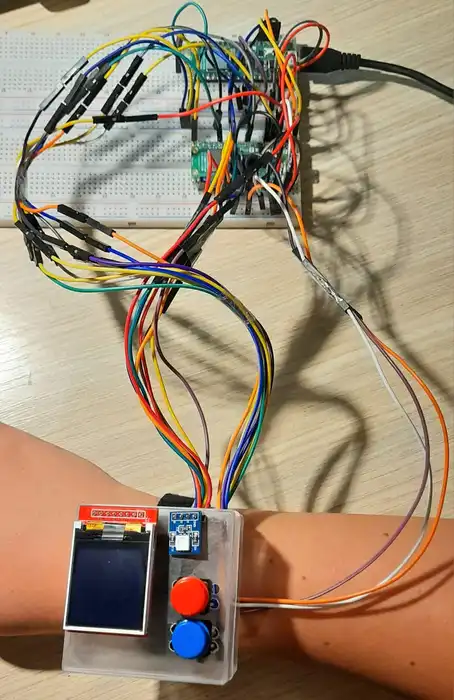

# Fitness tracker with breathing assistant
A heart rate based breathing guiding system to help regulate the heart beat through controlled breathing exercises with features for timing and hydration.

:::info 

**Author**: Mihon Corina-Cristiana \
**GitHub Project Link**: https://github.com/UPB-PMRust-Students/project-Corina-Mihon

:::

## Description

This project is a fitness tracker with a guided breathing assistant. It measures heart rate through a pulse sensor, displays real-time data on a screen, and guides users with visual breathing exercises using an LED indicator.  If the rate is too high, an LED pulses in a rhythm that guides the user to breath in and out slowly. The device also includes features for hydration tracking, workout timing, making it a compact welness tool.

## Motivation

I chose this project because of the increasing importance of stress management and heart health. By combining heart rate monitoring with breathing exercises, users can make adjustments to improve their physical health. It is a way of integrating technology into wellness practices.

## Architecture 



The main controller reads physiological data from the pulse sensor and controls an LED for visual breathing guidance. A button connected to the microcontroller allows the user to scroll through the menus (pulse reading, timin, hydration) and a second button allows the users to chose the menu or other settings. The display, also connected to the microcontroller, shows the data. The second microcontroller handles debugging. 

## Log

<!-- write your progress here every week -->

### Week 5 - 11 May

I connected the main Raspberry Pi Pico 2W with the second one that I use as a debbuger. I also connected the pulse sensor and implemented the basic pulse reading functionality and after that I displayed the measured BPM on the screen.

### Week 12 - 18 May

I displayed on the screen the menu for the mode(either exercising or relaxing). I connected the LEd module and added LED feedback to guide breathing during abnormal BPM, implemented PWM for light transitions and added the button to select the mode.

### Week 19 - 25 May

I worked at the way the project looks like and I have improved the pulse reading functionality with the logic given by an AI chat. 

## Hardware

Raspberry Pi Pico 2W: main controller for handling sensor data, controlling the LED

Raspberry Pi Pico 2W: used for debugging

XD-58C pulse sensor: measure the user's heart rate

RBG LED: used for the visual breathing feedback

Button(mode): allows the user to switch between menus

Button(action): allows the user to make choices

1.44'' LCD Display: Displays the heart rate

### Schematics




### Bill of Materials

<!-- Fill out this table with all the hardware components that you might need.

The format is 
```
| [Device](link://to/device) | This is used ... | [price](link://to/store) |

```

-->

| Device | Usage | Price |
|--------|--------|-------|
| [Raspberry Pi Pico 2W](https://www.raspberrypi.com/documentation/microcontrollers/raspberry-pi-pico.html) | The microcontroller | [39.66 RON x 2](https://www.optimusdigital.ro/ro/placi-raspberry-pi/13327-raspberry-pi-pico-2-w.html?) |
| [XD-58C pulse sensor](https://pulsesensor.com) | The pulse sensor | [15.17 RON](https://www.optimusdigital.ro/ro/senzori-altele/1273-senzor-de-puls-xd-58c.html?)|
| [1.44'' LCD Module](https://www.google.com/url?sa=t&source=web&rct=j&opi=89978449&url=https://www.optimusdigital.ro/en/index.php%3Fcontroller%3Dattachment%26id_attachment%3D196%26srsltid%3DAfmBOoruUzWlsxzAAf_-B4iAEJVfx2yxuVbGb-puhPoLH_3ZoySWRy6B&ved=2ahUKEwibuP6e7oaNAxXUiv0HHQ0hO54QFnoECB4QAQ&usg=AOvVaw0UxpN128YQYtVhZADYz4ql) | Display | [28 RON](https://www.optimusdigital.ro/ro/optoelectronice-lcd-uri/870-modul-lcd-144.html?)|
| [Button](https://www.optimusdigital.ro/ro/butoane-i-comutatoare/1114-buton-cu-capac-rotund-rou.html?search_query=buton+cu+capac+rosu&results=7) | Press the button to select modes | [2 RON](https://www.optimusdigital.ro/ro/butoane-i-comutatoare/1114-buton-cu-capac-rotund-rou.html?search_query=buton+cu+capac+rosu&results=7)|
| [Button](https://www.optimusdigital.ro/ro/altele/1118-buton-cu-capac-rotund-albastru.html?search_query=buton+cu+capac+albastru&results=1) | Press the button to scroll | [2 RON](https://www.optimusdigital.ro/ro/butoane-i-comutatoare/1114-buton-cu-capac-rotund-rou.html?search_query=buton+cu+capac+rosu&results=7)|
| [RGB LED module](https://www.optimusdigital.ro/ro/optoelectronice-led-uri/737-modul-cu-led-rgb.html?) | LED light | [5 RON](https://www.optimusdigital.ro/ro/optoelectronice-led-uri/737-modul-cu-led-rgb.html?)|


## Software

| Library | Description | Usage |
|---------|-------------|-------|
| [embedded-graphics](https://github.com/embedded-graphics/embedded-graphics) | 2D graphics library | Used for drawing text to the display |
| [embassy_embedded_hal](https://github.com/embassy-rs/embassy/tree/main/embassy-embedded-hal) | Adapters between Embassy and the standard embedded-hal traits | With shared_bus::blocking::spi::SpiDevice safely shares SPI between display and other peripherals. |
| [embassy_executor](https://github.com/embassy-rs/embassy/tree/main/embassy-executor) | The async runtime provided by Embassy for embedded systems | Runs async tasks such as #[embassy_executor::main] and the breathing LED task |
| [embassy_time](https://github.com/embassy-rs/embassy/tree/main/embassy-time) | Provides async-friendly time utilities like timers, delays, and durations | Used for Timer::after, Duration, Instant |
| [defmt](https://defmt.ferrous-systems.com/) | Compact and efficient logging system for embedded devices | Used for logging/debugging with info!|
| [panic_probe](https://crates.io/crates/panic-probe) | Handles panics | Reports detailed panic messages during runtime|
| [embassy_rp](https://github.com/embassy-rs/embassy/tree/main/embassy-rp) | The embassy hal | Used to access and control the Raspberry Pi Pico W hardware, including GPIOs, ADC, SPI, PWM, and system initialization via init|
| [embassy_sync](https://github.com/embassy-rs/embassy/tree/main/embassy-sync) |  Provides synchronization primitives for async and sync use | Used to run async code on embedded systems |
| [mipidsi](https://github.com/almindor/mipidsi) | Display driver for ST7735 TFT displays | Used to control SPI-based LCD displays like ST7735s | 


## Links

<!-- Add a few links that inspired you and that you think you will use for your project -->

1. [Projects 2023](https://ocw.cs.pub.ro/courses/pm/prj2023)
2. [link](https://iotdesignpro.com/projects/iot-heartbeat-monitoring-system-using-raspberry-pi)
...
