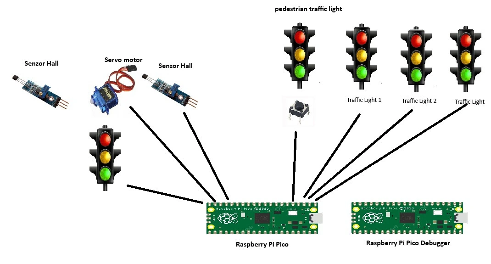
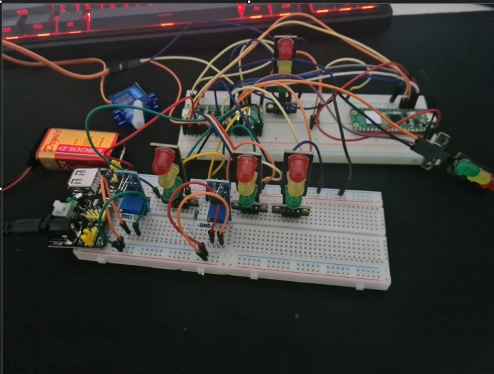
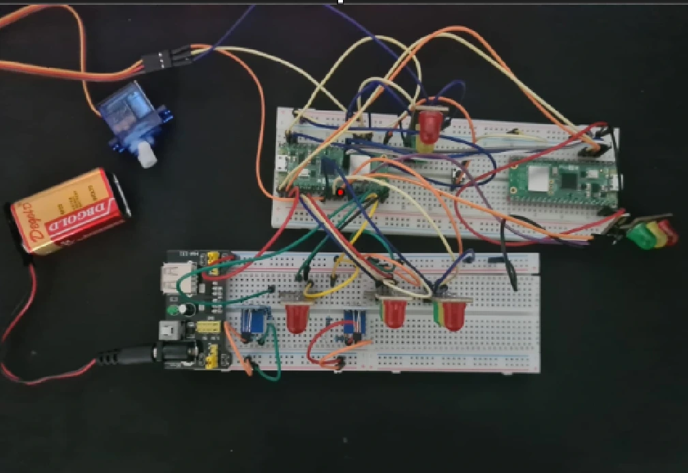
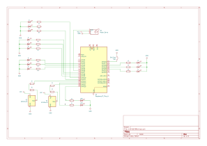

# Traffic light

A smart traffic intersection with an integrated railway crossing, using sensors to manage vehicle flow and ensure pedestrian safety in real time.

:::info 

**Author**: Dinu David-Andrei \
**GitHub Project Link**: https://github.com/UPB-PMRust-Students/project-DinuDavidAndrei

:::

## Description

This project aims to design and implement a smart intersection integrated with a nearby railway crossing. It uses sensors to monitor traffic and train presence in real time, optimizing vehicle flow and enhancing pedestrian safety. The system automatically adjusts traffic light patterns and activates safety signals when a train is approaching, creating a more efficient and secure environment.

## Motivation

The inspiration for this project comes from a real intersection near my grandparents' house, located close to a railway crossing. Over the years, several accidents have occurred there due to poor traffic coordination and the lack of smart signaling systems. This motivated me to design a solution that could prevent such incidents by combining real-time traffic monitoring with intelligent control of both the road intersection and the railway crossing. I believe technology can play a key role in increasing safety and traffic efficiency, especially in high-risk zones like this one.

## Architecture 

The architecture of the system is modular and designed to ensure both efficient traffic flow and pedestrian safety near a railway crossing. The main components are:

Sensor Input Module
Collects data from:

Traffic sensors (IR or ultrasonic) that detect vehicles in each lane

Railway sensor that detects train approach

Pedestrian button (optional) for crossing requests

Control Logic Unit
The core decision-making system:

Prioritizes traffic based on congestion level

Temporarily blocks road traffic if a train is detected

Allows safe pedestrian crossings when possible

Traffic Light Controller
Translates decisions from the Control Logic into commands for:

LED-based traffic lights (green, yellow, red)

Railway warning lights (e.g., blinking red)

Pedestrian signals (e.g., walk/don’t walk)

Safety Protocol Module
Ensures:

All traffic is stopped before train arrival

No conflict between road and railway flows

## Log

### Week 5 - 11 May
Received the first hardware components. I ordered a Raspberry Pi Pico 2 and a starter kit. I started exploring how everything works to gain some experience and check if everything functions properly.
### Week 12 - 18 May
I realized that hardware debuggers were unavailable for purchase , so I ordered another Raspberry Pi Pico 2 and set it up to work as a debugger. Also placed orders for the sensors, a servo motor, and a traffic light module.
Now that everything’s coming together, I have officially started working on the project
### Week 19 - 25 May
I assembled the entire project and finished both the hardware and the software parts. Additionally, I created a simple website to gain some experience in web development. Unfortunately, I didn’t manage to build the physical model (mock-up) yet. I plan to work on it next week before the final presentation.

## Hardware
 I used two Raspberry Pi Pico boards, a 9V battery, two breadboards, a servo motor, traffic lights (LEDs), and two Hall effect sensor.
 

### Schematics

### Bill of Materials
| Device | Usage | Price |
|--------|--------|-------|
| [2 Raspberry Pi Pico 2W](https://www.optimusdigital.ro/en/raspberry-pi-boards/13327-raspberry-pi-pico-2-w.html?srsltid=AfmBOoo4ziaX-vt_Q7PPrsLO06qiB90jc1E1yFdPfyxK6KjzQnSmybb1)| The microcontroller and one as a debugger| 80 lei|
| [Modul cu Senzor Hall YS-27](https://www.optimusdigital.ro/ro/senzori-senzori-hall/596-modul-cu-senzor-hall-ys-27.html?search_query=Modul+cu+Senzor+Hall+YS-27&results=17)| | 7lei x2|
|
| [Micro Servomotor SG90 90°](https://www.optimusdigital.ro/ro/motoare-servomotoare/26-micro-servomotor-sg90.html?search_query=Micro+Servomotor+SG9&results=9)| | 14lei|
|
| [Modul cu 3 LED-uri (Roșu, Galben, Verde)](https://www.optimusdigital.ro/ro/optoelectronice-altele/5705-modul-cu-3-led-uri-rou-galben-verde.html?search_query=Modul+cu+3+LED-uri+%28Ro%C8%99u%2C+Galben%2C+Verde%29&results=10)| | 4leix5|
|
| [Kit Plusivo pentru Introducere în Electronică)](https://www.optimusdigital.ro/ro/kituri/12026-kit-plusivo-pentru-introducere-in-electronica-0721248990075.html?search_query=kit+&results=322)| | 40lei|
|
## Software

| Library | Description | Usage |
|---------|-------------|-------|
| [embassy](https://docs.rs/embassy/latest/embassy/) | Async runtime for embedded systems | Manages tasks and system operations |
| [embassy-hal](https://docs.rs/embassy-hal/latest/embassy_hal/) | Hardware Abstraction Layer | Interfaces with Raspberry Pi Pico 2W hardware |
| [embassy-executor](https://docs.rs/embassy-executor/latest/embassy_executor/) | Task executor | Handles asynchronous tasks such as sensor polling |
| [embassy-time](https://docs.rs/embassy-time/latest/embassy_time/) | Timing module | Delays and periodic alerts (vibration, LED blinking) |
| [embassy-gpio](https://docs.rs/embassy-gpio/latest/embassy_gpio/) | GPIO management | Manages GPIO pins for LED, vibration motor, and button |
| [embassy-sync](https://docs.rs/embassy-sync/latest/embassy_sync/) | Sync primitives | Coordinates between concurrent tasks safely |
| [defmt](https://docs.rs/defmt/latest/defmt/) | Logging and formatting | Debug logging with minimal runtime overhead |
| [panic-probe](https://docs.rs/panic-probe/latest/panic_probe/) | Panic handler | Handles runtime panics and reports via RTT |
| [embedded-hal](https://docs.rs/embedded-hal/latest/embedded_hal/) | Abstraction layer | Interfaces with peripherals like I2C and digital IO |
| [rp2040-hal](https://docs.rs/rp2040-hal/latest/rp2040_hal/) | HAL for the Raspberry Pi Pico's RP2040 chip | Direct access to microcontroller peripherals |
| [mpu9250-driver](https://crates.io/crates/mpu9250) | Driver for the MPU9250 IMU sensor | Reads posture data from the accelerometer and gyroscope via I2C |

## Links

