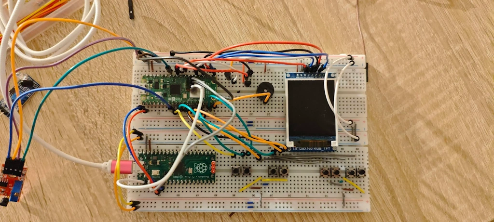
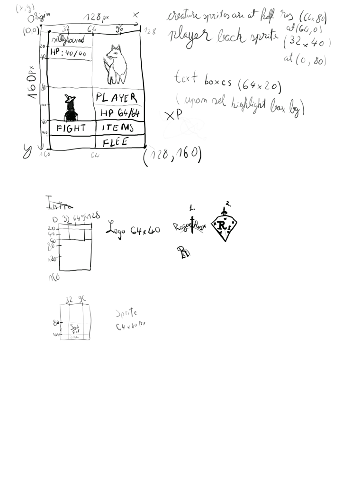
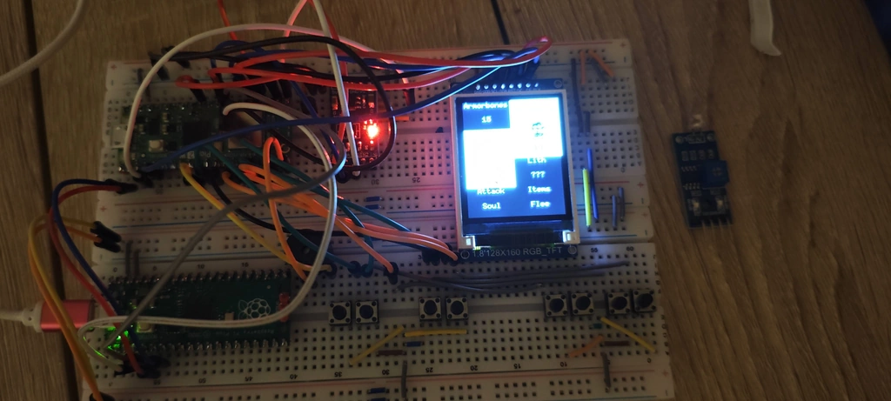
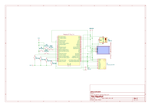

# Rogue Rust
A turn based rpg implemeting sensors for various functions on a pico 2w.

:::info 

**Author**: Denis-Iulian Pavel \
**GitHub Project Link**: https://github.com/UPB-PMRust-Students/project-denis-iulian-pavel

:::

## Description

My project will be a game coded completely in rust designed to run on a Pico 2W with 8 buttons (Left, Right, Up, Down, A, B, C and D), Temp Sensor, Accel Sensor.

## Motivation

I chose this project because I decided to implement a multiple features and utilize all aspects I've studied up until now in the lab, in rust on a microprocessor like the Pico 2W. 

## Architecture 

Raspberry Pi Pico 2W to:
- RGB_TFT LCD Screen 128x160
- A, B, C, D buttons
- Left, Right and Up, Down buttons
- Buzzer
- Temperature Sensor
- Acceleration Sensor

## Log

<!-- write your progress here every week -->

### Week 5 - 11 May

Established main board connections. Connected debugger, main board, a b c d buttons, screen and buzzer.
Wrote code to initialize and test functionality for these.
Wrote a script to display chroma keyed sprites on the screen so I can use background images and one to play sounds for the buzzer.

### Week 12 - 18 May

Purchased sensors. Scrapped joystick and replaced with buttons.
Established connections between the rest of the components.

### Week 19 - 28 May

Named the game RogueRust.
Chose new sensors, initialized accel sensor but it is unable to read properly
Created main game loop, character sprites, creatures as well as gameplay base off this.

The final board being:

## Hardware

Raspberry Pi Pico 2W, Buttons, Screen (rgb_tft 128x160), Temperature Sensor, Acceleration Sensor.

### Schematics

### Bill of Materials

| Device | Usage | Price |
|--------|--------|-------|
|[Raspberry Pi Pico 2W](https://www.raspberrypi.com/products/raspberry-pi-pico-2/)|The main controller|[39.66 RON](https://www.optimusdigital.ro/ro/placi-raspberry-pi/13327-raspberry-pi-pico-2-w.html?search_query=pico+2w&results=33)|
|Electronic Components Kit|Basic Components|[15.63 RON (SALE)](https://www.aliexpress.com/item/1005007636611675.html?spm=a2g0o.order_list.order_list_main.5.3bab1802f07p9F)|
|1.8-inch SPI TFT Module LCD Display|Screen|[15.45 RON (SALE)](https://www.aliexpress.com/item/1005007174990368.html?spm=a2g0o.order_list.order_list_main.10.3bab1802f07p9F)|
|Breadboard HQ (830 Puncte)|Extra Breadboard|9.98 RON (DELISTED)|
|ADXL345 Digital 3-Axis Accelerometer Module|Various Velocity Interactions|[12.99 RON](https://www.optimusdigital.ro/en/inertial-sensors/97-adxl345-tripple-axis-accelerometer.html)|
|[LM35D Analog Temperature Sensor](https://www.optimusdigital.ro/en/index.php?controller=attachment&id_attachment=1448)|Randomization elements|[4.99 RON](https://www.optimusdigital.ro/en/sensors/1469-lm35d-analog-temperature-sensor-to-92.html)|
|Total Cost|Full price for the hardware|98.70 RON|

## Software

| Library | Description | Usage |
|---------|-------------|-------|
| [tinybmp](https://crates.io/crates/tinybmp)                             | `no_std` BMP decoder                                      | Decode BMP sprite and background images                   |
| [embedded-text](https://crates.io/crates/embedded-text)                 | Text layout and rendering on embedded-graphics            | Render aligned or wrapped text boxes                      |
| [adxl345\_driver2](https://crates.io/crates/adxl345_driver2)            | Driver for ADXL345 3-axis accelerometer                   | Read acceleration data for motion or controls             |
| [itoa](https://crates.io/crates/itoa)                                   | Integer-to-ASCII formatter without pulling in `core::fmt` | Fast, heapless number-to-string conversion                |
| [embassy-executor](https://github.com/embassy-rs/embassy)               | Async/await task executor for Cortex-M                    | Drive embedded async tasks with interrupts or threads     |
| [embassy-rp](https://github.com/embassy-rs/embassy)                     | RP2040 HAL integration with async support                 | Interface Raspberry Pi Pico 2W peripherals asynchronously |
| [embassy-time](https://github.com/embassy-rs/embassy)                   | Timekeeping, delays, and scheduling for embedded async    | Sleep, timeouts, and uptime timestamps                    |
| [embassy-usb](https://github.com/embassy-rs/embassy)                    | Async USB device stack                                    | Implement USB CDC, HID, or custom USB classes             |
| [embassy-sync](https://github.com/embassy-rs/embassy)                   | Async-aware synchronization primitives                    | Share data safely between concurrent async tasks          |
| [embassy-futures](https://github.com/embassy-rs/embassy)                | `no_std` futures and combinators                          | Lightweight future utilities without heap allocation      |
| [embassy-embedded-hal](https://github.com/embassy-rs/embassy)           | Bridges `embedded-hal` traits into `async`                | Use HAL traits inside async contexts                      |
| [embedded-graphics](https://crates.io/crates/embedded-graphics)         | 2D drawing primitives for embedded displays               | Draw pixels, shapes, and fonts on TFT or OLED screens     |
| [display-interface-spi](https://crates.io/crates/display-interface-spi) | SPI abstraction for display drivers                       | Send commands/data to SPI-based screens                   |
| [mipidsi](https://crates.io/crates/mipidsi)                             | Generic MIPI-DSI display driver                           | Drive TFT displays over SPI/MIPI-DSI                      |
| [defmt](https://crates.io/crates/defmt)                                 | Efficient embedded logging framework                      | Log debug/info messages via RTT or semihosting            |
| [defmt-rtt](https://crates.io/crates/defmt-rtt)                         | RTT transport layer for `defmt`                           | Transfer log frames over SWO/JTAG via RTT                 |
| [fixed](https://crates.io/crates/fixed)                                 | Fixed-point numeric types                                 | Perform fractional math without floating-point support    |
| [fixed-macro](https://crates.io/crates/fixed-macro)                     | Macros for defining fixed-point constants                 | Write fixed-point literals conveniently                   |
| [static-cell](https://crates.io/crates/static-cell)                     | Statically allocated, runtime-initialized cell            | Safely init global data without dynamic allocation        |
| [heapless](https://crates.io/crates/heapless)                           | Fixed-capacity data structures (Vec, String, etc.)        | Store collections and buffers without `alloc`             |
| [embedded-hal-1](https://crates.io/crates/embedded-hal)                 | Blocking HAL traits for embedded peripherals              | Define SPI, I²C, GPIO, and other blocking interfaces      |
| [embedded-hal-async](https://crates.io/crates/embedded-hal-async)       | Async variants of `embedded-hal` traits                   | Non-blocking SPI, I²C, UART in async contexts             |
| [embedded-io-async](https://crates.io/crates/embedded-io-async)         | Async I/O traits for embedded read/write                  | Stream/sink traits for sensors and comm interfaces        |
| [cortex-m-rt](https://crates.io/crates/cortex-m-rt)                     | Cortex-M runtime startup and interrupt support            | Set up vector tables, entry point, and reset handlers     |
| [panic-probe](https://crates.io/crates/panic-probe)                     | Panic handler that prints backtraces via `defmt`          | Catch and report panics on embedded targets               |
| [byte-slice-cast](https://crates.io/crates/byte-slice-cast)             | Safe reinterpretation of byte slices                      | Cast between `&[u8]` and `&[T]` without unsafe code       |

