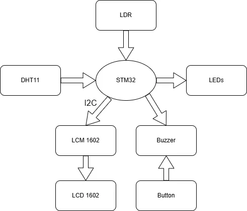
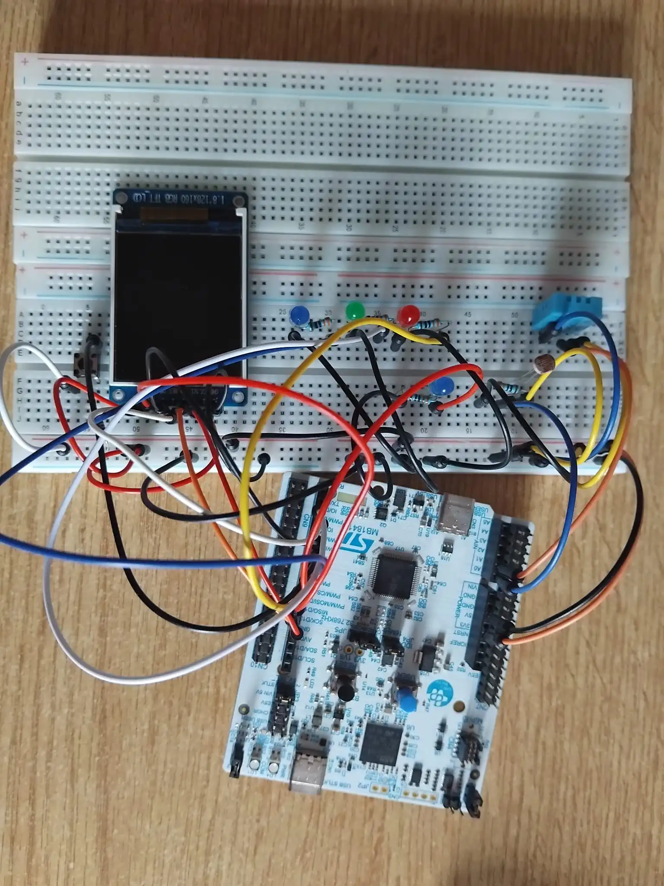
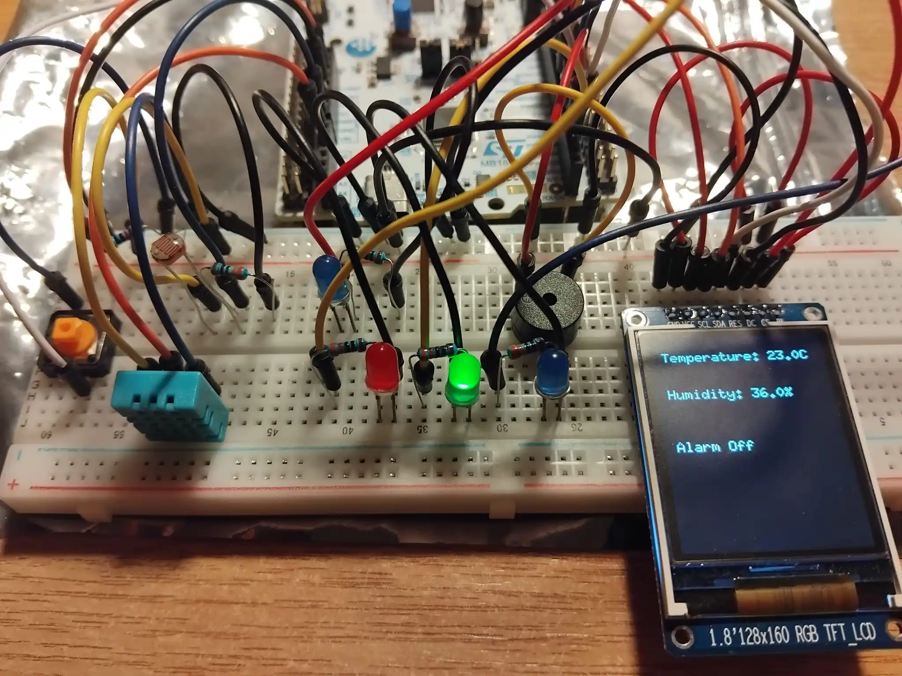
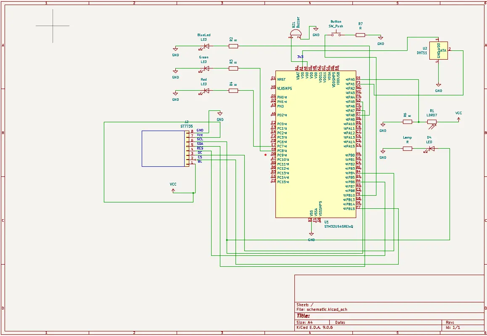

# Environment Tracker 

A STM32-based environment monitoring system that tracks data about temperature, humidity and Ambiental light, displaying it locally and on an LCD.

:::info 

**Author**: Julean Diana-Gabriela \
**GitHub Project Link**: https://github.com/UPB-PMRust-Students/project-dm-2025-Gabriela3456 

:::

## Description

The Smart Environment Tracker is an embedded system designed to measure and respond to environmental conditions in real time using an STM32 microcontroller programmed in Rust. It uses a DHT22 sensor to monitor temperature and humidity, and a photoresistor (LDR) to detect ambient light levels. Three LEDs visually indicate temperature ranges — green for normal, blue for cold, and red for hot — while an LCD display presents live sensor readings.
An integrated buzzer alarm system, controlled by a timer, activates when temperature or humidity exceeds predefined thresholds, providing an audible warning for unsafe conditions. A button should silence the buzzer when the user is noticed of the alert.
Another LED (a lamp system) is turned on when the light read from the photoresistor is reading a value beneath a set threshold. 
Further developments would include displaying on the screen a warning sign if the temperature is too high and the state of the button. 

## Components Overview

- DHT11 – to read and display temperature and humidity
- LDR – to read light levels for turning a lamp on when level drops
- LEDs – to show the temperature level and to act as a lamp 
- ST7735s – display temperature, humidity and light level.  
- Buzzer – alarm when temperature exceeds predefined thresholds
- Button – to stop the alarm

## Motivation

This project is developed to create a simple and reliable system for monitoring environmental conditions in real time. By combining temperature, humidity, and light sensing with visual and audible alerts, it aims to demonstrate how embedded systems can improve comfort, safety, and automation in environments such as homes, labs, or offices. 

## Architecture 

The STM32 reads sensor data, processes it and controls the LEDs, buzzer and LCD. 

Input devices (send data to the MCU): 
- LDR - STM reads its value via ADC pin, one-way input
- Button - user input device

Output devices: 
- LEDs
- ST7735 - MCU sends sensor readings to be displayed
- Buzzer - MCU activates an alarm using a timer
- DHT11

## Log

### Week 17 - 23 Nov
I drafted my idea for the project and decided upon the components I wanted to use. Overall, I spent this week documenting my project and searching for options of display. 

### Week 24 - 31 Nov
I started testing some of the project components, such as the LDR, the LEDs and DHT11 sensor. Implemented the logic for the LDR sensor, to read the light level and to light up an LED when light dropped below the 300 level. I made the architecture of the project schematics. 

### Week 1 - 7 Dec
This week I searched for a crate for the DHT sensor. I tried to test it, but after all code errors were solved, the DHT11 still gave me a reading error. I first tested it on arduino to see if there was something wrong with the hardware part, but as the sensor worked just fine there, I concluded it was a code problem. I also tested my initial display, an LCD1602, which unfortunately didn't work, neither on Rust nor with other programming languages. I bought another display with an LM1602 I2C.  

### Week 14 - 21 Dec
With help received from the lab, I got over the DHT11 problem. In the meantime I tested the new LCD with the integrated I2C. It didn't work either, so I decided to use a ST7735 instead. 

### Week 12 - 18 Ian
Implemented the whole hardware part of the project, including the ST7735 screen, the buzzer and the button aimed at stopping the alarm. Tested those components in order to make sure they work. 

### Week 19 - 25 Ian
Tested the buzzer, button and ST7735 screen. First, integrated the buzzer and the button in the project, making sure the whole alarm system worked with the rest of the project. Included the display in the project, showing values such as temperature, light and button status.  

## Hardware
 
 
 

### Schematics
 

### Bill of materials
| [Device](link://to/device) | Usage | [Price](link://to/store) |
|-----------------------------|-------|-------------------------|
| [STM32u545re-O](https://www.st.com/en/evaluation-tools/nucleo-u545re-q.html) | The microprocessor | [borrowed] |
| [DHT11 Sensor](https://www.emag.ro/senzor-de-temperatura-si-umiditate-dht11-arduino-ai051-s37/pd/D9CZ56BBM/) | Detects temperature and humidity | [6,5 RON](https://www.emag.ro/senzor-de-temperatura-si-umiditate-dht11-arduino-ai051-s37/pd/D9CZ56BBM/) |
| [Photoresistor](https://www.optimusdigital.ro/ro/componente-electronice-altele/28-fotorezistor10-pcs-set.html?search_query=photoresistor&results=3) | Detects light levels | [1.9 RON](https://www.optimusdigital.ro/ro/componente-electronice-altele/28-fotorezistor10-pcs-set.html?search_query=photoresistor&results=3) |
| [4 LEDs](https://www.optimusdigital.ro/ro/kituri/11970-set-led-uri-asortate-plusivo-500-buc-led-uri-100-buc-rezistoare-i-pcb-bonus.html?search_query=Led&results=662) | Shows temperature levels with colors | [8 RON](https://www.optimusdigital.ro/ro/kituri/11970-set-led-uri-asortate-plusivo-500-buc-led-uri-100-buc-rezistoare-i-pcb-bonus.html?search_query=Led&results=662) |
| [LCD Module ST7735](https://www.optimusdigital.ro/ro/optoelectronice-lcd-uri/3552-modul-lcd-de-144-cu-spi-i-controller-st7735-128x128-px.html?search_query=st7735&results=8) | Displays temperature and light | [30 RON](https://www.optimusdigital.ro/ro/optoelectronice-lcd-uri/3552-modul-lcd-de-144-cu-spi-i-controller-st7735-128x128-px.html?search_query=st7735&results=8) |
| [Buzzer Activ](https://www.optimusdigital.ro/ro/audio-buzzere/635-buzzer-activ-de-3-v.html?search_query=buzzer&results=47) | Stops the alarm | [1 RON](https://www.optimusdigital.ro/ro/audio-buzzere/635-buzzer-activ-de-3-v.html?search_query=buzzer&results=47) |
| [Switch](https://robokit.ro/buton-comutator-tactil-momentar-de-6x6x5mm?search=buton) | Stops the alarm | [0,35 RON](https://robokit.ro/buton-comutator-tactil-momentar-de-6x6x5mm?search=buton) |
| [Breadboard 830 Holes](https://robokit.ro/mb102-830-puncte-fara-lipire-breadboard?search=breadboard) | For prototyping and connections | [7 RON](https://robokit.ro/mb102-830-puncte-fara-lipire-breadboard?search=breadboard) |
| [Jumper Wires](https://www.robofun.ro/fire-conexiune-tata-tata-10-bucati-20cm.html?gad_source=1&gad_campaignid=20726321991&gbraid=0AAAAApSyPJXztoCXcRSbOFuSlj9i7Iql4&gclid=Cj0KCQjwoNzABhDbARIsALfY8VNT0OiqJawl2mxPwXJzD0xEF789u0CQtLksJjfnQ4TtoYzTh0tP1SoaAvhPEALw_wcB) | For connecting components | [5 RON](https://www.robofun.ro/fire-conexiune-tata-tata-10-bucati-20cm.html?gad_source=1&gad_campaignid=20726321991&gbraid=0AAAAApSyPJXztoCXcRSbOFuSlj9i7Iql4&gclid=Cj0KCQjwoNzABhDbARIsALfY8VNT0OiqJawl2mxPwXJzD0xEF789u0CQtLksJjfnQ4TtoYzTh0tP1SoaAvhPEALw_wcB) |
| [Resistors](https://www.robofun.ro/componente/rezistor-220k-0-25w-set-10-bucati.html) | Used with sensors and LEDs | [3 RON](https://www.robofun.ro/componente/rezistor-220k-0-25w-set-10-bucati.html) |

## Software

| Library                                                | Description | Usage |
| ------------------------------------------------------ | ----------- | ----- |
| [embassy_stm32](https://github.com/embassy-rs/embassy) | STM32 Hardware Abstraction | Provides async HAL for ADC, GPIO, SPI, and PWM (TIM2/TIM3) |
| [embassy_time](https://github.com/embassy-rs/embassy)  | Timer and timer API. | Manages the main async loop |
| [mipidsi](https://github.com/almindor/mipidsi)         | Display Driver | Drives the ST7735s LCD screen via SPI |
| [defmt](https://crates.io/crates/defmt)                | Logging Framework. | Efficient logging for information and error reporting. |
| [embedded_graphics](https://github.com/embedded-graphics/embedded-graphics) | 2D Graphics Library | Draws lines, text and shapes on the display.                     |

## Links 

1. [ST7735 wiring](https://www.youtube.com/watch?v=3-yzHpOAa0w)
2. [Weather System](https://www.hackster.io/jotrinelectronics/building-a-weather-station-with-raspberry-pi-pico-rp2040-9d5cbb)
