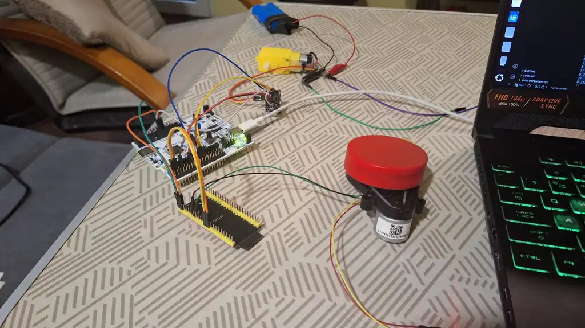
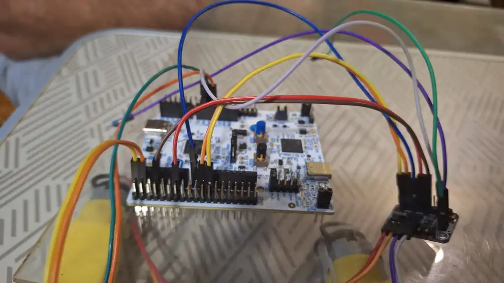
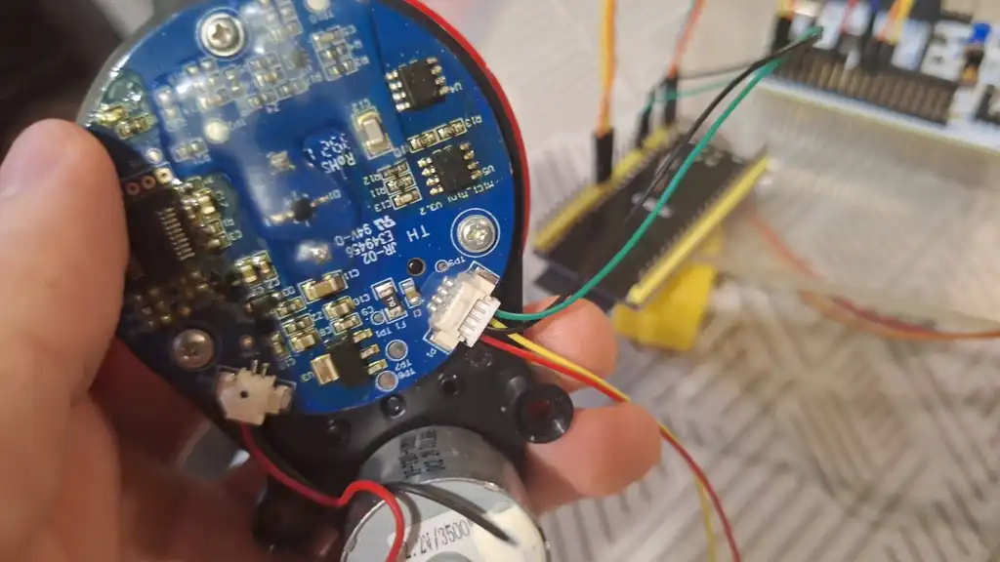

# Remote-controlled car with LiDAR
Embedded Rust and Embassy that features keyboard-based WiFi control and real-time 2D environment mapping using LiDAR.

:::info 

**Author**: Rascanu Dragos \
**GitHub Project Link**: https://github.com/UPB-PMRust-Students/project-dm-2025-Trolom

:::

## Description

A remote-controlled car with real-time 2D LiDAR mapping capabilities, built with Rust for embedded systems. Control the car via WiFi(hotspot for demo at uni) using your keyboard and visualize its surroundings through live mapping on the display of the pc.

## Motivation

 - LiDAR Logic: I wanted to gain hands-on experience with 360° LiDAR sensors, specifically learning how to decode raw laser distance data into a 2D coordinate system.

 - Wireless Data Streaming: I was motivated to implement a high-bandwidth wireless pipeline. I wanted to stream live sensor data directly over WiFi to a PC, simulating how professional autonomous robots and vacuum cleaners operate in the real world.

 - Rust in Motion: I wanted to use Embedded Rust to ensure memory safety and high performance when handling the concurrent tasks of driving motors and streaming telemetry data.

## Architecture 

## Log

### Week 5

Started buying the components, first were the driver module, two wheel motors and a LCD. Starting looking for an ESP32 as well as a LiDAR sensor

### Week 7

LiDAR module arrived, checked if the motors and module worked and controlled them through uart.

### Week 9

ESP32-S3 finally arrived and i could start working on the project.

### Week 11

Tested the ESP32 board and started writing the code for sending the LiDAR readings through WiFi to my pc.

### Week 12 & Holiday

Assembled the lidar car, wrote the python script and made the final touches. Ended up not using the LCD.

## Images

## Hardware

| Component | Purpose | Cost |
|-----------|---------|------|
| STM32 Nucleo-U545RE-Q | Main microcontroller | 128 lei |
| ESP32-S3 | WiFi communication module | 43 lei |

### Motion Control
| Component | Purpose | Cost |
|-----------|---------|------|
| 2× DC Gearmotors with wheels | Drive motors | 30 lei |
| DRV8833 Dual Motor Driver | Motor control | 25 lei |
| MG90S Servo Motor | Front-wheel steering | 19 lei |

### Sensing & Display
| Component | Purpose | Cost |
|-----------|---------|------|
| M1C1 360° LiDAR Module | Environment scanning | 137 lei |

### Schematics

Place your KiCAD schematics here.

### Bill of Materials

| Component | Purpose | Cost |
|-----------|---------|------|
| STM32 Nucleo-U545RE-Q | Main microcontroller | borrowed |
| ESP32-S3 | WiFi communication module | 43 lei |
| 2× DC Gearmotors with wheels | Drive motors | 30 lei |
| DRV8833 Dual Motor Driver | Motor control | 25 lei |
| M1C1 360° LiDAR Module | Environment scanning | 137 lei |
| | Total: | ~235 lei |

## Software

Library | Category | Description |
|---------|-----------|----------------------------|
| embassy-executor | Runtime | Used in both. The async task scheduler that drives the application loop. |
| embassy-stm32 | HAL for STM32 | STM32 only. Hardware Abstraction Layer for GPIO, PWM, and UART. |
| embassy-time | Time | Used in both. Handles durations and timers for async delays. |
| defmt / defmt-rtt | STM32 only. Highly efficient logging via RTT. |
| embedded-io-async | I/O Traits | Used in both. Provides the async Read/Write traits for UART/Network streams. |
| panic-probe | Debugging | STM32 only. Defines crash behavior; ESP32 uses esp-println for panics. |
| esp-hal | HAL | ESP32 only. The hardware abstraction layer for ESP32/Xtensa/RISC-V chips. |
| embassy-net | Networking | ESP32 only. Provides the TCP/IP and UDP stack used for WiFi. |
| esp-radio | Wireless | ESP32 only. Specifically handles the WiFi radio and controller logic. |
| static_cell | Memory | ESP32 only. Used here to safely create static references for the Network Stack. |
| alloc | Memory | ESP32 only. Enables dynamic memory allocation (heap) on the ESP32. |

## Links

### DriveSight (https://embedded-rust-101.wyliodrin.com/docs/fils_en/project/2025/andrei.neagu1910)
Manually controlled robotic platform with real-time video streaming and camera feed monitoring.

### Smart Ride (https://embedded-rust-101.wyliodrin.com/docs/fils_en/project/2025/andra.popovici)
Web app-controlled car with ultrasonic sensors for distance measurement and virtual mapping.

### RC Car with Physical Controller(https://embedded-rust-101.wyliodrin.com/docs/fils_en/project/2025/alin_ioan.gheorghe)
Raspberry Pi Pico-based car with WiFi joystick controller for wireless operation.

