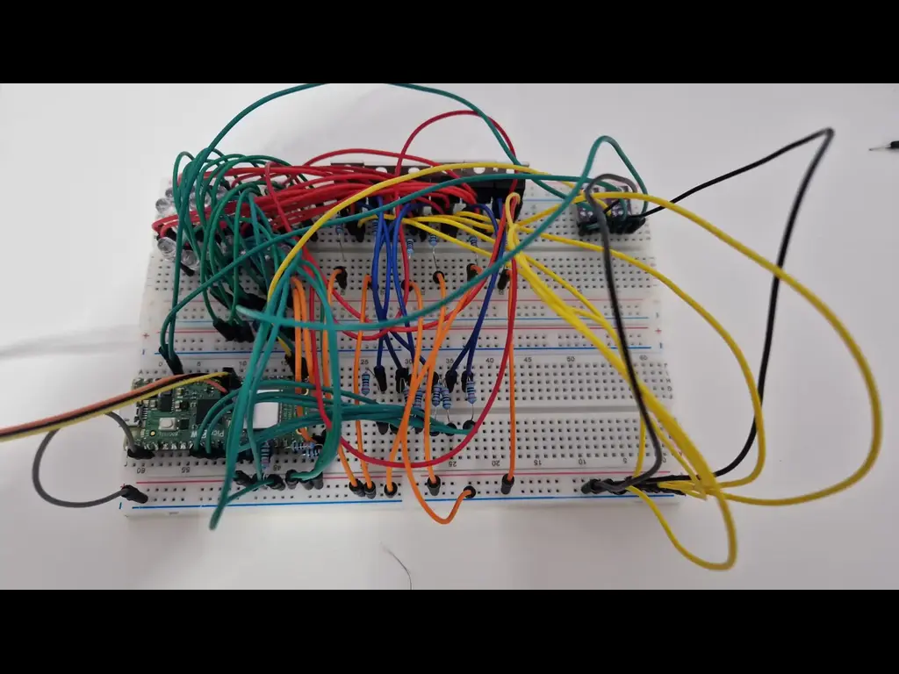
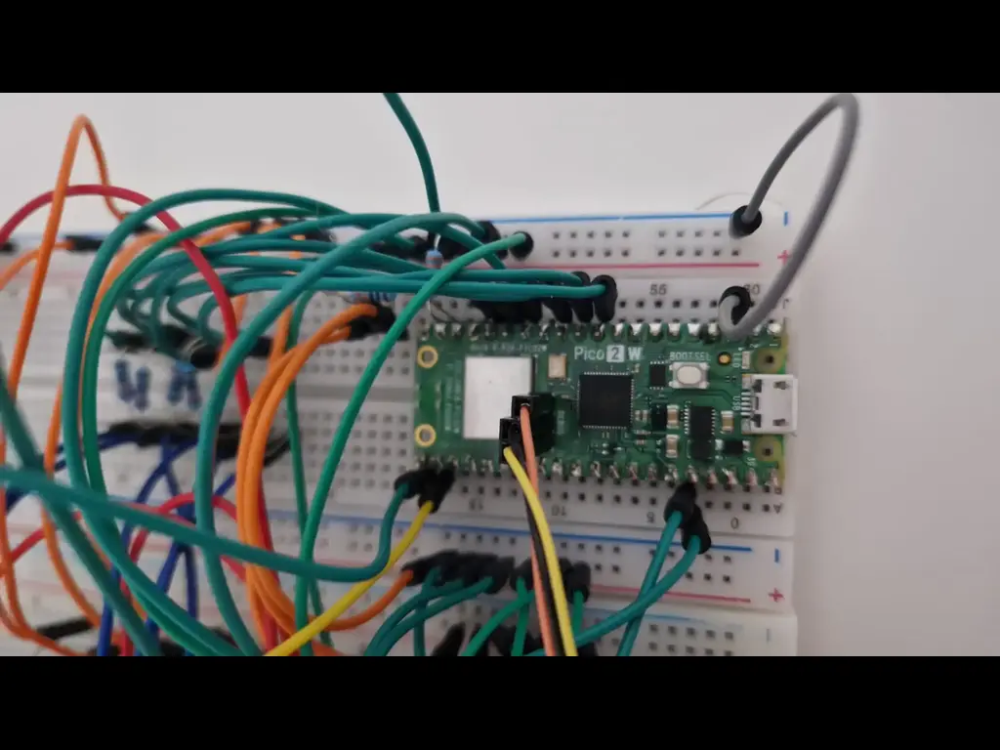
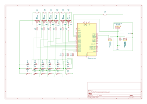

# Matrix LED Adaptive Headlight System

A simplified replica of modern adaptive headlight systems found in vehicles, using a matrix of LEDs, real-time sensor input, and Rust-powered control logic running on a Raspberry Pi Pico 2W.

:::info

**Author:** Eduard-Andrei Balaceanu \
**GitHub Project Link:**: https://github.com/UPB-PMRust-Students/project-eduard1506

:::

## Description

This project showcases the knowledge acquired throughout the semester by designing a functional hardware system that runs software written entirely in Rust. The system replicates a simplified version of the adaptive headlight functionality found in modern vehicles, using a matrix of LEDs controlled by a Raspberry Pi Pico 2W microcontroller.

The setup includes multiple white LEDs arranged in a grid, which dynamically turn on/off or dim based on real-time sensor input. The system uses light sensors to detect the presence and direction of oncoming lights, and a distance sensor to identify nearby objects. It also features adaptive cornering simulation using a joystick input.

The goal is to demonstrate real-time hardware control, sensor input interpretation, and modular embedded design using the Rust programming language.

## Motivation

One of my biggest passions is cars—and everything they represent. I've always loved the feeling of a late-night drive, but to truly enjoy it, you need a powerful and intelligent lighting system. Matrix LED headlights represent the pinnacle of automotive lighting technology, adapting dynamically to changing road conditions, light sources, and traffic.

I’ve been fascinated by how this system works, how it improves both safety and comfort, and why it isn’t more widely adopted across all types of vehicles. Through this project, I wanted to explore the core principles behind adaptive lighting and bring a simplified version to life using accessible components and Rust-based control logic.

## Architecture

The system architecture consists of the following functional layers:

1. **Sensor Layer**  
   - Three ambient light sensors (TEMT6000) detect the direction and intensity of incoming light sources.
   - One ultrasonic sensor (HC-SR04) measures the distance to nearby objects.

2. **Control Layer**  
   - A Raspberry Pi Pico 2W reads input data from all sensors.
   - A custom control algorithm written in Rust determines which LEDs should be turned on, off, or dimmed.

3. **Output Layer**  
   - A matrix of white LEDs is powered and controlled via IRLZ44N MOSFETs.
   - The system dims or disables individual LEDs based on sensor input to avoid blinding oncoming traffic while preserving road visibility.

Each component is connected using breadboards and jumper wires, with careful power and grounding design to ensure stability. The entire system operates without external Wi-Fi or cloud dependency, functioning in a fully local, embedded environment.

## Diagram

## Weekly Log

### Week 8 – May 4th

Over the past few weeks, I’ve been gathering all the necessary components for the project. After pitching my idea to the professor and getting the green light, I decided to attempt building a simplified version of the Matrix LED adaptive headlight system used in modern vehicles.

This week marked the official start of the documentation process. I’ve already experimented with wiring the Pico 2W, tested the debugger, and ran a few simple LED blink tests in Rust to confirm everything’s working. Most of the hardware is now in place — the MOSFETs, LEDs, sensors, and breadboards — though I’m still waiting on the OLED screen and joystick module.

I also started working on the architecture diagram using diagrams.net. I’m aiming to create something clean and professional, so the structure makes sense both visually and logically. Once that’s done, I’ll export it and integrate it into the site. Documentation is coming together nicely so far.

### Week 9 – May 11
Building the physical matrix was the main focus this week. I wired the 6×3 LED grid on the breadboards and connected the column MOSFET gates to the Pico’s GPIO 7 through 12. The row anode lines were wired to GPIO 13 through 15, each protected by a 330Ω resistor to limit current. After checking the wiring multiple times, I was able to confirm that I could control each LED individually and that the matrix multiplexing logic worked as planned.

### Week 10 – May 18
Sensor integration was the big challenge for this week. I connected two TEMT6000 light sensors, one on each side of the matrix, to serve as left/right ambient detectors. Both sensors were connected to Pico ADC pins (GP16 and GP17), and I wrote the initial Rust code to read and process their analog output. I also integrated the HC-SR04 ultrasonic distance sensor, adding a simple voltage divider on the ECHO pin to safely handle the 5V signal. There were some early issues with sensor noise and ADC instability, but after a few tweaks to the software and power supply setup, the sensor readings became reliable.

### Week 11 – May 25
This week was all about refining the software. I finished the main matrix control algorithm in Rust, implementing column-based multiplexing and software PWM for smooth row dimming. After some trial and error, I managed to significantly reduce LED flicker by increasing the PWM steps and optimizing the timing of the multiplex loop. I also improved the sensor code by reading the ultrasonic sensor less frequently (to avoid blocking LED refresh) and adding a smoothing function to the global brightness value, which eliminated any visible jitter in the LEDs. By the end of the week, the system reliably adapted the LED matrix in real time based on both ambient light and object distance, running smoothly and consistently.

| GP7               | MOSFET Gate for Column 1                 | Gate of MOSFET 1 (via 220Ω resistor)           |
| GP8               | MOSFET Gate for Column 2                 | Gate of MOSFET 2 (via 220Ω resistor)           |
| GP9               | MOSFET Gate for Column 3                 | Gate of MOSFET 3 (via 220Ω resistor)           |
| GP10              | MOSFET Gate for Column 4                 | Gate of MOSFET 4 (via 220Ω resistor)           |
| GP11              | MOSFET Gate for Column 5                 | Gate of MOSFET 5 (via 220Ω resistor)           |
| GP12              | MOSFET Gate for Column 6                 | Gate of MOSFET 6 (via 220Ω resistor)           |
| GP13              | LED Matrix Row 1 (Anode supply)          | Row 1 LEDs via 330Ω resistor                   |
| GP14              | LED Matrix Row 2                         | Row 2 LEDs via 330Ω resistor                   |
| GP15              | LED Matrix Row 3                         | Row 3 LEDs via 330Ω resistor                   |

The project uses two TEMT6000 ambient light sensors, placed on opposite sides of the breadboard to detect directional brightness — simulating oncoming traffic from the left or right. These sensors output an analog voltage that varies with light intensity, allowing the Pico to react accordingly.

### 📸 Photos of the Build

The following images show the current stage of hardware assembly, including breadboard layout, wiring details, and sensor positioning.

#### KiCad Schematic

## Bill of Materials

| **Device**             | **Usage**                                | **Price**        |
|------------------------|------------------------------------------|------------------|
| Raspberry Pi Pico W    | The microcontroller                      | 35 RON           |
| Breadboard             | The main breadboard                      | 10 RON           |
| Light Sensors (x2)     | Measure ambient light                    | 2 x 9.99 RON     |
| Ultrasonic Sensor      | Detect object distance                   | 6.49 RON         |
| MOSFETs (IRLZ44N x6)   | Drive high-power LEDs                    | 6 x 4.99 RON     |
| LED Assortment         | Visual output (matrix lighting)          | 26.99 RON        |

##  Software 

| **Library**       | **Description**                                                        | **Usage**                                       |
|------------------|------------------------------------------------------------------------|------------------------------------------------|
| `heapless`       | Data structure library                                                  | Used for String vectors                        |
| `embassy_rp`     | Embassy HAL for the Raspberry Pi RP2040                                 | Used to program the Pico                       |
| `embassy_sync`   | Sync primitives and async data support                                  | Communicating through tasks                    |
| `embedded-hal`   | Hardware abstraction traits                                             | Common interface for embedded peripherals      |
| `defmt`, `defmt-rtt` | Lightweight logging + RTT interface                                | Debugging via the probe                        |
| `cortex-m`       | ARM Cortex-M microcontroller support                                    | Low-level control                              |
| `cortex-m-rt`    | Runtime support                                                         | Startup and interrupts                         |
| `panic-halt`     | Panic behavior                                                          | Safe stop on crash                             |
