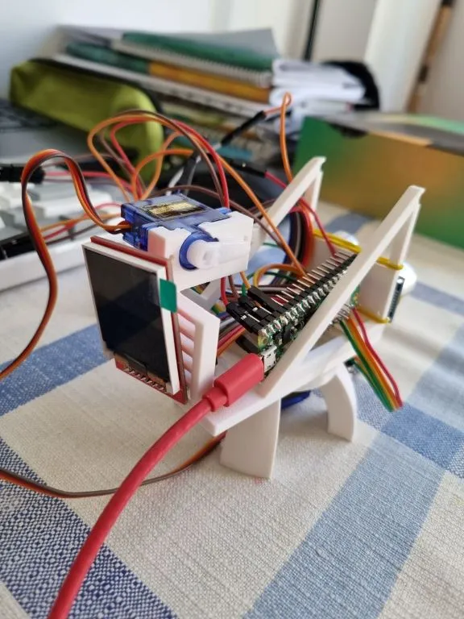
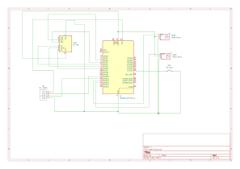

# Turret with object identification
A smart turret using a Raspberry Pi Pico 2W, with servo control, ultrasonic object detection and live radar

:::info
Author: Purcarescu Eduard-Gabriel \
GitHub Project Link : https://github.com/UPB-PMRust-Students/project-EduarditoRealG
:::

## Description
The project uses an ultrasonic sensor to help the user see the objects within a certain radius on a display and if an object is closer than a set distance, it uses a servomotor to shoot it. Another servo is used to constantly rotate the turret. After shooting, it stops and waits for a button to be pressed in order to reset.

## Motivation
Since I was little, I've always liked shooting games and I can say I wanted to do this project in order to remember my childhood and also something in order to gain more knowledge in software and hardware domain. I didn't like the games which didn't have a radar or a minimap, that is why I integrated also the lcd display.

## Architecture
1. Raspberry Pi Pico 2W: the brain of the operation. It receives information from the sensor and analyses what to send to the display and servomotor
2. Micro servomotor: shooting function
3. Metallic servomotor: used for automatic rotation of the turret
4. Ultrasonic sensor: measures the distance to an object and then sends it to the microcontroller
5. LCD display: displays objects seen by the ultrasonic sensor, behaving like a mini radar
6. Push button: serves as a reset function after an object has been shot
7. Breadboard: interconnects all the pieces

## Log

### Week 28 April - 4 May
Started working on the documentation for the project. I bought every necessary component and started to connect them on the breadboard, in order to be able to make the schematics and understand how they interact with eachother.
### Week 5-11 May
I began assembling all the components. I started also to look into the programming part, what features need to be implemented and I also 3D printed the structure.
### Week 12-18 May
The exterior design is finished and fully assembled. I continue making progress with the software milestone in order to interconnect all the parts' functions.

### Week 19-25 May

## Hardware
1. Raspberry Pi Pico 2W
2. Micro servomotor
3. Micro servomotor
4. Ultrasonic sensor
5. LCD display
6. Push button
7. Jumper wires
8. Breadboard
9. Resistors

### Schematics

### Bill of Materials
| Device | Usage | Price |
|--------|--------|-------|
| [Raspberry Pi Pico 2W](https://www.raspberrypi.com/documentation/microcontrollers/pico-series.html) | The microcontroller | [40 RON](https://www.optimusdigital.ro/en/raspberry-pi-boards/13327-raspberry-pi-pico-2-w.html?search_query=raspberry+pi+pico+2w&results=36) |
| [Debug probe](https://www.raspberrypi.com/documentation/microcontrollers/debug-probe.html) | Debug | [66 RON](https://www.optimusdigital.ro/en/accesories/12777-raspberry-pi-debug-probe.html?search_query=debug+probe&results=8) |
| [SG90](http://www.ee.ic.ac.uk/pcheung/teaching/DE1_EE/stores/sg90_datasheet.pdf) | Servomotor | [12 RON](https://www.optimusdigital.ro/en/servomotors/2261-micro-servo-motor-sg90-180.html?search_query=sg90&results=11) |
| [SG90](http://www.ee.ic.ac.uk/pcheung/teaching/DE1_EE/stores/sg90_datasheet.pdf) | Servomotor | [12 RON](https://www.optimusdigital.ro/en/servomotors/2261-micro-servo-motor-sg90-180.html?search_query=sg90&results=11) |
| Breadboard | Breadboard | [10 RON](https://www.optimusdigital.ro/en/breadboards/8-breadboard-hq-830-points.html) |
| 1.44' LCD dislay | Display | [28 RON](https://www.optimusdigital.ro/en/lcds/870-144-lcd-module-128x128-px-red.html) |
| Jumper wires | Wiring | [5 RON](https://www.optimusdigital.ro/en/wires-with-connectors/889-set-fire-tata-tata-10p-20-cm.html?search_query=jumper+wires&results=94) |
| Push button | Reset button | [0.36 RON](https://www.optimusdigital.ro/en/buttons-and-switches/1119-6x6x6-push-button.html?search_query=button&results=491) |

## Software

| Library | Description | Usage |
|---------|-------------|-------|
| [embassy-rp](https://docs.embassy.dev/embassy-rp/latest/rp2040/) | Pico Peripherals | Accesses Raspberry Pi Pico W hardware like GPIO, PWM, and SPI |
| [embassy-executor](https://docs.embassy.dev/embassy-executor/latest/embassy_executor/) | Async Runtime | Runs async tasks on embedded systems |
| [embassy-time](https://docs.rs/embassy-time/latest/embassy_time/) | Time Management Library | Used for timers, delays, and async time operations |
| [embedded-hal](https://docs.rs/embedded-hal/latest/embedded_hal/) | Hardware Abstraction Layer | Defines traits for embedded device interfaces like SPI, PWM, and GPIO |
| [embedded-graphics](https://docs.rs/embedded-graphics/latest/embedded_graphics/) | Graphics Primitives Library | Used to draw text, shapes, and images on embedded displays |
| [st7735-lcd](https://docs.rs/st7735-lcd/latest/st7735_lcd/) | Display Driver | Used to control ST7735 1.44" LCD over SPI |
| [display-interface-spi](https://docs.rs/display-interface-spi/latest/display_interface_spi/) | SPI Display Interface | Provides SPI interface support for embedded display drivers |
| [defmt](https://docs.rs/defmt/latest/defmt/) | Debug Formatter | Efficient logging and debug output for embedded systems |
| [defmt-rtt](https://docs.rs/defmt-rtt/latest/defmt_rtt/) | RTT Transport for defmt | Sends `defmt` logs over USB using Real-Time Transfer |
| [panic-probe](https://docs.rs/panic-probe/latest/panic_probe/) | Panic Handler | Displays panic messages via `defmt` for debugging |

## Links
https://pico.implrust.com/ultrasonic/index.html
https://www.raspberrypi.com/documentation/
https://pmrust.pages.upb.ro/docs/fils_en/welcome

