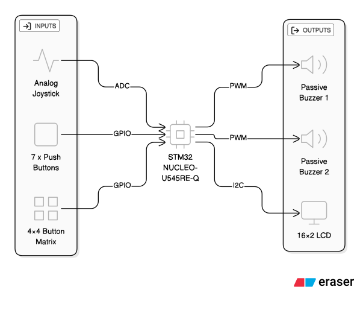

# Piano Player & Learner
A digital piano designed to help users learn and play songs with on-screen note guidance.

:::info 

**Author**: Sirbu-Boeti Eduard-Cristian \
**GitHub Project Link**: https://github.com/UPB-PMRust-Students/project-dm-2025-Sirbu-Boeti-Eduard

:::

## Description

The project is a 7-note piano intended as a simple learning system to follow the notes of a song. The user can play individual notes or up to two notes simultaneously, allowing for basic chords and harmonies aimed towards beginners. For intermediate learners we will make use of a joystick to experiment with changing the pitch of a note.

* We will use an LCD display to:
  * Guide the user to follow the displayed notes of a chosen song
  * Indicate system states (e.g. playing, recording, name of the song to be played etc.)
  
* The interface is a 4x4 button matrix used for controlling the system:
  * 1st row: Play more difficult pre-recorded songs
  * 2nd row: Guided play-along mode for easier songs using the display
  * 3rd row: Record and save user-played songs
  * 4th row: Auxiliary actions (start recording, confirm, cancel, etc.)

## Motivation

The main motiviation behind this project was me wanting to make use of the 4x4 button matrix component. Initially I wanted to make the tabletop game [Battleship](https://en.wikipedia.org/wiki/Battleship_(game)), but I wasn't satisfied with there being only 16 possible square grids due to the size of the button matrix. 

After fiddling around with buttons on the breadboard I liked the feel of it and wanted to try doing something with buttons that will fit nicely in your hand. Due to the size of the breadboard I was thinking of maybe using it as a remote controller for something but I ended up going with a small 7-note piano.

This was due to the fact that, when I was younger, I used to have a Yamaha digital piano with a lot of similar features and also because I saw that in previous years there have been similar piano projects.

## Architecture 



### Inputs
- **7× Push Buttons**
  - Act as the main “piano keys” (Do, Re, Mi, Fa, Sol, La, Si)
  - Connected as GPIO inputs with pull-ups
- **4×4 Button Matrix (Keypad)**
  - Used for system control (mode selection, song selection, confirm/cancel actions)
  - Connected via GPIO row/column scanning
- **Analog Joystick**
  - VRx and VRy connected to ADC inputs
  - Used for experimenting with pitch control
  - The joystick push button (SW) is not used/needed

### Outputs
- **2× Passive Buzzers**
  - Controlled using PWM
  - Support up to two simultaneous notes, naming the buzzers as "voices"
- **16×2 Character LCD (HD44780 controller chip)**
  - Displays current mode, target notes and system status
  - Connected via I2C 

### Connections

- **GPIO / EXTI** – push buttons (note input)
- **GPIO scan** – 4×4 keypad (columns driven, rows read)
- **ADC** – joystick VRx / VRy
- **PWM** – passive buzzers (frequency = note pitch)
- **I2C** – LCD module

## Log

### Week 5: 27 October - 2 November

This was the week when we had to present our Powerpoint presentations. In this week, I just gathered the necessary information and created the presentation. There were no additional modifications requested by the professor, as such I took that the project received the "OK".

### Week 6: 3 November - 9 November

This week I set up all 7 buttons on the breadboard and starting building a quick demo to see the overall difficulty. Initially I used a single buzzer, but I also wanted an additional one for concurrent notes. I didn't have an additional passive buzzer (only an active one) so I had to order one.

While waiting for the new buzzer, I managed to create the functional demo where i could play the notes through the buzzer.

### Week 7: 10 November - 16 November

This week I wanted to connect the I2C display to the MCU. I initially had trouble with the identification of the I2C address, thus not being able to use the display and, as such, I had to wait to complete Lab 06 - "Inter-Intergrated Circuit" to finally be able to scan the correct I2C address and print "Hello World".

Around this time, I also received my second passive buzzer and I finally connected it and was able to play two notes at the same time. 

Side note: I had to change all the button and the existing buzzer connections because I had to get the two buzzers to connect on different TIMs in order to play different notes at the same time. 

### Week 8: 17 November - 23 November

At this point, I had all the buttons and buzzers ready and the LCD display was just connected. Now, I wanted to connect the 4x4 button matrix. Here I struggled a lot because there were no markings on the on PCB of the order of the pins and their correspondence with the rows and columns. After finally thinking I got the connections right, I observed that it still wasn't working. I found out the the button matrix that I had simply wasn't detecting the entire rows 1 and 2 (I assume the pins that denoted the rows were broken because the columns had not problems). As such, I postponed this step in order to buy a new button matrix that hopefully works. 

Side note: At this point, I deconnected for now the existing note buttons for testing as I no longer had space for the 8 pins of the button matrix and had no Female-to-Female connectors for connecting to the Morpho pins. 

### Week 9: 24 November - 30 November

This week I started testing my joystick to see if it is working properly. I decided that I didn't need to make use of the SW button (clicking the joystick) and that I will either use the X or Y axis for pitch control. After testing it worked properly the ADC and seeing the changes in terminal. At this point I wanted to try testing the pitch change on a static note, but the results were not satisfying, making it sound bad. Hoping to find a solution. 

### Week 10: 1 December - 7 December

This week I mostly did changes to the code in order to better segment the code for future implementation. Namely, preparing the "Free Play", "Play Along 1 (single notes)" and "Play Along 2 (double notes)" into different functions to be called in the "loop".

### Week 11: 8 December - 14 December

After buying some Female-to-Female cable I was able to complete connection of all components together. I ended up not ordering a new button matrix, thinking that maybe it was my code's fault it wasn't working, but after several more tries I concluded that I need to buy a new button matrix. For now, until I buy the new one, I will have to work on the currently functional rows. 

### Week 12: 15 December - 21 December

This week I worked on writing the documentation and moving my segmented demos into a single Github repository for the source code. Starting to focus on the source code with all of its features. 

## Hardware

I have provided links for reference.

* [STM32 NUCLEO-U545RE-Q](https://www.st.com/en/evaluation-tools/nucleo-u545re-q.html)

* [Passive buzzers (×2)](https://www.optimusdigital.ro/ro/audio-buzzere/12247-buzzer-pasiv-de-33v-sau-3v.html)

* [Push buttons (×7)](https://protosupplies.com/product/tactile-momentary-pushbutton-yellow-12mm/)

* [16×2 character LCD display](https://ie.farnell.com/dfrobot/dfr0063/lcd-display-module-i2c-16x2-arduino/dp/3769973)

* [4×4 button matrix](https://protosupplies.com/product/tactile-keypad-4x4-matrix/)

* [Analog 2-axis XY joystick](https://www.pishop.us/product/analog-2-axis-thumb-joystick-with-select-button/)

* Connecting components:
  * Breadboard
  * Male-to-Male, Male-to-Female, Female-to-Female Cables

### Current pin usage
- **LCD (I2C1)**
  - SCL: `PB6`
  - SDA: `PB7`
- **Buzzers (PWM)**
  - Buzzer 1: `PC9` on `TIM3_CH4`
  - Buzzer 2: `PB10` on `TIM2_CH3`
- **7 Push Buttons**
  - `PC8`, `PB3`, `PB5`, `PB4`, `PA2`, `PC7`, `PC6`
- **Joystick**
  - VRx / VRy on `A0`, `A1`
  - powered at 3.3 V

### Schematics

<!--Place your KiCAD schematics here.-->

### Bill of Materials

<!-- Fill out this table with all the hardware components that you might need.

The format is 
```
| [Device](link://to/device) | This is used ... | [price](link://to/store) |

```

| Device | Usage | Price |
|--------|--------|-------|
| [Raspberry Pi Pico W](https://www.raspberrypi.com/documentation/microcontrollers/raspberry-pi-pico.html) | The microcontroller | [35 RON](https://www.optimusdigital.ro/en/raspberry-pi-boards/12394-raspberry-pi-pico-w.html) |
-->

## Software

<!--
| Library | Description | Usage |
|---------|-------------|-------|
| [st7789](https://github.com/almindor/st7789) | Display driver for ST7789 | Used for the display for the Pico Explorer Base |
| [embedded-graphics](https://github.com/embedded-graphics/embedded-graphics) | 2D graphics library | Used for drawing to the display |
-->

## Links

<!-- Add a few links that inspired you and that you think you will use for your project -->

<!--
1. [link](https://example.com)
2. [link](https://example3.com)
...
-->