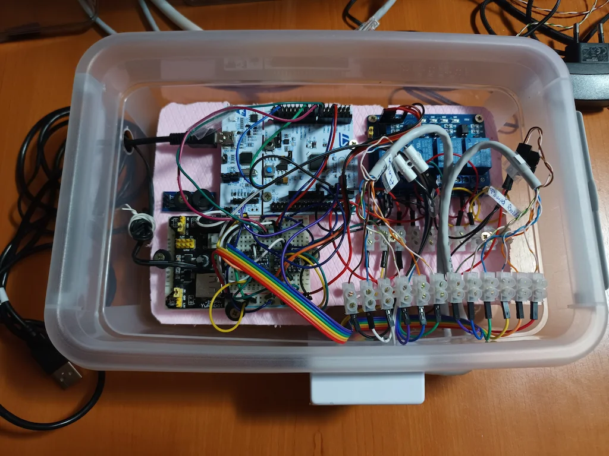
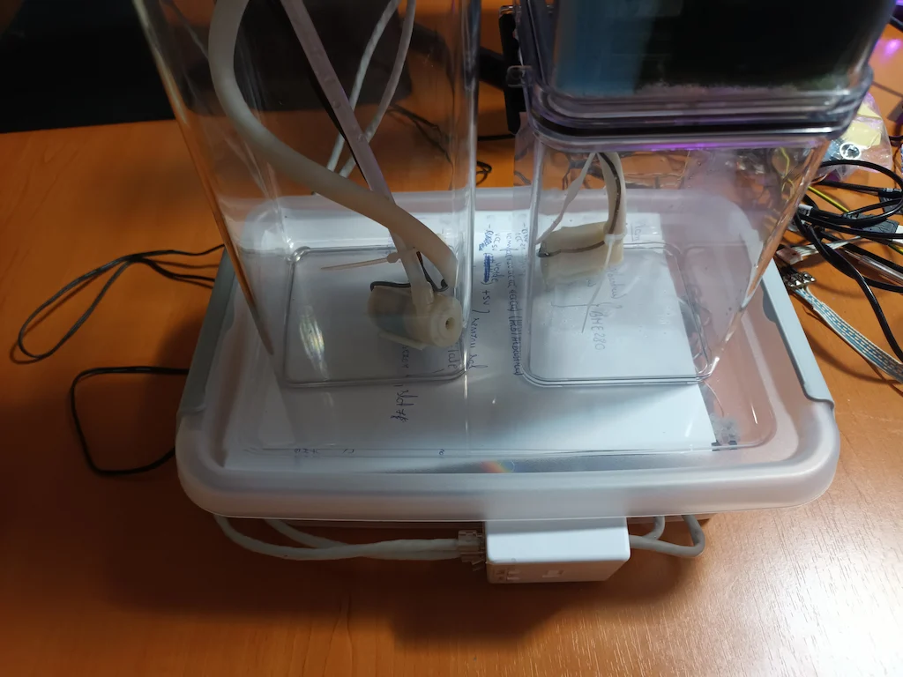
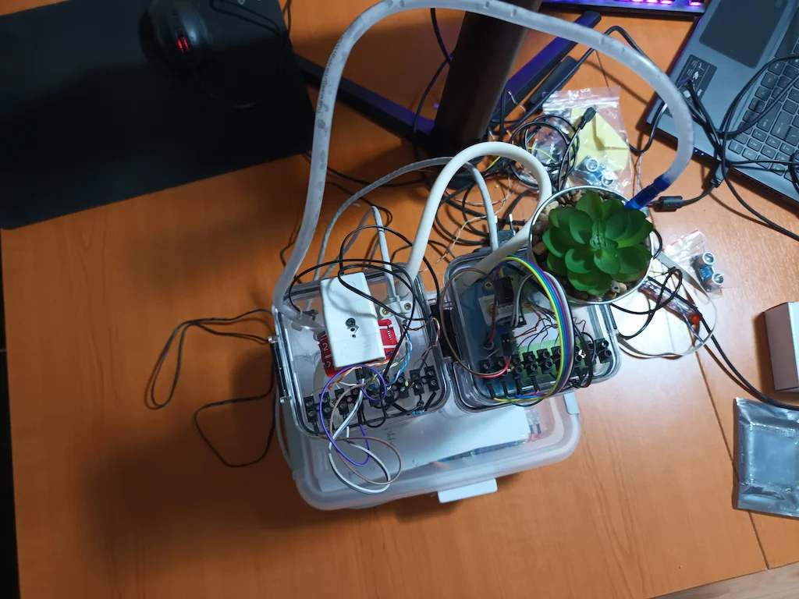
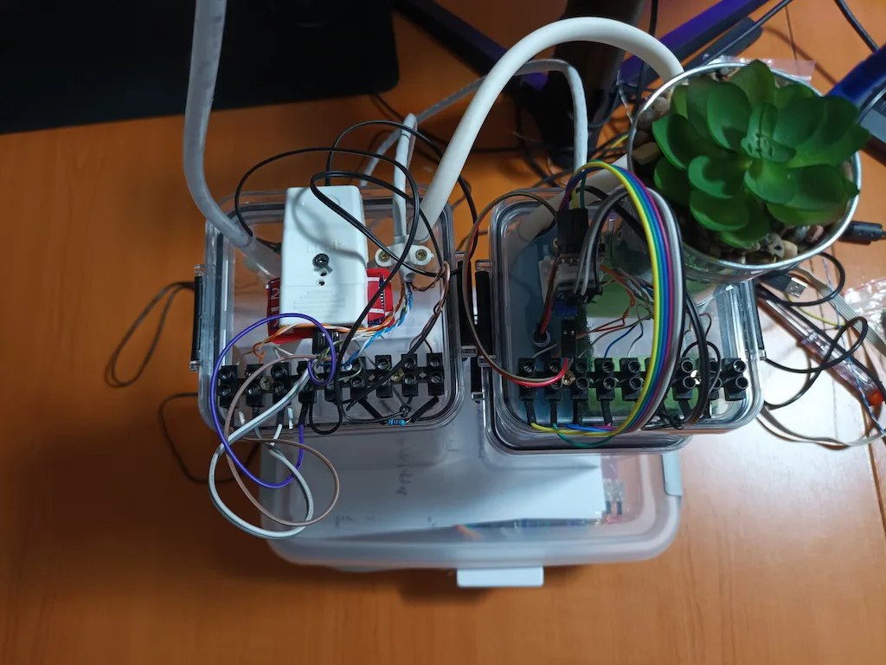
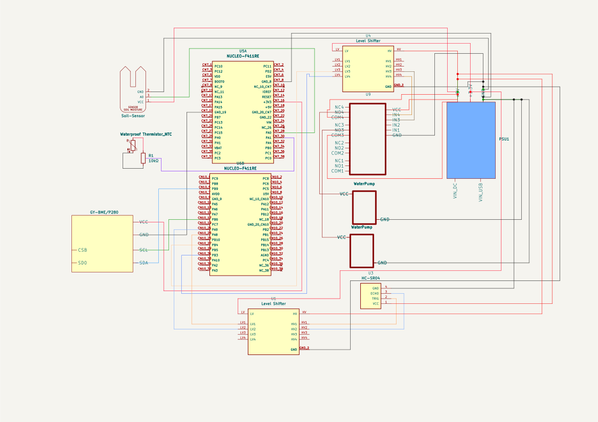

# Smart Irrigation System

:::info

**Author**: Niculae Filip Ioan  
**GitHub Project Link**: [https://github.com/UPB-PMRust-Students/project-NFI-279](https://github.com/UPB-PMRust-Students/project-NFI-279)

:::

## Description

This project presents a small-scale smart irrigation system capable of automating or manually controlling water delivery to a cultivated area. Managed through a Windows desktop GUI developed using ImGui and DirectX 11, the system communicates via UART to display real-time environmental and system data. 

Users can switch between AUTO mode, where irrigation is triggered automatically based on soil humidity, and MANUAL mode, which allows full control over the water pump and specific water quantities to be dispensed.

Additional features include the ability to monitor parameters such as external temperature, atmospheric pressure, water tank temperature, and current water volume. The system also supports tank configuration, enabling users to input its shape and dimensions so that accurate calculations can be made based on sensor readings. This project demonstrates how digital interfaces and real-time sensor integration can support precision irrigation, even at a reduced scale.

## Motivation

I’ve always been fascinated by how technology can make life easier, and agriculture is a perfect area to apply that. This project allows me to combine my passion for tech with my interest in sustainable practices. I wanted to create a system that can help people automate the irrigation process and make it more efficient, especially for small-scale or hobbyist growers.

## Architecture

The following diagram presents an overview of the physical interconnections in the system:

### NUCLEO-F411RE

- **Role**: Central controller that reads sensor data, manages irrigation logic, triggers alerts, and communicates with the desktop app.
- **Interfaces Used**:
  - I2C: BME280
  - ADC: Soil Moisture Sensor, NTC Thermistor, Active Buzzer
  - Digital GPIO: HC-SR04, Relay Module
  - UART: Communication with ImGui App

---

### BME280 Sensor

- **Interface**: I2C  
- **Role**: Measures atmospheric temperature and pressure  
- **Pins Used**:
  - SCL: PB6  
  - SDA: PB7  
- **Connection**: Connected directly to NUCLEO via I2C1

---

### HC-SR04 Ultrasonic Sensor

- **Interface**: Digital GPIO  
- **Role**: Measures distance to estimate water level in tank  
- **Pins Used**:
  - Trig: PA8 (Output)  
  - Echo: PA9 (Input)  
- **Connection**: Trigger pin sends pulse, Echo pin receives return

---

### Soil Moisture Sensor

- **Interface**: ADC  
- **Role**: Detects soil humidity level  
- **Pins Used**:
  - Signal: PA0  
- **Connection**: Connected to ADC as voltage divider output

---

### NTC Thermistor

- **Interface**: ADC  
- **Role**: Measures temperature (soil or ambient)  
- **Pins Used**:
  - Signal: PA1  
- **Connection**: Voltage divider setup; analog output to ADC pin

---

### 4-Channel Relay Module

- **Interface**: Digital Output  
- **Role**: Switches power to the Mini Submersible Water Pump  
- **Connection**:
  - Controlled by NUCLEO through level shifter  
  - Relay IN pins connected to 5V level-shifted GPIO

---

### Mini Submersible Water Pump

- **Interface**: Relay-controlled  
- **Role**: Dispenses water to the plants  
- **Power**: Controlled via relay module from a 5V power source

---

### Second Mini Submersible Water Pump

- **Interface**: Relay-controlled  
- **Role**: Refills the Water Tank
- **Power**: Controlled via relay module from a 5V power source

---

### Active Buzzer

- **Interface**: GPIO  
- **Role**: Beeps for alerts

---

### UART Communication

- **Interface**: UART over USB  
- **Role**: Sends data to and receives commands from ImGui desktop app

---

### Level Translator

- **Role**: Converts 3.3V GPIO signals from NUCLEO to 5V for relay module compatibility  
- **Connection**: Between NUCLEO GPIO pins and Relay IN pins  
- **Power Source**: 5V external power

---

### 5V Power Source

- **Role**: Powers the following modules:
  - Relay module  
  - Mini Submersible Water Pump  
- **Important**: This power source is separate from the USB powering the NUCLEO board

---

## Log

<!-- write every week your progress here -->

### Week 6 - 12 May
This week, I focused on getting all the hardware parts set up. I put together and wired up the NUCLEO board, all the sensors (BME280, HC-SR04, Soil Moisture, NTC), the relay module, and the water pumps, making sure the level translators and the 5V power supply were hooked up correctly. Once all the physical parts were connected and I double-checked everything, I drew up the circuit diagram for the system in KiCad to map out how all the components talk to each other.

### Week 7 - 19 May
The primary focus shifted to software, starting with the Windows desktop GUI. I set up the ImGui and DirectX 11 environment and designed the basic UI layout for sensor data display and user controls. Concurrently, I began implementing the UART communication protocol on both the NUCLEO firmware and the desktop application to establish an initial data link. Basic sensor reading stubs were also added to the firmware.

### Week 8 - 26 May
The main objective this week was to build out the core Rust firmware and establish its communication with the desktop GUI, allowing for clear data presentation and user-driven control.

- **Firmware Sensor Integration & Data Handling (Rust)**: On the NUCLEO, I focused on robust sensor integration using Rust. This involved implementing the necessary driver interactions and logic to reliably read data from all connected sensors:
  - BME280 (atmospheric temperature & pressure via I2C).
  - HC-SR04 (water level via GPIO and timer-based pulse measurement).
  - Soil Moisture Sensor (humidity via ADC).
  - NTC Thermistor (water tank temperature via ADC, including resistance-to-temperature conversion).

- **GUI Enhancement & Data Display**: The ImGui desktop application was significantly updated. I developed the routines to parse the incoming real-time sensor data stream originating from the NUCLEO's Rust firmware. UI elements were then populated to display these values clearly (e.g., dedicated sections for atmospheric conditions, soil moisture, water tank status).

- **Basic System Logic (NUCLEO - Rust)**: On the NUCLEO, I began implementing the core decision-making logic in Rust. This included parsing commands received from the GUI (like manual pump control or mode switching) and establishing the initial framework for the AUTO mode (e.g., checking soil moisture readings against a preliminary threshold to trigger irrigation).

- **Control Implementation**: I added interactive controls to the GUI, specifically buttons/switches for toggling between AUTO and MANUAL irrigation modes, and for manually activating/deactivating the water pump. The corresponding command structures were defined, and the GUI now sends these commands back to the NUCLEO via UART, enabling user interaction with the system.

- **Testing & Debugging**: Conducted initial end-to-end tests to ensure that sensor data was flowing correctly from the physical sensors, through the NUCLEO (processed by the Rust firmware), over UART, and displayed accurately on the GUI. Similarly, I tested that commands sent from the GUI were correctly received and interpreted by the NUCLEO's firmware. This phase involved significant debugging of both the UART communication protocol and the sensor data interpretation, ensuring reliable communication between the embedded Rust application and the desktop interface.
---

## Hardware
The Smart Irrigation System is built around several key hardware components, each playing a crucial role in its functionality:

*   **NUCLEO-F411RE**: Serves as the brain of the system. It acts as the central controller, responsible for reading data from multiple sensors, implementing the irrigation logic (both automatic and manual modes) and managing UART communication with the Windows desktop application.
*   **BME280 Sensor**: Functions as an environmental sensor, specifically measuring atmospheric temperature and pressure.
*   **HC-SR04 Ultrasonic Sensor**: Used to monitor the water level in the tank. It measures the distance to the water surface, allowing the system to estimate the remaining water volume.
*   **Soil Moisture Sensor** : Acts as the primary sensor for automated irrigation. It detects the humidity level in the soil, and its readings trigger the irrigation process in AUTO mode.
*   **NTC Thermistor**: Provides temperature reading.
*   **4-Channel Relay Module**: Works as an electromechanical switch. It is controlled by the NUCLEO board (via a level translator) to turn the Mini Submersible Water Pump on or off.
*   **Mini Submersible Water Pump**: The actuator responsible for water delivery. It pumps water from the tank to the cultivated area when activated by the relay module.
*   **Active Buzzer**: Serves as an auditory alert system.
*   **Level Translator** : An essential interface component that safely converts the 3.3V logic signals from the NUCLEO's GPIO pins to the 5V required to operate the relay module.
*   **5V Power Source**: Provides the necessary power for higher-voltage components like the relay module and the water pump, separate from the NUCLEO's USB power.
*   **UTP CAT5E Cable and Double Surface-mount UTP CAT5e Outlet**: These are used to make good, organized cable connections.
*   **Breadboard Power Supply**: Gives stable power distribution to components.

### Schematics

### Bill of Materials

| Device | Usage | Price |
|--------|--------|-------|
| [NUCLEO F411RE](https://ro.mouser.com/ProductDetail/STMicroelectronics/NUCLEO-F411RE?qs=Zt3UNFD9mQjdEJg18RwZ2g%3D%3D) | The microcontroller | [65 RON](https://ro.mouser.com/ProductDetail/STMicroelectronics/NUCLEO-F411RE?qs=Zt3UNFD9mQjdEJg18RwZ2g%3D%3D) |
| [HC-SR04 Ultrasonic Sensor](https://www.optimusdigital.ro/en/ultrasonic-sensors/2328-senzor-ultrasonic-de-distana-hc-sr04-compatibil-33-v-i-5-v.html) | Distance Measurement | [15 RON](https://www.optimusdigital.ro/en/ultrasonic-sensors/2328-senzor-ultrasonic-de-distana-hc-sr04-compatibil-33-v-i-5-v.html) |
| [BME280 Module](https://www.optimusdigital.ro/en/pressure-sensors/5649-bme280-barometric-pressure-sensor-module.html) | Barometric Pressure & Temperature | [20 RON](https://www.optimusdigital.ro/en/pressure-sensors/5649-bme280-barometric-pressure-sensor-module.html) |
| [4 Channel Level Translator X2](https://www.optimusdigital.ro/en/level-shifters/181-4-channnel-bidirectional-level-translator.html) | Voltage Level Translator | [10 RON](https://www.optimusdigital.ro/en/level-shifters/181-4-channnel-bidirectional-level-translator.html) |
| [4 Relay Module](https://www.optimusdigital.ro/en/relay-modules/478-blue-optoisolated-4-relay-module.html) | Controls devices | [14 RON](https://www.optimusdigital.ro/en/relay-modules/478-blue-optoisolated-4-relay-module.html) |
| [Mini Submersible Water Pump X2](https://www.optimusdigital.ro/en/others/4149-mini-submersible-water-pump.html) | Water Pump | [20 RON](https://www.optimusdigital.ro/en/others/4149-mini-submersible-water-pump.html) |
| [Ground Humidity Sensor Module](https://www.optimusdigital.ro/en/humidity-sensors/73-ground-humidity-sensor-module.html) | Detects soil humidity | [10 RON](https://www.optimusdigital.ro/en/humidity-sensors/73-ground-humidity-sensor-module.html) |
| [UTP CAT5E Cable](https://www.leroymerlin.ro/produse/cabluri-si-accesorii-multimedia/883/cablu-utp-cat5e-la-metru/113470) | Connecting Devices | [3 RON](https://www.leroymerlin.ro/produse/cabluri-si-accesorii-multimedia/883/cablu-utp-cat5e-la-metru/113470) |
| [Double Surface-mount UTP CAT5e Outlet](https://www.a2t.ro/retele-si-telefonie/priza-dubla-aplicata-utp-cat5e-regleta-krone-gembird.html) | Connecting Cables | [14 RON](https://www.a2t.ro/retele-si-telefonie/priza-dubla-aplicata-utp-cat5e-regleta-krone-gembird.html) |
| [Breadboard Power Supply](https://www.optimusdigital.ro/en/linear-regulators/61-breadboard-source-power.html) | Supplies Power | [5 RON](https://www.optimusdigital.ro/en/linear-regulators/61-breadboard-source-power.html) |
| [Water Hose](https://cleste.ro/furtun-plastic-1m.html) | Drives Water | [3 RON](https://cleste.ro/furtun-plastic-1m.html) |
---

## Software

| Library | Description | Usage |
|---------|-------------|-------|
| [embedded-hal](https://github.com/rust-embedded/embedded-hal) | Hardware abstraction traits for embedded systems | Used for ADC, GPIO, and I2C traits |
| [embassy](https://github.com/embassy-rs/embassy) | Async framework for embedded systems | Used for async execution and peripheral control |
| [embassy-stm32](https://github.com/embassy-rs/embassy) | STM32 HAL for Embassy | Used to control STM32F411RE peripherals |
| [embassy-time](https://github.com/embassy-rs/embassy) | Async timing utilities | Used for delays and timers |
| [embassy-sync](https://github.com/embassy-rs/embassy) | Sync primitives for async tasks | Used for task synchronization |
| [bme280](https://github.com/VersBinarii/bme280-rs) | Driver for BME280 sensor | Used for reading temperature and pressure |
| [hcsr04_async](https://github.com/1-rafael-1/hcsr04_async) | HC-SR04 ultrasonic sensor driver | Used for measuring distance |
| [defmt](https://github.com/knurling-rs/defmt) | Logging framework for embedded development | Used for efficient logging over RTT |
| [heapless](https://github.com/rust-embedded/heapless) | Data structures that don't need dynamic memory (the "heap") | Used for creating formatted UART data packets without requiring dynamic memory allocation. |
| [micromath](https://github.com/tarcieri/micromath) | Math functions for no-std environments | Used for calculation |
| [cortex-m](https://github.com/rust-embedded/cortex-m) | Access to Cortex-M processor | Used for Core CPU functions |
| [static_cell](https://github.com/embassy-rs/static-cell) | Static memory allocation utilities | Used by Embassy's task macro |

---

## Links

1. [Previous Implementation of My Project For InfoEducatie](https://community.infoeducatie.ro/t/smartlauncher-utilitar-bucuresti-lucrari-2022-nationala/5709)
2. [UART Communication with STM32](https://blog.theembeddedrustacean.com/stm32f4-embedded-rust-at-the-hal-uart-serial-communication)
3. [Automatic Plant Watering](https://www.youtube.com/watch?v=ojhrVsBs0nM)
4. [Nerdcave](https://nerdcave.xyz/)

