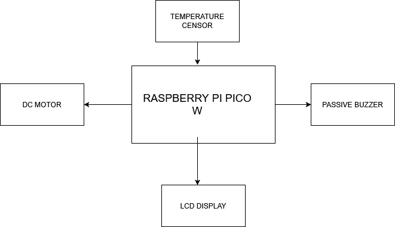

# SmartAir
An automated temperature-based fan control system.

:::info 

**Author**: Aktas Furkan Said\
**GitHub Project Link**: https://github.com/UPB-PMRust-Students/project-furkansaktas

:::

## Description

SmartAir is a temperature-activated fan system that automatically turns a fan on when the temperature exceeds a set threshold and off when it drops below. It uses a temperature sensor to monitor the environment and a microcontroller (Raspberry Pi Pico W) running Rust code to control the fan.

## Motivation

The motivation behind this project is to create an energy-efficient solution for regulating room temperature automatically. It showcases embedded systems' practical application in environmental monitoring and automation.

## Architecture 

The Raspberry Pi Pico W acts as the central controller managing all components. The BMP280 sensor provides temperature and pressure data via I2C, which the Pico uses to control a DC motor-powered fan. An LCD also connected through I2C displays live sensor readings and system status.

## Log

### Week 5 - 11 May

### Week 12 - 18 May

### Week 19 - 25 May

## Hardware

The project uses a Raspberry Pi Pico W as the central controller managing all components. A BMP280 sensor monitors temperature and pressure sending data to the Pico via I2C. When the temperature exceeds a defined threshold the Pico activates a DC motor to power a cooling fan and triggers an active buzzer to emit an audible alert. An LCD display shows real-time temperature, pressure, and system status, allowing users to easily monitor environmental conditions.

### Schematics

### Bill of Materials

| Device | Usage | Price |
|--------|--------|-------|
| [Raspberry Pi Pico W](https://www.raspberrypi.com/documentation/microcontrollers/raspberry-pi-pico.html) | The microcontroller | [35 RON](https://www.optimusdigital.ro/en/raspberry-pi-boards/12394-raspberry-pi-pico-w.html) |
| [BMP280](https://www.bosch-sensortec.com/products/environmental-sensors/pressure-sensors/bmp280/) | The temperature censor | [8.76 RON](https://sigmanortec.ro/modul-presiune-temperatura-si-umiditate-bmp280-5v) |
| [LCD display](https://spie.org/samples/TT100.pdf) | The LCD Display | [29.31 RON](https://www.robofun.ro/modul-lcd-5v-20x2-afisaj-albastru-si-fundal-luminat.html?gQT=1) |
| [DC Motor](https://web.uettaxila.edu.pk/CMS/SP2013/ectEMbs/notes/DC%20Motors.pdf) | DC Fan Motor | [8.99 RON](https://www.optimusdigital.ro/en/others/2355-motor-in-miniatura-n20-10170-10000-rpm-la-3-v.html?search_query=dc+motor&results=1034) |
| [Passive Buzzer](https://www.handsontec.com/dataspecs/module/passive%20buzzer.pdf) | Passive Buzzer | [1.40 RON](https://www.optimusdigital.ro/en/buzzers/634-5v-passive-buzzer.html) |

## Software

| Library | Description | Usage |
|---------|-------------|-------|
|[embassy-rp]|(https://docs.embassy.dev/embassy-rp/git/rp235xb/index.html) | Access to the pheripherals | Accessing and interacting with peripherals
|[panic-probe]|(https://docs.rs/panic-probe/latest/panic_probe/) | Panic handler for embedded targets | Logs panic messages via USB to assist in debugging during development
|[ag-lcd]| (https://docs.rs/ag-lcd/latest/ag_lcd/) | Display library for I2C LCDs | Used to control and write output to the I2C-connected LCD display
|[embassy-time]|(https://docs.embassy.dev/embassy-time/git/default/index.html) | Time management for async execution | Enables delays, timeouts, and interval scheduling

## Links

1. [link](https://www.youtube.com/watch?v=8kfROSQYDWI)
