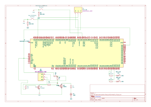

# WaveScope

An embedded device that captures, modulates and filters audio from an electret microphone for signal analysis.

:::info

**Author**: Omer Genan \
**GitHub Project Link**: https://github.com/UPB-PMRust-Students/project-genan2003

:::

## Description

This device is designed for audio signal processing, showcasing two fundamental principles in the field: modulation and filtering. It captures sound from an electret microphone (**MAX4466**) and applies digital signal processing techniques to clean and manipulate the signal. Specifically, it utilizes a biquad filter for frequency-based filtering and a Kalman filter for dynamic noise reduction and signal smoothing. All processing and computations are carried out by the microcontroller unit (**NUCLEO-STM32F767ZI**), which is equipped with a double-precision floating-point unit to efficiently perform mathematical functions using floating-point values. Once processed, the data is transmitted to a computer for visualization, including real-time audio feedback and plotting.

## Motivation

I chose this project because I have always been passionate about control theory and digital signal processing. These fields are fundamental to understanding how we can analyze, modify, and control the signals that surround us in everyday life — from audio and video to data transmission and sensor measurements. I believe it's important for every engineer to understand how signals work and how we can shape them using mathematical tools.

Beyond the technical interest, I see mathematics as a form of art. This project gives me the opportunity to explore that artistic side by offering both visual and audio interpretations of mathematical concepts.

## Architecture


Main components:

- **NUCLEO-STM32F767ZI** will handle all computations and signal processing, then send the processed data via USB to the laptop. This allows the user to both listen to the processed signal (a recording) and view plots to observe the differences before and after processing.
- **MAX4466** will capture sound from the user and send the signal through a GPIO pin with ADC capability. Since it's an analog sensor, the analog signal must be converted into a digital format for processing.

User interface:

- **Button** will be used to manually start the recording, preventing memory overflow that could occur if the board continuously recorded audio.

Feedback:

- **LEDs** will indicate whether the device is currently recording.

## Log

<!-- write your progress here every week -->

### Week 21 April - 28 April

I began by studying how the MAX4466 behaves and tried to find a suitable gain setting for it by connecting it to the board and printing the output values to the terminal.

### Week 28 April - 4 May

I implemented USB data transmission to a Python script that listens to the port where the board is connected. I then tried to analyze how the raw audio from the microphone sounds and also plotted the data received from the microcontroller.

### Week 5 - 11 May

I implemented a Kalman filter and started analyzing the processed data. From what I observe, further processing is necessary. While the Kalman filter performs well, I also want to remove the DC offset in the signal. So, I changed my strategy and added a slow low-pass filter to eliminate the DC offset. This combination currently works well alongside the Kalman filter. However, I still need to work on improving the processing and filtering even further.

### Week 12 - 18 May

After several attempts using only a slow low-pass filter and a tuned Kalman filter, I think it's time to switch to a biquad filter. So, I implemented a biquad filter (a low-pass and a high-pass filter cascaded). I also started using the Kalman filter for smoothing, and the results are better than before. The next step is to analyze the audio signal under varying noise conditions.

### Week 19 - 25 May

## Hardware


- **NUCLEO-STM32F767ZI** will serve as the main computational and signal processing unit, and will also function as a transmitter to the computer.
- **MAX4466** will act as the sensor from which audio signals will be received.
- **Red Button** will be used to trigger the raw recording.
- **Blue Button** will be used to trigger the processed recording.
- **Blue LED** will provide visual feedback for the timer during the processed recording
- **Red LED** will provide visual feedback for the timer during the raw recording

### Schematics



### Bill of Materials

<!-- Fill out this table with all the hardware components that you might need.

The format is
```
| [Device](link://to/device) | This is used ... | [price](link://to/store) |

```

-->

| Device                                                                                                                                                                                     | Usage                       | Price                                                                                                                                                                             |
| ------------------------------------------------------------------------------------------------------------------------------------------------------------------------------------------ | --------------------------- | --------------------------------------------------------------------------------------------------------------------------------------------------------------------------------- |
| [NUCLEO-STM32F767ZI](https://www.st.com/en/microcontrollers-microprocessors/stm32f7-series/documentation.html)                                                                             | The microcontroller         | [113.26 RON](https://ro.mouser.com/ProductDetail/STMicroelectronics/NUCLEO-F767ZI?qs=7UaJ5Mrpeu0%2F%252BMRranB3%2Fw%3D%3D)                                                        |
| [MAX4466](https://cdn-shop.adafruit.com/datasheets/MAX4465-MAX4469.pdf)                                                                                                                    | Microphone                  | [8.54 RON](https://sigmanortec.ro/modul-microfon-max4466-cu-amplificare-castig-reglabil-23-5vdc)                                                                                  |
| [Buttons](https://www.optimusdigital.ro/ro/butoane-i-comutatoare/1114-buton-cu-capac-rotund-rou.html)                                                                                      | Controlling the recording   | [1.99 RON](https://www.optimusdigital.ro/ro/butoane-i-comutatoare/1114-buton-cu-capac-rotund-rou.html)                                                                            |
| [LEDs and resistors](https://www.optimusdigital.ro/ro/kituri-optimus-digital/9517-set-de-led-uri-asortate-de-5-mm-si-3-mm-310-buc-cu-rezistoare-bonus.html?search_query=leduri&results=59) | Indicator for the recording | [26.99 RON](https://www.optimusdigital.ro/ro/kituri-optimus-digital/9517-set-de-led-uri-asortate-de-5-mm-si-3-mm-310-buc-cu-rezistoare-bonus.html?search_query=leduri&results=59) |
| [Wires female-male](https://www.optimusdigital.ro/ro/fire-fire-mufate/878-set-fire-mama-tata-40p-30-cm.html?search_query=fire&results=429)                                                 | Connecting the components   | [9.99 RON](https://www.optimusdigital.ro/ro/fire-fire-mufate/878-set-fire-mama-tata-40p-30-cm.html?search_query=fire&results=429)                                                 |

## Software

| Library                                                | Description                   | Usage                                     |
| ------------------------------------------------------ | ----------------------------- | ----------------------------------------- |
| [embassy-stm32](https://github.com/embassy-rs/embassy) | Async Rust embedded framework | Used for interacting with the peripherals |

## Links

<!-- Add a few links that inspired you and that you think you will use for your project -->

1. [NUCLEO-F767ZI pinout](https://os.mbed.com/platforms/ST-Nucleo-F767ZI/)
