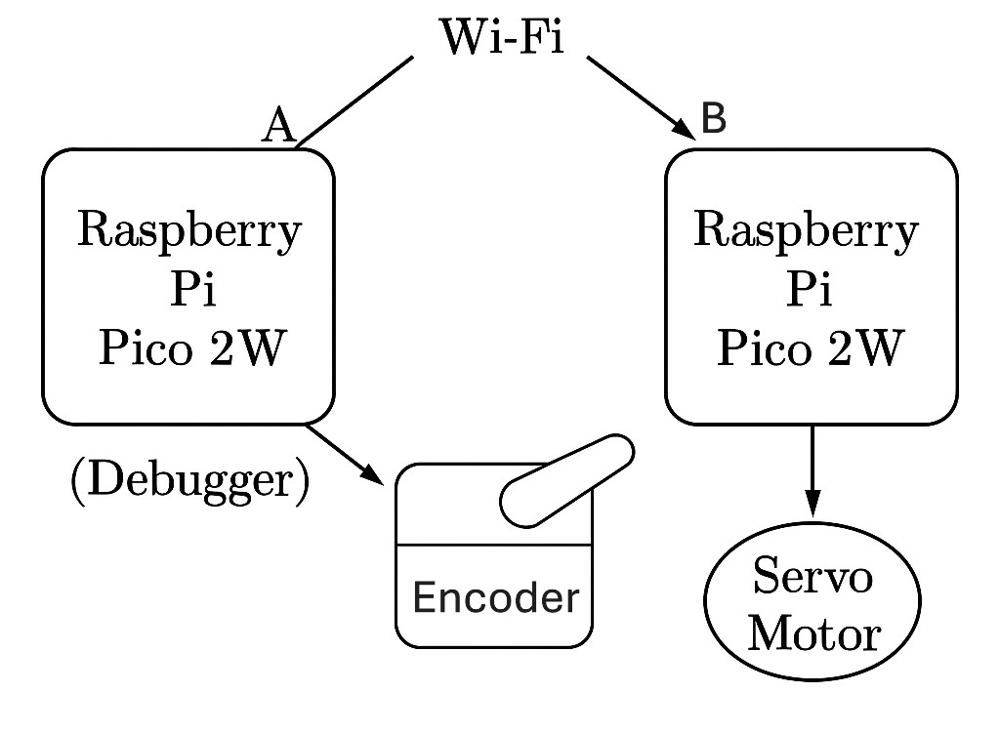
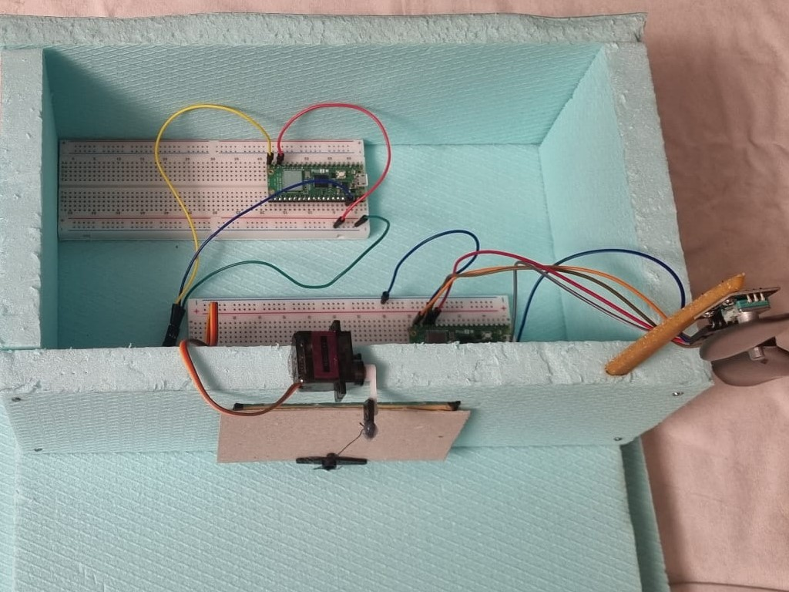
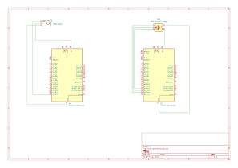

# Fan Rotation Detection with Window Control
If a fan exceeds a certain number of RPMs, the Pico closes the door.

**Author**: Popazu George-Alexandru
**GitHub Project Link**:https://github.com/UPB-PMRust-Students/project-PopazuAlexandru

## Description
This project is built using two Raspberry Pi Pico 2W, one servo-motor and one encoder. The first Pico monitors detects when the fan is rotating.
 When fan rotation is detected, the first Pico tells a window mechanism to close it and transmits a signal to a second Pico(debugger).

## Motivation
The motivation behind this project is to create an affordable and automated solution for protecting homes from incoming rain. By using a simple external fan as a wind-speed sensor and Raspberry Pi Pico microcontrollers, the system detects high wind speeds—often a precursor to rain—and automatically signals to close windows. This adds a layer of convenience and protection for homeowners, especially when they are away or unable to act quickly.
## Architecture 

### Schematic Diagram
This is the diagram that illustrates the components and their connections.

**Raspberry Pi Pico 2W**
- **Role**: The brain of the system. Reads signals from the encoder. Processes sensor data to determine if the fan is moving and controls a window mechanism to close it and transmits a signal to a second Pico which is a debugger.

**Servo motor**
- **Role**:  Is a precision-controlled motor that adjusts its position, speed, or torque based on feedback, commonly used in robotics and automation.

**Encoder**
- **Role**: Detects fan rotation. Outputs a digital signal to the Pico when the rpm's reaches a certain number.

**Breadboard & Jumper Wires**
- **Role**:  System assembly. Provides a platform for prototyping without soldering. Jumper wires connect components to the Pico.

**USB Cable**
- **Role**:   Power and programming. Powers the Pico during development. Used to upload code to the microcontroller.

## Log
### Week 5 - 11 May
Once the project was approved, I collected all the required components and began assembling the hardware. I also started designing a 3D model for the fan, but paused the design temporarily since I had not finalized the component layout for the final setup. After completing the hardware assembly, I moved on to researching the crates I planned to use for software development.

### Week 12 - 18 May

After finalizing the hardware, I proceeded with software implementation, achieving stable control and initial testing.

### Week 19 - 25 May

During this week, I completed the software development and finalized all remaining implementation details. I ensured the integration between the rotary encoder, servo motor, and Wi-Fi communication worked seamlessly. Final testing was performed to validate the system's behavior under expected operating conditions. With everything functioning as intended, I prepared the project for final documentation and presentation.

## Hardware
The hardware setup consists of a two Raspberry Pi Pico microcontroller as the core units, interfacing with multiple peripherals.

An encoder detects the fan's RPM, and if it exceeds a set limit, the connected Pico sends a signal to another Pico.

A servo motor opens a window when the Raspberry Pi Pico receives a signal from another Raspberry Pi Pico.

Power is supplied through the Pico's USB interface or external 3.3V source, with onboard voltage regulation ensuring stable 3.3V operation for all components. The compact design uses a breadboard or soldered perfboard for reliable interconnections between the Pico, sensor, and indicator circuit.

### Schematics
KiCad Scheme

### Bill of Materials
| Component | Purpose | Price |  
|-----------|---------|----------|  
|[2X Raspberry Pi Pico 2W](https://www.raspberrypi.com/documentation/microcontrollers/pico-series.html) | Microcontroller | [34.50 RON](https://www.optimusdigital.ro/ro/placi-raspberry-pi/12394-raspberry-pi-pico-w.html?search_query=raspberry+pico+pi&results=26) | 
|[2X Breadboard 175 x 67 x 9 mm](https://www.optimusdigital.ro/ro/prototipare-breadboard-uri/13244-breadboard-175-x-67-x-9-mm.html?search_query=bread+board&results=129) | Motherboard | [11,99 RON](https://www.optimusdigital.ro/ro/placi-raspberry-pi/12394-raspberry-pi-pico-w.html?search_query=raspberry+pico+pi&results=26) |   
| [Servo Motor](https://towerpro.com.tw/product/sg90-7/) | Mounts on fan blade | [13.99 RON](https://www.optimusdigital.ro/ro/motoare-servomotoare/26-micro-servomotor-sg90.html?search_query=servo+motor&results=145) |    
| [15 cm 10p Male-Female Wires](https://www.optimusdigital.ro/en/all-products/876-15-cm-male-female-wires-10p.html?search_query=male-male&results=808) | Male-Female Wires | [4.45 RON](https://www.optimusdigital.ro/en/all-products/876-15-cm-male-female-wires-10p.html?search_query=male-male&results=808)|
[10 cm 40p Male-Female Wires](https://www.optimusdigital.ro/en/wires-with-connectors/653-10-cm-40p-male-to-female-wire.html?search_query=male-male&results=808) | Male-Male Wires | [5.99 RON](https://www.optimusdigital.ro/en/wires-with-connectors/653-10-cm-40p-male-to-female-wire.html?search_query=male-male&results=808)|
[RotaryEncoder](https://www.optimusdigital.ro/ro/senzori-senzori-de-atingere/7150-modul-encoder-rotativ.html?search_query=encoder&results=34) | Detects fan rotation | [4,99 RON](https://www.optimusdigital.ro/ro/senzori-senzori-de-atingere/7150-modul-encoder-rotativ.html?search_query=encoder&results=34)|
|[3X Fan](https://www.optimusdigital.ro/ro/mecanica-elice/1300-elice-neagra-1147-cu-gaura-de-6-mm.html?search_query=elice&results=129) | Is rotating  | [8,49 RON](https://www.optimusdigital.ro/ro/mecanica-elice/1300-elice-neagra-1147-cu-gaura-de-6-mm.html?search_query=elice&results=129)|

## Software

| Library | Description | Usage |
|---------|-------------|-------|
[embassy-rp](https://docs.embassy.dev/embassy-rp/git/rp235xb/index.html) | Access to the pheripherals.| Initializing and interacting with peripherals |
[embassy-executor](https://docs.embassy.dev/embassy-executor/git/cortex-m/index.html) |An async/await executor designed for embedded usage | Used for asynchronous programming |
[embassy-time](https://docs.embassy.dev/embassy-time/git/default/index.html) | Timekeeping, delays and timeouts. | Used for delays |
[embassy-sync](https://docs.rs/defmt/latest/defmt/) |Synchronization primitives and data structures with async support | Used for providing channels, mutexes, signals, etc |
[defmt](https://docs.rs/ili9341/0.6.0/ili9341/) | A highly efficient logging framework that targets resource-constrained devices, like microcontrollers | Used for log messages with very small binary size and debugging embedded systems |
[defmt rtt](https://docs.rs/defmt-rtt/latest/defmt_rtt/) | A very highly efficient logging framework because of rtt | Diagnose crashes or panics with clear, compressed messages |
[cyw43](https://docs.embassy.dev/cyw43/git/default/index.html) |  It enables wireless communication, allowing your embedded Rust code to connect to Wi-Fi networks | Adding Wi-Fi capability to your Pico W for remote control, cloud communication, or app integration |
[cyw43-pio](https://docs.embassy.dev/cyw43-pio/git/default/index.html) | It's essential for connecting the Pico W to Wi-Fi in no_std Rust environments | Enabling Wi-Fi on the Pico W using Rust also supports embedded Rust projects that need networking |
[embassy-net](https://docs.embassy.dev/embassy-net/git/default/index.html) | It enables TCP/IP networking on microcontrollers | Creating non-blocking, async network applications on microcontrollers and also pairs with cyw43-pio for Wi-Fi-enabled embedded apps on the Pico W |
[pwm](https://docs.embassy.dev/embassy-rp/git/rp235xb/pwm/index.html) | PWM module | Used for controlling the buzzer

## Links
1. [how to make automatic door by IR sensor, servo motor and Arduino diy best futurestickArduino project](https://youtu.be/Ow3xSBkGPXE?si=DkegBTvWr0hPZknP)

