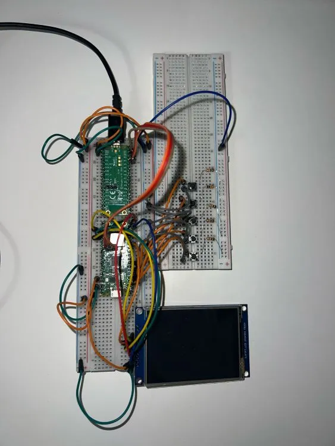
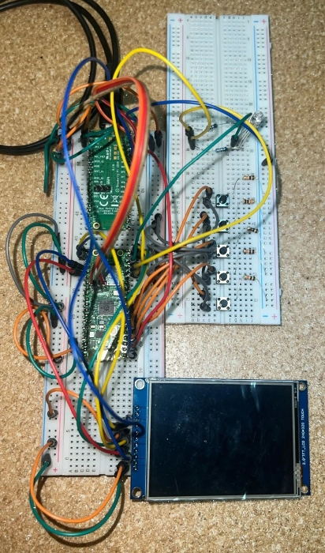

# Sudoku 9x9
A handheld Sudoku game inspired by classic paper puzzles, bringing the joy of logical thinking into a portable digital format.

:::info 
**Author**: Spiridon Georgiana-Alina \
**GitHub Project Link**: https://github.com/UPB-PMRust-Students/project-gspiridon
:::

## Description
This project is built using two Raspberry Pi Pico 2W boards, a color LCD display, and five pushbuttons. Four buttons are used to move a cursor across the 9x9 Sudoku grid, while the fifth lets the player select numbers by pressing it multiple times. The game checks for rule violations and can highlight mistakes using a built in hint feature. One of the Pico boards is dedicated to debugging during development.

## Motivation
I chose this project because Sudoku has always been one of my favorite logic games.I often play it in my free time to relax and challenge my mind. Building a handheld Sudoku console allowed me to combine my interest in embedded systems with something I genuinely enjoy. It's a great way to turn a simple paper and pencil puzzle into an interactive, portable electronic game while deepening my skills in Rust programming and hardware integration.

## Architecture 
This is the diagram that illustrates the components and their connections.

### Components Overview

**Raspberry Pi Pico 2W**
- **Role**: Serves as the central controller of the handheld Sudoku console. It reads input from the buttons, controls the ILI9341 display via SPI, and runs the game logic, including cursor movement and number placement.
- **Connections**: GPIO pins for the 5 control buttons: Up, Down, Left, Right, Select

**Button: Up**
- **Interface**: GPIO
- **Role**: Moves the selection cursor up in the Sudoku grid.
- **Connections**: Connected to a GPIO pin configured as input with a 10kΩ pull-down resistor.
 
**Button: Down**
- **Interface**: GPIO
- **Role**: Moves the selection cursor down in the Sudoku grid.
- **Connections**: Connected to a GPIO pin configured as input with pull-down.

**Button: Left**
- **Interface**: GPIO
- **Role**: Moves the selection cursor left in the Sudoku grid.
- **Connections**: Connected to a GPIO pin configured as input with pull-down.

**Button: Right**
- **Interface**: GPIO
- **Role**: Moves the selection cursor right in the Sudoku grid.
- **Connections**: Connected to a GPIO pin configured as input with pull-down.

**Button: Select**
- **Interface**: GPIO
- **Role**:  Changes the number in the selected cell (cycles from 1 to 9).
- **Connections**: Connected to a GPIO pin configured as input with pull-down.

**ILI9341 LCD (2.8" SPI Display)**
- **Interface**: SPI
- **Role**:  Renders the 9x9 Sudoku grid, cursor, user-entered numbers, and optional error highlights.

 

### Week 5 - 11 May
I focused on gathering the necessary hardware components for the project. I purchased a 2.8" SPI LCD module with touchscreen, two Raspberry Pi Pico 2W boards (one for running the game and one for debugging), a breadboard, tactile pushbuttons, jumper wires, and 10kΩ resistors. I started assembling the hardware by connecting the LCD to the Pico using the SPI interface and wiring the five control buttons to separate GPIO pins, each with a pull-down resistor.

### Week 12 - 18 May
I decided to add an RGB led that turns green when the answer is correct and red when it is not. I completed the hardware part and started implementing the Sudoku game. 

### Week 19 - 25 May

## Hardware
The hardware for the project is built around the Raspberry Pi Pico 2W microcontroller, which serves as the central control unit. A LCD display module with an ILI9341 controller is used to render the 9x9 Sudoku grid and user interface. The display is connected to the Pico via the SPI interface. Five tactile pushbuttons are connected to GPIO pins and used for user input,specifically to move the selection cursor and change numbers in the grid. Each button is wired with a 10kΩ pull-down resistor to ensure stable digital input readings. The components are assembled on a breadboard using jumper wires for quick prototyping and easy modifications.

### Schematics

### Bill of Materials
| Device                                                  | Usage                        | Price                           |
|---------------------------------------------------------|------------------------------|---------------------------------|
| [2 x Raspberry Pi Pico 2W](https://www.optimusdigital.ro/ro/placi-raspberry-pi/13327-raspberry-pi-pico-2-w.html?search_query=5056561803975&results=1) | The microcontroller + debugging| [79.32 RON]|
2 x Breadboard HQ | Used to assemble and connect components without soldering  | [19.96 RON] |
[2.8" SPI LCD Module with ILI9341 Controller (240 x 320 px)](https://www.optimusdigital.ro/ro/optoelectronice-lcd-uri/3544-modul-lcd-spi-de-28-cu-touchscreen-controller-ili9341-i-xpt2046-240x320-px.html?search_query=0104110000028952&results=1) | LCD Display | [69.99 RON] |
[5 x Resistor 0.25W 10KΩ](https://www.optimusdigital.ro/ro/componente-electronice-rezistoare/1088-rezistor-025w-100k.html?search_query=0104210000010039&results=1) | Pull-down resistors to stabilize button input signals | [0.50 RON] |
[5 x Tactile Buttons](https://www.optimusdigital.ro/ro/butoane-i-comutatoare/1119-buton-6x6x6.html?search_query=0104210000010862&results=1) | Move cursor and select/change numbers | [1.80 RON] |
[Jumper Wires](https://www.optimusdigital.ro/ro/fire-fire-mufate/12-set-de-cabluri-pentru-breadboard.html?search_query=0104210000001532&results=1) | Connect components to the Raspberry Pi Pico on the breadboard | [7.99 RON] |

## Software
| Library | Description | Usage |
|---------|-------------|-------|
[embassy-rp] | Access to the peripherals | Initializing and interacting with peripherals
[embedded-graphics] | 2D graphics library for memory-constrained embedded devices | Used for drawing and writing on the display
[gpio] | GPIO management | Used for reading button inputs and controlling output pins
[panic-probe] | Panic handler for embedded debugging | Sends panic messages over RTT
[embassy-executor] | An async/await executor designed for embedded usage | Used for asynchronous programming

## Links
