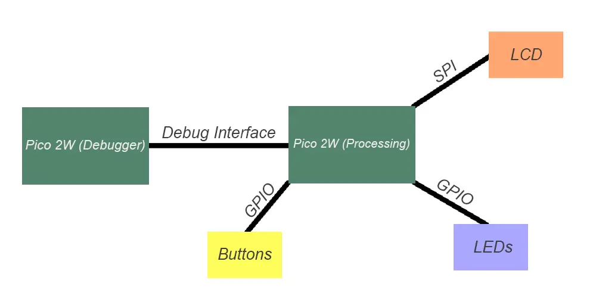
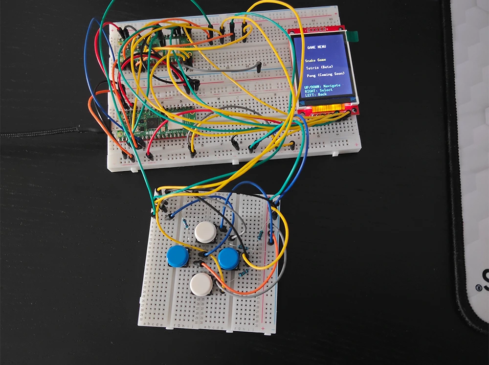
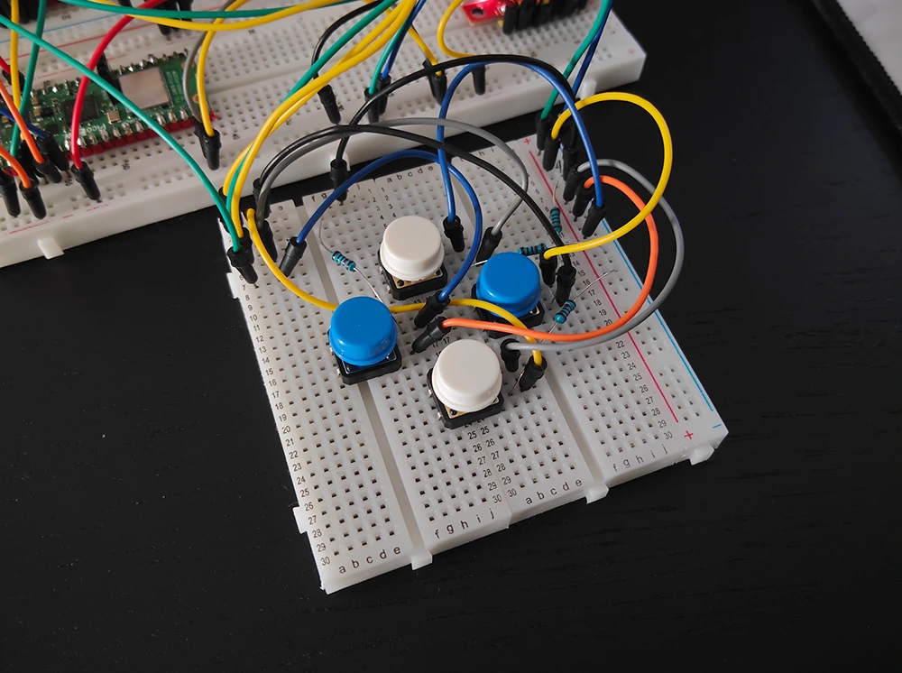
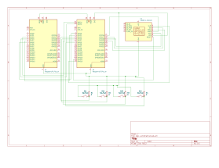

# Portable Retro Gaming Console

:::info 

**Author**: Illia Kucherenko

**GitHub Project Link**: [link to github](https://github.com/UPB-PMRust-Students/project-illia-kucherenko)

:::

## Description

It's a portable gaming console that will run some retro games that used to be popular back in the day. It is built using 2 RP pico 2w, an LCD Display, 4 buttons for controls and LEDs for visual feedback.

## Motivation

I've always been passionate about games and it remains a big part of my life even today. I decided to make something fun that would bring that childish joy we all crave for. I plan on implementing games like Pac-Man and Snake for now, if I succeed, I will try implementing more games.

## Architecture 

Architectural Diagram:

**Raspberry RP Pico 2W (Debugger)**
-Used to flash firmware to processing RP Pico 2W and debug in case of issues.
-Connects to the PC via micro-usb cable and to processing PR Pico 2W via debug interface  

**Raspberry RP Pico 2W (Processing)**
-Runs flashed firmware and acts as a main processing unit for the whole model. Reads data from buttons, controls LCDs, sends and updates image on an LCD, runs firmware with games and games themselves.

**LEDs**
-Used to add visual feedback to whats going on on the screen
-Connected via gpio pins to processing RP Pico 2W

**Buttons**
-Used for controls in menus and games
-Connected via gpio pins to processing RP Pico 2W

**LCD**
-Used to display the image (menus, games etc.)
-Connected via spi interface to processing RP Pico 2W

## Log
### Week 5 - 11 May
I've acquired all the necessary hardware, which is likely still subject to be rethought and changed. I've set up a configuration with two Pico 2Ws, one of them being a debugger for another one. Currently I'm in the process of getting LCD to work and looking for suitable libraries and crates for the project.

### Week 12 - 18 May
I managed to implement a basic version of Snake Game. Although initially it was choppy due to optimisation flaws in screen updates, I managed to fix it and the game now runs at buttery smooth 60 fps. The console is fully functional, but barebones and a little wonky to use for now. For now my plan is to add new gameplay features to the game which are not currently present, and add LEDs for visual feedback. Since I haven't done that yet my KiCad schematic doesn't include RGB LEDs, in the next weekly log I'll make sure to include that as well, as the project will reach a more finished and polished state.

### Week 19 - 25 May

## Hardware
Consists of RP Pico 2W (2x), LCD TFT 2.2" module, buttons and resistors and 2 breadboards to hold everything together. At the moment buttons and resistors are not installed due to design concerns.

### Schematics
Here's a KiCad schematic for the current version of the console:

### Bill of Materials

| Device | Usage | Price |
|--------|--------|-------|
| [Raspberry Pi Pico 2W (2x)](https://www.raspberrypi.com/documentation/microcontrollers/pico-series.html) | Microcontroller | [39.66 RON](https://www.optimusdigital.ro/en/raspberry-pi-boards/13327-raspberry-pi-pico-2-w.html?srsltid=AfmBOoo5CQdoi14-RbmA_YJJrNUG1hPBzlSKgPdCOYv9U2PgJdK3bPwM)|
| LCD SPI 2,2 '' 240x320 PX (1x) | LCD Screen | [59.99 RON](https://www.optimusdigital.ro/ro/optoelectronice-lcd-uri/1260-lcd-spi-22-240x320-px.html)|
| Wire Kit(2x) | Wires | [7.99 RON](https://www.optimusdigital.ro/ro/fire-fire-mufate/12-set-de-cabluri-pentru-breadboard.html)|
| Resistor Kit (1x) | Resistors | [14.99 RON](https://www.optimusdigital.ro/ro/componente-electronice-rezistoare/10928-plusivo-kit-250-buc-rezistoare.html) |
| Breadboard (2x) | Breadboards | [19.96](https://www.optimusdigital.ro/ro/prototipare-breadboard-uri/8-breadboard-830-points.html) |
| White Capped Buttons (4x) | Buttons | [1.99 RON](https://www.optimusdigital.ro/ro/butoane-i-comutatoare/1115-buton-cu-capac-rotund-alb.html) |
| Common Cathode RGB (3x) | RGB LEDs | [0.99 RON](https://www.optimusdigital.ro/ro/optoelectronice-led-uri/483-led-rgb-catod-comun.html?search_query=rgb&results=121) |

## Software

| Library | Description | Usage |
|---------|-------------|-------|
[embassy-rp](https://docs.embassy.dev/embassy-rp/git/rp235xb/index.html) | Grants access to low-level peripherals on RP microcontrollers | Initializing and interacting with peripherals
[embassy-executor](https://docs.embassy.dev/embassy-executor/git/cortex-m/index.html) | Async runtime tailored for embedded environments | Used for async programming |
[embassy-time](https://docs.embassy.dev/embassy-time/git/default/index.html) | Time abstraction library for delays and timers | Used for delays |
[embassy-sync](https://docs.embassy.dev/embassy-sync/git/default/index.html) | Async-safe primitives for shared state management | Used for inter-task communication via channels, mutexes, etc. in async code |
[ili9341](https://docs.rs/ili9341/0.6.0/ili9341/) | Driver for TFT module based on ILI9341 chip | Used for rendering graphics on compatible TFT LCD displays |
[embedded-graphics](https://docs.rs/embedded-graphics/0.8.1/embedded_graphics/) | 2D graphics library that is focused on memory constrained embedded devices | Used for displaying graphics on the display |
[embedded-hal-async](https://docs.rs/embedded-hal-async/latest/embedded_hal_async/) | An asynchronous Hardware Abstraction Layer (HAL) for embedded systems | Provides a standard way to use hardware asynchronously across different embedded devices |
[gpio](https://docs.embassy.dev/embassy-rp/git/rp235xb/gpio/index.html) | GPIO management | Used for controlling GPIO pins

## Links

1. [link](https://www.youtube.com/watch?v=SB3qwe6CTjM)