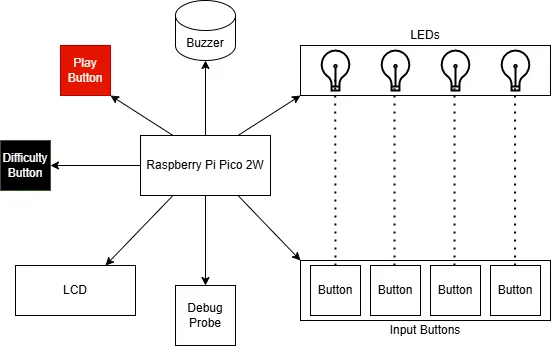
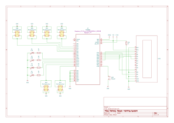
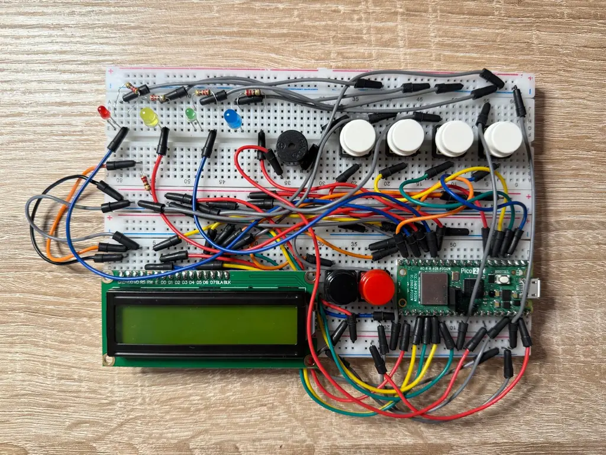
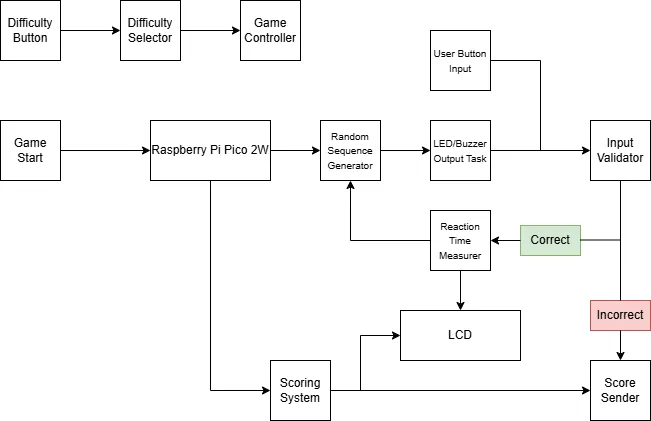

# Memory Recall Training System
An Embedded Game for Cognitive and Reaction Speed Enhancement

:::info 

*Author*: Ioana-Alexia DEACONU \
*GitHub Project Link*: https://github.com/UPB-PMRust-Students/project-alexiadeaconu

:::

## Description

Memory Recall Training System is a microcontroller-based interactive game that challenges players to enhance their short-term memory and reaction speed. It works by generating and displaying sequences of LED activations which the player must reproduce correctly using buttons. The system dynamically adjusts its behavior based on selected difficulty levels and provides real-time audio-visual feedback via a buzzer and LCD. At the end of each game, the system displays the final score, calculated based on accuracy and reaction time, and sends the result to an online leaderboard via Wi-Fi.

## Motivation

This project was chosen due to its potential to combine several embedded systems topics: hardware control (LEDs, buttons, PWM for sound), real-time input processing, user interface via an LCD, and network communication. Moreover, the cognitive aspect of the game provides a meaningful and engaging application of embedded technology in educational or therapeutic contexts.

## Architecture

- **Raspberry Pi Pico 2W**: Connects directly to all other components in the system.
- **Debug Probe**: Used during development and testing for programming.
- **Play Button**: Read as a digital input, trigerring the countdown on the LCD.
- **Difficulty Button**: Cycles through difficulty levels, updating the LCD accordingly.
- **LCD**: Updated by the Pico based on game state and input events.
- **Passive Buzzer**: Driven via PWM from the Pico. Different assigned tone for each LED.
- **LEDs**: Each LED corresponds to an Input Button.
- **Input Buttons**: Each Input Button corresponds to a LED. Read via digital input.

## Log

<!-- write your progress here every week -->

### Week 5 - 11 May

#### Hardware Integration
- Assembled the full hardware setup using jumper wires and two breadboards.
- Connected the components: 4 LEDs, 6 push buttons, LCD1602 display (in 4-bit mode), Raspberry Pi Pico 2W microcontroller and Debug Probe.
- Verified the functionality of each hardware component through basic individual tests (LED blinking, button press detection, display initialization).

#### Software Development
- Wrote the main application that defines the game logic and rules.
- Initialized peripherals (LEDs, buttons, LCD) using `embassy_sync::Mutex` for safe concurrent access in async tasks.
- Implemented the following:
  - Random LED sequence generation using the `oorandom` crate.
  - Input handling to compare player responses with the generated sequence.
  - Visual feedback.
  - Reaction time measurement using `embassy_time::Instant` and display on the LCD at the end of each correct input.
  - Score display on the LCD at the end of each game.

### Week 12 - 18 May

#### Hardware Integration
- Integrated the passive buzzer into the hardware setup.
- Successfully verified its functionality through basic sound tests, including varying tones and frequencies.

#### Software Development
- Implemented the following:
  - Audio feedback for each LED activation and for each button press during user input.
  - Difficulty selection via button presses before game start and display on the LCD.
  - Game initiation after difficulty selection via "Play" button.
  - Game-over function that plays a short melody and animates LEDs in a playful pattern.
  - Game restart without USB reset.

### Week 19 - 25 May

#### Project Case Design
- Designed and built a physical case for the project to house all hardware components neatly and securely.

#### Software Development
- Implemented the following:
  - Connection to Wi-Fi for network communication.
  - Score and selected difficulty transmission to the server at the end of each game session.
  - New scoring formula that factors in reaction time and input accuracy to generate a final performance score.
- Cleaned up and restructured the code to make it easier to read and understand.

#### Server Logic (`server.py`)
- Initialized a Flask web server to serve both the HTML frontend and an API endpoint (`/data`) for live updates.
- Implemented a background UDP listener thread that:
  - Listens for score data over port 5000.
  - Decodes incoming messages and timestamps them.
  - Appends each score to an in-memory list.
- Dynamically serves real-time JSON data to the frontend (`/data`) for:
  - The 20 most recent scores.
  - A leaderboard (top 10 scores).
- Added real-time notifications on the webpage:
  - Displays a pop-up when a new score is received.
  - Triggers a celebration pop-up (with confetti effect) when a new top score is achieved.
- Integrated a score trend chart that shows performance over time and a pie chart that shows the distribution of plays across difficulties.
- Enhanced UI with:
  - Card-style layout.
  - Color-coded difficulties.
  - Medals for the top 3 scores.
  - Total number of games played.
  - Difficulty filter.

## Hardware

The project uses the **Raspberry Pi Pico 2W** as the main microcontroller, powered via USB and programmed using a **Raspberry Pi Debug Probe** over the SWD interface. Key hardware components include:

- **LEDs** (Red, Yellow, Green, Blue): Connected to GPIO pins via *220Ω resistors* to limit current.

- **Push Buttons**: 6 buttons connected to GPIO pins. 

- **Passive Buzzer**: Connected to a PWM-capable GPIO pin for audio tone output.

- **LCD1602**: Wired in 4-bit parallel mode, using six GPIOs for control and data.

- **Breadboards (830 points)**: Used to prototype the circuit layout.

- **Male-to-Male Jumper Wires**: For connecting components to the breadboard and microcontroller.

- **Power Distribution**: VSYS and GND from the Pico are shared across the breadboard rails.

All components are integrated onto the breadboard to form a compact and testable embedded system.

### Schematics

### Bill of Materials

<!-- Fill out this table with all the hardware components that you might need.

The format is 

| [Device](link://to/device) | This is used ... | [price](link://to/store) |

-->

| Device | Usage | Price |
|--------|--------|-------|
| [Raspberry Pi Pico 2W](https://www.raspberrypi.com/documentation/microcontrollers/raspberry-pi-pico.html) | The microcontroller | [39.66 RON](https://www.optimusdigital.ro/en/raspberry-pi-boards/13327-raspberry-pi-pico-2-w.html) |
| [Debug Probe](https://www.raspberrypi.com/documentation/microcontrollers/debug-probe.html) | Programming & debugging | [69.06 RON](https://ro.farnell.com/raspberry-pi/sc0889/debug-connector-3-pin-raspberry/dp/4163983) |
| [LCD Module 1602 Backlight Yellow Green 5V](https://www.waveshare.com/datasheet/LCD_en_PDF/LCD1602.pdf) | Display | [9.82 RON](https://www.optimusdigital.ro/en/lcds/867-modul-lcd-1602-cu-backlight-galben-verde-de-5v.html) |
| [LEDs](https://www.farnell.com/datasheets/1498852.pdf) | Visual indicators | [4 x 0.39 RON](https://www.optimusdigital.ro/en/leds/696-led-rou-de-3-mm-cu-lentile-difuze.html) |
| Resistors 0.25W 220Ω | LED current limiting | [5 x 0.10 RON](https://www.optimusdigital.ro/en/resistors/1097-025w-220-resistor.html) |
| Push Buttons | User input | [6 x 1.99 RON](https://www.optimusdigital.ro/en/buttons-and-switches/1115-white-button-with-round-cover.html) |
| Passive Buzzer | Audio feedback | [0.99 RON](https://www.optimusdigital.ro/en/buzzers/12247-3-v-or-33v-passive-buzzer.html) |
| Breadboard HQ (830 points)| Prototyping connections | [2 x 9.98 RON](https://www.optimusdigital.ro/en/breadboards/8-breadboard-hq-830-points.html) |
| Male-to-Male Jumper Wires | For wiring components | [7.99 RON](https://www.optimusdigital.ro/en/wires-with-connectors/12-breadboard-jumper-wire-set.html) |

## Software

#### 1. Difficulty Button
- *Function*: User input to select game difficulty.
- *Behavior*: Cycles through Easy, Medium, Hard.

#### 2. Difficulty Selector
- *Function*: Reads the state of the Difficulty Button.
- *Behavior*: Maintains the currently selected difficulty level.
- *Interaction*: Determines the Game Controller to adjust sequence logic.

#### 3. Game Controller
- *Function*: Central unit managing the game logic.
- *Responsibilities*:
  - Starts game when initiated.
  - Coordinates sequence generation, input validation, and score calculation.

#### 4. Random Sequence Generator
- *Function*: Generates a random sequence of LED combinations.
- *Tool*: Uses `oorandom::Rand32`.
- *Output*: Passes the generated sequence to the Output Task.

#### 5. Output Task (LEDs + Buzzer)
- *Function*: Provides visual and audio feedback.
- *Behavior*:
  - Activates LEDs in a predefined sequence.
  - Plays distinct tones for each LED using the buzzer.

#### 6. User Button Input
- *Function*: Allows user to replicate the LED sequence.
- *Behavior*: Captures physical button presses and passes them to the Input Validator.

#### 7. Input Validator
- *Function*: Compares the player's input to the original generated sequence.
- *Logic*:
  - Correct input: trigger Reaction Time Measurer to save reaction time and continue game.
  - Incorrect input: end game and trigger Scoring System to save score.

#### 8. Reaction Time Measurer
- *Function*: Measures the player's response time.
- *Tool*: Uses `embassy-time` timers.
- *Output*: Reaction time data used in scoring.

#### 9. Scoring System
- *Function*: Calculates the player's final score.
- *Criteria*:
  - Input accuracy
  - Reaction time

#### 10. LCD
- *Function*: Displays game state and results.
- *Tool*: Uses `hd44780-driver`.
- *Content*:
  - Current difficulty
  - Countdown to game start
  - Reaction times
  - Final score

#### 11. Score & Difficulty Sender
- *Function*: Sends final score to leaderboard.
- *Tools*: Uses `embassy-net`.

| Library | Description | Usage |
|---------|-------------|-------|
| [embassy-rs](https://github.com/embassy-rs/embassy) | Asynchronous embedded framework | Core async runtime and I/O handling |
| [embassy-executor](https://github.com/embassy-rs/embassy/tree/main/embassy-executor) | Task scheduling and execution framework for embedded systems | Used for managing asynchronous tasks with Spawner |
| [embassy-rp](https://github.com/embassy-rs/embassy/tree/main/embassy-rp) | Raspberry Pi Pico 2W hardware abstraction | Used for controlling GPIO pins, PWM, and peripherals |
| [embassy-net](https://github.com/embassy-rs/embassy/tree/main/embassy-net) | Network stack | Used for HTTP POST score submission |
| [embassy-sync](https://github.com/embassy-rs/embassy/tree/main/embassy-sync) | Synchronization primitives for async code | Provides Mutex for protecting shared resources in async tasks |
| [embassy-time](https://github.com/embassy-rs/embassy/tree/main/embassy-time) | Time handling for asynchronous applications | Used for managing timers and delays (Duration, Timer, Instant) |
| [hd44780-driver](https://crates.io/crates/hd44780-driver) | LCD driver | Control of the LCD |
| [heapless](https://crates.io/crates/heapless) | Fixed-size strings | Efficient string manipulation without heap |
| [oorandom](https://crates.io/crates/oorandom) | Random number generation library | LED sequence generation |
| [cyw43](https://crates.io/crates/cyw43) | Driver for the CYW43 Wi-Fi chip | Enables Wi-Fi hardware communication |
| [cyw43-pio](https://crates.io/crates/cyw43-pio) | PIO-based implementation of the CYW43 driver | Enables communication with CYW43 chip via PIO on RP2040 |
| [static_cell](https://crates.io/crates/static_cell) | Safe static memory initialization | Used for safely initializing global statics like peripherals and executors |
| [defmt](https://github.com/knurling-rs/defmt) | Efficient embedded logging framework | Debug output and panic diagnostics |
| [panic-probe](https://crates.io/crates/panic-probe) | Minimal panic handler for embedded systems | Handles panic situations and logs output via defmt |

## Links

<!-- Add a few links that inspired you and that you think you will use for your project -->

1. [Project Inspiration](https://www.youtube.com/watch?v=FZLmSVf_AiY)
2. [Playing Songs on a Passive Buzzer](https://esp32.implrust.com/buzzer/play-songs/index.html)
3. [Case Design](https://www.youtube.com/watch?v=XN7a0z1gjsI)
