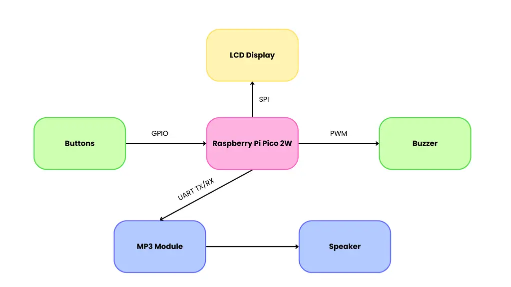
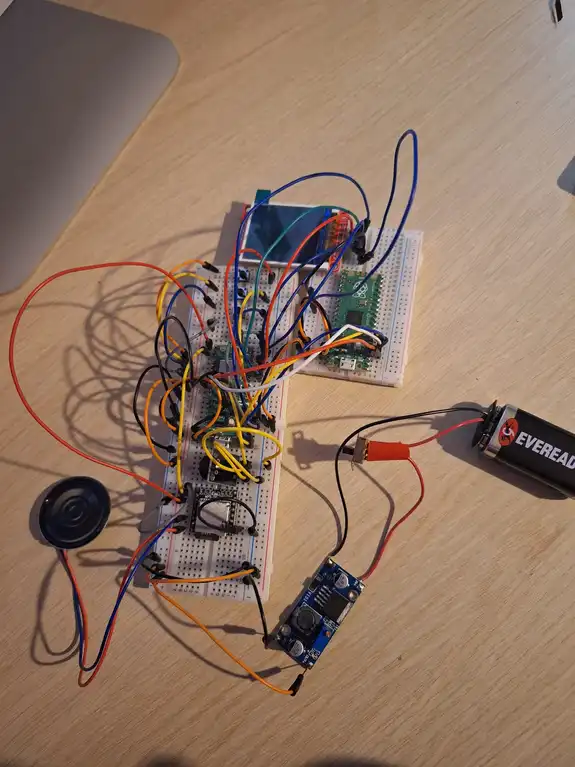
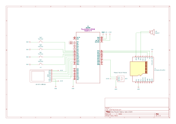

# Rusty Rhythm
Rusty Rythm is a simple rhythm game where you press buttons to the beat of a track of your choosing from the game's catalogue.

:::info 

**Author**: NEDELCU Ioana \
**GitHub Project Link**: https://github.com/UPB-PMRust-Students/project-ioqnq

:::

## Description

When booting up the game, you will be prompted to pick one of the available songs and the difficulty which you wish to play on. You can then input a 3 character username. The gameplay itself consists of pressing the buttons to the rhythm of the song you selected with the aid of the visual interface. Hitting the correct button(s) at the right time adds to your score.

## Motivation

While being more familiar with mobile, touch-screen based rhythm games, I've always been fascinated by the larger-scale arcade machines, which offer more of a physical, tactile response. I hope to put the technical knowledge I have gained throughout the semester to use by bringing to life a pocket-sized version of the arcade experience.

## Architecture



## Log

### Week 6 - 12 May
Finished ordering any remaining parts that I might have needed. My components ended up requiring more current than I was expecting so I couldn't power everything using the pico as I had planned (went for a battery + step down module set up instead). Brought KiCad scheme in its final form.

### Week 7 - 19 May
Battery proved too troublesome so in the end I'm using a 3.3V and 5V power source. All components now work together. Coded in game menus (song select, difficulty select, gameplay). Will need to add a results screen. Have a few ideas for beatmap implementation.

### Week 20 - 26 May
Final gameplay elements implemented (falling notes, scoring). Made some small KiCad scheme changes to reflect the power source setup. In the end I chose to design the beatmap manually. To do this, I played the song and started a timer. First I measured the amount of time a note takes to reach the bottom of the screen. Then I played the song and pressed buttons to the beat, each button displaying its timing and column number. This is how I got the timestamps that will later have to be compared to the player's inputs.

## Hardware

1. **Raspberry Pi Pico W Microcontroller**: Coordinates all of the components.
2. **Buttons**: Game input.
3. **Buzzer**: Audio feedback for game inputs.
4. **MP3 Player Module**: Reads song from a microSD card.
5. **Speaker**: Ouputs song.
6. **Display**: Visual output device, displays the game elements (falling notes, score, menus). 
7. **Breadboard**: Used for building the circuit.
8. **Wires**: Used for connecting the components.



### Schematics

<!--  -->



### Final Look
<!--  -->


### Bill of Materials

<!-- Fill out this table with all the hardware components that you might need.

The format is 
```
| [Device](link://to/device) | This is used ... | [price](link://to/store) |

```

-->

| Device | Usage | Price |
|--------|--------|-------|
| [Rapspberry Pi Pico 2W](https://www.raspberrypi.com/documentation/microcontrollers/pico-series.html#pico-2-family) | The microcontroller | [39,66 RON](https://www.optimusdigital.ro/ro/placi-raspberry-pi/13327-raspberry-pi-pico-2-w.html?search_query=raspberry+pi+pico&results=26) |
| [Male-Female Wires](https://www.optimusdigital.ro/ro/toate-produsele/876-set-fire-mama-tata-10p-15-cm.html?search_query=mama+15cm&results=3) | Electronic Components | [4,45 RON](https://www.optimusdigital.ro/ro/toate-produsele/876-set-fire-mama-tata-10p-15-cm.html?search_query=mama+15cm&results=3) |
| [Jumper Wires Set](https://www.optimusdigital.ro/ro/fire-fire-mufate/12-set-de-cabluri-pentru-breadboard.html?search_query=set+fire&results=110) | Electronic Components | [7,99 RON](https://www.optimusdigital.ro/ro/fire-fire-mufate/12-set-de-cabluri-pentru-breadboard.html?search_query=set+fire&results=110) |
| [Breadboard 400](https://www.mouser.com/datasheet/2/58/BPS-DAT-(BB400)-Datasheet-932623.pdf?srsltid=AfmBOor87ADUyjMbDJu3F6IKgb9pBw2YChJln_o68OGvC4oivuXkb2aS) | Electronic Components | [4,56 RON](https://www.optimusdigital.ro/ro/prototipare-breadboard-uri/44-breadboard-400-points.html?search_query=breadboard+hq&results=128) |
| [Breadboard 830](http://www.busboard.com/documents/datasheets/BPS-DAT-(BB830)-Datasheet.pdf) | Electronic Components | [4,99 RON](https://www.optimusdigital.ro/ro/prototipare-breadboard-uri/44-breadboard-400-points.html?search_query=breadboard+hq&results=128) |
| [DC-DC Step Down LM2596S](https://www.ti.com/lit/ds/symlink/lm2596.pdf)| Electronic Components | [12,99 RON](https://www.optimusdigital.ro/ro/surse-coboratoare-reglabile/1108-modul-dc-dc-step-down-lm2596hv.html?search_query=step+down&results=69) |
| [Push Buttons](https://components101.com/switches/push-button) | Game inputs | [1,44 RON](https://www.optimusdigital.ro/ro/butoane-i-comutatoare/1119-buton-6x6x6.html?search_query=buton+6&results=213) |
| [MP3 Player Mini](https://wiki.dfrobot.com/DFPlayer_Mini_SKU_DFR0299)| Reads song | [13,99 RON](https://www.optimusdigital.ro/ro/audio/1484-modul-mp3-player-in-miniatura-dfplayer-mini.html?search_query=mp3&results=45) |
| [LCD SPI Module Screen](https://ardushop.ro/en/displays-and-leds/1349-modul-lcd-spi-128x160-6427854019561.html) | Display | [43,58 RON](https://ardushop.ro/en/displays-and-leds/1349-modul-lcd-spi-128x160-6427854019561.html) |
| [Speaker](https://www.farnell.com/datasheets/3004596.pdf) | Outputs song | [4,98 RON](https://ardushop.ro/en/modules/1898-difuzor-2w-8ohm-6427854028723.html) |
| [Passive Buzzer Module](https://www.handsontec.com/dataspecs/module/passive%20buzzer.pdf)| Game feedback | [1,69 RON](https://www.optimusdigital.ro/ro/componente-electronice/12598-modul-buzzer-pasiv.html?search_query=modul+buzzer&results=30) |
| [Rapspberry Pi Pico](https://www.raspberrypi.com/documentation/microcontrollers/pico-series.html#pico-1-family) | Debugger | [31,50 RON](https://ardushop.ro/en/raspberry-pi/513-raspberry-pi-pico-6427854006004.html) |


## Software

| Library | Description | Usage |
|---------|-------------|-------|
| [embassy-embedded-hal](https://github.com/embassy-rs/embassy/tree/main/embassy-embedded-hal) | Embedded I/O | Screen SPI |
| [embedded-graphics](https://github.com/embedded-graphics/embedded-graphics) | 2D graphics library | Drawing to the display |
| [st7735-lcd](https://github.com/sajattack/st7735-lcd-rs) | Display driver | Controls the display |
| [embedded-time](https://crates.io/crates/embedded-time) | Durations, clocks, rates | Beatmap timings, general delays |
| [heapless](https://docs.rs/heapless/latest/heapless/) | Static data structures | Beatmap storing |
| [mipidsi](https://docs.rs/heapless/latest/heapless/) | SPI Driver | Screen Controller |


## Links

<!-- Add a few links that inspired you and that you think you will use for your project --> 

1. [Additional project inspiration](https://www.youtube.com/watch?v=SYxIqJ6wqH0)
2. [Raspbery Pi Pico 2W with DFPlayerMini MP3 Player](https://www.youtube.com/watch?v=Tuc359wUx_E)
3. [DFPlayer Raspberry Pi Pico Audio Player Project](https://www.youtube.com/watch?v=IDCNz7A6sWA)
4. [DFPlayer Mini Set Up Tutorial](https://www.youtube.com/watch?v=7WiSeQxb1bU)
5. [LM2596 DC-DC Buck Converter Adjustable Tutorial](https://www.youtube.com/watch?v=Lk51i-F1CD4)
