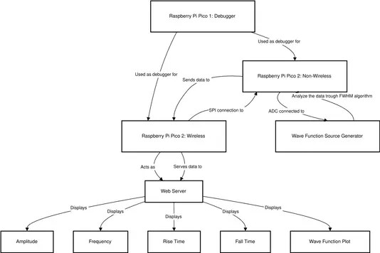
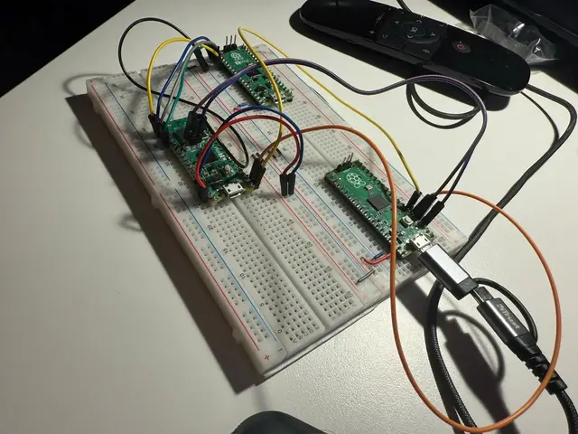
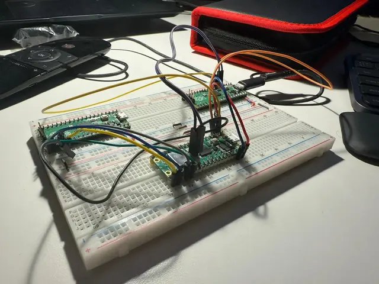

# iScope

**Author**: Ionescu Ionut. \
**GitHub Project Link**: [https://github.com/UPB-PMRust-Students/project-ionutz04.git](https://github.com/UPB-PMRust-Students/project-ionutz04.git)

This project presents a miniaturized, dual-microcontroller oscilloscope system designed to address the limitations of traditional oscilloscope equipment through an accessible web interface.

## Project Overview

The iScope represents a significant departure from conventional oscilloscope technology, offering a compact and efficient alternative to traditional bulky instruments. By leveraging modern microcontroller capabilities, this project transforms signal analysis into a more accessible and user-friendly experience through a locally-hosted web interface.

## Motivation and Significance

Traditional oscilloscopes present several practical challenges for engineers, including their substantial size, complexity of operation, and limited portability. Based on professional engineering experience, these instruments often prove cumbersome in field applications and laboratory settings with space constraints. The iScope project addresses these limitations by:

1. Miniaturizing the form factor while maintaining essential functionality
2. Simplifying the user interface through web-based visualization
3. Enhancing portability without sacrificing measurement capabilities
4. Providing a more intuitive approach to waveform analysis

This innovation represents a paradigm shift in oscilloscope design philosophy, prioritizing accessibility and efficiency.

## System Architecture

The iScope employs a distributed architecture consisting of three primary components:

## Log

<!-- write your progress here every week -->
The logging of the projects starts way before the start of making an ideea on what the PM project  should look like, by means, from the start of the semester i have found it interesting to make an oscilloscope with an raspberry pi pico.
### Phase 1: Research and Concept Development (March 1 - April 4)

Initial research focused on fundamental oscilloscope principles, including:

- ADC sampling methodologies
- Full Width at Half Maximum (FWHM) algorithm implementation
- Signal processing requirements for accurate waveform representation
- Data extraction and transmission protocols


### Phase 2: Communication Protocol Exploration (April 4-18)

Investigation of data transmission methods revealed UART limitations for high-speed sampling applications. This led to exploration of alternative approaches:

1. **Raspberry Pi 3 B+ Integration**: Initially considered as a Grafana host, but abandoned due to:
    - Project constraints requiring exclusive use of microcontrollers
    - Complexity of GPIO programming for SPI implementation

### Phase 3: Alternative Communication Methods (April 18-21)

2. **W5100 Ethernet Module Implementation**: Evaluated for high-bandwidth data transfer (100Mbps) but rejected due to:
    - Similar constraints as the Raspberry Pi 3 approach
    - Requirement for custom driver development with excessive complexity

### Phase 4: Final Architecture Selection (April 21 - May 25)

3. **Raspberry Pi Pico 2W Solution**: Selected as optimal approach, enabling:
    - Direct web hosting capabilities
    - Simplified user interface implementation
    - Elimination of external computing requirements

### Phase 5: Implementation and Testing (May 25 - May 2)

- Acquisition of Raspberry Pi Pico 2W hardware
- Web interface development and integration
- System validation and performance testing


## Hardware Components



The iScope implementation utilizes a multi-microcontroller approach:

1. **Raspberry Pi Pico (Debug Unit)**: Provides debugging capabilities and system monitoring
2. **Raspberry Pi Pico (Primary Target)**: Performs analog signal acquisition and preliminary processing through:
    - ADC signal sampling
    - Implementation of FWHM algorithm on dedicated core
    - Data preparation for transmission
3. **Raspberry Pi Pico 2W (Secondary Target)**: Handles data reception and visualization through:
    - Data reception from primary target
    - Web server hosting
    - User interface presentation

### Schematics


### Bill of Materials

<!-- Fill out this table with all the hardware components that you might need.

The format is 
```
| [Device](link://to/device) | This is used ... | [price](link://to/store) |

```

-->

| Device | Usage | Price |
|--------|--------|-------|
| [Raspberry Pi Pico 1](https://www.raspberrypi.com/documentation/microcontrollers/raspberry-pi-pico.html) | The microcontroller | [35 RON](https://www.optimusdigital.ro/en/raspberry-pi-boards/12024-raspberry-pi-pico-728886755172.html?search_query=raspberry+pi+pico+&results=36) |
| [Raspberry Pi Pico 2](https://www.raspberrypi.com/documentation/microcontrollers/pico-series.html#pico-2-family) | The microcontroller | [35 RON](https://www.optimusdigital.ro/en/raspberry-pi-boards/13266-raspberry-pi-pico-2.html?search_query=raspberry+pi+pico+&results=36) |
| [Raspberry Pi Pico 2W](https://www.raspberrypi.com/documentation/microcontrollers/pico-series.html#pico-2-family) | The microcontroller | [35 RON](https://www.optimusdigital.ro/en/raspberry-pi-boards/13327-raspberry-pi-pico-2-w.html?search_query=raspberry+pi+pico+2&results=36) |


## Software

| Library | Description | Usage |
| :-- | :-- | :-- |
| [embassy-time](https://github.com/embassy-rs/embassy) | Timekeeping, delays and timeouts for embedded async applications | Used for syncronisation and chrono stuff |
| [embassy-usb](https://github.com/embassy-rs/embassy) | Async USB device stack for embedded devices with support for various USB classes |  Used for uploading the rust core code on MCUs |
| [embassy-net](https://github.com/embassy-rs/embassy) | Async network stack for embedded systems with TCP, UDP, DHCP, and DNS support | For configuring the website service on Pico 2w MCU ||
| [cyw43](https://github.com/embassy-rs/embassy) | Driver for Cypress CYW43xx WiFi chips used in Raspberry Pi Pico W | Wifi chipset firmware for configuration of websocket |
|[picoserve](https://github.com/sammhicks/picoserve)| An async no_std HTTP server suitable for bare-metal environments, heavily inspired by axum | Used in creation of the http part of the website |
## Links

<!-- Add a few links that inspired you and that you think you will use for your project -->

1. [Raspberry Pi Pico 200Khz Digital Oscilloscope](https://www.instructables.com/Raspberry-Pi-Pico-200Khz-Digital-Oscilloscope/)
2. [Raspberry pi forum about creation of an Oscilloscope with an MCU](https://forums.raspberrypi.com/viewtopic.php?t=365757)
