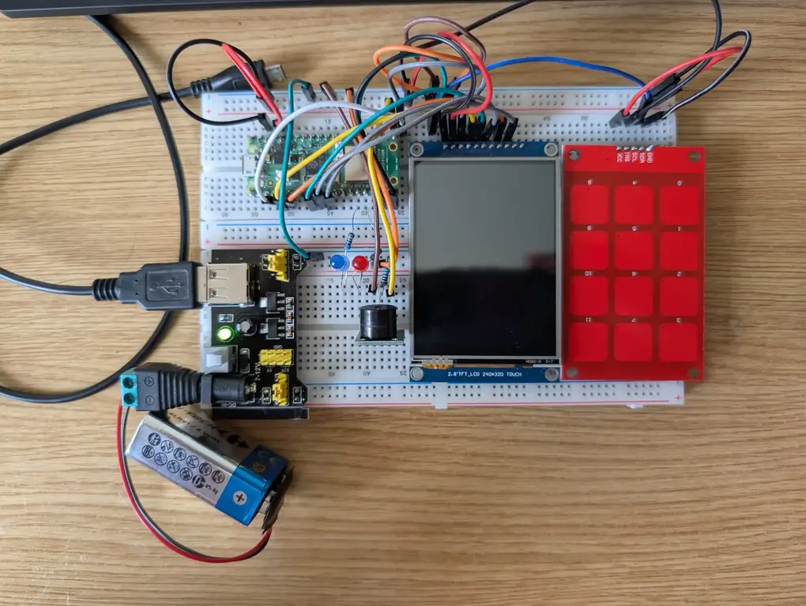
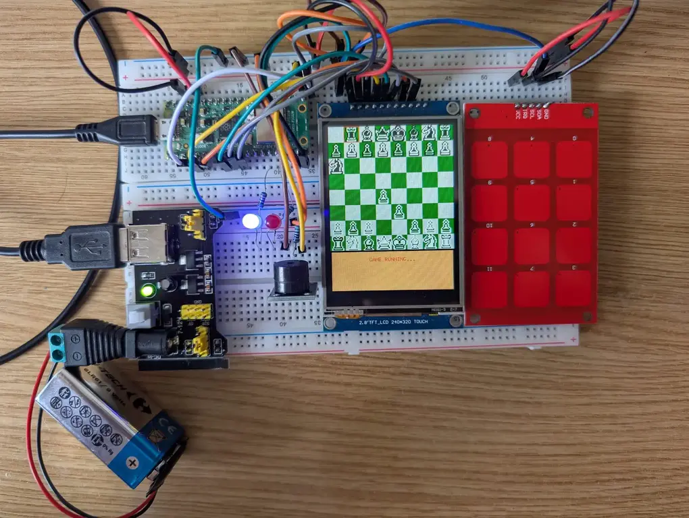
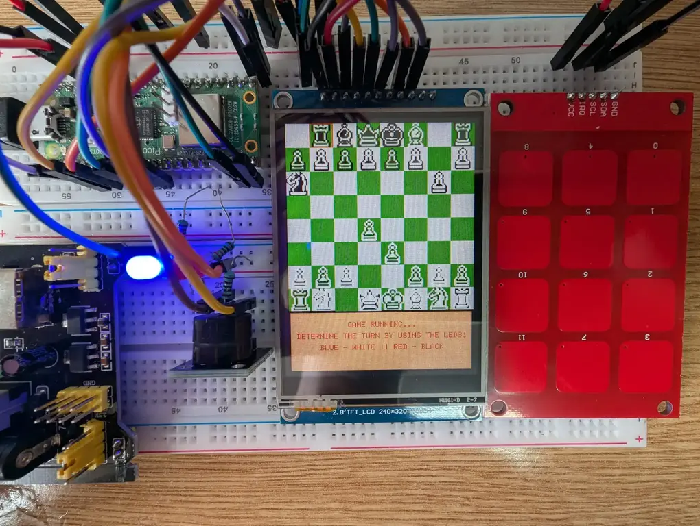

# Embedded Chess
Chess engine and game running on a fully embedded system.

:::info 

**Author**: Oprea Ionuț-Georgian \
**GitHub Project Link**: https://github.com/UPB-PMRust-Students/project-mas-vi

:::

## Description

A chess engine and game running on the Pico that users can play on a LCD display using a keyboard:

- The game uses the display to allow the users to select the game mode: Player vs Player or Player vs AI.
- The chess engine provided the validation and move generation AIs. 
- A buzzer is used to serve different information about the cursor movement and piece and menu selections.
- Two leds to show which of the players is to move.

## Motivation

I choose this project as I am passionate about chess and wanted to see the extent to which a chess engine could run on a mirco controller.
I knew this involved a lot of optimization and wanted to take the challange.
## Architecture 

Architecture:


Game Loop:


## Log

<!-- write every week your progress here -->

### Week 6 - 12 May

- Received all the components for the project that were ordered in advance.
- Put all the hardware components together.
- Tested the chess engine and game loop developed before all the components had arrived.
- The game is in a functional state, need to implement algorithms for optimal piece selection.
- Updated log and documentation.


### Week 7 - 19 May
- Continued work on the optimal piece selection.
- Updated log and documentation.
- Updated KiCad scheme.
- Finished Hardware.

### Week 20 - 26 May

## Hardware

### Pictures
<table>
<tr>
<td>



</td>
<td>


</td>
</tr>
<tr>
<td>



</td>
<td>



</td>
</tr>
</table>

### Components Usage
For the project, the following were used:

- A **Raspberry Pi Pico 2W** for controlling the Display(Drawing to it), the MPR Keyboard Module(Getting input), the Active Buzzer Module and running the game loop and Chess Engine.
- The **ILI9341 LCD 240x320 Display** was used to provide the user with the game GUI.
- The **MPR121 Keyboard Module** provided the used input for piece movement and game mode selection.
- The **Active Buzzer Module** was intented to offer an acustic signal to confirm keyboard press.
- The **two leds** indicate the turn of the players(either white or black).


### Schematics


### Bill of Materials

<!-- Fill out this table with all the hardware components that you might need.

The format is 
```
| [Device](link://to/device) | This is used ... | [price](link://to/store) |

```

-->

| Device | Usage | Price |
|--------|--------|-------|
| [Raspberry Pi Pico 2W](https://datasheets.raspberrypi.com/picow/pico-2-w-datasheet.pdf) | The microcontroller | [40 RON](https://www.optimusdigital.ro/ro/placi-raspberry-pi/13327-raspberry-pi-pico-2-w.html) |
|SPI LCD Module|The Display|[70 RON](https://www.optimusdigital.ro/en/lcds/3544-modul-lcd-spi-de-28-cu-touchscreen-controller-ili9341-i-xpt2046-240x320-px.html)|
|MPR121 Module with Keypad|Capacitive Touch Sensor |[30 RON](https://www.optimusdigital.ro/en/touch-sensors/5693-mpr121-capacitive-touch-sensor-module-with-keypad.html)|
|Active Buzzer Module|Used to signal touch |[5 RON](https://www.optimusdigital.ro/en/buzzers/12513-pcb-mounted-active-buzzer-module.html)|
## Software

| Library | Description | Usage |
|---------|-------------|-------|
|[ili9341](https://github.com/yuri91/ili9341-rs)|A platform agnostic driver to interface with the ILI9341|Used for controlling the display|
| [embedded-graphics](https://github.com/embedded-graphics/embedded-graphics) | 2D graphics library | Used for drawing to the display |
|[embedded-alloc](https://github.com/rust-embedded/embedded-alloc)|Embedded Allocator|Used for memory allocation|
|[mpr121-hal](https://gitlab.com/tendsinmende/mpr121-hal)|MPR121 Driver|Used for getting input from Keyboard|
|[embedded-canvas ](https://github.com/LechevSpace/embedded-canvas)|2D Canvas Library|Used for more complex drawing|
## Links

<!-- Add a few links that inspired you and that you think you will use for your project -->

1. [Creating a Chess Engine in Python](https://youtube.com/playlist?list=PLBwF487qi8MGU81nDGaeNE1EnNEPYWKY_&si=s_FbRTKng44ahwd3)
