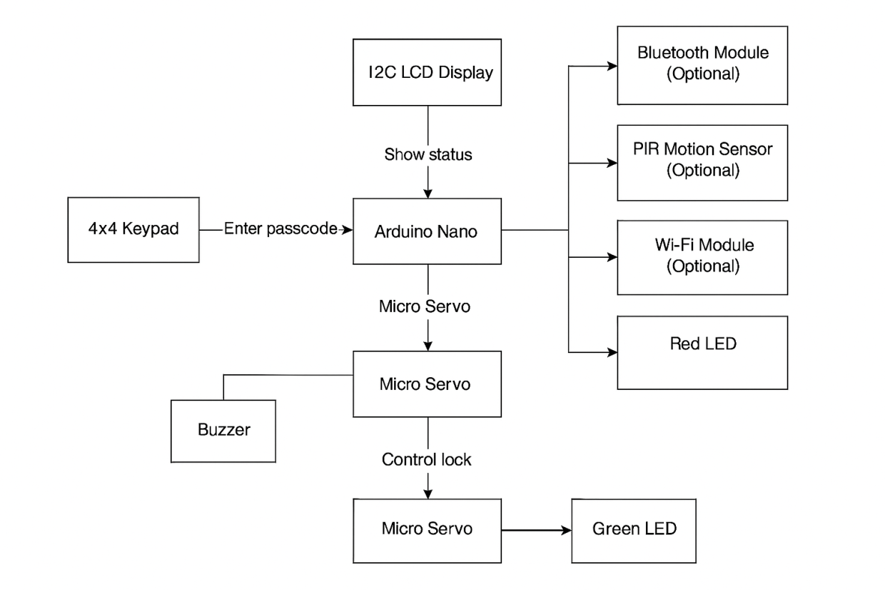

# Smart Lock System
Used to securely control access using a keypad and Arduino

:::info
Author: *Khalifa Mohammad* \
GitHub Project Link: *https://github.com/UPB-PMRust-Students/project-khalifamohammad*
:::

## Description
The Smart Lock System is a secure access control solution using a 4x4 keypad for PIN input and an Arduino Nano as the core controller. Upon entering a valid code, the system activates a servo motor to unlock and signals success with a green LED. Incorrect inputs trigger a buzzer and a red LED to indicate denial of access. An LCD provides real-time feedback, and the system is modular for upgrades such as RFID, Bluetooth, motion sensors, and Wi-Fi.

## Motivation 
*Security has always been an area of personal interest, and I wanted to build a practical system to better understand the principles of access control. This project allowed me to explore embedded systems and real-world hardware integration.*

## Architecture

1. **Arduino Nano** – Microcontroller handling logic and I/O.
2. **4x4 Membrane Keypad** – Used to input passcodes.
3. **I2C LCD Display** – Shows system status and prompts.
4. **Micro Servo Motor** – Acts as the locking mechanism.
5. **Buzzer** – Alerts the user on incorrect code entry.
6. **LEDs (Red/Green)** – Indicate locked/unlocked states.
7. **Resistors** – Used for LED protection.
8. *(Optional)* **RFID Reader** – Adds card-based authentication.
9. *(Optional)* **Bluetooth Module** – Enables wireless control.
10. *(Optional)* **PIR Sensor** – Detects motion for added security.
11. *(Optional)* **Wi-Fi Module** – For remote IoT features.

## Log

### Week 1
I started working on the project, bought the necessary components, and began drafting the documentation and schematic.

### Week 2

### Week 3

### Week 4

## Hardware

### Schematics

### Bill of Materials

| Device                                   | Usage                     |
|------------------------------------------|---------------------------|
| Arduino Nano                             | Microcontroller           | 
| 4x4 Membrane Keypad                      | PIN entry                 | 
| I2C LCD Display                          | Status feedback           | 
| Micro Servo (9g)                         | Locking mechanism         | 
| Buzzer                                   | Audible alert             | 
| Red LED                                  | Locked state indicator    | 
| Green LED                                | Unlocked state indicator  | 
| Resistors                                | For LED current limiting  | 
| *(Optional)* RFID Module                 | RFID authentication       | 
| *(Optional)* Bluetooth Module (HC-05/06) | Wireless unlocking        | 
| *(Optional)* PIR Motion Sensor           | Intrusion detection       | 
| *(Optional)* ESP8266/ESP32 Wi-Fi Module  | IoT connectivity          | 

## Software

| Library                | Description                            | Usage                          |
|------------------------|----------------------------------------|--------------------------------|
| Arduino IDE            | Development environment                | Writing and uploading code     |
| Keypad Library         | Keypad input processing                | Detect and process button presses |
| Wire Library           | I2C communication                      | Used by LCD display            |
| LiquidCrystal_I2C      | LCD control                            | Display messages to user       |
| Servo Library          | Servo motor control                    | Lock/unlock control            |
| MFRC522 Library        | RFID control *(optional)*              | Authenticate RFID tags         |
| SoftwareSerial Library | Serial comms for BT module *(optional)*| Connects HC-05/06              |
| Blynk Library          | IoT platform *(optional)*              | Remote control with smartphone |

## Links

*https://github.com/UPB-PMRust-Students/project-khalifamohammad*

