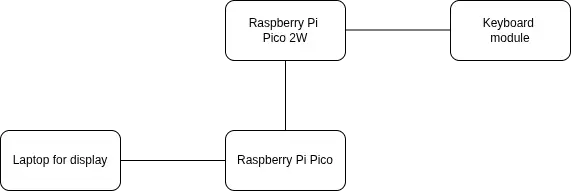
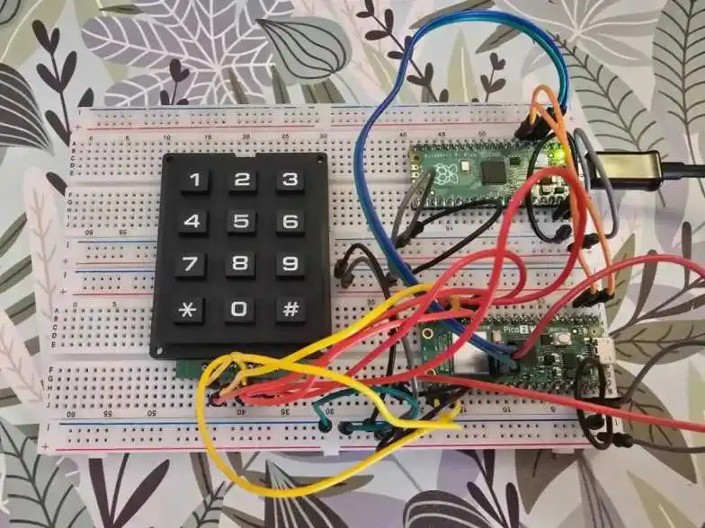
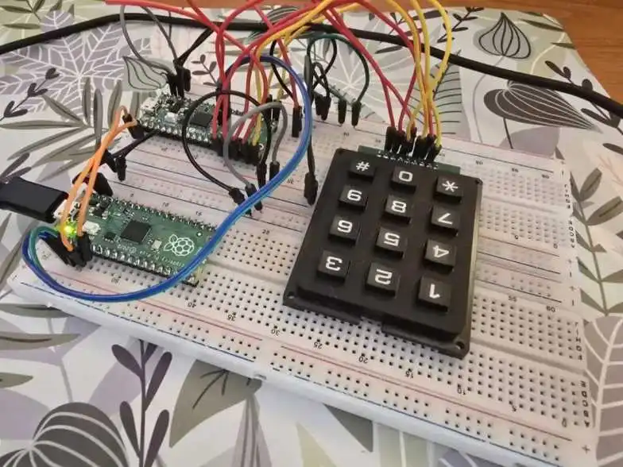
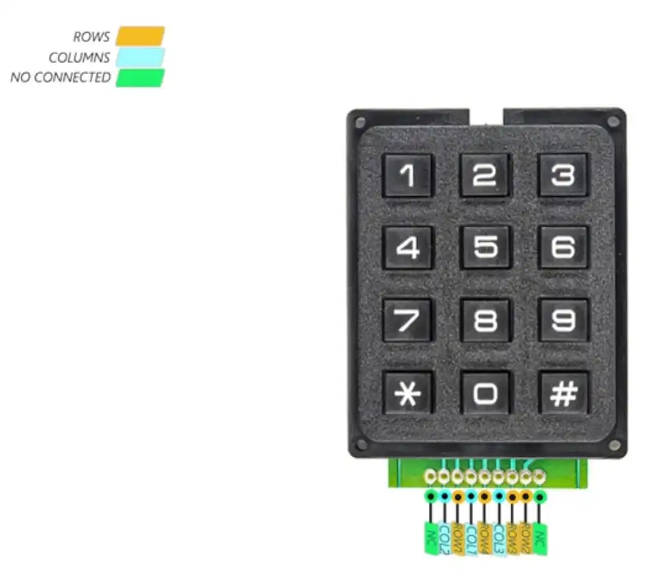

# Sudoku Game
Play sudoku using a Raspberry Pi Pico 2W and a keyboard module

:::info 

**Author**: Laura Florentina Sandu \
**GitHub Project Link**: https://github.com/UPB-PMRust-Students/project-laurasandu13

:::

## Description

My project makes it possible to play Sudoku by inputting the numbers and moving from one cell to another by using a keyboard module. The game is visible on a webpage on the laptop. Games are previously added and players can choose what difficulty to play. Players will be able to start a new game, input numbers, use the undo and redo operations and check if their answers are correct.

Sudoku is a logic-based, combinatorial number placement puzzle. The objective is to fill the 9x9 grid with numbers so that each column, each row, and each 3x3 subgrid contain the numbers from 1 to 9 without repetition.

The game helps with cognitive stimulation by improving memory, concentration and logic, and also provides a calming effect and a sense of accomplishment.

## Motivation

I have been playing Sudoku on and off since I was a little child, and over time, it became one of my favorite comfort games to play. The game is pretty easy and straightforward, and I thought it would be perfect to make it the subject of my project. 

## Architecture 

## Log

### Before week 5 - 11 May

I had bought all necessary components way before and wired the Picos first. I flashed my debugger and then made sure everything worked by running the lab skeleton with the "Hello, world!" program. 

Then I wired my keyboard module to make sure it worked properly, and wrote a program to get input from it in the terminal. After multiple tries and checks of the wiring and the code, I still didn't manage to do it.

### Week 5 - 11 May
 
This week I finally managed to make the keyboard module work by continuously trying to find other solutions and methods to make it work. 

Then I got started on the game logic.

### Week 12 - 18 May

### Week 19 - 25 May

## Hardware
* Raspberry Pi Pico 2W - main microcontroller used for game logic
* Raspberry Pi Pico - debugger    
* Keyboard module - number keyboard used for input and other controls 

The pins of the keyboard module have a very interesting configuration. There are 9 pins, of which the first and last are NC (No Connect) pins. The remaining 7 pins each correspond to a row or a column. The picture below clearly shows the pin configuration.

### Schematics

### Bill of Materials

| Device | Usage | Price |
|--------|--------|-------|
| [Raspberry Pi Pico 2W](https://datasheets.raspberrypi.com/picow/pico-2-w-datasheet.pdf) | The microcontroller | [39.66 RON](https://www.optimusdigital.ro/ro/placi-raspberry-pi/13327-raspberry-pi-pico-2-w.html?search_query=5056561803975&results=1) |
| [Raspberry Pi Pico](https://www.raspberrypi.com/products/raspberry-pi-pico/) | The debugger | [30 RON](https://www.emag.ro/microcontroller-raspberry-pi-rp2040-pico/pd/DKQQWNMBM/?utm_source=mobile%20app&utm_campaign=share%20product&utm_medium=ios) |
| [Keyboard module](https://mm.digikey.com/Volume0/opasdata/d220001/medias/docus/794/3845_Web.pdf) | Input and other functionalities | [18.44 RON](https://www.optimusdigital.ro/ro/altele/5825-modul-tastatura.html?search_query=0104110000044457&results=1) |

Total comes up to 88.1 RON.

## Software

| Library | Description | Usage |
|---------|-------------|-------|
| [embassy-rp](https://docs.embassy.dev/embassy-rp/git/rp235xa/index.html) | HAL crate designed for the RP2040 and RP2350 microcontrollers | gpio and uart for the keyboard module
| [embassy-time](https://docs.rs/embassy-time/latest/embassy_time/) | used for timekeeping, delays and timeouts in embedded systems | syncronization of tasks|
| [embassy-usb](https://docs.embassy.dev/embassy-usb/git/default/index.html) | async USB device stack for embedded devices in Rust | connectivity between pico and laptop |
| [embassy-net](https://docs.embassy.dev/embassy-net/git/default/index.html) | no-std no-alloc async network stack, designed for embedded systems | networking |
| [cyw43](https://docs.rs/cyw43/latest/cyw43/) | Rust driver for the CYW43439 wifi+bluetooth chip | wifi connectivity |

## Links

1. [Datasheet of Raspberry Pi Pico 2W](https://datasheets.raspberrypi.com/picow/pico-2-w-datasheet.pdf)
2. [Datasheet of keyboard module](https://mm.digikey.com/Volume0/opasdata/d220001/medias/docus/794/3845_Web.pdf)
3. [Embassy documentation](https://embassy.dev/book/)
4. [Mathematics of Sudoku](https://en.wikipedia.org/wiki/Sudoku#Mathematics_of_Sudoku)