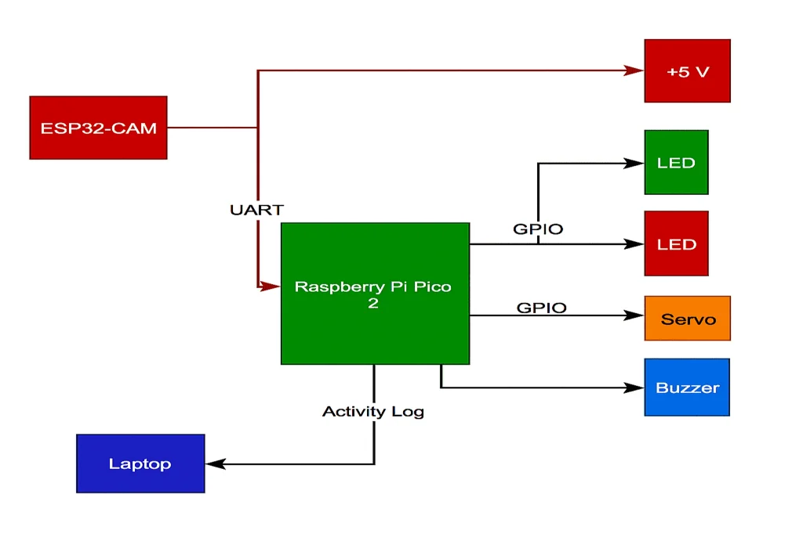
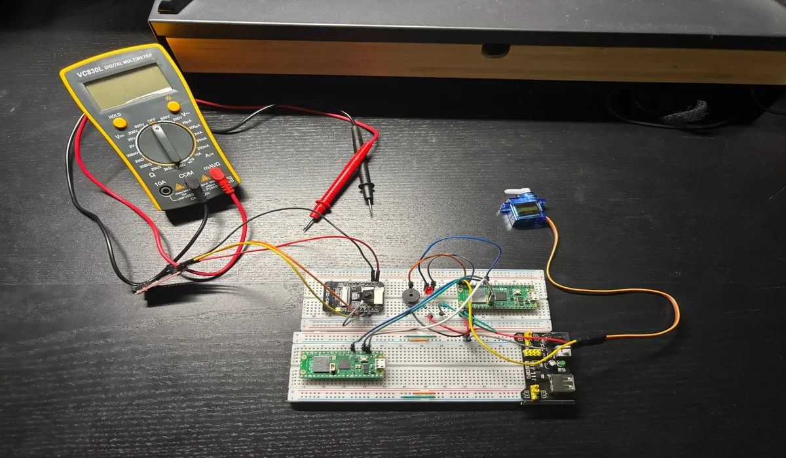
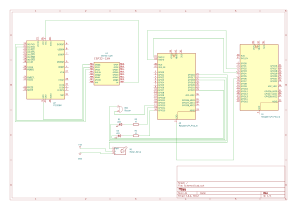

# 🔐 Smart Door Lock with Face Recognition
A secure, AI-powered door lock system using ESP32-CAM and Raspberry Pi Pico 2.

:::info

**Author**: Matei-Alexandru Tiță \
**GitHub Project Link**: https://github.com/UPB-PMRust-Students/project-MateiTita

:::

---

## 🧾 Description

This project implements a smart door lock system that uses **face recognition** for access control.  
The system relies on an **ESP32-CAM** to detect and recognize faces and streams video live over Wi-Fi.  
When a known face is detected, it sends a signal to a **Raspberry Pi Pico 2**, written in **Rust**, which activates a **servo motor** to unlock the door and triggers visual (LED) and audio (buzzer) feedback.

All access events are **logged in real time** to a connected laptop via USB.

---

## 💡 Motivation

The goal of this project is to explore a practical application of embedded systems and machine vision, combining:
- Offline, low-cost **AI** via ESP32
- **Embedded Rust** programming
- Real-time feedback and logging
- A functional and extendable prototype for smart home security

---

## 🧠 Architecture

### System Flow

1. **ESP32-CAM**
   - Captures live video
   - Performs face detection and recognition
   - Streams to browser via local IP
   - Sends `"GRANT"` or `"DENY"` to Pico over UART

2. **Raspberry Pi Pico 2**
   - Waits for serial commands
   - Controls:
     - **Servo** for door lock
     - **LEDs** (Green = granted, Red = denied)
     - **Buzzer** for audio feedback
   - Sends event logs to laptop via USB

3. **Laptop**
   - Runs a Python script to receive and timestamp events

---

## 🗓️ Development Log

### Week 1 – Initial Planning
   I set up and powered the Raspberry Pi Pico 2 and ESP32-CAM, tested the ESP32-CAM by flashing the CameraWebServer example and viewing the live video stream on my laptop, and verified the Pico environment by writing a simple Rust program to blink an LED, confirming basic GPIO control and that both boards were functioning properly.

### Week 2 – Core Setup
   In Week 2, I replaced the initial UART-based communication with a Wi-Fi-based protocol for transmitting access control signals between the ESP32-CAM and the Raspberry Pi Pico 2. I configured the ESP32-CAM to run a lightweight HTTP server that, upon recognizing a known face, sends a GRANT or DENY signal as an HTTP GET request to the Pico's IP address on the local network.

### Week 3 – Hardware Integration

### Week 4 – Logging and Testing

---

## 🔩 Hardware

### Components Used

| Component             | Purpose                                 |
|----------------------|-----------------------------------------|
| ESP32-CAM             | Face recognition and video streaming    |
| Raspberry Pi Pico 2   | Hardware control (Rust)                 |
| Servo Motor (SG90)    | Lock/unlock mechanism                   |
| Red and Green LEDs    | Visual status indication                |
| Buzzer                | Audio feedback                          |
| Breadboard + Wires    | Connections and prototyping             |
| Laptop (USB)          | Real-time log receiver                  |

### Bill of Materials

| Component         | Qty | Price (RON) | Total (RON) |
|------------------|-----|-------------|-------------|
| ESP32-CAM         | 1   | 50          | 50          |
| Raspberry Pi Pico 2 | 1 | 35          | 35          |
| SG90 Servo        | 1   | 20          | 20          |
| LEDs + Buzzer     | 4   | 5           | 5           |
| Breadboard + Wires| 1   | 15          | 15          |
| **Total**         |     |             | **125**     |

---

## 💻 Software

### Tools & Frameworks

#### 📷 ESP32-CAM
- CameraWebServer example
- Face recognition + streaming over Wi-Fi

#### 🦀 Raspberry Pi Pico 2
- Rust with `rp2040-hal`, `embedded-hal`, `usb-device`
- UART parser for GRANT/DENY commands
- PWM control for servo + GPIO for feedback

#### 🐍 Laptop Logger
- Python 3 + `pyserial`
- Receives USB serial data
- Timestamps and saves logs to `door_log.txt`

---

