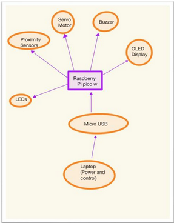

# Project Name
Railway Simulator
:::info 

**Author**: Turcu Mihai Alexandru\
**GitHub Project Link**: https://github.com/UPB-PMRust-Students/project-mihai-alex-71

:::

## Description

This project is a railway crossing simulator developed using the Rust programming language and two Raspberry Pi Pico 2 microcontrollers—one dedicated to system control and the other used as a debugger. The system employs two ultrasonic proximity sensors to detect the approach and passage of a train. When a train is detected, servo motors lower the crossing barriers, and both a light and sound signal are activated to warn nearby pedestrians and vehicles. The motion sensors are also used to estimate the speed of the train, based on the number of cars it consists of. This simulation offers a simple yet effective way to demonstrate how real-world railway safety systems operate.

## Motivation

The goal of this project was to simulate a real-world railway crossing system using low-cost and accessible hardware. By combining Rust's performance and safety features with the versatility of the Raspberry Pi Pico 2, I aimed to deepen my understanding of embedded systems, sensor integration, and real-time control. This project also allowed me to explore practical applications of automation in transportation safety.

## Architecture 



1) Train Detection Module
    Function: Detects whether a train is approaching or has passed using two ultrasonic sensors placed at different points on the track.
    Output: Sends proximity data to the Control Module.

2) Speed Estimation Module
    Function: Calculates the speed of the train and estimates the number of cars based on the time difference between the sensor triggers.
    Input: Data from both ultrasonic sensors.
    Output: Speed and train state (e.g., "approaching", "passed") sent to the Control Module.

3) Control Module
    Function: Core logic running on the main Raspberry Pi Pico 2. It processes sensor data, calculates train speed and state, and controls all other modules.
    Input: Proximity and speed data, joystick input.
    Output:
        Sends display data to the OLED Display Module
        Sends actuation commands to the Barrier & Signal Module
        Communicates system state to the Debug Module

4) Barrier & Signal Module
    Function: Controls the crossing barriers (via servo motors), LED warning lights, and acoustic buzzer.
    Input: Commands from the Control Module or manually from the Joystick.
    
5) OLED Display Module
    Function: Displays current system status:
        Train state (e.g., "no train", "approaching", "passing")
        Estimated speed
        Barrier state
    Input: Data from the Control Module via I2C/SPI.

6) Joystick Input Module
    Function: Allows manual control of the barriers for testing or override.
    Input: Analog signals read by the Control Module.
    
7) Debug Module
    Function: Logs and monitors system states and sensor values.
    Platform: Second Raspberry Pi Pico 2 connected to the main controller.

Connections Overview:
    Ultrasonic Sensors → Control Module: via GPIO (Trigger/Echo)
    Joystick → Control Module: via ADC (analog pins)
    Control Module ↔ OLED Display: via I2C or SPI
    Control Module → Servos/LEDs/Buzzer: via GPIO/PWM
    Control Module ↔ Debug Module: via UART/I2C/SPI
## Log

I have focused on the research phase—reading documentation, watching tutorials to understand component wiring, and setting up the debugger on one Raspberry Pi Pico.

### Week 5 - 11 May

### Week 12 - 18 May

### Week 19 - 25 May

## Hardware

The project uses two Raspberry Pi Pico 2 boards (one as debugger), ultrasonic proximity sensors to detect the train, servo motors to control the barriers, LEDs and a buzzer for signals, an OLED display to show status and speed, and a joystick for manual control.

### Schematics


### Bill of Materials

<!-- Fill out this table with all the hardware components that you might need.

The format is 
```
| [Device](link://to/device) | This is used ... | [price](link://to/store) |

```

-->

 Device | Usage | Price |
|--------|-------|-------|
| [Raspberry Pi Pico W](https://www.raspberrypi.com/documentation/microcontrollers/raspberry-pi-pico.html) | Main microcontroller for processing and control | [35 RON](https://www.optimusdigital.ro/en/raspberry-pi-boards/12394-raspberry-pi-pico-w.html) |
| [Ultrasonic Proximity Sensors (HC-SR04)](https://www.electronicshub.org/hc-sr04-ultrasonic-sensor/) | Detect train approach and passage | ~12 RON each |
| [Servo Motor (SG90)](https://www.optimusdigital.ro/en/motors/898-servomotor-towerpro-sg90-9g.html) | Control railway barriers | [15 RON](https://www.optimusdigital.ro/en/motors/898-servomotor-towerpro-sg90-9g.html) |
| [OLED Display (SSD1306)](https://www.optimusdigital.ro/en/displays/916-display-oled-128x64-pixel-i2c-096-inch.html) | Displays train status and speed | [25 RON](https://www.optimusdigital.ro/en/displays/916-display-oled-128x64-pixel-i2c-096-inch.html) |
| [Joystick Module](https://www.optimusdigital.ro/en/input-devices/2765-joystick-module.html) | Manual control of barriers | [10 RON](https://www.optimusdigital.ro/en/input-devices/2765-joystick-module.html) |
| [Buzzer](https://www.optimusdigital.ro/en/audio-devices/967-active-buzzer-module.html) | Acoustic signal when train approaches | [5 RON](https://www.optimusdigital.ro/en/audio-devices/967-active-buzzer-module.html) |
| LEDs (Red and Green) | Visual indicators for crossing status | ~1 RON each |
| Resistors (220Ω) | For LEDs current limiting | ~0.5 RON each |
| Jumper Wires | Connecting components | ~10 RON (set) |
| USB Cable | Power and programming | - |
| Optional External Power Supply | Extra power for servo motor | Optional |

---

## Software

| Library | Description | Usage |
|---------|-------------|-------|
| [st7789](https://github.com/almindor/st7789) | Display driver for ST7789 | Used for the display for the Pico Explorer Base |
| [embedded-graphics](https://github.com/embedded-graphics/embedded-graphics) | 2D graphics library | Used for drawing to the display |
| [rp-pico](https://docs.rs/rp-pico/latest/rp_pico/) | Board support crate for Raspberry Pi Pico | Main framework for controlling the Pico |
| [rp2040-hal](https://docs.rs/rp2040-hal/latest/rp2040_hal/) | HAL for the RP2040 microcontroller | Controls GPIO, ADC, PWM, I2C, etc. |

## Links

1. [Ultrasonic sensor guide](https://www.tomshardware.com/how-to/ultrasonic-sensor-raspberry-pi-pico)
2. [Servo motor guide](https://dronebotworkshop.com/servo-motors/)
3. [Rust Book](https://docs.rust-embedded.org/book/)
4. [Oled Display guide](https://electrocredible.com/oled-display-raspberry-pi-pico-i2c-micropython/)
5. [Joystick guide](https://maker.pro/raspberry-pi/projects/raspberry-pi-pico-analog-joystick-interfacing)
6. [Tutorial](https://www.hackster.io/news/automatic-railway-crossing-system-f6edcc3560f9)

