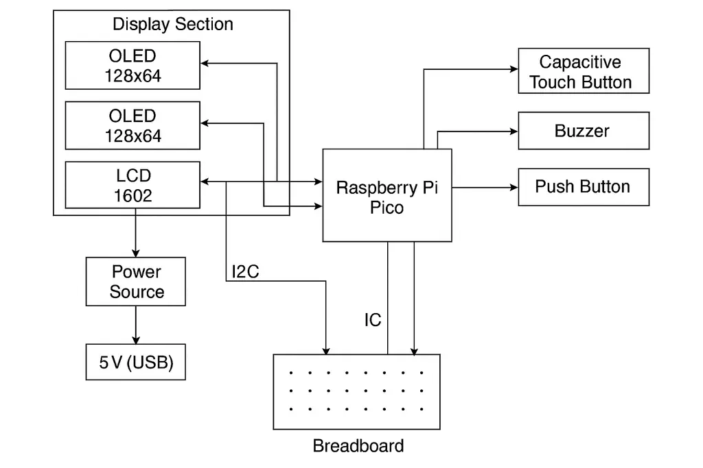

# Slot Machine Project: Gold Inferno Replica
A single Raspberry Pi Pico-based embedded slot machine simulation using Rust and Embassy to control multiple LCD screens.

:::info

**Author**: Vasilescu Mihai Catalin
**GitHub Project Link**: [GitHub](https://github.com/UPB-PMRust-Students/project-catalinvasilescu27)

:::

## Description
This project replicates the Gold Inferno slot machine using three OLED screens controlled by a single Raspberry Pi Pico microcontroller, employing Rust and Embassy for asynchronous real-time gameplay and animations.

## Motivation
I chose this project to gain practical experience with Rust, asynchronous programming using Embassy, and managing multiple displays with limited hardware resources.

## Architecture
The system architecture includes:
- Single Raspberry Pi Pico microcontroller as both the game logic controller and display manager
- Three OLED screens connected via SPI interfaces
- Touch button for user interaction (Spin, Bet)
- Buzzer for audio feedback

Main components:
- Game Logic and Display Controller (Raspberry Pi Pico)
- OLED Display Setup (3 screens)
- User Input Interface (Touch button: Spin, Bet)
- Audio feedback interface (Buzzer)

The Pico uses Embassy for efficient multitasking and synchronization between game logic and display animations.

## Log

### Week 5 - 11 May
- Project planning, architecture, and component selection
- Set up development environment with Rust and Embassy

### Week 12 - 18 May
- Basic SPI communication with OLED screens
- Initial tests with Rust and asynchronous tasks using Embassy

### Week 19 - 25 May
- Implemented core game logic and reel animation synchronization
- Interactive input handling tests with touch button
- Integrated buzzer for audio feedback

## Hardware

### Schematics

### Bill of Materials
| Device | Usage | Price |
|--------|--------|-------|
| [Raspberry Pi Pico](https://ardushop.ro/ro/raspberry-pi/513-raspberry-pi-pico-6427854006004.html) | Microcontroller | [35 RON](https://ardushop.ro/ro/raspberry-pi/513-raspberry-pi-pico-6427854006004.html) |
| [OLED 128x64 0.96" SPI](https://ardushop.ro/ro/display-uri-si-led-uri/1794-display-oled-128x64-096-spi-6427854027184.html) | Displays for slot symbols (3 units) | [39 RON each](https://ardushop.ro/ro/display-uri-si-led-uri/1794-display-oled-128x64-096-spi-6427854027184.html) |
| [Capacitive Touch Button TTP223B](https://ardushop.ro/ro/senzori/640-senzor-capacitiv-ttp223b-6427854007988.html) | User inputs (Spin, Bet) | [5 RON](https://ardushop.ro/ro/senzori/640-senzor-capacitiv-ttp223b-6427854007988.html) |
| [Passive Buzzer](https://ardushop.ro/ro/componente-discrete/1724-1283-buzzer.html#/333-tip-pasiv) | Audio feedback | [3 RON](https://ardushop.ro/ro/componente-discrete/1724-1283-buzzer.html#/333-tip-pasiv) |
| [LCD 1602 Blue](https://ardushop.ro/ro/electronica/2305-1306-lcd-1602-verde-albastru.html#/1-culoare-albastru) | Secondary display | [20 RON](https://ardushop.ro/ro/electronica/2305-1306-lcd-1602-verde-albastru.html#/1-culoare-albastru) |
| [I2C Module for LCD 1602/2004](https://ardushop.ro/ro/comunicatie/2333-modul-i2c-pentru-lcd-1602-2004-6427854007353.html) | I2C interface for LCD | [14.33 RON](https://ardushop.ro/ro/comunicatie/2333-modul-i2c-pentru-lcd-1602-2004-6427854007353.html) |
| Power source (USB or battery) | Powering the setup | 5 RON |
| Breadboard and wires | Component interconnections | Free (previously acquired) |
