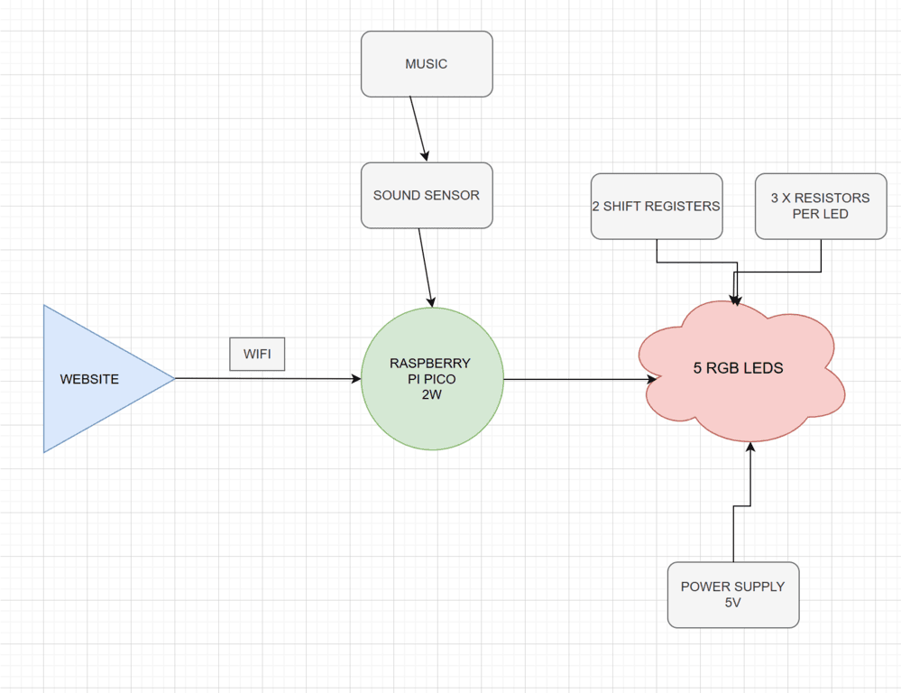
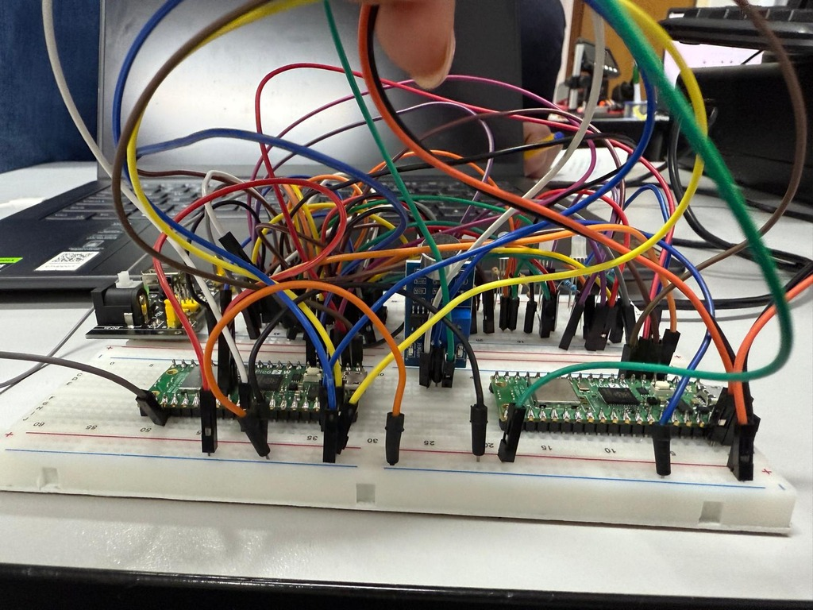
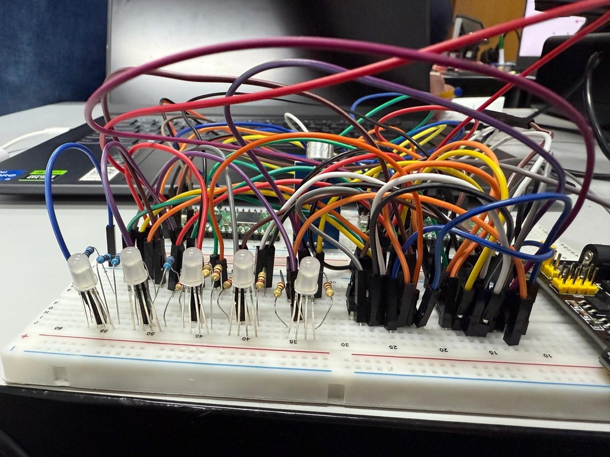
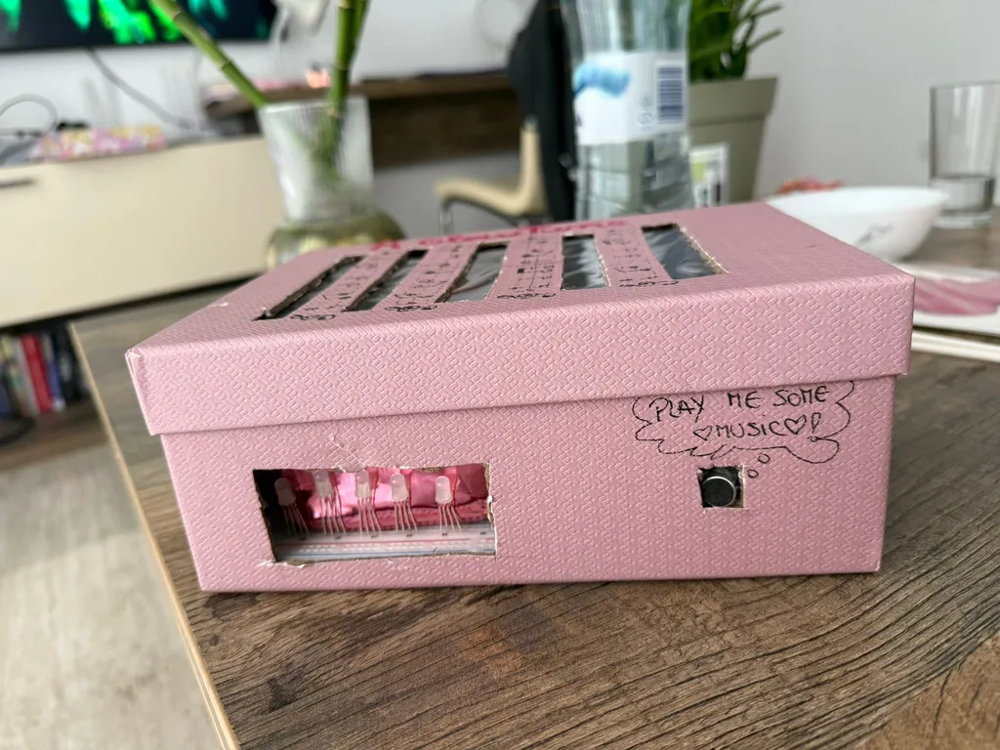
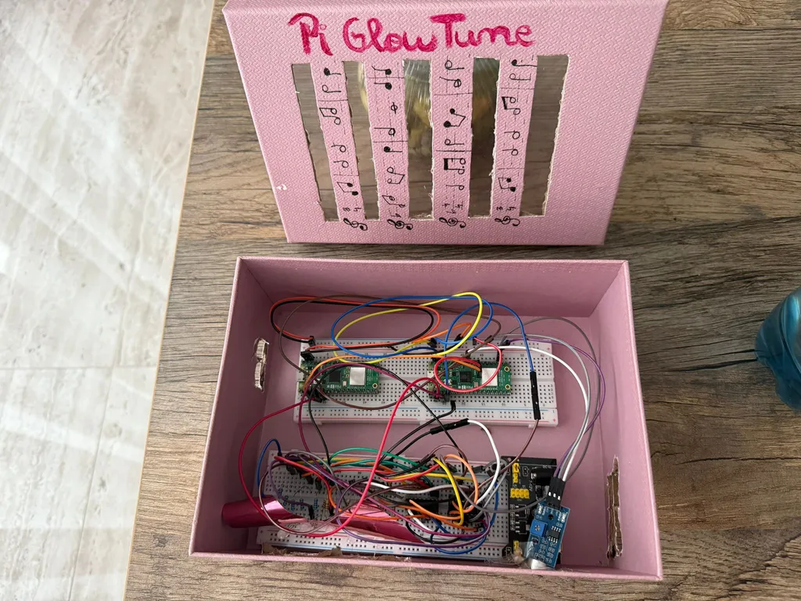
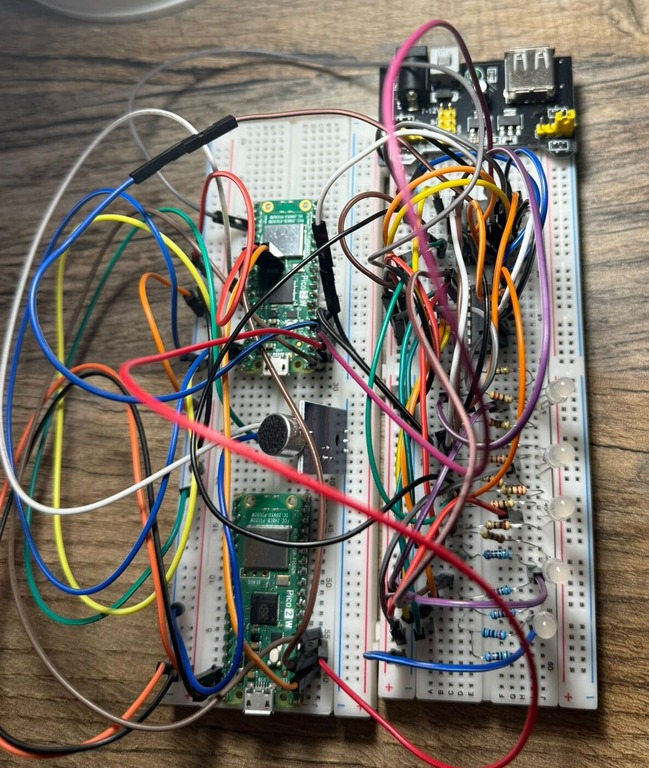

# PiGlowTune
PiglowTune is a Rust-powered project that syncs LED light patterns with music in real time.
:::info 

**Author**: Stoean Miruna-Teodora \
**GitHub Project Link**: [https://github.com/UPB-PMRust-Students/project-mirunastoean]

:::

## Description

This project features a music-reactive LED system powered by a Raspberry Pi Pico W 2, which lights up 5 RGB LEDs in real time based on sound intensity. Using 2 shift registers (74HC595), the Pico controls each LED’s color and brightness through pulse and fade effects. A web app connected over Wi-Fi allows you to remotely select different LED effects, making it easy to switch between vibrant color modes and create an interactive light-and-sound experience.


## Motivation

My motivation for this project comes from my passion for both music and visual aesthetics. I've always been fascinated by how sound can be transformed into something you can see and feel, not just hear. This project gave me the perfect opportunity to blend those interests by creating a system where music drives a visual experience in real time. I wanted to explore how technology could bridge the gap between auditory and visual art, and building a music-reactive LED setup felt like a natural and exciting challenge—especially with the added control and customization through a web interface.

## Architecture 



The sound sensor picks up music and sends audio intensity data to the Raspberry Pi Pico W 2, which also connects via Wi-Fi to a mobile web app for remote control. The Pico processes the analog sound input and controls 5 RGB LEDs (common cathode) using 2× 74HC595 shift registers, with each RGB channel driven through current-limiting resistors. The entire LED system is powered by an external 5V power supply. The LEDs respond to music with synchronized light effects, including pulsing and dynamic color changes.
## Log


### Week 5 - 11 May
After purchasing all the necessary materials for my project, I began assembling the components, connected everything using jumper wires, performed debugging, and verified that my Raspberry Pi was functioning correctly.
### Week 12 - 18 May
\
\
This week, I began by individually testing all my RGB LEDs to ensure they were functioning properly. I then carefully connected them using two shift registers, which required a lot of patience and precision. After setting up the hardware, I created three distinct lighting effects: Rainbow, Pulse White, and Strobe Party—each selectable by the user. Finally, I made the effects respond to sound by connecting the LEDs to a sound sensor, allowing the lights to react dynamically to audio input.
### Week 19 - 25 May


This week, I successfully configured the Wi-Fi on my Raspberry Pi Pico 2W, turning it into an access point. Additionally, I created a simple HTML page where the user can select their desired LED effect. The project's software is finished and I also worked on the design of the project.
[Video of the Project working](https://youtu.be/UlZHCPw0-Iw)
## Hardware

\
**1. Raspberry Pi Pico 2W** – Controls the LEDs, processes sound input, and connects to Wi-Fi for command input.\
**2. Microphone Sound Sensor** – Detects sound intensity from music and sends analog signal to the Pico.\
**3. 5× RGB LEDs (Common Cathode)** – Light up based on sound input, creating pulse and color effects.\
**4. 2× 74HC595 Shift Registers** – Control the 15 LED channels (R, G, B for 5 LEDs) using only 3 GPIO pins.\
**5. 15× Resistors (220Ω–330Ω)** – Current-limiting resistors for each RGB channel.\
**6. Power Supply (5V)** – External power source to provide enough current for the LEDs.\
**7. Breadboard & Jumper Wires** – For assembling and wiring the circuit easily.\
The project uses several hardware components working together to create light effects synchronized with music. The Raspberry Pi Pico 2W acts as the brain: it receives the audio signal from the microphone sensor, processes it, and controls the RGB LEDs based on the sound intensity. The 5 common-cathode RGB LEDs light up in different colors and pulse according to the music rhythm.

To control all 15 RGB channels (3 colors × 5 LEDs) using only a few GPIO pins from the Pico, two 74HC595 shift registers are used. Each color channel has a resistor to limit current and protect the LEDs.

The LEDs are powered separately by an external 5V power supply to ensure enough current and stable operation. All components are connected on a breadboard, with jumper wires used for easy wiring between them.

### Schematics


### Bill of Materials

<!-- Fill out this table with all the hardware components that you might need.

The format is 
```
| [Device](link://to/device) | This is used ... | [price](link://to/store) |

```

-->

| Device | Usage | Price |
|--------|--------|-------|
| [Raspberry Pi Pico 2W](https://www.raspberrypi.com/documentation/microcontrollers/raspberry-pi-pico.html) | The microcontroller | [39 RON](https://www.optimusdigital.ro/en/raspberry-pi-boards/13327-raspberry-pi-pico-2-w.html?gad_source=1&gbraid=0AAAAADv-p3DfPn0jghDBkW5rmkni4ZwoA&gclid=Cj0KCQjwlMfABhCWARIsADGXdy_lnzlbb9XJk7UTW9TkCTAm8ZO8qfzlB-ip4f0Q1Y9SH4H72JOmpJIaAg6iEALw_wcB) |
| [ Sound Sensor Module](https://docs.sunfounder.com/projects/vincent-kit/en/latest/components/component_sound_module.html) | The sound sensor | [5 RON](https://www.optimusdigital.ro/en/others/12325-sound-sensor-module-no-cable.html?gad_source=1&gbraid=0AAAAADv-p3DfPn0jghDBkW5rmkni4ZwoA&gclid=Cj0KCQjwlMfABhCWARIsADGXdy-HKSPwoqj3SIXiT-xBpWjE4KsrZDu62aPRudyepcXEmM5GoV-WlKkaAmLYEALw_wcB)|
| [ 2 x Breadboard ](https://os.mbed.com/handbook/Breadboard) | The breadboards used | [15 RON](https://www.optimusdigital.ro/en/breadboards/8-breadboard-hq-830-points.html?gad_source=1&gbraid=0AAAAADv-p3Bg2RZlhy48fcp-_r0lc4u3t&gclid=Cj0KCQjwlMfABhCWARIsADGXdy_ZvCM78LZHRQIGdsT20NooKmcugTGzs2lQRYEnMjOO0kPVxvZpem4aAmZNEALw_wcB) |
| [ 40 x Male-Male Wires](https://docs.sunfounder.com/projects/sf-components/en/latest/component_wires.html) | Male to Male Jumpers Wires| [5,99 RON](https://www.optimusdigital.ro/ro/fire-fire-mufate/886-set-fire-tata-tata-40p-15-cm.html?search_query=fire+tata+tata&results=73)|
| [10 x Female-Male Wires](https://docs.sunfounder.com/projects/sf-components/en/latest/component_wires.html) | Female to Male Jumper Wires | [5,99 RON](https://www.optimusdigital.ro/en/wires-with-connectors/653-10-cm-40p-male-to-female-wire.html?gad_source=1&gbraid=0AAAAADv-p3B_VkQFxiPfaNoAEcFAPICVQ&gclid=Cj0KCQjw_dbABhC5ARIsAAh2Z-TVakS-GcyoE-yBG96jgOewY1Ps9Q-EOhbhifYEJ2SK_i-J9Z-BW1kaAh3GEALw_wcB)|
| [Power Supply Module](https://docs.sunfounder.com/projects/kepler-kit/en/latest/component/component_power_module.html)| Alimentation Source for Breadboard|[4,69 RON](https://www.optimusdigital.ro/ro/electronica-de-putere-stabilizatoare-liniare/61-sursa-de-alimentare-pentru-breadboard.html?gad_source=1&gbraid=0AAAAADv-p3B_VkQFxiPfaNoAEcFAPICVQ&gclid=Cj0KCQjw_dbABhC5ARIsAAh2Z-TMS5d9pNDhk9tBLnjs0ttXkzHn5xV4ZCWnihaWuqgMuibOegNXTZAaAlwzEALw_wcB)|
| [ 5 x RGB LEDS - common cathode ](https://docs.sunfounder.com/projects/sf-components/en/latest/component_rgb_led.html)| RGB Leds|[10 RON](https://ardushop.ro/ro/display-uri-si-led-uri/958-led-rgb-tricolor-cu-catod-comun-5mm-6427854012944.html?gad_source=1&gad_campaignid=22058879462&gbraid=0AAAAADlKU-41-2czyYDWcrCVAuZSa0kRI&gclid=CjwKCAjw24vBBhABEiwANFG7y8ltd5iA-k0_BmYtOtXt_0ODS_V8emFuJzP-SkxBvEEjkGQbNOdHFBoCia8QAvD_BwE)|
| [2 x Shift Registers sn74hc595n](https://www.ti.com/lit/ds/symlink/sn74hc595.pdf)| Shift Registers |[3,99 RON]|(https://www.optimusdigital.ro/en/others/2448-registru-de-deplasare-74hc595-dip-16.html?srsltid=AfmBOopvOxLjvj3ABPM4012zM-5k2W55KAx3s47IDq2ji_H--yB9nS_7)|
| [15 x Resistors 220 ohms](https://www.anypcba.com/blogs/electronic-component-knowledge/decoding-the-220-ohm-resistor-applications-color-codes-and-practical-guide.html)| Resistors for Leds |[0,20 RON]|(https://www.optimusdigital.ro/en/resistors/1097-025w-220-resistor.html?gad_source=1&gad_campaignid=19615979487&gbraid=0AAAAADv-p3BwDHjuGRdU2n8sxhv2sTEI7&gclid=CjwKCAjw24vBBhABEiwANFG7y3Oyo4j9zWwgc0UgB0QlPGJuU_ZXPCTKlXxIArl-HLIU7fOqC8XQzRoC1t8QAvD_BwE)|


## Software

| Library | Description | Usage |
|--------|-------------|-------|
| [embassy-rp](https://docs.embassy.dev/embassy-rp/git/rp2040/index.html) | Hardware abstraction layer for RP2040 | Enables async interaction with the microcontroller hardware |
| [embassy-net](https://github.com/embassy-rs/embassy) | Networking stack for embedded systems | Manages Wi-Fi connectivity and enables web server features |
| [cyw43](https://github.com/embassy-rs/embassy) | Wi-Fi driver for CYW43439 chip | Supports wireless communication for Raspberry Pi Pico W |
| [defmt](https://docs.rust-embedded.org/defmt/defmt/) | Lightweight logging framework | Used for efficient embedded debugging |
| [panic-probe](https://docs.rs/panic-probe/0.3.0/panic_probe/) | Panic handler for embedded Rust apps | Helps capture crash reports in no-std environments |

## Links

<!-- Add a few links that inspired you and that you think you will use for your project -->

1. [Raspberry Pi Audio Reactive LED Strip (2020)](https://www.youtube.com/watch?v=7YLF-N0596I)
2. [Sound Reactive WS Led with Raspberry Pi Pico](https://www.youtube.com/watch?v=PaSVcxk2iVk&t=3s)

