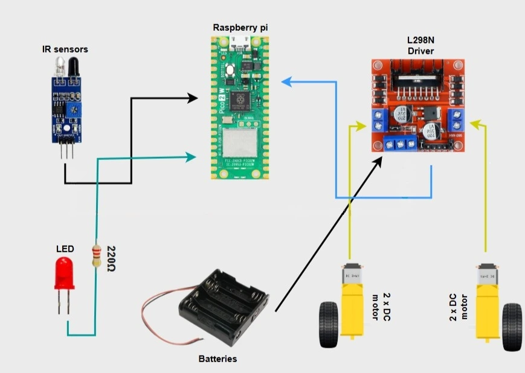
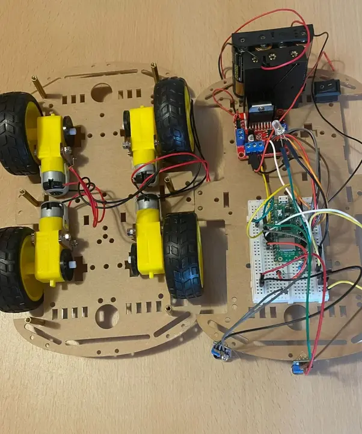
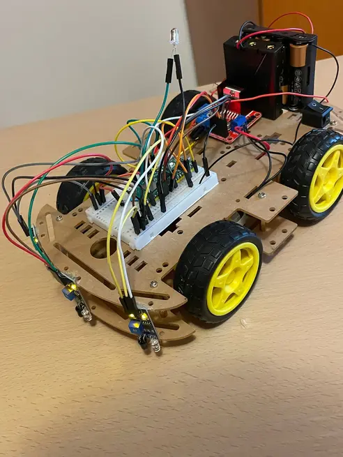
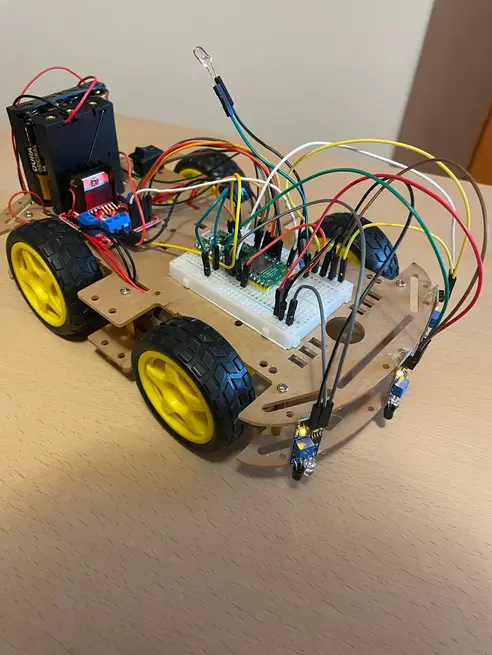

# Rusty Car-go line follower
A car that follows a light-absorbing black line using Infrared sensors.

:::info 

**Author**: Mohamed Daoudo \
**GitHub Project Link**: https://github.com/UPB-PMRust-Students/project-Joan-DwD

:::

## Description

**Rusty Car-go** is a car programmed in Rust that follows a black colored tape that absorbs light compared to the surrounding surface which typically absorbs more light using IR (infrared) sensors that read digital low or digital high, and the Rasberry Pi Pico 2W reads these signals and adjusts the motors' speed/direction via L298N moto driver, and lights up a little LED when the car is going. This project serves as a door to building more more creative and fun projects.

## Motivation

As a little kid, the idea of seeing wires connected to each other causing machines to move and work, whether for fun or to assist us in our daily lives fascinated me. It led me to build simple projects, such as small fans during the summer or a cotton candy machine because I enjoyed sweets. Reminiscing about these days motivated me to work with DC motors and wires again and build a car with them.

## Architecture

The Raspberry Pi Pico 2W powered by L298N motor driver's onboard 5V regulator to ensure stable supply, It serves as a brain that directs the behaviour of the robot, it's technically responsible for data processing, It outputs directional control and PWM speed signals to the L298N Motor driver which is connected to it via several GPIO pins.

The IR sensors, powered by 3.3V power source of the pico, are connected to the Pico's GPIO pins, detect the line's position based on the color black and send digital signals to the microcontroller to keep the robot on it's track .

The L298N motor driver, powered by batteries, controls the speed and direction of DC motors connected to it via it's output terminals, whose role is to drive the robot's wheels according to Pico's commands, simultaneously, an LED connected to Pico's GPIO pin lights up whenever the motors are active, providing visual feedback.

Finally, the chassis, it provides a well-structured body for the components ensuring stable operation, protection, and ease of assembly.

## Log

### Week 5-11 May
I started imagining the code and it's structure to make it well-suitable and compatible with what I learned throughout the labs, and wrote a few simple lines regarding the initialization of my components and their behaviour (e.g. PWM for my car's speed via En pins).

However, I immediately started working on the car by assembling and testing some of the components to ensure that they were in a perfect condition as soon as they arrived as it had a higher priority than the software part at that moment.

Moreover, I started desiging an early inchoate version of my KiCad schematic for the robot in order to gain more familiarity with the software and make some improvements later for the Hardware Milestone.
### Week 12-18 May
I finally received all of my stuff including what was missing and used my solderer to connect whats needed (RP, DC motors, and the Switch), assembled all the components, made sure everything is wired and connected carefully, and acquired the final model for the robot.

I also got to update my KiCad schematic and obtain one final version that suits and matches well with my board connections, and took better shots of my hardware.
 
Without further ado, I began contemplating the software part more deeply and committed what I had written initially. 
### Week 19-25 May
This week marked the successful completion of the software for my Car-go. With all hardware components assembled, I focused entirely on finalizing the embedded Rust firmware.

The software is designed to continuously read sensor data in real time and adjust motor behavior accordingly. Depending on the detected position of the black line, the system dynamically regulates motor speed and direction using PWM signals, enabling the car to follow gentle curves and turns smoothly and accurately.

I implemented a responsive control mechanism that interprets various sensor combinations to determine the appropriate motion, such as moving forward, turning left or right, or stopping when the line is lost. All control logic is handled asynchronously to ensure fast reaction times and reliable performance.

After extensive testing and calibration, including adjusting sensor thresholds and motor speeds, the car now tracks the line. With the final version of the code committed and functioning as intended, this week concludes the full integration of software into a working robotic system.

## Hardware

- Raspberry Pi Pico 2W: The central controller of the robot aka the "brain".
- Infrared sensors: Used for black or white line detection.
- L298N motor driver: Controls DC motor speed or direction.
- DC motors: Used to move and steer the robot.
- 2 AA battery holders connected (4x, 3x): Power supply to the motor driver.
- LED: Indicator of motor activity.
- I/O Switch: Adds more flexibility in turning off/on the robot instead of manual wiring.
- The robot chassis: It serves as the body of the robot and holds all components.

### Pictures

## Schematics

## Bill of Materials

| Device              | Usage                      | Price   |
|---------------------|----------------------------|---------|
|[Raspberry Pi Pico 2W](https://www.raspberrypi.com/documentation/microcontrollers/pico-series.html#pico2w-technical-specification) | Microcontroller            | [39.66 RON](https://www.optimusdigital.ro/ro/placi-raspberry-pi/13327-raspberry-pi-pico-2-w.html?search_query=raspberry+pico+2w&results=26)  |
|[IR sensors](https://www.circuits-diy.com/hw201-infrared-ir-sensor-module/)        | line detection    | [10,47 RON](https://www.optimusdigital.ro/en/optical-sensors/4514-infrared-obstacle-sensor.html?search_query=infrared+obstacle+sensors&results=14)  |
|[DC motors with wheels & chassis (unassembled)](https://cdn.ozdisan.com/ETicaret_Dosya/729231_182181.pdf)                     | Structure of the robot                            | [79.59 RON](https://sigmanortec.ro/en/smart-car-4wd-chassis-kit)        |
|[L298N Motor Driver](https://www.twicea.com/solution/l298n-motor-driver-specification-features-pinout-how-it-works)                  | Control speed of DC motors                              | [10.99 RON](https://www.optimusdigital.ro/en/brushed-motor-drivers/145-l298n-dual-motor-driver.html?search_query=L298N&results=4)         |
|[Male-Male jumper wires set](https://media.digikey.com/pdf/Data%20Sheets/Digi-Key%20PDFs/Jumper_Wire_Kits.pdf)                      |       Connecting components                     |   [7.99 RON](https://www.optimusdigital.ro/en/wires-with-connectors/12-breadboard-jumper-wire-set.html?search_query=Breadboard+Jumper+Wires+Set&results=22)| 
|[10cm Female-Male jumper wires](https://media.digikey.com/pdf/Data%20Sheets/Digi-Key%20PDFs/Jumper_Wire_Kits.pdf)                    |          Connecting components                  |    [2.99 RON](https://www.optimusdigital.ro/en/wires-with-connectors/650-fire-colorate-mama-tata-10p.html?search_query=10+cm+10p+Male-Female+Wires&results=12)     |
|[20cm Female-Male jumper wires](https://media.digikey.com/pdf/Data%20Sheets/Digi-Key%20PDFs/Jumper_Wire_Kits.pdf)                     |        Connecting components                    | [3.99 RON](https://www.optimusdigital.ro/en/wires-with-connectors/214-fire-colorate-mama-mama-10p.html?search_query=10+cm+10p+Male-Female+Wires&results=12)         |
|[LED](https://www.farnell.com/datasheets/3811080.pdf)                      |   Motor activity indication                        | Already had it     |
|[Switch](https://www.chinadaier.com/kcd1-101-12v-dc-20a-mini-rocker-switch/) | Power switching |[1.99 RON](https://www.optimusdigital.ro/en/buttons-and-switches/7377-kcd10-101-switch.html?search_query=KCD10-101+Switch+&results=1) |
|[Battery holder 4 x R6](https://datasheet.octopart.com/2478-Keystone-datasheet-30154.pdf)                      |Power supply| [9.43 RON](https://www.optimusdigital.ro/en/battery-holders/2806-battery-holder-4-x-r6.html?search_query=%09Battery+Holder+4+x+R6&results=74)  | 
|[Battery holder 3 x R6](https://datasheet.octopart.com/2478-Keystone-datasheet-30154.pdf)    |Power supply| [3.95 RON](https://www.optimusdigital.ro/en/battery-holders/1090-3-x-r6-battery-holder.html?search_query=0104110000009968&results=1) |                                
|[Breadboard](https://www.mouser.com/datasheet/2/58/BPS-DAT-%28BB400%29-Datasheet-932623.pdf)          |  Circuit building     |[4.56 RON](https://www.optimusdigital.ro/en/breadboards/44-400p-hq-breadboard.html?search_query=breadboard&results=362)|

## Software

| Library            | Description                               | Usage                                     |
|--------------------|-------------------------------------------|-------------------------------------------|
| [defmt](https://docs.rs/crate/defmt/latest)              | Logging and debugging           | printing debug information |
| [embassy_executor](https://crates.io/crates/embassy-executor)   | Task management system for asynchronous Rust    |spawning asynchronous tasks concurrently |
| [embassy_rp::gpio](https://docs.embassy.dev/embassy-stm32/git/stm32c011d6/gpio/index.html)   | Pico GPIO control pins            |configuring digital input/output pins |
| [embassy_rp::pwm](https://docs.embassy.dev/embassy-rp/git/rp2040/pwm/index.html)    | Pulse width modulation           | to mainly control motor speed and direction|
| [embassy_time](https://docs.embassy.dev/embassy-time/)       | Time and delay handling in asynchronous Rust     | adds delays or wait for a specific duration in tasks |
| [panic_probe](https://lib.rs/crates/panic-probe) | Panic handling                         | Sends panic messages through `defmt`                                        |
| [embassy_sync::blocking_mutex::raw::ThreadModeRawMutex](https://docs.rs/embassy-sync/latest/embassy_sync/blocking_mutex/raw/struct.CriticalSectionRawMutex.html) | blocking thread mutex | Provides safe access to shared data across async tasks                      |
| [embassy_sync::channel](https://docs.embassy.dev/embassy-sync/git/default/pubsub/index.html) | Channel messaging system         | Allows async message passing between producers and consumers                |

## Links

1.[How to construct line following robot](https://youtu.be/H8wVLaQeSWQ?si=odB3tcmSnWRXZFpz)

2.[Line following car with Raspberry Pi Pico](https://srituhobby.com/how-to-make-a-line-tracking-robot-with-raspberry-pi-pico-board/)
 
3.[More guidance](https://quartzcomponents.com/blogs/electronics-projects/line-follower-robot-using-arduino?srsltid=AfmBOopANi596iyggapmAuFa1iQ-XZoUMyAkejQJASX9k0wGWDHNtwUL)

4.[Reasearch Article](https://academics.su.edu.krd/public/profiles/Ahmad.ahmed/research-register/research-register-554-4016-1612220739-1.pdf)
