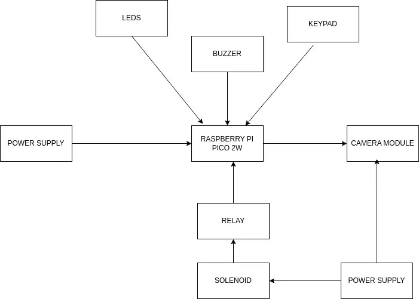
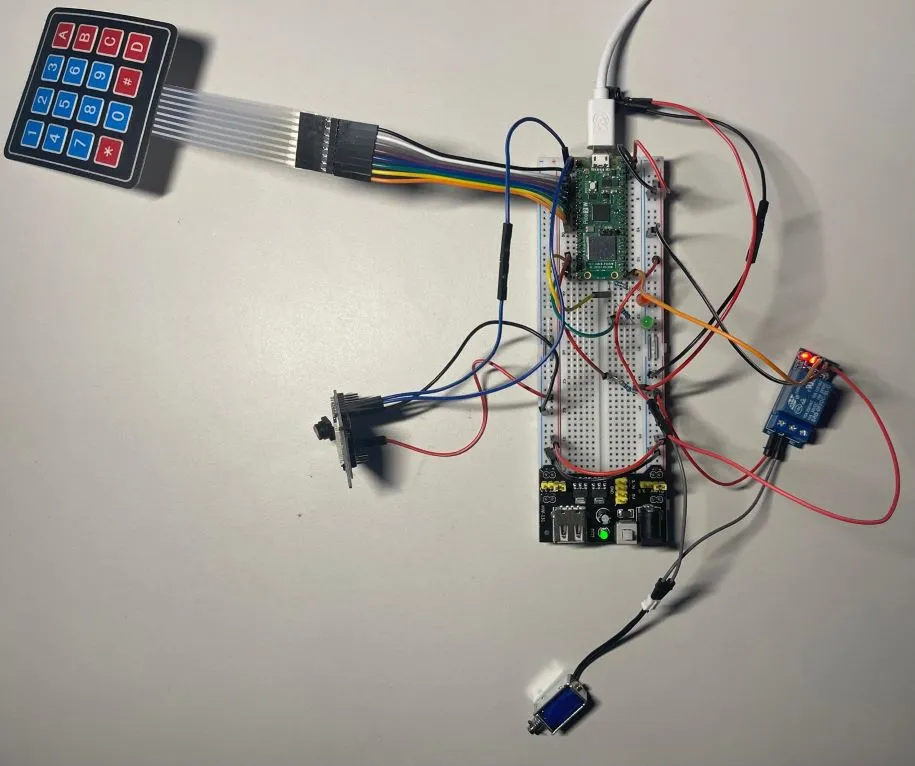
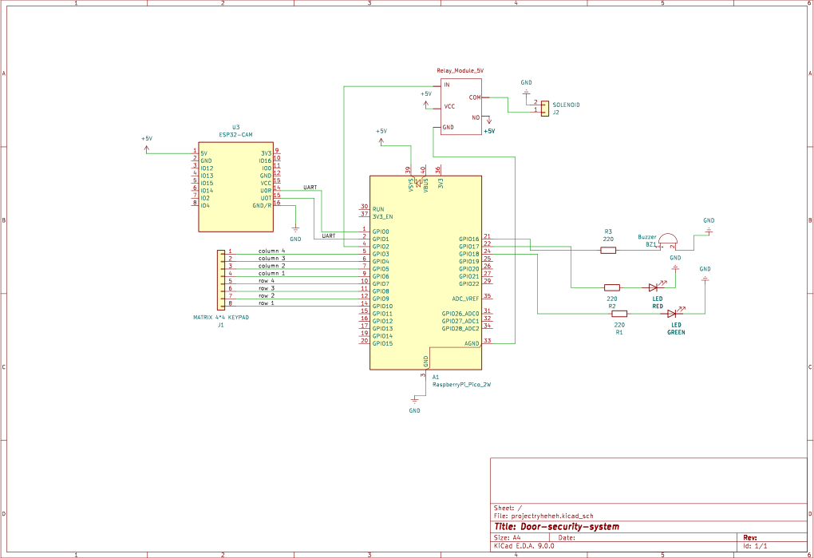

# Door Security System
A smart door lock system that detects intruders using a camera module and secures access with a passcode.

:::info

**Author**: Bumbacea Nicoleta-Alexandra \
**GitHub Project Link**: https://github.com/UPB-PMRust-Students/project-NicoletaBumbacea

:::

## Description

The project is a door security system built using a Raspberry Pi Pico 2, programmed in Rust. The system locks the door and requires a 4-digit code to unlock. When the correct code is entered, a green LED turns on, a confirmation sound is played, and the door unlocks. If the wrong code is entered, a red LED turns on, a warning sound is played, and a photo is taken using an Adafruit OV5640 Camera Module. This image is then stored for security purposes.​

## Motivation

I chose this project because it combines embedded systems, security, and real-world problem-solving. Door security is a practical application, and building a smart lock system allows me to explore key concepts such as keypad input handling, device control with GPIO, audio/visual feedback, and basic image capture using a camera module.

## Architecture 
The project includes the following main components:

Input Handler: Captures the 4-digit PIN via a matrix keypad.

PIN Validator: Compares the input against a stored code.

Control Logic: Determines if the door should unlock or log an intruder.

Feedback System: Uses LEDs and buzzer to provide visual and audio feedback.

Communication Module: Sends a UART signal to ESP32-CAM to take a picture.

Image Handler: Receives image data over UART or forwards it to a connected device.

 

## Log

### Week 5 - 11 May
This week, I completed the hardware setup for my smart door lock system. All components — including the keypad, LEDs, buzzer, solenoid, and ESP32-CAM module — have been connected and tested for basic functionality.
### Week 12 - 18 May
I transitioned into the software development stage. I initialized the Rust project using the Embassy framework and began writing basic control logic to interact with the hardware, starting with GPIO testing for LEDs and preparing the structure for handling keypad input. This lays the groundwork for implementing core features like code verification and door control in the coming week.
### Week 19 - 25 May

## Hardware

Raspberry Pi Pico 2W - Acts as the central microcontroller running the embedded Rust program.Handles keypad scanning, logic processing, UART communication, GPIO control for LEDs, buzzer, relay.

4x4 Matrix Keypad - Used for user input; allows the user to enter the 4-digit access code.

Green LED-Indicates successful code entry and that the door is being unlocked.

Red LED-Indicates failed code entry or unauthorized access attempt.

Piezo Buzzer - Provides audio feedback.

Relay Module (1 Channel, 5V) - Switches high-current 5V to drive the solenoid.

Solenoid Lock - Mechanically controls the locking/unlocking of the door.

Camera Module - Captures an image when an incorrect code is entered.

Power Supply  -Powers the Raspberry Pi Pico and all connected peripherals.

### Schematics

### Bill of Materials

| Device | Usage | Price |
|--------|--------|-------|
| [Raspberry Pi Pico 2W](https://www.raspberrypi.com/documentation/microcontrollers/raspberry-pi-pico.html) | The microcontroller | [40 RON](https://www.optimusdigital.ro/ro/placi-raspberry-pi/13327-raspberry-pi-pico-2-w.html?search_query=raspberry+pi+pico+2W&results=26)|
|[SC0889 Raspberry Pi Debug Probe](https://www.farnell.com/datasheets/3930618.pdf)|Programs/debugs the Pico 2W|[74 RON](https://ro.farnell.com/raspberry-pi/sc0889/debug-connector-3-pin-raspberry/dp/4163983)|
|[4x4 Matrix Keypad](https://cdn.sparkfun.com/assets/f/f/a/5/0/DS-16038.pdf)|Used to input the 4-digit unlock code|[7 RON](https://www.optimusdigital.ro/ro/senzori-senzori-de-atingere/470-tastatura-matriceala-4x4-cu-conector-pin-de-tip-mama.html?search_query=tastatura&results=51)|
|[ESP32-CAM Development Board with OV2640 2MP Camera Module](https://media.digikey.com/pdf/Data%20Sheets/DFRobot%20PDFs/DFR0602_Web.pdf)|Camera Module-Captures intruder images on failed attempts|[61 RON](https://sigmanortec.ro/placa-dezvoltare-esp32-cam-wifi-bluetooth-ov2640-2mp)|
|Solenoid - 5v|Locks/unlocks the door|[37 RON](https://www.robofun.ro/mecanice/solenoid-5v-small.html)|
|Relay module|Controls the solenoid safely from Pico|[5 RON](https://www.optimusdigital.ro/ro/electronica-de-putere-module-cu-releu/13084-modul-releu-cu-un-canal-comandat-cu-5-v.html?search_query=relay&results=24)|
|Breadboard kit|For circuit prototyping (includes breadboard, wires, LEDs, resistors,etc.)|[70 RON](https://www.emag.ro/set-componente-electronice-led-uri-breadboard-830-puncte-componente-pentru-incepatori-compatibil-arduino-si-raspberry-pi-ouylaf-308-10149-409/pd/DH8RVLYBM/)|
|Suport carcasa baterie 9V + mufa|powers the components|[3.18 RON](https://ardushop.ro/ro/carcase-i-suporturi/1060-suport-carcasa-baterie-9v-mufa-6427854014559.html)|

## Software

| Library | Description | Usage |
|---------|-------------|-------|
|embassy|Async framework for embedded Rust|	Run async tasks like input, delays|
|embassy-rp|Embassy HAL for Raspberry Pi Pico 2W|Control GPIO, PWM, I2C, SPI|
|cortex-m|Low-level support for ARM Cortex-M chips|Set up interrupt handling, registers|
|cortex-m-rt|Runtime and entry point for ARM Cortex-M|Required for running code on Pico|
|defmt|Lightweight logging crate for embedded| Rust	Debug messages over USB/debug probe|
|probe-rs|Flash and debug embedded devices|Upload firmware and debug over USB|

## Links

<!-- Add a few links that inspired you and that you think you will use for your project -->

1. [link](https://example.com)
2. [link](https://example3.com)
...

