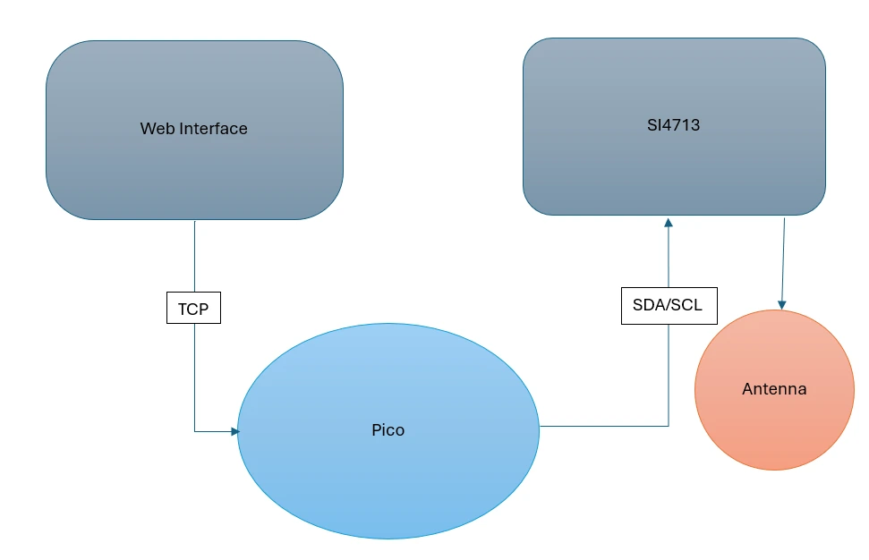
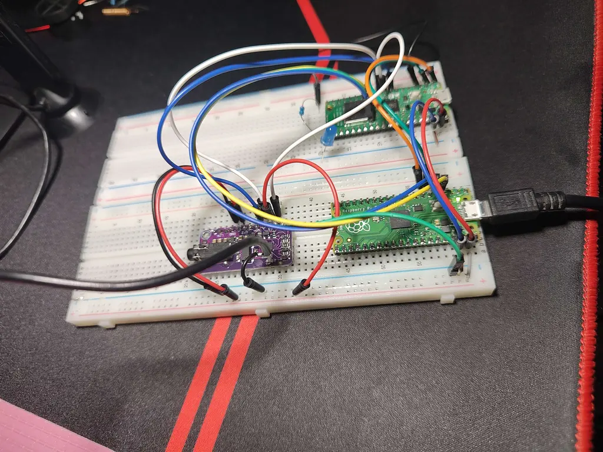
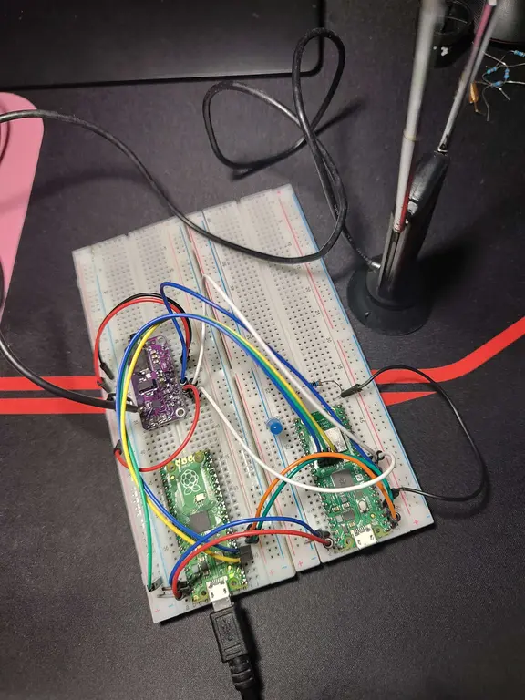

# Sentence Encryption Device
Sentence Encryption Device using morse code and Pico 2W

:::info 

**Author**: Budu Octaivan-Andreis \
**GitHub Project Link**: https://github.com/UPB-PMRust-Students/project-BUDU-Octavian-Andrei


:::

## Description

The Sentence Encryption Device is designed to automatically transmit entire
words or sentences in encrypted Morse code using a Raspberry Pi Pico 2 W
instead of manually and mechanically inputing each character.
The idea here is to make use of the Wifi module on the raspberry pi as input,
this way you can skip the painstaking process of introducing characters on the
board. Then the pico takes this input and encodes it based on your desired
encryption method (ex: Caesar, Vigenere, M-94, etc) then translates it from
string/char to morse code, from there it is further processed in order to be
GPIO compatible. The GPIO signal is used to modulate an oscillator/
transmitter circuit.

## Motivation

I chose this project because I am fan of 20th century history and I like the old school method of sending messages, I wanted to recreate one of the most famous encryption machines, engima, to the best of my ability to replicate it

## Architecture



1. **Browser** (HTML/CSS/JS)
2. **Node.js** bridge (HTTP + WebSocket + TCP)
3. **Pico W** runs `embassy-rp` + `embassy-net`, TCP client
4. **SI4713** via I²C: tune FM & key its tone generator

## Log

<!-- write your progress here every week -->

### Week 5 - 11 May
I have finished the hardware section, a few more issues are on the clarity of the signal but a better antenna has been installed.

### Week 12 - 18 May
I have implemented multiple encryption methods that should serve at the pleasure of the user to encrypt their message before sending via RF.

### Week 19 - 25 May
I have implemented error handling on the user side so that if they make a small mistake when inserting keys and messages it doesn't panic the pico and instead it tells them the format they should use.

## Hardware




| Device                      | Interface    | Pico Pin(s)            |
| --------------------------- | ------------ | ---------------------- |
| SI4713 FM TX module         | I²C          | SDA = GP16, SCL = GP17 |
|                             | Reset (RST)  | GP18                   |
|                             | GPO1 (key)   | GP19 (tone on/off)     |
| On-board LED (TX indicator) | GPIO         | GP25                   |
| Pico W                      | USB power    | 5 V → 3.3 V regulator  |
|                            | Wi-Fi (CYW43)| PIO-driven SPI (pins 24,25,29) |

### Schematics


### Bill of Materials

<!-- Fill out this table with all the hardware components that you might need.

The format is 
```
| [Device](link://to/device) | This is used ... | [price](link://to/store) |

```

-->

| Device | Usage | Price |
|--------|--------|-------|
| [Raspberry Pi Pico 2W](https://www.raspberrypi.com/products/raspberry-pi-pico-2/) | The microcontroller | [39,66 RON](https://www.optimusdigital.ro/en/raspberry-pi-boards/13327-raspberry-pi-pico-2-w.html?search_query=raspberry+pi+pico+2W&results=36) |
| [Raspberry Pi Pico](https://www.raspberrypi.com/products/raspberry-pi-pico/)| The debugger | [22,49 RON](https://www.optimusdigital.ro/en/raspberry-pi-boards/12024-raspberry-pi-pico-728886755172.html?srsltid=AfmBOooFXPdXK0sYQupOpvS4Htz5q0sj0cSIZz4r1YkAj5fqowD9ZS8B) |
| [SI4713](https://www.skyworksinc.com/-/media/Skyworks/SL/documents/public/data-sheets/Si4712-13-B30.pdf)| The RF unit |[78,49 RON](https://sigmanortec.ro/modul-transmitator-fm-si4713-i2c-3-5vdc?SubmitCurrency=1&id_currency=2&gad_source=1&gad_campaignid=22174019478&gclid=CjwKCAjwiezABhBZEiwAEbTPGLfnwqsWrG7VFtppRTcn0ktydoBEjkHXcY4StrgNV4fhmGjQ4mvspxoCln8QAvD_BwE) |


## Software

| Crate / Library         | Version        | Role                                   |
| ----------------------- | -------------- | -------------------------------------- |
| [`embassy-rp`]          | 0.3.0 (git)    | Pico RP2 async executor + GPIO/PIO     |
| [`embassy-net`]         | 0.7.0 (git)    | DHCP + TCP client                      |
| [`cyw43`]               | 0.3.0 (git)    | On-board Wi-Fi driver                  |
| [`panic-probe`]         | 0.3.2          | Defmt RTT panic handler                |
| [`defmt`]               | 1.0            | Compact logging                        |
| [`heapless`]            | 1.0            | Fixed-capacity no-std containers       |
| [`static_cell`]         | 1.0            | Safe global storage                    |
| [`embedded_hal_async`]  | 1.0            | HAL-compat async I²C trait             |
| [`embassy_time`]        | 1.0            | Async timing utilities                 |
| [`embassy_executor`]    | 1.0            | Asynchronous task executor             |


## Links

<!-- Add a few links that inspired you and that you think you will use for your project -->

1. [link](https://www.youtube.com/watch?v=XGqbieVcjPU)
2. [link](https://embassy.dev/book/)
3. [link](https://www.raspberrypi.com/documentation/pico-sdk/networking.html)
4. [link](https://www.manualslib.com/products/Silicon-Laboratories-Si4713-5585424.html)

