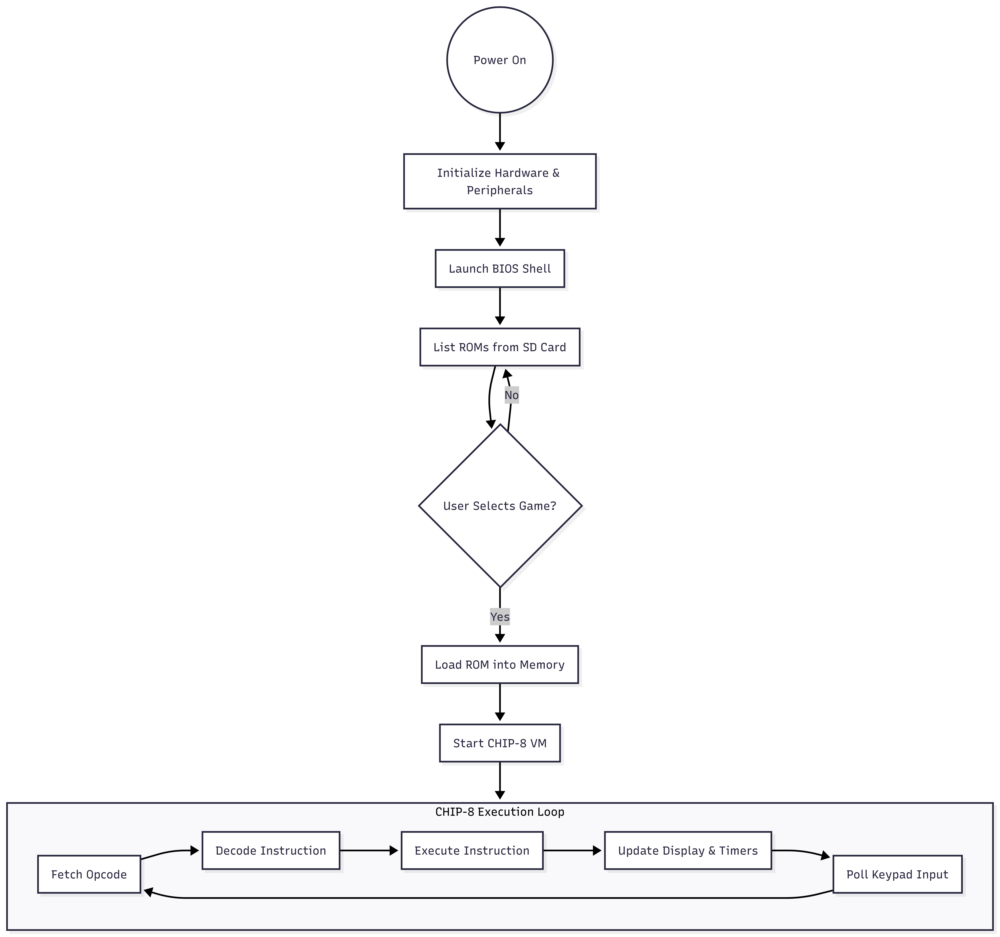
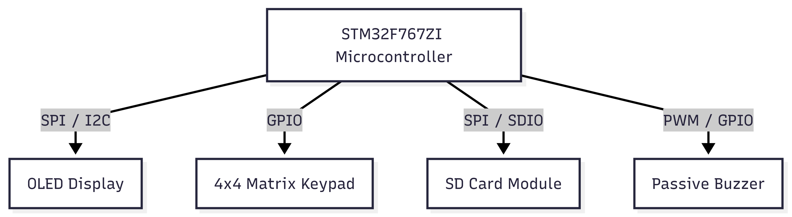

# STM32 Retro Console
A portable gaming console in Rust, featuring a custom BIOS, a virtual machine emulating CHIP-8 ISA, and a game library loaded from an SD card.

:::info

**Author**: Andreescu Ovidiu-Ștefan \
**GitHub Project Link**: https://github.com/UPB-PMRust-Students/project-dm-2025-ovidiu-andreescu

:::

## Description

The STM32 Retro Console is a handheld embedded system designed to play retro games. It features a custom BIOS shell for selecting ROMs from an SD card and a CHIP-8 Virtual Machine to execute game logic on the STM32F767ZI microcontroller.

## Motivation

I chose this project to validate the full embedded development stack in Rust, from hardware bring-up to application logic. Specifically, I wanted to:
* Use a virtual machine (CHIP-8) to understand low-level instruction parsing.
* Create a complete system that boots independently and manages a file system, rather than running a single hardcoded script.
* Demonstrate interactivity by integrating display drivers, audio feedback, and matrix keypad input into a single portable device.

## Architecture

The system architecture is centered around the **STM32F767ZI** microcontroller, which acts as the host for the CHIP-8 interpreter.

**Main Components & Connections:**
1.  **Core System (STM32):** Handles the fetch-decode-execute cycle of the VM and manages peripheral timing.
2.  **Storage Subsystem:** An **SD Card Module** connects via SPI to provide a dynamic file system. The BIOS reads this to list and load `.ch8` ROM files into RAM.
3.  **Human Interface (Input):** A **$4\times4$ Matrix Keypad** is scanned via GPIO to map physical button presses to the 16-key CHIP-8 layout.
4.  **Human Interface (Output):**
  * **OLED Display:** Connects via I2C/SPI to render the $64\times32$ monochrome graphics buffer.
  * **Passive Buzzer:** Connects via PWM/GPIO to generate simple square wave tones for game sound.

## Log

## Hardware

The project utilizes an STM32F767ZI Nucleo-144 board as the central processing unit, interfacing with a 128x64 OLED display via 
SPI/I2C for video output. User interaction is handled through a 4x4 matrix keypad scanned via GPIO, while game assets are 
loaded dynamically from an SD card module and audio is output through a passive buzzer.
### Schematics

### Bill of Materials

| Device               | Usage | Price    |
|----------------------|--------|----------|
| [STM32F767ZI Nucleo] | The main microcontroller board | ~130 RON |
| [1.3" OLED Display]  | 128x64 Screen for rendering game graphics | ~25 RON  |
| [4x4 Matrix Keypad]  | User input for game controls (16 keys) | ~10 RON  |
| [SD Card Module]     | Interfacing with the SD card to load ROMs | ~10 RON  |
| [Passive Buzzer]     | Audio feedback (beeps/tones) | ~12 RON  |

## Software

| Library                   | Description | Usage |
|---------------------------|-------------|-------|
| `stm32f7xx-hal + embassy` | Hardware Abstraction Layer | Configures GPIO, SPI, and Timers for the STM32F7 |
| `embedded-graphics`       | 2D graphics library | Drawing pixels and text to the display buffer |
| `ssd1306`                 | Display Driver | Initializes and sends data to the OLED screen |
| `embedded-sdmmc`          | File System Library | Reading FAT32 file systems on the SD card |
| `cortex-m-rt`             | Runtime Crate | Startup code and entry point for bare metal execution |

## Links

1. [CHIPnGo - Inspiration](https://github.com/kurtjd/CHIPnGo)
2. [chip8stm32 - Inspiration](https://github.com/AlfonsoJLuna/chip8stm32)
3. [Cowgod's CHIP-8 Technical Reference](http://devernay.free.fr/hacks/chip8/C8TECH.htlm)
