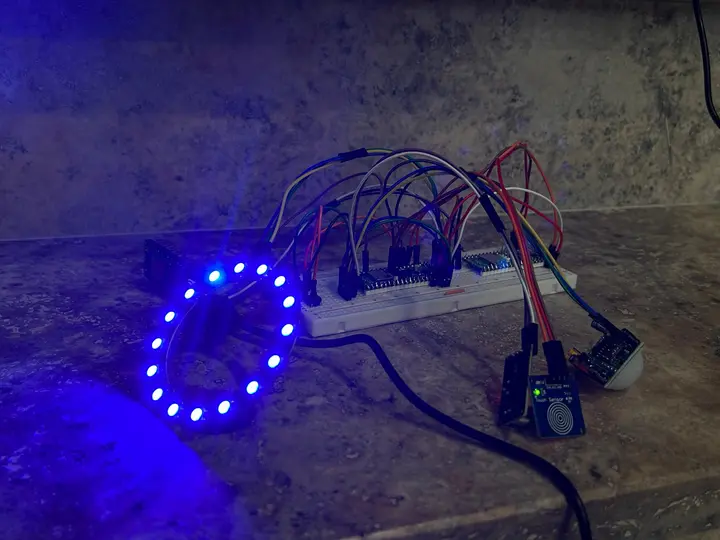
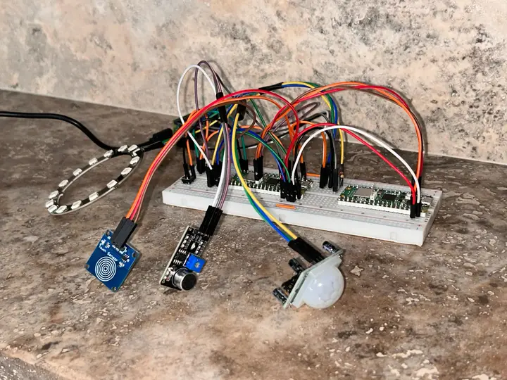
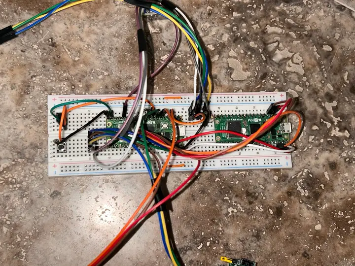
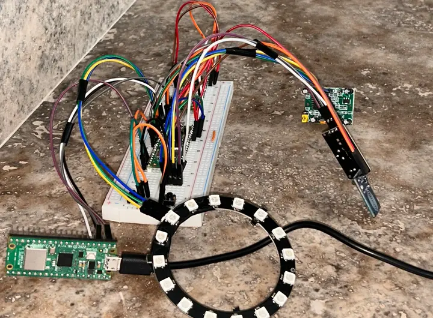

# Mood-Light-Lamp  
An interactive smart lamp that dynamically adjusts lighting based on touch, motion, and sound inputs, now also remotely controllable via Wi-Fi.

:::info 

**Author**: Băițan Raluca \
**GitHub Project Link**: [https://github.com/UPB-PMRust-Students/project-RalucaBaitan](https://github.com/UPB-PMRust-Students/project-RalucaBaitan)  

:::

## Description  
This project is a mood-responsive RGB lamp powered by a Raspberry Pi Pico 2W. It uses a Finite State Machine (FSM) to manage and cycle through a set of interactive lighting modes:  
- **Night Mode** – activates only when motion is detected and turns off automatically after 30 seconds  
- **Alarm Mode** – triggered by loud sounds, flashing red to indicate alerts  
- **Standard Mode** – brightness is controlled via a button (25%, 50%, 75%, 100%)  
- **Party Mode** – one button changes color, another adjusts brightness  
- **Random Party Mode** – randomly changes both color and brightness over time  
- **Beat Sync Mode** – changes colors in sync with detected sounds or beats  

A capacitive touch sensor allows users to cycle between modes, while two tactile buttons toggle the reactivity of sound and motion sensors. The project also supports Wi-Fi control, enabling users to change settings or monitor the current mode from a web interface or mobile device.

## Motivation  
The goal of this project was to design a lamp that is both visually appealing and interactive. I aimed to create a smart device that adapts to environmental stimuli such as motion and sound, offering a more dynamic and personalized lighting experience. By integrating Wi-Fi control, the lamp goes beyond basic functionality, allowing remote configuration and aligning with current developments in smart home technologies.

## Architecture  
 

### Components Overview

**Raspberry Pi Pico W**  
- **Role**: Coordinates all components, manages FSM transitions, and runs the Wi-Fi server.

**WS2812 LED Strip**  
- **Interface**: PIO  
- **Modes**: Calm fade, party pulse (audio-reactive), ambient wave, focus blink

**Touch Sensor (TTP223)**  
- **Interface**: Digital input  
- **Role**: Switches between lighting modes on user tap

**PIR Motion Sensor**  
- **Interface**: Digital  
- **Role**: Activates effects when motion is detected

**Sound Sensor (KY-038)**  
- **Interface**: Analog (ADC)  
- **Role**: Responds to ambient sound for reactive lighting

**Tactile Buttons (x2)**  
- **Role**: One button changes the LED brightness, the other changes the color

**Wi-Fi Web Interface**  
- **Interface**: HTTP API  
- **Role**: Allows remote control of lighting modes and sensor settings

## Log  
### Week 5 – 11 May  
Bought all components and tested them on a breadboard. Verified that all sensors (motion, sound, touch) work correctly. WS2812B LED ring was tested separately. FSM states and lighting modes were planned.

### Week 12 – 18 May  
Implemented the FSM logic in Rust using the `embassy` async framework. Integrated all sensors into the code and mapped them to different modes. Used UART communication to send commands to a second board that drives the LED ring. Buttons were added for adjusting brightness and changing color. Five modes are working: Night, Alarm, Standard, Party, RandomParty, and BeatSync. Core functionality is finished, with only Wi-Fi control left to implement.

### Week 19 – 25 May  

## Hardware

This project uses a modular hardware architecture based on multiple **Raspberry Pi Pico 2W** boards, each assigned a specific role to simplify development, debugging, and hardware interaction.

- The **main Pico 2W** (RP2350) runs the application logic written in Rust. It handles the finite state machine (FSM), processes input from the motion, sound, and touch sensors, and manages the overall behavior of the RGB lamp.
- A second **Pico 2W** was used as a CMSIS-DAP debugger, connected via SWD, to flash and debug the main board during development.
- A third **Pico W** was dedicated to driving the **WS2812B LED ring**. The LED control code, originally designed for the RP2040 chip, was not compatible with the RP2350 variant used on the main board. To overcome this, the LED board was flashed with a simple MicroPython script and controlled via UART from the main Rust application.

This separation allowed the LED board to interpret UART commands (such as setting color and brightness) independently, while the main board remained focused on logic and sensor input.

The hardware also includes:
- A **TTP223 capacitive touch sensor** for cycling through lighting modes.
- A **PIR motion sensor** to detect presence and trigger light effects.
- A **KY-038 sound sensor** connected via ADC, used for audio-reactive modes.
- **Two tactile buttons**: one for changing brightness and the other for switching colors.

Power is provided via standard 5V USB adapters, and components are interconnected on a breadboard using jumper wires and pin headers.

## Schematics  

 
### Bill of Materials

| Device | Usage | Price (lei) |
|--------|-------|-------------|
| [Raspberry Pi Pico WH (Wireless + Headers)](https://www.googleadservices.com/pagead/aclk?sa=L&ai=DChcSEwi_wMDbi62NAxXRjmgJHdr5KHgYABARGgJ3Zg&co=1&gclid=Cj0KCQjwiqbBBhCAARIsAJSfZkZUy5cU6cEwtfJV1OkblJpiWFfMjrTR7JQe8n1bj34HuP8g68wUWPcaAn6AEALw_wcB&...) | Main controller with Wi-Fi | 56.23 |
| [Raspberry Pi Pico 2W (2 units)](https://www.googleadservices.com/pagead/aclk?sa=L&ai=DChcSEwi3koDqi62NAxVTlYMHHW-EOmYYABALGgJlZg&co=1&gclid=Cj0KCQjwiqbBBhCAARIsAJSfZkYKo1MHXHWWf6o84q4u11u59l56ataqWgd5jV9INCkgRGXsim4FGvIaAl6hEALw_wcB&...) | Additional control/debug/testing | 79.32 |
| WS2812B RGB LED Ring (16 LEDs) | Dynamic lighting effects | 29.15 |
| [Sound Sensor Module (KY-038)](https://www.googleadservices.com/pagead/aclk?sa=L&ai=DChcSEwj9s8KCjK2NAxWVkYMHHaUYFngYABABGgJlZg&co=1&gclid=Cj0KCQjwiqbBBhCAARIsAJSfZkad2flWBMpUpUGUpP0XVtXjfGkHovE6EF4DzSWw-IoM3afgcguhHKgaAr7UEALw_wcB&...) | Audio input | 6.27 |
| [PIR Motion Sensor Module (HC-SR501 or similar)](https://www.googleadservices.com/pagead/aclk?sa=L&ai=DChcSEwiyrZKOjK2NAxUBjYMHHZTpMC4YABAIGgJlZg&co=1&gclid=Cj0KCQjwiqbBBhCAARIsAJSfZkZUGzQtn_cyHUSkEzpHxNKS_NhJ46kI0GhICE5pE09pMv-1h7ynJBIaApPxEALw_wcB&...) | Motion detection | 8.46 |
| [Capacitive Touch Sensor (TTP223B)](https://ardushop.ro/ro/senzori/640-senzor-capacitiv-ttp223b-6427854007988.html) | Touch input for mode switching | 2.89 |
| [Push Buttons (5 pcs, through-hole)](https://www.googleadservices.com/pagead/aclk?sa=L&ai=DChcSEwiYhbabjK2NAxXVQ0ECHQoLCR8YABAPGgJ3cw&co=1&gclid=Cj0KCQjwiqbBBhCAARIsAJSfZkYHCCovuHsz0NX-5rmPO_sm0gA7akCgwc4njaXzHRCqN665_6zpJ_YaAvCzEALw_wcB&...) | Color/brightness control | 5.10 |
| Breadboard (830 tie-points) | Prototyping base | 20.83 |
| [Micro USB cables (white + black)](https://www.googleadservices.com/pagead/aclk?sa=L&ai=DChcSEwiQy7OnjK2NAxV5BwYAHUKRIlAYABATGgJ3cw&co=1&gclid=Cj0KCQjwiqbBBhCAARIsAJSfZkZl1nLK36oRH-PpiWE8WNq2cPUmBm-uAoraS51lZigcCN-gcnole8IaAq11EALw_wcB&...) | Power and data | 7.75 |
| [5V 2A Power Supply](https://www.googleadservices.com/pagead/aclk?sa=L&ai=DChcSEwjLwOWwjK2NAxXpf0ECHXNTEG0YABAOGgJ3cw&co=1&gclid=Cj0KCQjwiqbBBhCAARIsAJSfZkakSt4R7pNNy4NCVa8Wg7y3g6F_rSD8PrXkKyIhaM6vwofgIlP758YaAh22EALw_wcB&...) | System power | 12.85 |
| Jumper wires + Male-Male + Male-Female wires | Circuit connections | 21.63 |
| Resistors (10K, 330Ω, 220Ω total) | Pull-ups and current limiting | 2.00 |
| Pin headers (straight and 90°, 40-pin) | Connections for modules and Pico | 6.44 |
| **Total** |  | **311.62** |

## Software

| Library | Description | Usage |
|---------|-------------|-------|
| `embassy-executor` | Async executor for embedded Rust | Runs async `main`, timers, and peripherals |
| `embassy-time` | Timekeeping utilities | Delays, timers, and timestamps |
| `embassy-rp` | Embassy HAL for Raspberry Pi Pico | Access GPIO, UART, DMA, interrupts |
| `heapless` | Data structures without dynamic allocation | Used for fixed-size `String<32>` commands |
| `defmt` | Logging for embedded systems | Debug info for mode changes and events |
| `panic-probe` | Panic handler for embedded Rust | Debug on panic (via RTT) |
| `core::fmt::Write` | Core trait for writing to strings | Formats UART commands |

## Links

- [https://github.com/smart-leds-rs/ws2812-spi-rs](https://github.com/smart-leds-rs/ws2812-spi-rs)
- [https://docs.rs/ws2812-pio/latest/ws2812_pio/](https://docs.rs/ws2812-pio/latest/ws2812_pio/)
- [https://github.com/tomarrell/rasp-ws2812b](https://github.com/tomarrell/rasp-ws2812b)
- [https://github.com/makerportal/rpi-pico-ws2812](https://github.com/makerportal/rpi-pico-ws2812)
- [https://github.com/rust-embedded/awesome-embedded-rust](https://github.com/rust-embedded/awesome-embedded-rust)

