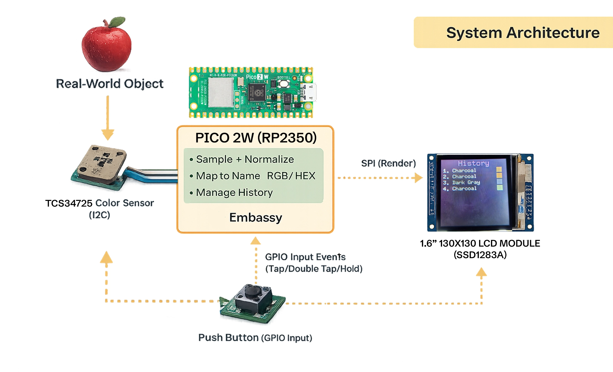
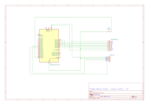

# ColorPicky — The Rust Real-Life Color Picker

A real-time color picking tool powered by Rust and Embassy for the RP2350.

:::info

**Author**: Razvan Andrei Timofte \
**GitHub Project Link**: https://github.com/UPB-PMRust-Students/project-dm-2025-razandtim

:::

## Description

ColorPicky is a compact, real-time color picking tool built in **Rust** using **Embassy** on the **RP2350 (Raspberry Pi Pico 2W)**. It reads colors from real-world objects using a TCS34725 sensor, identifies them by name and hex code, and keeps a history of your findings. Features include:

- **Real-time Color Sensing**: Reads RGB and Clear channel data from a TCS34725 sensor
- **Color Naming**: Matches the sampled color to the nearest known color name (e.g., "Red", "Sky Blue", "Forest Green")
- **Hex & RGB Display**: Shows the precise Hex code and RGB values on screen
- **History Mode**: Stores the last 10 saved colors in a scrollable history list
- **Interactive UI**: Main screen with live color preview and History screen for saved colors
- **Button Controls**: Hold for live sampling, tap to save, double tap to switch screens, long press to clear history

<iframe width="315" height="560" src="https://www.youtube.com/embed/nf3QsNqSgGU" frameborder="0" allowfullscreen></iframe>

## Motivation

This project was inspired by practical use-cases in graphic design, photo/video color grading, and UI branding, where it is useful to capture and reuse colors from physical objects. The second goal was to gain hands-on experience with embedded Rust on RP2350 using Embassy, integrating multiple peripherals (I2C + SPI + GPIO) in a responsive application.

## Architecture

The firmware is organized around three main components:

1. **Sensor Module**: Handles periodic I2C communication with the TCS34725 color sensor, reading RGBC values and converting them to standard RGB/HEX formats with nearest-match color naming.

2. **UI/Display Module**: Manages SPI communication with the SSD1283A LCD and uses `embedded-graphics` to render two screens:
   - Main Screen: Live color preview box, color name, and hex code
   - History Screen: Scrollable list of previously saved colors

3. **Input Handler**: Monitors the GPIO button and interprets gestures (tap, double tap, hold, long press) to control application behavior.

All components share an **Application State** containing the current sampled color and a ring-buffer history of saved colors.

## Log

### Week – 18-26 November

Ordered and received hardware parts (Pico 2W, TCS34725). Prepared breadboard wiring and verified power rails.

### Week – 29 December - 4 January

Verified peripherals individually:

- I2C communication with the TCS34725 (basic readout and sanity checks)
- SPI communication with the LCD (initialization + test drawing)
- GPIO button input (debounce and stable reads)

Set up Rust embedded environment and Embassy toolchain, configured the target, linker settings, and flashing workflow. Resolved early build/runtime issues on RP2350.

### Week – 12-18 January

Implemented the main application logic:

- Continuous sampling
- RGB/HEX conversion
- Color naming (nearest-match approach)
- UI screens + history buffer
- Input gestures (tap/double tap/long press)

Integration + stability improvements:

- Refined UI layout
- Improved responsiveness
- Added photos and documentation (pinout, usage, future work)

## Hardware

The project uses a Raspberry Pi Pico 2W as the main microcontroller, communicating with a TCS34725 RGB color sensor over I2C and an SSD1283A 1.6" LCD display over SPI. A push button connected to GPIO provides user input for controlling the application.

### Schematics

### Bill of Materials

| Device                                                                                                    | Usage                                         | Price                                                                                                                            |
| --------------------------------------------------------------------------------------------------------- | --------------------------------------------- | -------------------------------------------------------------------------------------------------------------------------------- |
| [Raspberry Pi Pico 2W](https://www.raspberrypi.com/documentation/microcontrollers/raspberry-pi-pico.html) | The microcontroller                           | [~31 RON](https://www.tme.eu/ro/details/sc1633/raspberry-pi-sisteme-incorporate/raspberry-pi/raspberry-pi-pico-2-w/)             |
| [TCS34725 RGB Color Sensor](https://www.dfrobot.com/product-1546.html)                                    | Reads RGB and Clear channel data from objects | [~40 RON](https://www.tme.eu/ro/details/df-sen0212/senzori-de-mediu/dfrobot/sen0212/)                                            |
| [SSD1283A 1.6" 130x130 SPI LCD](https://www.lcdwiki.com/1.6inch_SPI_Module_SSD1283A_SKU:MSP1601)          | Display for UI and color preview              | [~25 RON](https://www.emag.ro/afisaj-grafic-tft-lcd-130x130px-spi-1-6-inch-tft-16-ssd1283a-spi/pd/DBKNW6MBM/)                    |
| Push Button                                                                                               | User input for controlling the application    | [0.1 RON](https://www.optimusdigital.ro/en/buttons-and-switches/1119-6x6x6-push-button.html?search_query=push+button&results=69) |

## Software

| Library                                                                     | Description                | Usage                                                     |
| --------------------------------------------------------------------------- | -------------------------- | --------------------------------------------------------- |
| [embassy-rp](https://github.com/embassy-rs/embassy)                         | Embassy HAL for RP2350     | Async runtime and peripheral access for Pico 2W           |
| [embassy-executor](https://github.com/embassy-rs/embassy)                   | Embassy async executor     | Task scheduling and async/await support                   |
| [embedded-graphics](https://github.com/embedded-graphics/embedded-graphics) | 2D graphics library        | Drawing UI elements, text, and color boxes to the display |
| [defmt](https://github.com/knurling-rs/defmt)                               | Efficient embedded logging | High-performance debug logging via probe-rs               |

## Links

1. [Embassy - Rust Async Framework for Embedded](https://embassy.dev/)
2. [TCS34725 Datasheet](https://cdn-shop.adafruit.com/datasheets/TCS34725.pdf)
3. [Embedded Graphics Documentation](https://docs.rs/embedded-graphics/latest/embedded_graphics/)
4. [RP2350 Datasheet](https://datasheets.raspberrypi.com/rp2350/rp2350-datasheet.pdf)
5. [probe-rs - Embedded Debugging Toolkit](https://probe.rs/)

- Improve naming accuracy using perceptual distance (ex. CIE Lab / ΔE) and a larger palette
- Design a compact enclosure (3D printed casing)
- Add a web app
