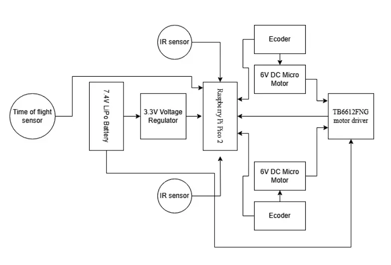

# Autonomous maze solving robot
A car like autonmous robot that can mapout an maze and solve it as fast as possible all by itself.

:::info 

**Author**: Velici Richard-Alexandru \
**GitHub Project Link**: https://github.com/UPB-PMRust-Students/project-SilentSleeper

:::

## Description

The robot will be a small size two wheeled car with the ability to find the shortest path through
an 8x8 cell maze and navigate it all by itself. In the spirit of the micromouse robot competitions, the
objective is to give the little robot the ability to navigate the maze and slowly find the end point, which
will always be at the middle of the grid, while at the same time map the maze layout for calculating the
shortest path. After this initial run of the maze is done the robot should come back to its initial position,
calculate the shortest path and try to get to the end point again using the calculated path, at full speed.
For the maze size specifications I will try to follow the requirements generally used by micromouse
competitions which means that the maze wall will be 5 cm tall and the path should have 18 cm in
width. Also, as I said previously, the grid will be 8x8 instead of the common 16x16.

## Motivation

I once saw a video about micromice robotics competitions, in which micro robots comptete in solving a maze like the ones famously used for testing the
inteligence of lab mouses. The entire concept looked interesting and it made me wonder what are the technical challanges that come with this kind of 
project. 

## Architecture 

The **Raspberry Pi Pico 2** is the central processing unit, serving the pourpse of comunicating with the sensors and processing the data from them for 
maping the maze layout and finding the best path to the center.

The **Time of Fligh** sensors are used for orientation using as refrence the left side walls and the front walls.

The **Motors** are used for mobility and also mapping of the maze through the integrated encoders 


## Log

<!-- write your progress here every week -->

### Week 5 - 11 May

Finished tying up loose end in the research for the project and made the documantation.

### Week 12 - 18 May

### Week 19 - 25 May

## Hardware

Besides the Pi Pico 2, the two ToF sensors and the motors which are the central arhitectural hardware components of the project, other important part
are:
- The 7.4V LiPo battery which will be used as the main power supply.
- A 3.3V regulator for bottlenecking the supply to the Raspberry board to its rated supply voltage.
- A second Raspberry Pi Pico 2 to act as debugger.
- Motor driver for optimal control of the two DC motors 

### Schematics

Place your KiCAD schematics here.

### Bill of Materials

<!-- Fill out this table with all the hardware components that you might need.

The format is 
```
| [Device](link://to/device) | This is used ... | [price](link://to/store) |

```

-->

| Device | Usage | Price |
|--------|--------|-------|
| [2x Raspberry Pi Pico 2](https://www.raspberrypi.com/documentation/microcontrollers/raspberry-pi-pico.html) | The microcontroller + Debugger | [93.98 RON](https://ardushop.ro/ro/raspberry-pi/2453-raspberry-pi-pico-2-5056561803951.html) |
| [2x N20 6V Micro Motor DC with reduction and encoder] | Movement and mapping of maze | [98.16 RON](https://www.robofun.ro/arduino-original/ga12-n20-6v-1000rpm-micro-motor-dc-cu-reductor-si-encoder.html) |
| [TB6612FNG motor driver](https://octopart.com/datasheet/tb6612fng%2Cc%2C8%2Cel-toshiba-50464480?msclkid=cf8cf70b84d81a6e72d89f10c2b60bf4&utm_source=bing&utm_medium=cpc&utm_campaign=b_cpc_emea-ro_search_dsa_english_en_usd_all-categories&utm_term=semiconductors&utm_content=Discrete%20Semiconductors%20DSA) | Motor Driver | [26.01 RON](https://ardushop.ro/en/motors-and-drivers/517-tb6612fng-dual-motor-driver-module-6427854006028.html) |
| [2x VL53L0X time of flight sensor](https://www.st.com/resource/en/datasheet/vl53l0x.pdf) | Orientation in the maze | [69.98 RON](https://www.optimusdigital.ro/ro/senzori-senzori-de-distanta/3322-modul-senzor-de-masurare-a-distanei-bazat-pe-viteza-luminii-cjmcu-vl53l0x.html?search_query=VL53L0X&results=5) |
| [AMS1117-3.3V voltage regulator](https://www.alldatasheet.com/datasheet-pdf/pdf/205691/ADMOS/AMS1117-3.3.html) | Pico voltage bottleneck | [3.30 RON](https://ardushop.ro/ro/alimentare/1734-regulator-de-tensiune-dc-dc-ams1117-33v-step-down.html) |
| 7.4V LiPo Battery| Main power supply | [113,22 RON](https://www.emag.ro/baterie-action-sport-games-7-4-v-1000-mah-17462/pd/D0C566MBM/?X-Search-Id=5f3bdae4993f5625bfee&X-Product-Id=166743067&X-Search-Page=1&X-Search-Position=38&X-Section=search&X-MB=0&X-Search-Action=view) |
| Pololu wheels 40x7 mm | Movement | [30.52](https://www.robofun.ro/mecanice/pololu-roti-40-7mm-white.html) |
| Wires | Electrical connections | [7.99 RON](https://www.optimusdigital.ro/ro/fire-fire-mufate/12-set-de-cabluri-pentru-breadboard.html?search_query=fire&results=429) |
| Ball caster | Movement stability| [3.95 RON](https://www.optimusdigital.ro/ro/mecanica-suporturi-cu-bila/74-ball-caster.html?search_query=ball+caster&results=5) |
| 2x SMD Button| Powering up and manual control | [1.16 RON](https://www.optimusdigital.ro/ro/butoane-i-comutatoare/8546-buton-smd-3-x-6-x-25-mm-alb.html?search_query=buton+smd+3&results=6) |


## Software

| Library | Description | Usage |
|---------|-------------|-------|
| [embassy-rp](https://github.com/embassy-rs/embassy) | HAL in rust  | Embassy support for Raspberry Pi Pico |
| [embedded-time](https://docs.rs/embassy-time/latest/embassy_time/) | Timing library | Async timers & delays in rust |
| [embassy-executor](https://docs.rs/embassy-executor/latest/embassy_executor/struct.Executor.html) | Async task executor framwork | Parallel processing in rust |

## Links

<!-- Add a few links that inspired you and that you think you will use for your project -->
Will add.
...
