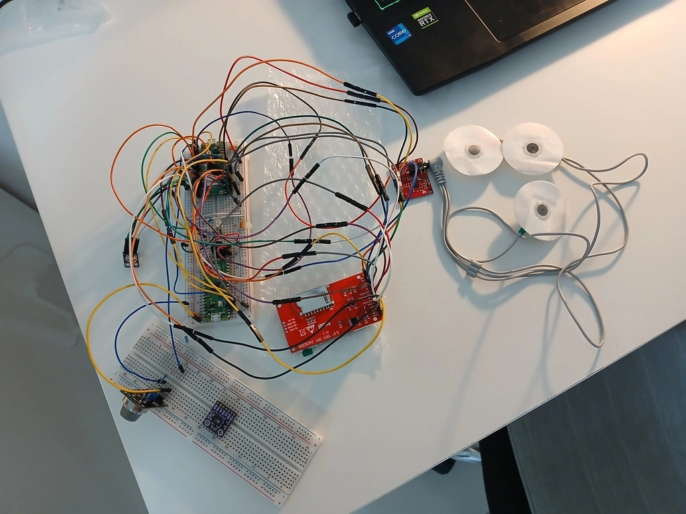
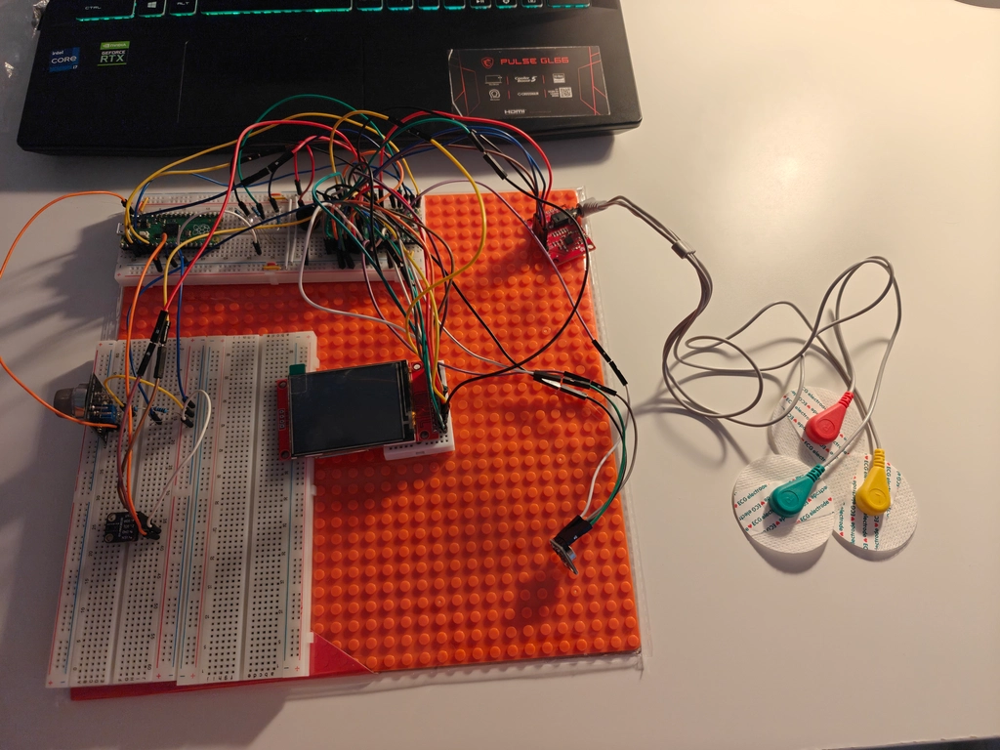
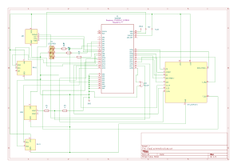

# VitalPi
Meet Your Personal Health Guardian - Real-time Vital Monitoring at Your Fingertips

:::info 

**Author**: Bachynskyi Roi \
**GitHub Project Link**: https://github.com/UPB-PMRust-Students/project-frihetselsker

:::

## Description

It is a stationary health station featuring body temperature, ECG, and air quality sensors allowing evaluate your wellness from home. The system provides immediate notifications and results on site, while transmitting health data wirelessly to the server for remote monitoring and better view.

## Motivation

I chose VitalPi to democratize healthcare monitoring, making vital health data accessible to everyone regardless of location or resources. This solution brings decent health monitoring into homes and underserved communities potentially improving health outcomes for those with limited access to regular medical care.

## Architecture 
### Schematics
This diagram reflects the concept of connections of every part in this project.

---

**Raspberry Pi Pico 2W**

*Role:* Central controller for the entire health station system

*Connections:* GPIO pins for all sensors, display, LED, and buzzer

*Function:* Collects data from sensors, processes readings, manages notifications, and sends data to server

---

**Touchscreen Display**

*Interface:* SPI

*Role:* User interface for health monitoring station

*Connections:* GPIO10 - 13, GPIO16 - 22

*Function:* Displays real-time health metrics, allows user interaction with the system

---

**Temperature Sensor**

*Interface:* I2C

*Role:* Monitors body or ambient temperature

*Connections:* GPIO14 and GPIO15

*Function:* Provides temperature readings for health assessment

---

**Air Quality Sensor**

*Interface:* ADC

*Role:* Detects air pollutants, VOCs, or specific gases

*Connections:* GPIO27(ADC1)

*Function:* Monitors environmental air quality that could affect health

---

**ECG Sensor**

*Interface:* ADC

*Role:* Captures electrical signals from the heart

*Connections:* GPIO26(ADC0)

*Function:* Records cardiac activity for heart health monitoring

---

**BPE-SpO2 Sensor:**

*Interface:* I2C

*Role:* Measures blood oxygen saturation and pulse rate

*Connections:* GPIO8 and GPIO9

*Function:* Monitors oxygen levels in blood and heart rate, critical vital signs for overall health assessment

---
**RGB LED**

*Interface:* PWM

*Role:* Visual notification system

*Connections:* GPIO2, GPIO3, and GPIO4 with current-limiting resistors

*Function:* Color-coded alerts based on sensor readings

---

**Passive Buzzer**

*Interface:* PWM

*Role:* Audible notification system

*Connections:* GPIO28

*Function:* Sounds alerts

---

**Web Application**

*Interface:* Wi-Fi

*Role:* Data visualization and remote monitoring interface

*Features:* Displays historical data trends, allows data export for medical professionals

*Function:* Provides accessible interface for viewing health data 

## Log

### Week 5 - 11 May

I imported all my work-in-progress materials to the project's repository where every component was tested except MAX30102, which I was trying to replace that time. I made all the connections with respect to the uploaded KiCAD schematics.

### Week 12 - 18 May

My goal was to unify all the code that I had had before and make one program with several tasks from it. What is more, I have started to work on the UI of the project. The biggest issue I faced was handling the signal from BPE sensor which was too difficult to set up.

### Week 19 - 25 May

During the final week, I managed to connect every single component to the holistic system, wrapped it into a convenient box. I faced some problems with Wi-Fi and PubSubChannels, but now it works and can be used by a user.

## Hardware

VitalPi utilizes a Raspberry Pi Pico 2W microcontroller as its processing core and webbite communicator, paired with a TFT LCD touchscreen (240×320px) for user interaction. Health monitoring is provided through an AD8232 ECG sensor module for cardiac activity, an MLX90614ESF infrared temperature sensor for contactless temperature readings, and a GY-MAX30102 optical heart rate and blood oxygen sensor. Environmental monitoring comes from an MQ135 gas sensor configured with a 10kΩ/20kΩ resistor voltage divider. User notifications are delivered via an RGB LED (with 220Ω current-limiting resistors) for visual alerts and a passive buzzer for audible warnings.

### Schematics

This is the KiCad Schematics of the project.

### Bill of Materials

| Device | Usage | Price |
|--------|--------|-------|
| [Raspberry Pi Pico 2W](https://www.raspberrypi.com/documentation/microcontrollers/raspberry-pi-pico.html) | The microcontroller that processes all sensor data and manages wireless connectivity | [35 RON](https://www.optimusdigital.ro/en/raspberry-pi-boards/12394-raspberry-pi-pico-w.html) |
|[2.4" TFT LCD Touchscreen (240×320px)](http://www.lcdwiki.com/2.4inch_SPI_Module_ILI9341_SKU:MSP2402)|User interface display for viewing health data and interacting with the system|[54 RON](https://www.emag.ro/display-tactil-tft-lcd-240-x-320-px-cu-cititor-sd-spi-2-4-inch-gri-rosu-tft-24-ili9341-restouch-spi/pd/D49CJMYBM/?utm_campaign=share_product&utm_source=mobile_dynamic_share&utm_medium=android)|
|[MLX90614ESF Infrared Temperature Sensor](https://www.melexis.com/en/product/MLX90614/Digital-Plug-Play-Infrared-Thermometer-TO-Can) |Non-contact temperature measurement for body and ambient temperature monitoring|[60 RON](https://www.optimusdigital.ro/en/temperature-sensors/138-mlx90614esf-infrared-temperature-sensor.html?gad_source=1&gclid=Cj0KCQjwoNzABhDbARIsALfY8VP4KOk-uamBw2aAAHJ--2XHtenjYjfFNSvu1_ldMD97vs0Ro4AwfvkaAomFEALw_wcB)|
|[AD8232 ECG Sensor Module](https://www.google.com/url?sa=t&source=web&rct=j&opi=89978449&url=https://www.analog.com/media/en/technical-documentation/data-sheets/ad8232.pdf&ved=2ahUKEwivq-_73YmNAxWgSfEDHfFSNnEQFnoECCEQAQ&usg=AOvVaw1ZekMJX-ZT0NP6lisc-KfI) |Single-lead electrocardiogram sensor for heart activity monitoring and analysis|[35 RON](https://www.google.com/url?sa=t&source=web&rct=j&opi=89978449&url=https://www.optimusdigital.ro/en/others/1347-modul-senzor-ecg-ad8232.html%3Fsrsltid%3DAfmBOoq7ktMvGHH3i34NuyOIysD9tOLrn9shzC3jfg7yPPLJ9DLfWkmG&ved=2ahUKEwjU0LKh3omNAxUTRPEDHaxjITIQFnoECCYQAQ&usg=AOvVaw3B14kha6sXv0jADqs4gqSQ)|
|[MQ135 Gas Sensor](https://www.olimex.com/Products/Components/Sensors/Gas/SNS-MQ135/resources/SNS-MQ135.pdf)|Air quality detection for monitoring harmful gases and environmental conditions|[16 RON](https://www.bitmi.ro/modul-senzor-calitate-aer-mq135-10423.html?gad_source=1&gclid=Cj0KCQjwoNzABhDbARIsALfY8VMkJt8lr23lYsZGiwqCjhqz0_K5gn6aomgZT2sPRCyjlESzoN40NHAaAshEEALw_wcB)|
|[Breakout heart rate sensor GY-MAX30102](https://www.instructables.com/Guide-to-Using-MAX30102-Heart-Rate-and-Oxygen-Sens/)|Pulse oximetry sensor for monitoring blood oxygen levels and heart rate|[14 RON](https://www.emag.ro/breakout-senzor-ritm-cardiac-robofun-gy-max30102-pentru-arduino-00005330/pd/DJQVF1YBM/)|
|[Passive Buzzer Module](https://www.handsontec.com/dataspecs/module/passive%20buzzer.pdf)|Audio notification system for alerts and warnings|[2 RON](https://www.optimusdigital.ro/en/electronic-components/12598-passive-buzzer-module.html)|
|[RGB LED Common Cathode](https://www.mouser.com/catalog/specsheets/Soldered_100105%205mm%20RGB%20LED%20diode%20common%20cathode.pdf?srsltid=AfmBOooEda5-sqCRuQ-qNjnFkSjChamOBkOXMJI-_FxKITltrbbSo-8I)|Visual status indicator showing system and health conditions through color coding|[1 RON](https://www.optimusdigital.ro/en/leds/483-rgb-led-common-cathode.html?srsltid=AfmBOoqqRw8qCkA0KuLfmskkMIM2O0KJjFAchG4kDGp_oNTNVTboTiOw)|
|[3 x 220Ω Resistors](https://www.optimusdigital.ro/en/resistors/10958-05w-220-resistor.html) |Current-limiting components for the RGB LED|[0,30 RON](https://www.optimusdigital.ro/en/resistors/10958-05w-220-resistor.html)|
|[1 kΩ Resistor](https://www.optimusdigital.ro/en/resistors/859-025w-1k-resistor.html?srsltid=AfmBOopYUKWi3_R7jO7hJJaGlh9ly_XcDNCyIgR8xsUILaELgU_VR-Gc)|Component of voltage divider for MQ135 gas sensor|[0,10 RON](https://www.optimusdigital.ro/en/resistors/859-025w-1k-resistor.html?srsltid=AfmBOopYUKWi3_R7jO7hJJaGlh9ly_XcDNCyIgR8xsUILaELgU_VR-Gc)|
|[2 kΩ Resistor](https://www.optimusdigital.ro/en/resistors/851-025w-22k-resistor.html?srsltid=AfmBOorNykvdmztfEqMvz_hlfJonyaACrUh2bPOsvN76Xk9tm9VrWeT7)|Component of voltage divider for MQ135 gas sensor|[0,10 RON](https://www.optimusdigital.ro/en/resistors/851-025w-22k-resistor.html?srsltid=AfmBOorNykvdmztfEqMvz_hlfJonyaACrUh2bPOsvN76Xk9tm9VrWeT7)|

## Software

| Library | Description | Usage |
|---------|-------------|-------|
| [embassy-rp](https://github.com/embassy-rs/embassy)| Embassy support for Raspberry Pi RP2350|Runs async embedded tasks on Raspberry Pi Pico 2W|
|[embassy-embedded-hal](https://github.com/embassy-rs/embassy)|Async implementation of embedded-hal traits|Interfaces with async-compatible embedded peripherals|
|[embassy-sync](https://github.com/embassy-rs/embassy)|Synchronization primitives for async embedded Rust|Used for mutexes, signals, and channels in concurrent tasks|
|[embassy-executor](https://github.com/embassy-rs/embassy)|Async task executor for bare-metal embedded systems|Manages scheduling and running async tasks on the device|
|[embassy-futures](https://github.com/embassy-rs/embassy)|Lightweight async utilities for embedded systems|Provides futures and combinators used in async workflows|
|[embassy-time](https://github.com/embassy-rs/embassy)|Timekeeping and delays for embedded systems|Used for timers, delays, and task timeouts|
|[embassy-net](https://github.com/embassy-rs/embassy)|Async TCP/IP networking stack|Handles communication between device and remote server|
|[embassy-net-wiznet](https://github.com/embassy-rs/embassy)|Wiznet W5500 Ethernet driver for Embassy|Provides Ethernet connectivity support|
|[cyw43](https://github.com/embassy-rs/embassy)|Driver for the CYW43 Wi-Fi chip|Provides Wi-Fi connectivity to the Raspberry Pi Pico 2W|
|[cyw43-pio](https://github.com/embassy-rs/embassy)|PIO-based CYW43 driver implementation|Allows communication with CYW43 via the Pico's PIO|
|[defmt](https://github.com/knurling-rs/defmt)|Logging framework optimized for embedded devices|Used for low-overhead logging during debugging|
|[defmt-rtt](https://github.com/knurling-rs/defmt)|Backend for defmt using RTT (Real-Time Transfer)|Enables real-time logging over debug probe|
|[cortex-m-rt](https://github.com/rust-embedded/cortex-m)|Runtime for Cortex-M microcontrollers|Sets up interrupt vectors and program entry point|
|[panic-probe](https://github.com/knurling-rs/defmt)|Panic handler for defmt-enabled embedded apps|Captures and displays panics for debugging|
|[embedded-hal-async](https://github.com/rust-embedded/embedded-hal)|Asynchronous embedded-hal traits|Defines async traits for interacting with hardware|
|[display-interface-spi](https://github.com/therealprof/display-interface)|SPI interface for display drivers|Provides abstraction for SPI-based display communication|
|[ili9341](https://github.com/yuri91/ili9341-rs)|Driver for ILI9341 LCD display controller|Enables graphics output to ILI9341-based displays|
|[heapless](https://github.com/rust-embedded/heapless)|Data structures that don't require dynamic memory|Used for buffers and queues with guaranteed memory use|
|[xpt2046](https://github.com/nullstalgia/mff-hr-v1/tree/master/xpt2046)|Touchscreen driver for XPT2046|Reads user input from resistive touchscreen displays|
|[micromath](https://github.com/tarcieri/micromath)|Lightweight math library for microcontrollers|Used for computations like ECG signal processing|
|[mlx9061x](https://github.com/eldruin/mlx9061x-rs)|Driver for MLX90614 temperature sensor|Used for contactless infrared temperature measurement|
|[embedded-graphics](https://github.com/embedded-graphics/embedded-graphics)|2D graphics library|Used for drawing to the display|
|[static_cell](https://github.com/embassy-rs/static-cell)|Statically allocated, initialized at runtime cell|Provides safe static storage for async resources|
|[embedded-io-async](https://github.com/rust-embedded/embedded-io)|Async I/O traits for embedded systems|Enables async I/O operations for networking and communication|

### Software Design

#### Architecture Overview

The software follows an async task-based architecture using the Embassy framework. The application is structured around independent async tasks that communicate through publish-subscribe channels and simple channels, enabling real-time sensor monitoring while maintaining responsive user interaction.

#### Core Components

**Task Architecture**

The system implements eight primary async tasks, each responsible for specific functionality:

- **`main`** - System initialization and task spawning
- **`wifi_task`** - Network communication and cloud data transmission  
- **`display_task`** - User interface state machine and touchscreen handling
- **`led_task`** - Visual feedback system with color-coded health indicators
- **`buzzer_task`** - Audio notification system for alerts and confirmations
- **`temp_task`** - Temperature sensor monitoring via I²C
- **`adc_task`** - ECG measurement using AD8232 sensor and Air Quality measurement using MQ135 sensor
- **`bpm_task`** - BPM and Saturation measurement using MAX30102 via I²C

**Communication System**

Inter-task communication is handled through Embassy's **publish-subscribe channels**. This decoupled architecture allows tasks to operate independently while coordinating through standardized `Command` messages that specify source device, target device, and requested action. The data is sent via simple **channels** to ensure that it has been transfered successfully.

**Device Abstraction**

Hardware interfaces are abstracted through the **pins module**, which groups related GPIO pins into logical bundles. This abstraction simplifies hardware management and enables clean separation between hardware configuration and application logic.

#### State Management

**Display State Machine**

The user interface operates as a comprehensive state machine with states for each measurement workflow:
- **Startup sequence** with visual/audio feedback
- **Main menu** for measurement selection  
- **Measurement states** (ECG, pulse/SpO₂, temperature, air quality)
- **Data transmission states** with cloud upload feedback
- **Success/failure states** with retry capabilities

**Sensor Data Flow**

Sensor readings follow a standardized pipeline:
1. **Measurement initiation** through display commands
2. **Data collection** by dedicated sensor tasks
3. **Processing and validation** within sensor-specific logic
4. **Display presentation** with health status indicators
5. **Cloud transmission** via WiFi with success confirmation

#### Real-time Capabilities

The Embassy executor enables **cooperative multitasking** where tasks voluntarily yield control during I/O operations or delays. This approach ensures:
- **Responsive UI** - Touch events processed within 50ms polling intervals
- **Continuous monitoring** - Sensors operate independently without blocking other tasks
- **Efficient resource usage** - No preemptive context switching overhead
- **Deterministic timing** - Precise control over measurement windows and data transmission

**Memory Management**

The system uses **static allocation** exclusively through `heapless` data structures and `static_cell` for async resources. 

### Software Diagram

## Links

<!-- Add a few links that inspired you and that you think you will use for your project -->

1. [Datasheet for MAX30102](https://www.analog.com/media/en/technical-documentation/data-sheets/max30102.pdf)
2. [Embedded-canvas for better update on the screen](https://crates.io/crates/embedded-canvas)

