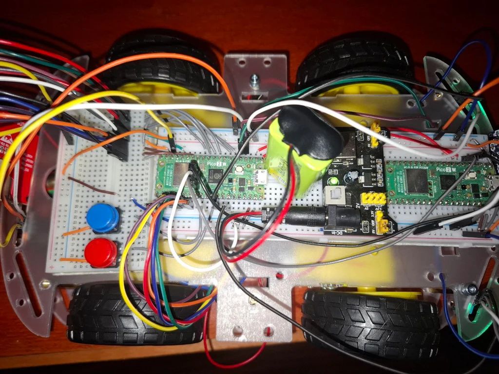
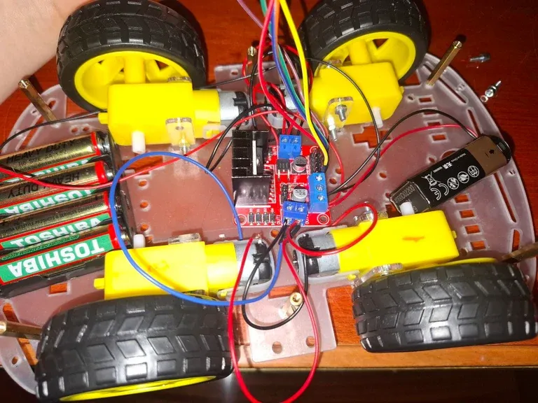
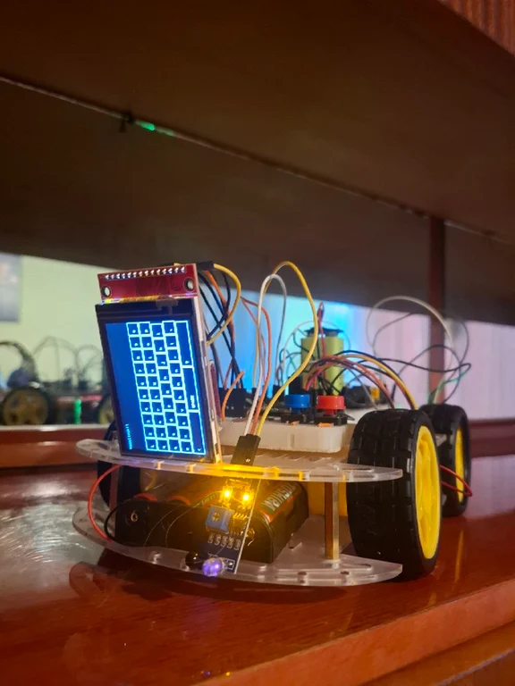
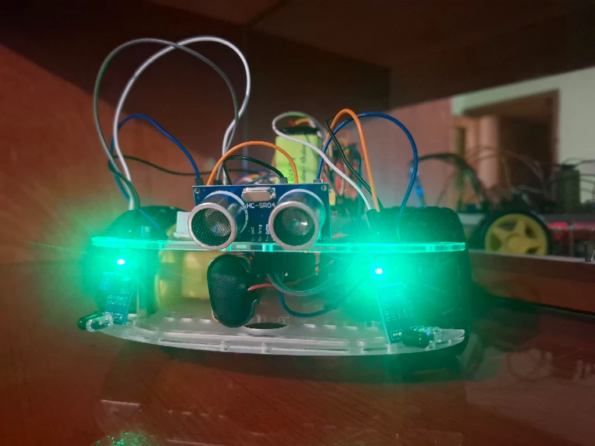
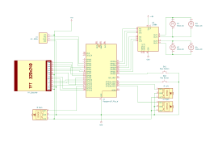

# PicoDeliver
A robotic message and small item delivery system

:::info 

**Author**: Sofiia Huzhan \
**GitHub Project Link**: https://github.com/UPB-PMRust-Students/project-demesup

:::

## Description

PicoDeliver is a robotic system that delivers messages and small items within a local area. Messages can be entered  either through the device's display interface or via a web interface. The robot wanders around. When the recipient, and when they signal their presence through the website, the robot stops to deliver its payload.

## Motivation

I built this because robots are cool. There’s something satisfying about making a machine move, react to sensors, and  follow commands. It’s like bringing code to life, and that never gets old.

But beyond just fun, I wanted something more personal than another phone notification. Why text my roommate "Where’s the charger?" when a little robot could deliver the message instead? It’s playful, practical, and a great way to learn.

## Architecture 

### 1. Raspberry Pi Pico (Pico #1)

**Role:** Main microcontroller (brains of the operation)

**Interfaces:**
- GPIO (Digital I/O)
- SPI (for display)
- WiFi (TCP communication)

**Functions:**
- Reads inputs from sensors (IR, ultrasonic, buttons)
- Controls motors through the motor driver
- Displays data on the SPI screen
- Communicates with a web application

**Connections:**
- GPIO → Motor Driver (control signals)
- GPIO ← IR Proximity Sensors, Ultrasonic Sensor, Buttons
- SPI → Display
- WiFi ↔ Web App (bidirectional)
- Power Input ← Battery (5V via Power Supply Module)

---

### 2. Motor Driver (L298N or compatible)

**Role:** Amplifies control signals to drive motors

**Interface:**
- GPIO (from Pico)
- Vin (12V power input)
- Motor output channels

**Functions:**
- Converts low-power signals into high-current motor commands
- Controls motor direction and speed

**Connections:**
- GPIO ← Pico (control pins)
- Vin ← Battery (12V power input)
- Output → Left and Right Motors

---

### 3. IR Proximity Sensors (Left, Right and Rear)

**Role:** Detects nearby objects for navigation or avoidance

**Interface:** GPIO

**Functions:**
- Emits IR light and senses reflections
- Provides distance indication

**Connections:**
- Signal → Pico GPIO
- Power and Ground → Power Supply

---

### 4. Ultrasonic Sensor (HC-SR04)

**Role:** Measures distance to obstacles

**Interface:** GPIO (trigger and echo pins)

**Functions:**
- Sends ultrasonic pulse and receives echo
- Calculates distance based on echo time

**Connections:**
- Trigger → Pico GPIO
- Echo ← Pico GPIO

---

### 5. Buttons (Red and Blue)

**Role:** Manual input for control

**Interface:** GPIO (digital)

**Functions:**
- Allows easier interction with the robot

**Connections:**
- Signal → Pico GPIO

---

### 6. Display (SPI)

**Role:** Provides visual feedback

**Interface:** SPI (MOSI, SCK, CS)

**Functions:**
- Displays sensor values, status indicators, menus, keyboard

**Connections:**
- SPI Lines ← Pico

---

### 7. Web App

**Role:** Enables remote control and monitoring

**Interface:** WiFi (TCP/IP)

**Functions:**
- Sends control commands to Pico
- Receives real-time sensor data

**Connections:**
- WiFi ↔ Pico (TCP communication)

---

### 8. Power Supplies

- **Pico:** Powered by a battery via Power Supply Module
- **Motor Driver:** Powered directly from 9V + 4×1.5V batteries

## Log

### Week 5 - 11 May

After receiving the components, I tested their functionality and researched compatible software libraries for my
hardware setup. Once verified, I proceeded with system design.

### Week 12 - 18 May

Focused on implementing the remote control functionality and integrating it with the display system. Developed the basic
logic for the menu navigation and began working on the on-screen keyboard, including input handling and layout
structuring.

### Week 19 - 25 May

## Hardware

### Component Details
- **Raspberry Pi Pico 2W**: The brain of the operation, running all control logic
- **DC Motors**: 4 gearmotors providing wheel movement (2 per side)
- **L298N Driver**: Powers and controls motor speed/direction
- **Infrared Sensors**: Left/right/rear obstacle detection (reflectance sensors)
- **Ultrasonic Sensor**: Front-facing distance measurement (2cm-400cm range)
- **TFT Display**: 2.4" color screen with touch input for user interface
- **Buttons**: Physical input for selection
- **Dupont Wires**: Jumper cables for all electrical connections
- **Chassis**: Frame holding all components
- **Power Supply Module**: 9V battery to 5V regulator, powers up the components
- **Motor Power Supply**: Direct 9V battery connection(with 4×1.5V battery pack as boost power)

### Schematics

Here is the KiCad schematics. On the schematics Power Supply Module is denoted as +5V for simplicity

### Bill of Materials

| Device | Usage | Price |
|--------|-------|-------|
| [Raspberry Pi Pico 2W *2](https://www.raspberrypi.com/documentation/microcontrollers/raspberry-pi-pico.html) | Microcontroller board | [39.66 RON each (79.32 RON total)](https://www.optimusdigital.ro/ro/placi-raspberry-pi/13327-raspberry-pi-pico-2-w.html) |
| [DC Motor (×4)](https://ardushop.ro/ro/electronica/752-motor-dc-3v-6v-cu-reductor-1-48-6427854009609.html) | Wheel drive motors | ~7 RON each (28 RON total) |
| [L298N Dual Motor Driver Module](https://www.optimusdigital.ro/ro/drivere-de-motoare-cu-perii/145-driver-de-motoare-dual-l298n.html) | Motor control | 10.99 RON |
| [Infrared Obstacle Sensor (×3)](https://www.optimusdigital.ro/ro/senzori-senzori-optici/4514-senzor-infrarosu-de-obstacole.html) | Object detection | 3.49 RON each (10.47 RON total) |
| [HC-SR04 Ultrasonic Sensor](https://www.optimusdigital.ro/ro/senzori-senzori-ultrasonici/9-senzor-ultrasonic-hc-sr04-.html) | Distance measurement | 6.49 RON |
| [10cm Dupont Wires (40-pin)](https://www.optimusdigital.ro/ro/fire-fire-mufate/653-fire-colorate-mama-tata-40p-10-cm.html) | Short connections | 5.17 RON |
| [20cm Dupont Wires (40-pin)](https://www.optimusdigital.ro/ro/fire-fire-mufate/92-fire-colorate-mama-tata-40p.html) | Long connections | 5.99 RON |
| [2.4" SPI TFT Display](https://www.emag.ro/display-tactil-tft-lcd-240-x-320-px-cu-cititor-sd-spi-2-4-inch-gri-rosu-tft-24-ili9341-restouch-spi/pd/D49CJMYBM/) | User interface | 47.99 RON |
| [Buttons(×2)](https://www.optimusdigital.ro/ro/butoane-i-comutatoare/1115-buton-cu-capac-rotund-alb.html) | Option selection | 1.99 RON each (3.98 RON total) |
| Chasis | Base for the robot | 30 RON |
| [Power Supply Module](https://www.optimusdigital.ro/ro/electronica-de-putere-stabilizatoare-liniare/61-sursa-de-alimentare-pentru-breadboard.html) | Power Supply | 4.69 RON |
## Software

| Library | Description | Usage |
|---------|-------------|-------|
| [heapless](https://crates.io/crates/heapless) | Stack-allocated data structures | Creating fixed-size strings for LCD writing |
| [embassy-time](https://crates.io/crates/embassy-time) | Timekeeping for async embedded | Delays, timeouts and scheduling |
| [embassy-executor](https://crates.io/crates/embassy-executor) | Async/await executor | Managing concurrent tasks |
| [embassy-sync](https://crates.io/crates/embassy-sync) | Synchronization primitives | Inter-task communication and resource sharing |
| [micromath](https://crates.io/crates/micromath) | Sensor data processing |  |
| [fixed](https://crates.io/crates/fixed) | Fixed-point math for sensors |  |
| [embedded-graphics](https://github.com/embedded-graphics/embedded-graphics) | 2D graphics primitives and text rendering | Drawing shapes, text and UI elements |
| [ili9341](https://crates.io/crates/ili9341) | TFT LCD display driver | Controlling screen output and display settings |
| [xpt2046](https://github.com/nullstalgia/mff-hr-v1/tree/master/xpt2046) | Resistive touch controller driver | Handling touch input and calibration |

## Links

1. Inspiration: [Delievery robots](https://www.youtube.com/shorts/X4sxt9EzPo8)
