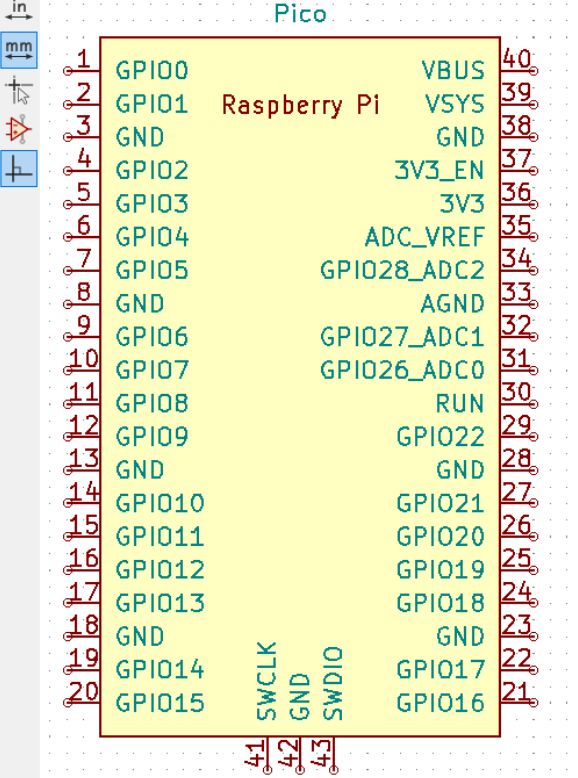

# Home Assistant

A voice controlled smart home assistant using the Raspberry Pi Pico 2W and OpenAI API
:::info 

**Author**: Khalifa Tawfek\
**GitHub Project Link**: https://github.com/UPB-PMRust-Students/project-KhalifaTawfek

:::

## Description

This project aims to build a voice controlled smart home assistant using the Raspberry Pi Pico 2W It connects to the internet and smart devices via Wi-Fi and communicates with OpenAI's API to provide intelligent voice responses. The device listens to voice commands through a digital microphone and responds through a speaker using an I2S DAC/amplifier. The entire system runs embedded Rust using the Embassy framework.

## Motivation

I've always been fascinated by artificial intelligence, especially its ability to understand and respond to natural language. Integrating AI into a compact embedded system for home automation is both a technical and creative challenge. With the Raspberry Pi Pico 2W and OpenAI's API this project bridges embedded systems and conversational AI to create a meaningful smart home experience.

## Architecture

### Schematic Diagram

**Main Architecture Components:**

* **Voice Command Interface**

  * INMP441 Microphone → captures user speech (via I2S)
* **Pico 2W Core Logic**

  * Processes audio and sends requests to OpenAI
* **Wi-Fi Communication Module**

  * Uses `embassy-net` for HTTP requests
* **OpenAI API**

  * Converts speech to intent, generates text responses
* **Response Output**

  * MAX98357A I2S amplifier + speaker (via I2S)
* **Optional Smart Device Control**

  * GPIOs or MQTT over Wi-Fi

**Connections:**

* **Microphone (INMP441)** → I2S input (Microphone → GPIO + I2S pins)
* **Speaker (via MAX98357A DAC)** → I2S output (Speaker ← GPIO + amplifier)
* **Wi-Fi**: Built-in (no external wiring needed)
* **GPIOs** → Relays/LEDs/smart devices (optional)

## Log

### Week 5 – 11 May

* Switched from ESP32 to Raspberry Pi Pico 2W
* Reviewed Embassy framework and I2S support in Rust

### Week 12 – 18 May

### Week 19 – 25 May

## Hardware

The project uses:

* **Raspberry Pi Pico 2W**: Core controller with Wi-Fi and GPIO
* **INMP441 Microphone**: I2S digital microphone for audio input
* **MAX98357A Amplifier**: I2S DAC and amplifier for audio output
* **Speaker**: Outputs OpenAI-generated responses
* **Breadboard + jumper wires**: For prototyping and easy rewiring
* **Optional Relays / LEDs**: For controlling or indicating smart home devices

### Schematics

* **Microphone to Pico**: INMP441 → I2S (BCLK, LRCL, DOUT)
* **Amp to Pico**: MAX98357A → I2S (BCLK, LRCL, DIN)
* **Power**: 3.3V from Pico
* **Wi-Fi**: Built-in (no external wiring needed)

### Bill of Materials

| Device                                                                                              | Usage                             | Price    |
| --------------------------------------------------------------------------------------------------- | --------------------------------- | -------- |
| [Raspberry Pi Pico 2W](https://www.raspberrypi.com/documentation/microcontrollers/pico-series.html) | Main controller with Wi-Fi        | \~40 RON |
| [INMP441 I2S Microphone](https://www.adafruit.com/product/3421)                                     | Captures voice input              | \~5 RON  |
| [MAX98357A I2S Amp](https://www.adafruit.com/product/3006)                                          | Converts digital signal to analog | \~5 RON  |
| [Speaker](https://www.optimusdigital.ro/)                                                           | Outputs responses                 | \~10 RON |
| Breadboard + Wires                                                                                  | Prototyping                       | \~5 RON  |
| [Relay Module (Optional)](https://www.optimusdigital.ro/)                                           | Controls appliances               | \~7 RON  |

## Software

All written in **Rust** using **Embassy** for async embedded development.

| Library                                                                      | Description                           | Usage                     |
| ---------------------------------------------------------------------------- | ------------------------------------- | ------------------------- |
| [embassy-rp](https://docs.embassy.dev/embassy-rp/git/rp235xb/index.html)     | Raspberry Pi Pico HAL                 | GPIO, I2S, ADC, PWM       |
| [embassy-net](https://docs.embassy.dev/embassy-net/git/default/index.html)   | Async network stack                   | Wi-Fi, HTTP               |
| [embassy-time](https://docs.embassy.dev/embassy-time/git/default/index.html) | Time management                       | Delays & timers           |
| [embedded-hal-async](https://docs.rs/embedded-hal-async/)                    | Standard async hardware abstraction   | Unified control           |
| [reqwest](https://docs.rs/reqwest/)                                          | HTTP client in Rust                   | Communicates with OpenAI  |
| [i2s-rs (custom)](https://github.com/)                                       | (If needed) low-level I2S abstraction | Audio I/O                 |
| [OpenAI API](https://platform.openai.com/docs)                               | API endpoint                          | Natural language response |

## Future Additions

* Voice wake word (local or cloud-based)
* Local keyword control for lights/devices
* Touch screen or LCD for visual feedback

