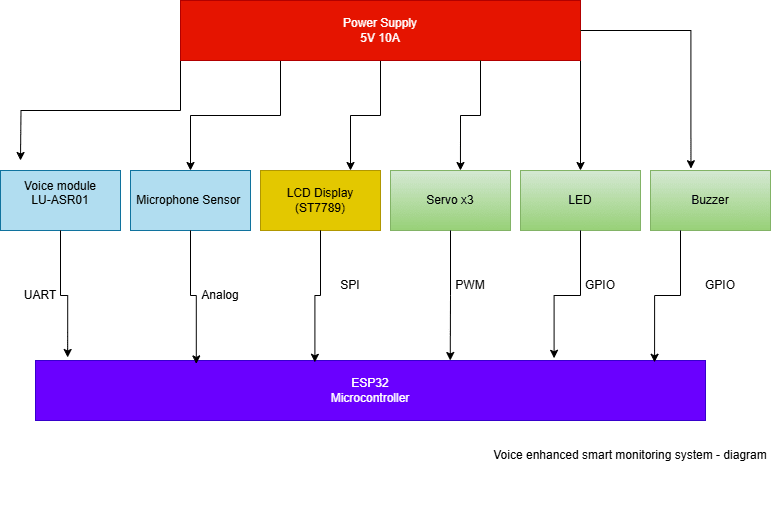
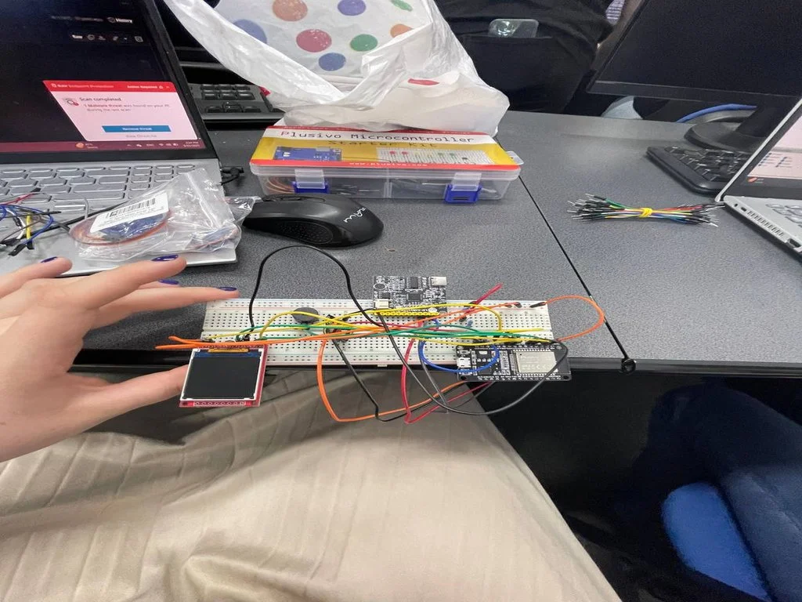
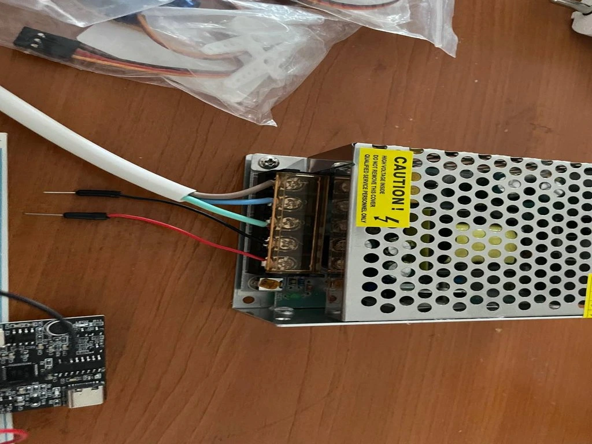
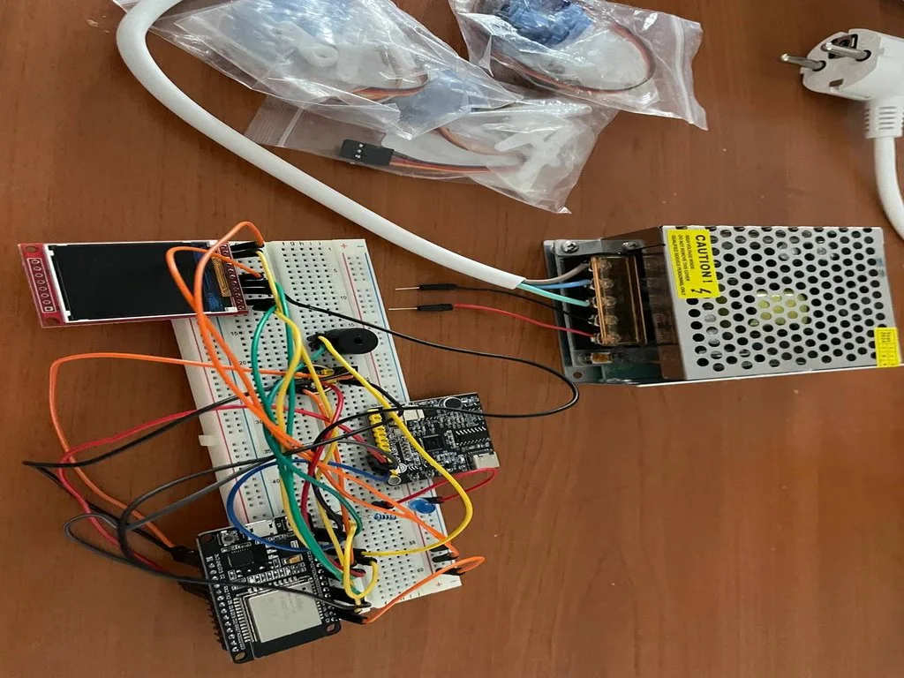
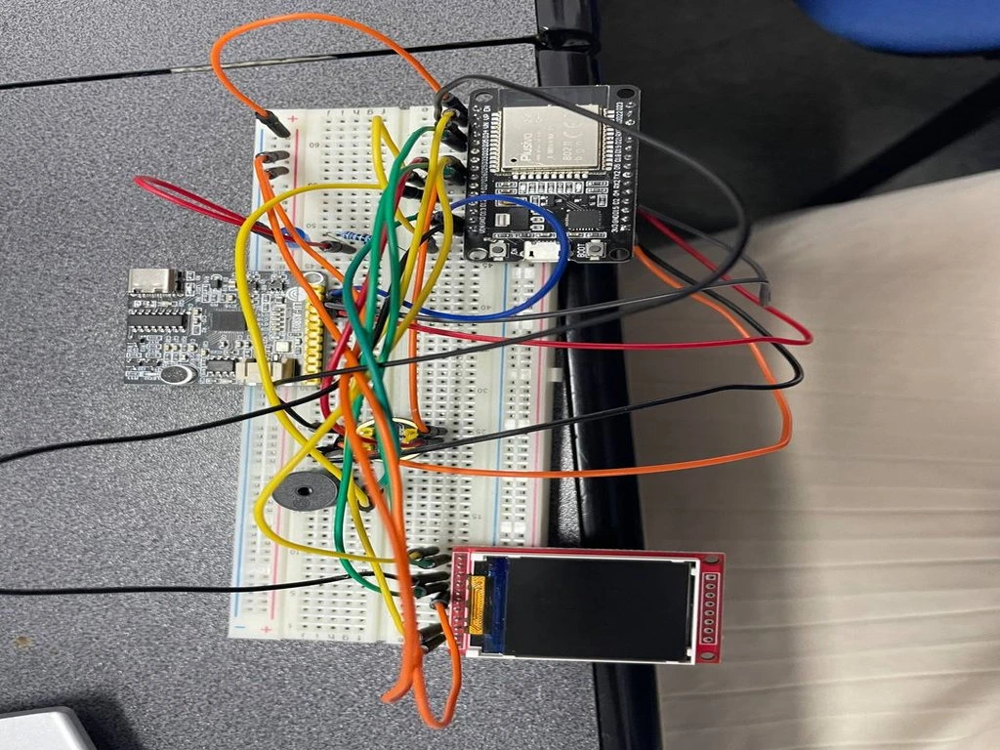
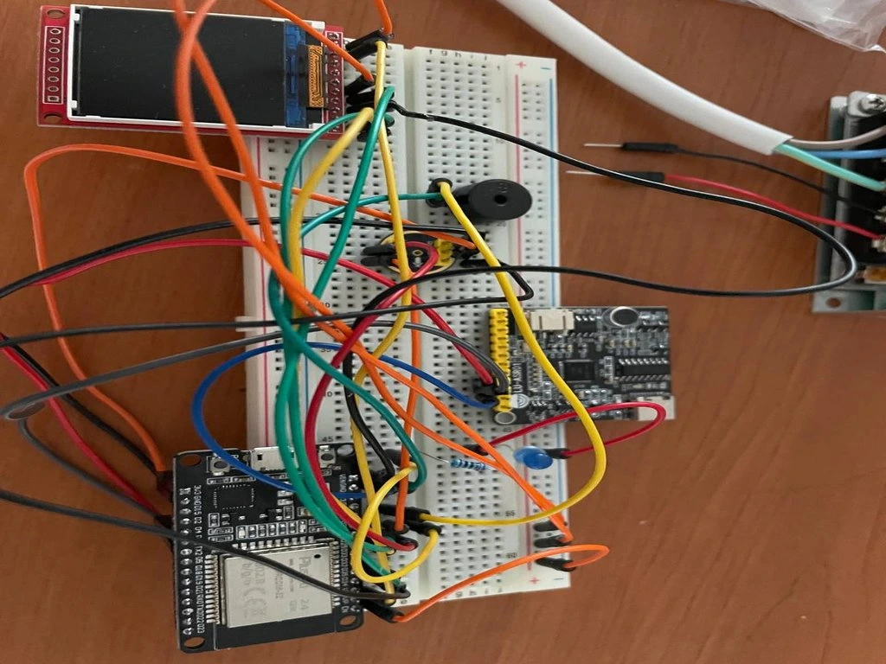
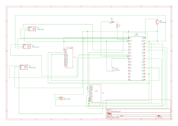

# Voice enhanced smart monitoring system
A voice controlled embedded system that listens to your voice, reacts to sounds around it, 
and moves or shows information on a screen in real time.

:::info 

**Author**: Glavan Teodora Alexandra \
**GitHub Project Link**: https://github.com/UPB-PMRust-Students/project-teodora121

:::

## Description

Voice enhanced smart monitoring system is am interactive project that listens to your
voice and reacts to sounds in the environment. Built with an ESP32, it can turn on lights, move servo motors,
or trigger alerts based on what you say or what it hears around it. A small LCD screen shows what's happening 
in real time like system status, actions taken, or sensor readings. 

## Motivation

I wanted to build a project that doesn't just run in the background, but actually responds to you.
Using voice commands and sound as inputs made it feel more user friendly
## Architecture 

Add here the schematics with the architecture of your project. Make sure to include:
Control Unit (ESP32): This is the brain of the system. 
It handles all the decision-making and makes sure everything works together,
 processing inputs and controlling outputs.

Input Processing Unit: This part takes care of all the incoming information. 
It listens for voice commands through the Voice Recognition Module (LU-ASR01)
 and detects sound levels with the Microphone Sound Sensor.

Output Processing Unit: After the system processes the input, 
this unit handles all the actions. It controls the Servo Motors to move things, 
shows feedback on the LCD display, signals status with LED lights, and gives sound alerts
 through the active buzzer.

Power Management Unit: This is what keeps everything running.
 It makes sure all components get the power they need without overloading. 

the ESP32 (Control Unit) communicates with the Input Processing Unit (voice and sound sensors)
 and the output processing unit (servomotors, display, lights, and buzzer), 
with power supplied by the power management unit.

## Log

<!-- write your progress here every week -->

### Week 28 - 4 May
During this week, I ordered several components, including the ESP32 Dev Board, 
LU-ASR01 Voice Recognition Module, SG90 Micro Servo Motors, LCD Display and other essential peripherals.

### Week 5 - 11 May

### Week 12 - 18 May
During this week, I connected the components on the breadboard, ensuring proper wiring and layout. Additionally, I configured the power supply to provide a stable voltage source for the project.
### Week 19 - 25 May

## Hardware

ESP32 Microcontroller
Purpose: Acts as the main control unit of the system, handling communication and processing.
Function: Processes voice commands, environmental sounds, and controls outputs (servos, LEDs, display).

LU-ASR01 Voice Recognition Module
Purpose: Recognizes and processes voice commands.
Function: Listens for predefined commands and sends them to the ESP32 to trigger corresponding actions.

SG90 Micro Servo Motors (3 units)
Purpose: Provides physical movement for tasks such as opening a door, waving, or other mechanical actions.
Function: Rotates in response to PWM signals from the ESP32 to perform specific tasks like moving objects or simulating actions.

1.44" LCD Display (128x128 pixels)
Purpose: Displays real time information and feedback to the user.
Function: Shows system status, command results, and sensor data, such as battery voltage and alert messages.

Microphone Module
Purpose: Detects sound in the environment.
Function: Triggers actions based on noise levels, like activating servos or sounding the buzzer when loud noise is detected.

Active Buzzer
Purpose: Provides audio alerts for specific events or actions.
Function: Emits sound when triggered, such as when a noise alert is triggered or after a voice command is processed.

LED
Purpose: Visual indicator for system status.
Function: Lights up to show when the system is active, blinks during specific actions, or signals an error.

5V 10A Power Supply
Purpose: Powers the entire system, including the ESP32 and peripheral components.
Function: Provides sufficient power for the servos and other components that require higher current than the ESP32 can
 supply directly.

### Schematics

Place your KiCAD schematics here.

Device                                                                                                                                                                                                                                                                                   | Usage                                                 | Price       |
| ---------------------------------------------------------------------------------------------------------------------------------------------------------------------------------------------------------------------------------------------------------------------------------------- | ----------------------------------------------------- | ----------- |
| [ESP32 Dev Board](https://www.optimusdigital.ro/ro/placi-cu-bluetooth/4371-placa-de-dezvoltare-esp32-cu-wifi-i-bluetooth-42.html?search_query=Placa+de+Dezvoltare+ESP32+cu+WiFi+%C8%99i+Bluetooth+4.2&results=8)                                                                         | The microcontroller for controlling the entire system | 35 RON      |
| [LU-ASR01 Voice Recognition Module](https://www.bitmi.ro/electronica/modul-control-si-recunoastere-vocala-lu-asr01-11724.html)                                                                                                                                                           | Recognizes and processes voice commands               | 60 RON      |
| [SG90 Micro Servo Motor](https://www.optimusdigital.ro/ro/motoare-servomotoare/2261-micro-servo-motor-sg90-180.html?search_query=sg90&results=11)                                                                                                                                        | Provides physical movement for the system             | 12 RON each |
| [1.44" LCD Display (128x128)](https://www.optimusdigital.ro/ro/optoelectronice-lcd-uri/870-modul-lcd-144.html?search_query=Modul+LCD+&results=75)                                                                                                                                        | Displays system feedback and status                   | 28 RON      |
| [Microphone Sound Sensor Module](https://www.bitmi.ro/module-electronice/modul-microfon-omnidirectional-interfata-i2s-mems-inmp441-11003.html)                                                                                                                                           | Detects sound levels in the environment               | 20 RON      |
| Active Buzzer                                                                                                                                                                                                                                                                            | Emits sound alerts for system notifications           | \~3 RON     |
| LED Light                                                                                                                                                                                                                                                                                | Visual indicator for system status                    | \~5 RON     |
| [5V 10A Power Supply](https://www.optimusdigital.ro/ro/surse-ac-dc-de-5-v/1954-sursa-de-tensiune-in-comutaie-5v-10a-50-w.html?gad_source=1&gbraid=0AAAAADv-p3Dg__41yAUeaPE-WMaZW2eL1&gclid=Cj0KCQjw8cHABhC-ARIsAJnY12zTEaDCe_jSSaqTaDOfScAuEuKvbNz_lI9bVrTfbC1PiLDe_R3NVFAaAjkzEALw_wcB) | Powers the system including servos and peripherals    | 48 RON      |
| Breadboard, Wires, and Resistors                                                                                                                                                                                                                                                         | For prototyping and circuit assembly                  | \~30 RON    |

## Software

| Library                                                                     | Description                   | Usage                                                        |
| --------------------------------------------------------------------------- | ----------------------------- | ------------------------------------------------------------ |
| [st7789](https://github.com/almindor/st7789)                                | Display driver for ST7789     | Used for driving the 1.44" LCD display                       |
| [embedded-graphics](https://github.com/embedded-graphics/embedded-graphics) | 2D graphics library           | Used for drawing and rendering graphics on the display       |
| [ESP32 Voice Recognition](https://github.com/VoiceRecognition/ESP32)        | Library for voice recognition | Used to interface with the LU-ASR01 voice recognition module |
| [Servo](https://www.arduino.cc/en/Reference/Servo)                          | Servo control library         | Used to control the SG90 micro servo motors                  |
| [Adafruit\_Sensor](https://github.com/adafruit/Adafruit_Sensor)             | General sensor library        | Used for sensor management and integration                   |
| [Wire](https://www.arduino.cc/en/Reference/Wire)                            | I2C communication library     | Used for communication between ESP32 and the LCD screen      |

## Links

<!-- Add a few links that inspired you and that you think you will use for your project -->

...
