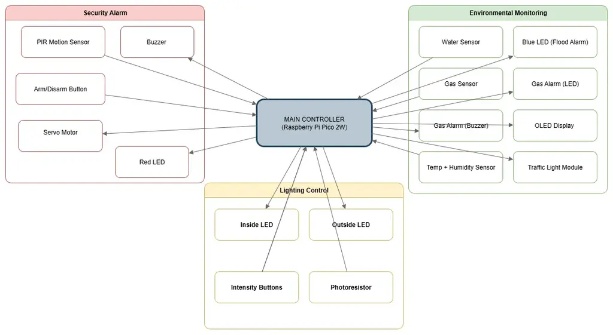
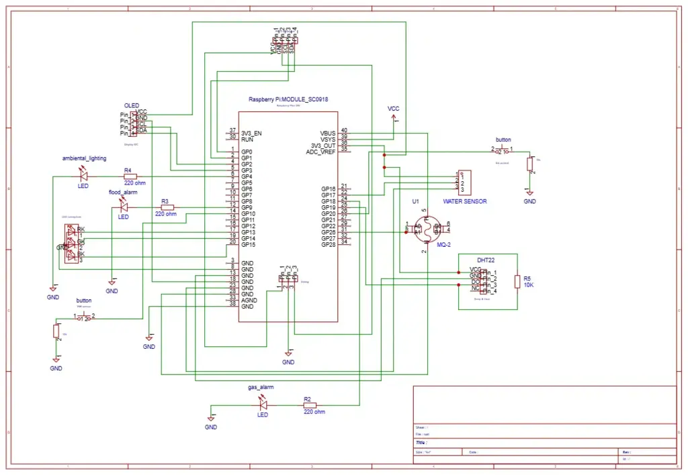

# Smart Home System
:::info 

**Author**: Stergarel Teodora 
**GitHub Project Link**: https://github.com/teodora-stergarel/website

:::

## Description

This project implements a **smart home mockup** controlled by a Raspberry Pi Pico 2W, integrating **security, safety, and comfort features**.

**Main functionalities:**
- **Alarm system:** armed via button. When triggered by motion (PIR sensor), it activates a buzzer, a red LED, and locks cabinets using 2 servos.
- **Room lighting control:** 2 independent room LEDs, each with 3 brightness levels (low/medium/high), controlled by buttons.
- **Flooding alarm (bathroom):** water sensor turns on a blue LED.
- **Gas alarm (kitchen):** MQ-2 sensor activates a buzzer and a red LED when methane is detected.
- **Environment monitoring:** temperature displayed on an OLED I2C display; humidity displayed using a traffic-light LED module (red = too humid, yellow = optimal, green = too dry).

## Motivation

Modern homes need monitoring and automation systems for safety and energy efficiency. This project demonstrates how **embedded Rust** can be used to implement a realistic smart home controller with multiple sensors, actuators, and user interfaces, while applying concepts learned during the semester (GPIO, PWM, ADC, I2C, async tasks).

## Architecture

- **Alarm Control Module**: manages ARM/DISARM state via button input; when armed, triggers the PIR-based motion detection and coordinates buzzer + servo actuation.
- **Motion Detection Task**: reads the PIR sensor; on detection, signals the alarm system and drives a red LED + cabinet lock servos.
- **Lighting Control Module**: cycles indoor room LEDs through three brightness levels using PWM, based on button presses.
- **Flood Alarm Task**: monitors the water sensor; activates a blue LED when flooding is detected in the “bathroom”.
- **Gas Alarm Task**: samples MQ-2 sensor output via ADC; when methane threshold is exceeded, drives buzzer and red LED.
- **Environment Monitoring Module**: reads DHT22 sensor; displays temperature on OLED and maps humidity to a traffic-light LED module (red/yellow/green).
- **Display Task**: updates OLED with real-time sensor values and system state.
- **System Integration**: coordinates tasks asynchronously using Embassy framework, ensuring smooth handling of sensors, outputs, and user inputs.

## Log

### Week 1
 During the first week, I focused on the theoretical foundation and initial project planning. I researched different smart home systems and documented the requirements for security, safety, and comfort functionalities. I also explored the Raspberry Pi Pico 2W capabilities, paying attention to available GPIO pins, communication protocols (I2C, SPI), and power management considerations. A draft system architecture was created, outlining how sensors, actuators, and the OLED display would interact. Additionally, I compared alternative sensors (DHT22 vs. BME280, MQ-2 vs. other gas detectors) to justify my component selection.
### Week 2
In the second week, I moved on to the hardware design phase. I created detailed wiring plans for the PIR motion sensor, buzzer, LEDs, servo motors, DHT22 sensor, and MQ-2 gas sensor. I also integrated pull-up and pull-down resistors where needed, ensuring safe operation and stable input readings. A bill of materials (BOM) was finalized, including component specifications and approximate costs. Furthermore, I designed a KiCad schematic to represent the connections between the Pico board and the sensors, with special attention to pin allocation to avoid conflicts.
### Week 3
The third week was dedicated to software development and testing on a modular basis. I started by setting up a Rust development environment with Embassy framework support and performed initial tests using LEDs and buttons. Asynchronous tasks were implemented to simulate the alarm system workflow, including motion-triggered alerts with buzzer and LED feedback. I also wrote routines for PWM control of the room LEDs with three brightness levels, and for reading environmental data from the DHT22. Debugging was performed using one dedicated Pico board, while the second one was reserved for system integration.
### Week 4
In the final week, I attempted to fully integrate all hardware and software components. The alarm system, lighting control, ambient lighting with photoresistor, gas and flood alarms, and OLED temperature display were combined into a single workflow. During this phase, I encountered a technical problem with the Raspberry Pi Pico 2W, where the debugging process failed due to communication errors and storage limitations on the board. This issue temporarily blocked progress, despite this, the system design and partial implementations prove that the project were feasible and close to full functionality. Due to lack of time, I decided that the best option to overcome this issue and continue testing was to purchase a new Raspberry Pi Pico 2W, which allowed me to refine and improve the code.

## Hardware

The project is built around the **Raspberry Pi Pico 2W** microcontroller and integrates the following components:

- **HC-SR501 PIR Sensor**: Detects motion at the entrance; used to trigger the alarm system when armed.
- **MQ-2 Gas Sensor**: Monitors methane levels in the “kitchen”; activates buzzer and LED when threshold is exceeded.
- **Water Level Sensor Module**: Detects flooding in the “bathroom”; activates a blue LED alarm.
- **DHT22 Temperature & Humidity Sensor**: Provides ambient readings.
- **SSD1306 OLED Display (0.96", I2C)**: Displays temperature values.
- **Traffic Light LED Module (R/Y/G)**: Indicates humidity levels 
- **Room LEDs (White)**: Simulate lighting in different rooms; brightness controlled in three levels via PWM.
- **Yard LEDs (White)**: Simulate outdoor lighting; controlled automatically by the LDR sensor.
- **LDR Light Sensor Module**: Detects ambient light to toggle outdoor LEDs at night.
- **Mini Servo Motors (SG90, 2x)**: Used to lock/unlock cabinets as part of the security system.
- **Active Buzzer (3V)**: Provides acoustic feedback for alarms (gas leak, intruder).
- **Push Buttons**: For ARM/DISARM, and room light control.
- **Resistors (220Ω, 1kΩ, 10kΩ)**: Used as current limiters for LEDs and voltage dividers where necessary.
- **Breadboard & Jumper Wires**: Enable prototyping and cable management across different areas of the house mockup.

### Schematics

Below is the schematics of the device:

KiCad Schematics:

### Bill of Materials

| Device | Usage | Price |
|--------|--------|-------|
| [Raspberry Pi Pico 2W](https://www.raspberrypi.com/documentation/microcontrollers/raspberry-pi-pico.html) | Main microcontroller | [35 RON](https://www.optimusdigital.ro/ro/raspberry-pi-boards/14117-raspberry-pi-pico-2w.html) |
| [Raspberry Pi Pico 2W](https://www.raspberrypi.com/documentation/microcontrollers/raspberry-pi-pico.html) | Main microcontroller | [35 RON](https://www.optimusdigital.ro/ro/raspberry-pi-boards/14117-raspberry-pi-pico-2w.html) |
| [Raspberry Pi Pico 2W](https://www.raspberrypi.com/documentation/microcontrollers/raspberry-pi-pico.html) | Main microcontroller | [35 RON](https://www.optimusdigital.ro/ro/raspberry-pi-boards/14117-raspberry-pi-pico-2w.html) |
| [HC-SR501 PIR Sensor](https://www.optimusdigital.ro/ro/senzori-de-miscare/191-hc-sr501-senzor-de-miscare-infrarosu-pir-arduino.html) | Motion detection (intruder alarm) | [12 RON](https://www.optimusdigital.ro/ro/senzori-de-miscare/191-hc-sr501-senzor-de-miscare-infrarosu-pir-arduino.html) |
| [MQ-2 Gas Sensor](https://www.optimusdigital.ro/ro/senzori-gaz/192-mq-2-modul-senzor-de-gaz.html) | Methane/gas leak detection | [17 RON](https://www.optimusdigital.ro/ro/senzori-gaz/192-mq-2-modul-senzor-de-gaz.html) |
| [Water Level Sensor Module](https://www.optimusdigital.ro/ro/senzori-de-apa/236-senzor-de-nivel-apa.html) | Flooding detection | [10 RON](https://www.optimusdigital.ro/ro/senzori-de-apa/236-senzor-de-nivel-apa.html) |
| [DHT22 Sensor](https://www.optimusdigital.ro/ro/senzori-de-temperatura-si-umiditate/425-modul-senzor-de-temperatura-si-umiditate-dht22.html) | Temperature & humidity monitoring | [20 RON](https://www.optimusdigital.ro/ro/senzori-de-temperatura-si-umiditate/425-modul-senzor-de-temperatura-si-umiditate-dht22.html) |
| [SSD1306 OLED Display 0.96"](https://www.optimusdigital.ro/ro/displays-oled/183-modul-afisaj-oled-096-inch-128x64px-i2c-iic-spi-arduino.html) | System status and temperature display | [25 RON](https://www.optimusdigital.ro/ro/displays-oled/183-modul-afisaj-oled-096-inch-128x64px-i2c-iic-spi-arduino.html) |
| [Traffic Light LED Module (R/Y/G)](https://www.bitmi.ro/module-electronice/modul-led-semafor-compatibil-arduino-10405.html) | Humidity indicator | [3 RON](https://www.bitmi.ro/module-electronice/modul-led-semafor-compatibil-arduino-10405.html) |
| [Mini Servo Motor SG90](https://www.optimusdigital.ro/ro/servo-motoare/193-servomotor-sg90-9g.html) | Cabinet locking system | [15 RON](https://www.optimusdigital.ro/ro/servo-motoare/193-servomotor-sg90-9g.html) |
| [Active Buzzer 3V](https://www.optimusdigital.ro/ro/buzzere/88-buzzer-activ-3v.html) | Alarm sound | [3 RON](https://www.optimusdigital.ro/ro/buzzere/88-buzzer-activ-3v.html) |
| [LDR Light Sensor Module](https://www.optimusdigital.ro/ro/senzori-lumina/178-senzor-de-lumina-ldr-module.html) | Outdoor ambient light detection | [6 RON](https://www.optimusdigital.ro/ro/senzori-lumina/178-senzor-de-lumina-ldr-module.html) |
| [LEDs (White, Red, Blue)](https://www.optimusdigital.ro/ro/leduri/88-led-uri-5mm.html) | Room lights, alarms, yard lights | ~1 RON each |
| [Resistors (220Ω, 1kΩ, 10kΩ)](https://www.optimusdigital.ro/ro/rezistori/83-set-500-rezistori-025w.html) | Current limiting, voltage dividers | ~0.5 RON each |
| [Electrolytic Capacitor 100–470µF](https://www.optimusdigital.ro/ro/condensatori-electrolitici/92-condensator-electrolitic-100uf-25v.html) | Servo power stabilization | 1 RON |
| [Breadboard + Jumper Wires](https://www.optimusdigital.ro/ro/breadboard/100-breadboard-830-puncte.html) | Prototyping & wiring | [20 RON](https://www.optimusdigital.ro/ro/breadboard/100-breadboard-830-puncte.html) |

## Software

| Library | Description | Usage |
|---------|-------------|-------|
| [embassy](https://github.com/embassy-rs/embassy) | Async runtime for embedded Rust | Manages concurrent tasks for sensors, actuators, and alarms |
| [embedded-hal](https://github.com/rust-embedded/embedded-hal) | Hardware abstraction layer for microcontrollers | Provides traits for GPIO, I2C, SPI, PWM used across drivers |
| [rp-pico](https://crates.io/crates/rp-pico) | Support crate for Raspberry Pi Pico 2W | Board support package with HAL and pin mappings |
| [ssd1306](https://crates.io/crates/ssd1306) | Display driver for SSD1306 OLED displays | Controls the 0.96" I2C OLED for showing temperature/humidity |
| [embedded-graphics](https://github.com/embedded-graphics/embedded-graphics) | 2D graphics library for embedded systems | Renders text, symbols, and icons on the OLED display |
| [dht-sensor](https://crates.io/crates/dht-sensor) | DHTxx sensor driver | Reads temperature and humidity data from the DHT22 |
| [heapless](https://crates.io/crates/heapless) | Fixed-capacity data structures without dynamic allocation | Used for queues, buffers, and storing sensor readings |
| [defmt](https://github.com/knurling-rs/defmt) | Efficient logging framework for embedded Rust | Provides debug output during development and testing |
