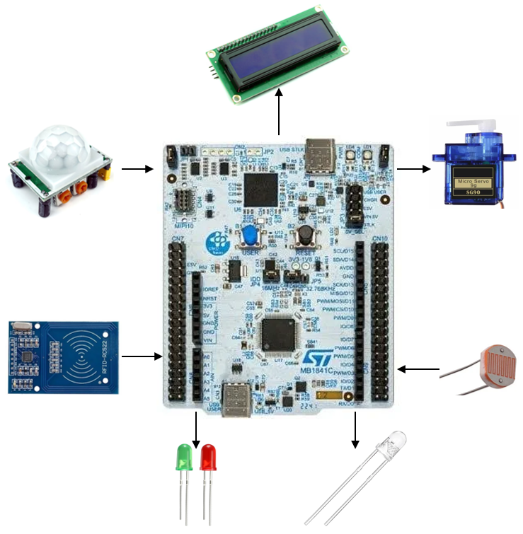

# Smart Home Devices

This project aims to automate basic home devices, *mainly the main front door*, based on the presence of the owner.

:::info

**Author:** Petre Teodora-Maria \
**GitHub Project Link:** https://github.com/UPB-PMRust-Students/project-dm-2025-730dora

:::

## Description

This main focus of this project is to implement a Secure Access Smart Door system using the STM32 microcontroller and the Rust programming language. The main goal is to provide autonomous entry control: the door system activates when motion is detected and grants access only after a person provides the correct RFID scan. A servo motor manages the lock, and colored LEDs, along with a screen, provide feedback, displaying a personalized welcome message upon successful authentication.

## Motivation

Since I was little I used to make dollhouses out of cardboard, but I’ve always felt like something was missing. I wanted to make them as real as possible – functional lights, doors, almost everything that a real house has – but I didn’t know how to.

## Architecture 

* **STM32** - used for handling the logic of the project. It receives an interrupt from the *PIR detector* that a person is at the door which sends the RFID from an idle state to an active one.
* **PIR Motion Detector (HC-SR501)** – detects the person approaching the door
* **RFID Reader Module** – collects the security credentials for authentication
* **LEDs** – provides immediate visual feedback for granted/denied access
* **Servomotor SG90** – mechanically closes and opens the door if the access is granted
* **LCD Screen** – displays personalized *“Welcome, [user’s name]”* message upon successful entry
* **Photoresistor** - inside the house after entry the photoresistor analyzes the state of the light and turns on a "main light" if necessary.

week -->

### Week 5 - 11 May

### Week 12 - 18 May

### Week 19 - 25 May

## Hardware

-   **STM32 Microcontroller** - the central processing unit, responsible for running the embedded Rust firmware, using PWM for motor control and SPI for the communication with the RFID module and the rest via GPIO pins

-   **Servomotor SG90** - acts as the physical lock actuator, controlled via a PWM signal from the STM32 to precisely move the door mechanism between "locked" and "unlocked" positions
    
-   **PIR Motion Detector (HC-SR501)** - input device that triggers the security sequence by sending a digital signal to an STM32 GPIO pin when movement is detected
    
-   **RFID Reader Module (RC522)** - communicates via SPI to the STM32, reading credential data from passive RFID tags for secure user authentication
    
-   **LEDs (Red/Green)** - simple visual output indicators connected to GPIO pins, signaling "Access Granted" (Green) or "Access Denied" (Red)
    
-   **LCD Screen** - displays the personalized welcome message

### Schematics

Place your KiCAD schematics here.
will do soon

### Bill of Materials

<!-- Fill out this table with all the hardware components that you might need.

The format is 

| [Device](link://to/device) | This is used ... | [price](link://to/store) |

-->

| Device | Usage | Price |
|--------|--------|-------|
| [STM32 NUCLEO-U545RE-Q](https://www.st.com/resource/en/user_manual/um3062-stm32u3u5-nucleo64-boards-mb1841-stmicroelectronics.pdf) | The microcontroller | 0 RON (borrowed) |
| [SERVOMOTOR SG90](http://www.ee.ic.ac.uk/pcheung/teaching/DE1_EE/stores/sg90_datasheet.pdf) | The motor for the door | [20 RON](https://www.emag.ro/set-servomotor-sg90-unghi-de-lucru-180-grade-23-mm-9-g-3874783591829/pd/DXVZ3MYBM/) |
| [PIR](https://www.handsontec.com/dataspecs/SR501%20Motion%20Sensor.pdf)|Motion Sensor| [15 RON](https://www.emag.ro/senzor-de-miscare-detector-pir-hc-sr501-sensibilitate-reglabila-33-x-23-x-30-mm-multicolor-2-a-020/pd/DZLTKLMBM/) |
| [RFID](https://www.elprocus.com/rc522-rfid-module/) | Reader Module | [20 RON](https://www.emag.ro/modul-rfid-rc522-40x60mm-3-3v-gd-0207/pd/D33Y4GYBM/) |
| [LEDs](https://en.wikipedia.org/wiki/Light-emitting_diode) | denied/granted access visualisation & light | from an old kit |
| [830 points Breadboard](https://en.wikipedia.org/wiki/Breadboard) | Connectivity | also from an old kit |
| [Photoresistor](https://en.wikipedia.org/wiki/Photoresistor) | detects the level of natural light outside | from the same old kit |
| [16x2 I2C LCD Display](https://www.handsontec.com/dataspecs/module/I2C_1602_LCD.pdf) | The "Welcome, user!" screen | free from the kit |

## Software

| Library | Description | Usage |
|---------|-------------|-------|
| [embassy-executor](https://docs.embassy.dev/embassy-executor/git/std/index.html) | Async runtime for embedded systems | Running concurrent tasks (sensors, gates, display) |
| [embedded-graphics](https://github.com/embedded-graphics/embedded-graphics) | 2D graphics library | Used for writing to the display |
| [embassy-time](https://docs.rs/embassy-time/latest/embassy_time/) | Timekeeping, delays and timeouts | Stop waiting if card isn't scanned fast enough & manage motor to open/close door |

## Links

<!-- Add a few links that inspired you and that you think you will use for your project -->

1. [The labs](https://embedded-rust-101.wyliodrin.com/docs/fils_en/category/lab)
