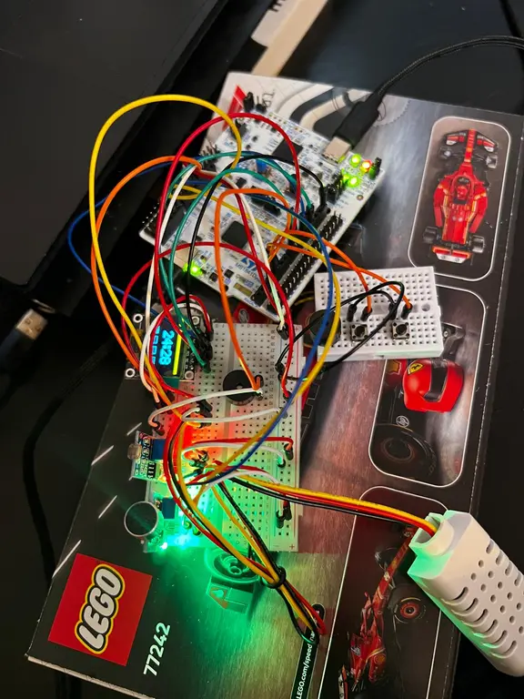
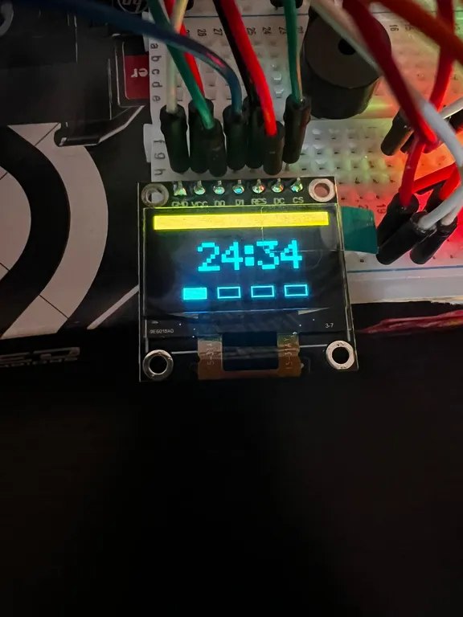
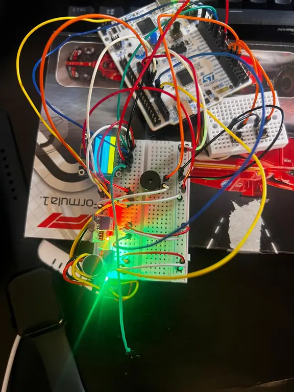
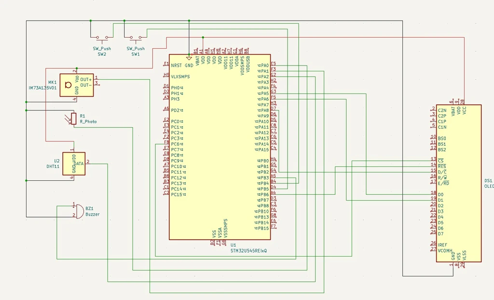
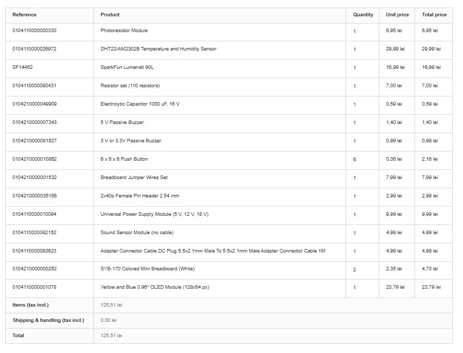

# Pomodoro Timer with Environmental Monitoring

A productivity timer implementing the Pomodoro Technique, the device features an OLED display, environmental sensors, audible notifications, and bidirectional USB communication with a companion PC application.

:::info
Author: Puscasu Tudor

Group: 1241EC

Github Project link : https://github.com/UPB-PMRust-Students/project-dm-2025-TudorPuscasul
:::


--------------------------------------------------------------------------------

## Description

This project implements a full-featured Pomodoro timer designed to help users maintain focus during work sessions. The Pomodoro Technique divides work into 25-minute focused sessions separated by short breaks, with a longer break after completing four sessions.

The system displays the countdown timer on a 128x64 pixel OLED screen using SPI communication at 4 MHz. Environmental monitoring is provided by a DHT22 temperature and humidity sensor, a photoresistor module for ambient light detection, and a sound sensor module for noise detection. An active buzzer provides audio feedback for session transitions and button presses.

A key feature is the USB CDC (Communications Device Class) interface that creates a virtual COM port when connected to a PC. A Python application with a graphical interface can monitor the timer state in real-time and send control commands. The communication uses JSON messages over serial, with the STM32 sending status updates every second and sensor data every five seconds.

Technical specifications:
- Microcontroller: STM32U545RE-Q
- Display: SSD1306 OLED 
- Clock configuration: HSI at 16 MHz for system, HSI48 at 48 MHz for USB
- Communication: USB CDC at 115200 baud (virtual COM port)

--------------------------------------------------------------------------------

## Motivation

I chose this project because the Pomodoro Technique has been proven effective for improving focus and productivity, and building a dedicated hardware timer offered an opportunity to explore embedded systems development beyond simple LED blinking examples.

The project combines multiple peripherals and communication protocols in a practical application. Working with SPI for the display, GPIO for buttons and sensors, and USB for PC communication provided hands-on experience with the interfaces commonly used in embedded systems. The Embassy framework allowed me to learn modern async/await patterns in a no_std environment, which is quite different from typical Rust programming.

--------------------------------------------------------------------------------

## Architecture

The firmware follows a task-based architecture using Embassy's cooperative multitasking. Each major function runs as an independent async task that yields control when waiting for events or time delays.

```
                                    +------------------+
                                    |    main()        |
                                    |  (spawns tasks)  |
                                    +--------+---------+
                                             |
         +----------+----------+-------------+-------------+----------+----------+
         |          |          |             |             |          |          |
         v          v          v             v             v          v          v
    +---------+ +--------+ +--------+  +-----------+ +--------+ +--------+ +--------+
    | timer   | | button | | button |  |  buzzer   | | sensor | |display | |  usb   |
    | task    | | task   | | handler|  |  task     | | task   | | task   | |  task  |
    +---------+ +--------+ | task   |  +-----------+ +--------+ +--------+ +--------+
         |          |      +--------+        ^            |          |          |
         |          |           |            |            |          |          |
         |          |           |            |            |          |          |
         |          v           |            |            |          |          |
         |    +------------+    |            |            |          |          |
         |    |  BUTTON    |----+            |            |          |          |
         |    |  CHANNEL   |    |            |            |          |          |
         |    +------------+    |            |            |          |          |
         |                      |            |            |          |          |
         |                      v            |            |          |          |
         |               +------------+      |            |          |          |
         |               |  BUZZER    |------+            |          |          |
         |               |  CHANNEL   |                   |          |          |
         |               +------------+                   |          |          |
         |                      |                         |          |          |
         v                      v                         v          v          |
    +-----------------------------------------------------------------------+   |
    |                         POMODORO (Mutex)                              |   |
    |   timer_state | remaining_secs | session_count | total_focus | ...    |   |
    +-----------------------------------------------------------------------+   |
                                                                     |          |
                                                                     v          |
                                                         +------------------+   |
                                                         | SENSORS (Mutex)  |   |
                                                         | temp | humidity  |   |
                                                         | light | sound    |   |
                                                         +------------------+   |
                                                                                |
                                                                                v
    +-------------------------------------------------------------------------+
    |                              USB CDC                                     |
    |                    (Virtual COM Port - 115200 baud)                      |
    +-----------------------------------+-------------------------------------+
                                        |
                                        | JSON messages (bidirectional)
                                        |
                                        v
    +-------------------------------------------------------------------------+
    |                         PC Application (Python)                          |
    |   +-------------------+    +------------------+    +------------------+  |
    |   | SerialManager     |    | Timer Display    |    | Control Buttons  |  |
    |   | (background read) |    | Session Status   |    | Start/Pause/Skip |  |
    |   +-------------------+    +------------------+    +------------------+  |
    +-------------------------------------------------------------------------+


    HARDWARE CONNECTIONS:

    +-------------+     +-------------+     +-------------+
    |   USER      |     |   EXT1      |     |   EXT2      |
    |   Button    |     |   Button    |     |   Button    |
    |   (PC13)    |     |   (PB4)     |     |   (PB5)     |
    +------+------+     +------+------+     +------+------+
           |                   |                   |
           +-------------------+-------------------+
                               |
                               v
                        +------+------+
                        | button_task |
                        +-------------+

    +-------------+     +-------------+     +-------------+
    | Photoresist |     | Sound       |     | DHT22       |
    | (PA0)       |     | Sensor(PA1) |     | (PA4)       |
    +------+------+     +------+------+     +------+------+
           |                   |                   |
           +-------------------+-------------------+
                               |
                               v
                        +------+------+
                        | sensor_task |
                        +-------------+

    +------------------+                         +-------------+
    | SSD1306 OLED     |                         | Active      |
    | SPI: PA5,PA7     |                         | Buzzer      |
    | DC:PC7 CS:PC6    |                         | (PB3)       |
    | RES:PB6          |                         +------+------+
    +--------+---------+                                |
             |                                          |
             v                                          v
      +------+------+                           +-------+-----+
      | display_task|                           | buzzer_task |
      +-------------+                           +-------------+
```

## Task descriptions:

timer_task - Manages the countdown logic. Decrements the remaining time each second during active states (Working, ShortBreak, LongBreak). Handles automatic transitions between work sessions and breaks, including the long break after four completed sessions.

button_task - Polls the three button inputs every 10 milliseconds with 50 millisecond debouncing. Sends button events through a channel to the handler task.

button_handler_task - Receives button events and modifies the timer state accordingly. The USER button toggles between start/pause, the first external button handles reset (when paused) or skip (when running), and the second external button cycles through display modes.

buzzer_task - Receives pattern commands through a channel and plays the corresponding beep sequences. Patterns include short clicks for button feedback, multiple beeps for session transitions, and rapid beeps for break warnings.

sensor_task - Reads the DHT22 temperature and humidity sensor every 2 seconds, and polls the photoresistor and sound sensor inputs every 50 milliseconds. Detects state transitions and maintains trigger counts for environmental monitoring.

display_task - Updates the OLED screen every 200 milliseconds. Renders one of three display modes: Timer mode showing the countdown with session indicators, Sensors mode showing environmental data, or Stats mode showing accumulated statistics.

usb_task - Manages the USB CDC connection. Waits for a host connection, then sends JSON status messages every second and processes incoming text commands. Handles connection and disconnection events gracefully.

status_task - Outputs debug information through RTT every 5 seconds for development monitoring.

Shared state is protected by mutex primitives from embassy-sync. The POMODORO mutex holds the timer state, and the SENSORS mutex holds environmental readings. Inter-task communication for events uses channels with capacity for 4 pending messages.

--------------------------------------------------------------------------------

## Components Overview

Development Board:
NUCLEO-U545RE-Q - STM32U545RE microcontroller on Nucleo-64 form factor with integrated ST-LINK debugger and dual USB-C connectors

Display:
0.96 inch OLED module with SSD1306 controller, 128x64 pixel resolution, SPI interface, operating voltage 3.3V to 5V

Sensors:
DHT22 temperature and humidity sensor with 1-Wire digital interface
Photoresistor module with digital output and adjustable threshold potentiometer
Sound sensor module with digital output and adjustable sensitivity potentiometer

Audio:
Active buzzer module, 3.3V to 5V operating voltage, produces fixed frequency tone when powered

Input:
Built-in USER button on NUCLEO board (directly controls PC13 pin)
Two external pushbutton switches for additional control functions

Cables and Connections:
USB-C cable for ST-LINK debugging and power
USB-C cable for USB USER port (CDC communication)
Dupont jumper wires for peripheral connections
Breadboard for external component mounting

--------------------------------------------------------------------------------

## Hardware Photos




Complete hardware setup showing the NUCLEO board, breadboard with sensors, OLED display, and USB connections




OLED display showing the timer screen with countdown and session indicators


OLED display showing the sensors screen with environmental readings



Breadboard detail showing button connections, buzzer, and sensor modules


Python PC application connected and displaying timer status

--------------------------------------------------------------------------------

## Development Log

Week 10 (Project Setup and Basic Structure)
- Selected the Pomodoro timer concept after reviewing project requirements
- Cloned the stm32u5_lab template repository which provided the Embassy framework setup and build configuration
- Studied the existing example files (blinky.rs, spi.rs, usb.rs) to understand the Embassy programming model
- Created the initial main.rs with state structures for PomodoroState and TimerState enum
- Implemented basic timer countdown logic in a single task
- Tested the built-in USER button with simple press detection

Week 11 (Display and Buttons)
- Connected the SSD1306 OLED display via SPI interface
- Wrote the OLED driver from scratch including initialization sequence, command sending
- Created bitmap font data for digits 0-9 at 5x8 pixel size
- Implemented 3x scaling for large timer digits (15x24 pixels)
- Added letter glyphs for status text display
- Integrated two external buttons with internal pull-up resistors
- Implemented debouncing with 50 millisecond threshold
- Created the button event channel system for decoupled handling

Week 12 (Timer Logic and Audio)
- Completed full Pomodoro state machine with Idle, Working, ShortBreak, LongBreak, and Paused states
- Implemented automatic transitions: work to break, break to work, long break after 4 sessions
- Added session counting and total focus time tracking
- Connected active buzzer and created pattern-based notification system
- Defined buzzer patterns for button clicks, session starts, work completion, break warnings, and break completion
- Added break warning beeps at 30 seconds remaining
- Created three display modes (Timer, Sensors, Stats) with cycling via button

Week 13 (Sensors and USB Communication)
- Connected DHT22 temperature and humidity sensor to PA4 using 1-Wire protocol
- Connected photoresistor module to digital input PA0
- Connected sound sensor module to digital input PA1
- Implemented DHT22 driver with timing-critical bit-banging for 1-Wire communication
- Implemented edge detection for light and sound sensor state changes with trigger counting
- Added USB CDC task based on the usb.rs example from the template
- Configured HSI48 clock at 48 MHz for USB peripheral
- Used JSON message protocol for status updates and commands

Week 14 (PC Application and Integration)
- Created Python application using tkinter for the graphical interface
- Implemented SerialManager class with automatic port detection based on VID/PID
- Added multi-threaded serial reading with queue-based message passing to UI thread
- Built complete UI with timer display, session indicators, control buttons, sensor readings, and statistics
- Fixed Bluetooth port detection issue by filtering on USB vendor ID
- Completed end-to-end testing of bidirectional communication
- Documented pin assignments and wrote final documentation

--------------------------------------------------------------------------------

## Hardware

NUCLEO-U545RE-Q Development Board


The main development platform featuring the STM32U545RE microcontroller.

Specifications:
- Core: ARM Cortex-M33 at up to 160 MHz
- Flash memory: 512 KB
- SRAM: 272 KB
- Operating voltage: 3.3V (5V tolerant on most pins)
- USB: Full-speed USB 2.0 OTG
- Debug: Integrated ST-LINK/V3

Pin assignments used in this project:
- PA0: Photoresistor digital input
- PA1: Sound sensor digital input
- PA4: DHT22 data (1-Wire)
- PA5: SPI1 SCK (OLED clock)
- PA7: SPI1 MOSI (OLED data)
- PA11: USB D-
- PA12: USB D+
- PB3: Buzzer output
- PB4: External button 1 (Reset/Skip)
- PB5: External button 2 (Display mode)
- PB6: OLED reset
- PC6: OLED chip select
- PC7: OLED data/command
- PC13: Built-in USER button


SSD1306 OLED Display Module

Specifications:
- Resolution: 128 x 64 pixels
- Display type: Monochrome OLED
- Controller: SSD1306
- Interface: SPI (configured) or I2C
- Operating voltage: 3.3V to 5V
- Viewing angle: greater than 160 degrees
- Module dimensions: approximately 27mm x 27mm


Photoresistor Module

A light-dependent resistor module with comparator circuit providing digital output.

Specifications:
- Operating voltage: 3.3V to 5V
- Output type: Digital (high/low based on threshold)
- Sensitivity adjustment: Onboard potentiometer
- Indicator: Power LED and trigger LED


Sound Sensor Module

A microphone module with comparator circuit for sound level detection.

Specifications:
- Operating voltage: 3.3V to 5V
- Output type: Digital (high when sound exceeds threshold)
- Sensitivity adjustment: Onboard potentiometer
- Detection range: Adjustable via potentiometer

DHT22/AM2302B Temperature and Humidity Sensor

Specifications:
- Power supply: 3.3 V DC - 5.5 V DC
- Humidity range: 0-99.9% RH
- Temperature range: -40oC to + 80oC
- Accuracy:  ± 2% RH,  ± 0.5oC
- Exit: Digital
- Communication protocol: 1 Wire


Active Buzzer Module

Specifications:
- Operating voltage: 3.3V to 5V
- Type: Active (internal oscillator, fixed frequency)
- Sound output: approximately 2 kHz
- Drive: Direct GPIO high/low control

## Schematic



*Could not use the acutal oled dsiplay in kicad so i put a placeholder and only connected what i actually had
--------------------------------------------------------------------------------

## Bill of Materials

| Component | Description | Usage | Cost |
|-----------|-------------|-------|------|
| SSD1306 OLED | 0.96 inch 128x64 display | Timer and status display | 23,79 lei |
| Photoresistor module | Light sensor with digital output | Ambient light monitoring | 6,95 lei |
| Temperature and humidity module | temperature and humidity sensor with digital output | Ambient temperature monitoring | 29,99 lei |
| Sound sensor module | Microphone with digital output | Noise detection | 4,99 lei |
| Active buzzer | 3.3V buzzer module | Audio notifications | 1,40 lei |
| Pushbuttons (x2) | Tactile switches | User input controls | 0.72 lei |
| Breadboard | 400 tie-point breadboard | Component mounting | 7,00 lei |
| Jumper wires | Male-to-male and male-to-female | Connections | 7,99 lei |
| USB-C cables (x2) | Data cables | Debug and CDC communication | 0,00 lei |

Total cost: 82,83 lei



--------------------------------------------------------------------------------

## Software

Embedded Firmware Libraries

| Library | Version | Description | Usage |
|---------|---------|-------------|-------|
| embassy-stm32 | 0.2.0 | STM32 HAL for Embassy | GPIO, SPI, USB peripheral access |
| embassy-executor | 0.7.0 | Async task executor | Cooperative multitasking runtime |
| embassy-time | 0.4.0 | Time utilities | Delays, timeouts, timekeeping |
| embassy-sync | 0.6.2 | Synchronization primitives | Mutex, Channel for shared state |
| embassy-usb | 0.4.0 | USB device stack | CDC-ACM class implementation |
| embassy-futures | 0.1.0 | Future utilities | Async join operations |
| defmt | 0.3 | Efficient logging | Debug output via RTT |
| defmt-rtt | 0.4 | RTT transport for defmt | Debug message transport |
| cortex-m | 0.7.7 | Cortex-M runtime | Low-level processor access |
| cortex-m-rt | 0.7.5 | Cortex-M runtime support | Startup and interrupt vectors |
| heapless | 0.8 | Static data structures | Fixed-size String for messages |
| static_cell | 2 | Static allocation | USB descriptor buffers |
| panic-probe | 1.0.0 | Panic handler | Error handling during debug |

## PC Application Dependencies

| Library | Version | Description | Usage |
|---------|---------|-------------|-------|
| pyserial | 3.5+ | Serial port library | USB CDC communication |
| tkinter | (built-in) | GUI framework | User interface |

## Development Tools

| Tool | Description | Usage |
|------|-------------|-------|
| Rust toolchain | Programming language compiler | Firmware compilation |
| probe-rs | Debug probe software | Flashing and RTT communication |
| cargo | Rust package manager | Build system and dependency management |
| Python 3.x | Scripting language | PC companion application |

--------------------------------------------------------------------------------

## Project Structure

This project was built starting from the stm32u5_lab template repository, which provides the Embassy framework configuration, build scripts, and example code for the board. The examples directory contains working reference code that was studied to understand peripheral initialization patterns.

stm32u5_lab/
    .cargo/
        config.toml          - Cargo build configuration for ARM target
    .vscode/
        settings.json        - VS Code debugger settings
    examples/                
        blinky.rs            - Basic LED blinking
        spi.rs               - SPI communication example
        usb.rs               - USB CDC example (used as reference)
        ...                  - Other peripheral examples
    pomodoro_app/            
        pomodoro_app.py      - Main application source
        requirements.txt     - Python dependencies
    src/
        main.rs              - Pomodoro timer firmware
    Cargo.toml               - Rust dependencies and project config
    build.rs                 
    rust-toolchain.toml      
    README.md                - This documentation

The main firmware is contained entirely in src/main.rs, organized into clearly marked sections for configuration, state definitions, individual tasks, and the main function.

--------------------------------------------------------------------------------

## Building and Running

Prerequisites:
1. Install Rust via rustup (https://rustup.rs)
2. Install the ARM target: rustup target add thumbv8m.main-none-eabihf
3. Install probe-rs: cargo install probe-rs-tools

Flashing and running:

    cargo run --release

Running the PC application:

    cd pomodoro_app
    pip install -r requirements.txt
    python pomodoro_app.py

Note: Connect two USB cables - one to the ST-LINK connector for debugging, and one to the USB USER connector for the CDC communication. The PC application will automatically detect the correct COM port based on the USB vendor ID.

--------------------------------------------------------------------------------

## Communication Protocol

The STM32 sends JSON messages over USB CDC at 115200 baud.

Status message (sent every 1 second):

    "t":"s","st":"work","r":1423,"sn":2,"tf":3600,"ts":1

Fields: t=type, st=state, r=remaining seconds, sn=session number, tf=total focus seconds, ts=total sessions

Environment message (sent every 5 seconds):

    "t":"e","tm":245,"hu":450,"li":0,"so":1

Fields: t=type, tm=temperature*10, hu=humidity*10, li=light triggered, so=sound triggered

Commands (text, newline terminated):
- start - Begin timer from idle state
- pause - Pause running timer
- resume - Resume paused timer
- reset - Return to idle state
- skip - Skip current phase

--------------------------------------------------------------------------------

## References

Embassy Framework
https://embassy.dev
https://github.com/embassy-rs/embassy

STM32U5 Documentation
https://www.st.com/en/microcontrollers-microprocessors/stm32u545re.html
https://www.st.com/en/evaluation-tools/nucleo-u545re-q.html

Pomodoro Technique
https://en.wikipedia.org/wiki/Pomodoro_Technique

Rust Embedded Book
https://docs.rust-embedded.org/book/

PySerial Documentation
https://pyserial.readthedocs.io/
